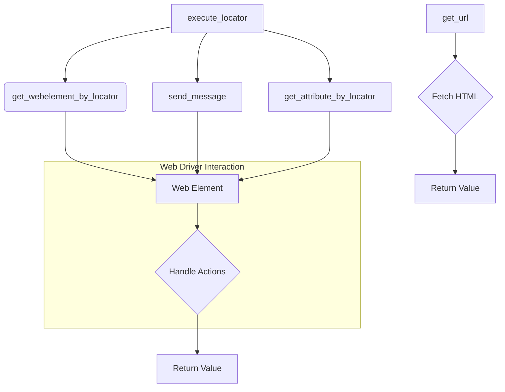

# <input code>

```python
подробные описания для каждой функции модуля `executor`:\n\n### 1. `execute_locator`\n```python\ndef execute_locator(locator: dict, message: str = \'\', typing_speed: float = 0.0, continue_on_error: bool = True) -> any:\n    """ Executes actions on a web element based on the provided locator.\n\n    @param locator: A dictionary or object containing locator information (e.g., type, selector).\n    @param message: Optional message to send to the web element (e.g., text to enter).\n    @param typing_speed: Speed of typing when sending a message (in seconds between keystrokes).\n    @param continue_on_error: Flag indicating whether to continue execution if an error occurs.\n    \n    @return: The result of the locator execution, which could be the web element, a list of elements, an attribute value, or action result.\n    """\n    ...\n```\n- **Назначение**: Выполняет действия на веб-элементе, используя указанный локатор.\n- **Параметры**:\n  - `locator`: Словарь или объект с информацией о локаторе (например, тип поиска и селектор).\n  - `message`: Сообщение для отправки элементу (например, текст для ввода).\n  - `typing_speed`: Скорость набора текста, если отправляется сообщение.\n  - `continue_on_error`: Флаг для продолжения выполнения в случае ошибки.\n- **Возвращаемое значение**: Результат выполнения локатора, который может быть веб-элементом, списком элементов, значением атрибута или результатом действия.\n\n### 2. `get_webelement_by_locator`\n```python\ndef get_webelement_by_locator(locator: dict) -> any:\n    """ Finds and returns a web element based on the provided locator.\n\n    @param locator: A dictionary or object containing locator information (e.g., type, selector).\n    \n    @return: The found web element or a list of elements, depending on the locator\'s specification.\n    """\n    ...\n```\n- **Назначение**: Находит и возвращает веб-элемент(ы) на странице, используя локатор.\n- **Параметры**:\n  - `locator`: Словарь или объект с информацией о локаторе.\n- **Возвращаемое значение**: Один или несколько веб-элементов, найденных по локатору.\n\n### 3. `get_attribute_by_locator`\n```python\ndef get_attribute_by_locator(locator: dict, message: str = \'\') -> any:\n    """ Retrieves the attribute value of a web element identified by the locator.\n\n    @param locator: A dictionary or object containing locator information (e.g., type, selector).\n    @param message: Optional message to send to the web element (e.g., text to enter before retrieving attribute).\n    \n    @return: The value of the attribute of the found web element, or None if an error occurs.\n    """\n    ...\n```\n- **Назначение**: Получает значение атрибута веб-элемента, найденного по локатору.\n- **Параметры**:\n  - `locator`: Словарь или объект с информацией о локаторе.\n  - `message`: Сообщение для отправки элементу перед получением атрибута (необязательно).\n- **Возвращаемое значение**: Значение атрибута веб-элемента.\n\n### 4. `send_message`\n```python\ndef send_message(locator: dict, message: str, typing_speed: float = 0.0, continue_on_error: bool = True) -> bool:\n    """ Sends a message (e.g., text) to a web element identified by the locator.\n\n    @param locator: A dictionary or object containing locator information (e.g., type, selector).\n    @param message: The message to send to the web element.\n    @param typing_speed: Speed of typing when sending the message (in seconds between keystrokes).\n    @param continue_on_error: Flag indicating whether to continue execution if an error occurs.\n    \n    @return: True if the message is sent successfully, otherwise False.\n    """\n    ...\n```\n- **Назначение**: Отправляет сообщение (например, текст) веб-элементу, используя локатор.\n- **Параметры**:\n  - `locator`: Словарь или объект с информацией о локаторе.\n  - `message`: Сообщение для отправки элементу.\n  - `typing_speed`: Скорость набора текста, если сообщение отправляется по частям.\n  - `continue_on_error`: Флаг для продолжения выполнения в случае ошибки.\n- **Возвращаемое значение**: `True`, если сообщение успешно отправлено, или `False`, если произошла ошибка.\n\n### 5. `get_url`\n```python\ndef get_url(url: str, protocol: str = \'https://\') -> bool:\n    """ Retrieves HTML content from a specified URL or file path.\n\n    @param url: The URL or file path to fetch the HTML content from.\n    @param protocol: The protocol to use for URL (default is \'https://\').\n    \n    @return: True if the content is successfully fetched, otherwise False.\n    """\n    ...\n```\n- **Назначение**: Загружает HTML-контент с указанного URL-адреса или локального файла.\n- **Параметры**:\n  - `url`: URL-адрес или путь к файлу для получения HTML-контента.\n  - `protocol`: Протокол для URL (по умолчанию `https://`).\n- **Возвращаемое значение**: `True`, если контент успешно загружен, или `False`, если произошла ошибка.
```



```markdown
# <algorithm>

Функциональность кода, представленного в виде функций, не может быть визуализирована пошаговой блок-схемой без доступа к реализации этих функций.  Вместо этого, можно описать общие алгоритмы работы каждой функции.

* **`execute_locator`**:  Принимает локатор и дополнительные параметры. Вызывает `get_webelement_by_locator` для получения элемента по локатору.  Если передан `message`, то вызывает `send_message`. Далее, при необходимости, выполняет `get_attribute_by_locator` для получения атрибута. Возвращает результат действия.

* **`get_webelement_by_locator`**: Находит элемент по локатору и возвращает его.

* **`get_attribute_by_locator`**: Находит элемент по локатору, получает значение указанного атрибута и возвращает его.

* **`send_message`**: Находит элемент по локатору, отправляет сообщение (например, текст) элементу с заданной скоростью ввода.  Возвращает True, если сообщение отправлено успешно, иначе False.

* **`get_url`**: Запрашивает HTML-контент по указанному URL. Возвращает True, если контент успешно загружен, иначе False.


# <mermaid>


**Описание диаграммы:**

Диаграмма представляет взаимосвязь между функциями модуля `executor`.  `execute_locator` является основной функцией, которая вызывает другие функции.  `get_webelement_by_locator`, `send_message`, `get_attribute_by_locator` взаимодействуют с веб-драйвером (обозначено как `Handle Actions`). `get_url` отвечает за загрузку контента с URL. Возвращаемые значения функций показаны стрелками к блокам `Return Value`.

# <explanation>

**Импорты:**

Код не содержит импортов, поэтому нет информации об импортах и связях с другими пакетами.  Предполагается, что необходимые для работы функций модуля (`webdriver` и др.) импортированы в другом месте проекта.

**Классы:**

Код не содержит определений классов, все представленные функции — это обычные функции.


**Функции:**

* **`execute_locator`**: Является центральной функцией для взаимодействия с веб-элементами.  Использует другие функции для получения элемента, отправки сообщения, и получения атрибутов.

* **`get_webelement_by_locator`**:  Получает веб-элемент по локатору.  Предполагается, что эта функция работает с веб-драйвером (например, Selenium).

* **`get_attribute_by_locator`**:  Получает значение атрибута веб-элемента.

* **`send_message`**: Отправляет сообщение на веб-элемент.

* **`get_url`**: Загружает HTML-контент с URL-адреса.  Функция `get_url` скорее всего использует `requests` или `urllib` для работы с HTTP.

**Переменные:**

Переменные типа `locator`, `message`, `typing_speed`, `continue_on_error` и `url` – это параметры функций.  Их типы указаны в аннотациях типов (`locator: dict`, `message: str`, и т.д.).


**Возможные ошибки и улучшения:**

* **Обработка исключений:**  В представленном коде отсутствует обработка исключений (например, `try...except` блоки).  Важно добавить обработку `NoSuchElementException`, `StaleElementReferenceException` и других возможных ошибок, связанных с взаимодействием с веб-элементами.

* **Зависимость от `webdriver`:** Код предполагает наличие внешней библиотеки (`webdriver`, вероятно, Selenium), которая обеспечивает взаимодействие с браузером.  Нужно указать в документации (или в коде) зависимость от этой библиотеки.

* **Тип данных `locator`:** Использование `dict` для локейторов — хорошая практика.  Однако, чтобы улучшить гибкость, можно использовать специализированные классы или объекты для локейторов, которые могут хранить информацию о типе локатора (например, `id`, `xpath`, `css`).

* **`typing_speed`:**  Необходимо учитывать, что слишком низкая скорость ввода может привести к ошибке, если страница не успевает обновиться.

* **`get_url`:**  Нужно добавить обработку случаев, когда URL не валиден или загрузка не удается (например, статус ответа HTTP не 200).