## Анализ кода `executor.py`

### <алгоритм>

1.  **Инициализация `ExecuteLocator`**:
    *   Создается экземпляр класса `ExecuteLocator`, принимая на вход `webdriver` и дополнительные аргументы.
    *   Инициализируется `self.driver` экземпляром `webdriver`.
    *   Создается `self.actions` - экземпляр `ActionChains`, связанный с `self.driver`.

2.  **Вызов `execute_locator`**:
    *   Метод принимает `locator` (словарь с настройками локатора), `message` (сообщение для отправки), `typing_speed` (скорость набора текста) и `continue_on_error` (флаг продолжения при ошибке).
    *   Внутри метода вызываются другие методы в зависимости от настроек в `locator`
        *  `get_webelement_by_locator`: получение элемента
        *  `send_message`: отправка сообщения
        *  `get_attribute_by_locator`: получение атрибута элемента
        *  `evaluate_locator`: вычисление атрибута локатора

3.  **Вызов `get_webelement_by_locator`**:
    *   Принимает `locator` (словарь или `SimpleNamespace`), `message`.
    *   Определяет тип локатора (`by`) и его селектор (`selector`, `selector 2` и т.д.).
    *   Использует `WebDriverWait` для ожидания появления элемента на странице.
    *   Возвращает найденный `WebElement` (или список `WebElement`, если найдено несколько), или `False`, если элемент не найден.
    *   В случае таймаута или `NoSuchElementException` возвращает `False` или, если `continue_on_error` равен `False`, то вызывает исключение.

4.  **Вызов `get_attribute_by_locator`**:
    *   Принимает `locator` (словарь или `SimpleNamespace`), `message`.
    *   Вызывает `get_webelement_by_locator` для получения элемента.
    *   Вызывает `_get_element_attribute` для получения атрибута элемента.
    *   Возвращает атрибут элемента (или список атрибутов, если найдено несколько элементов).

5.  **Вызов `_get_element_attribute`**:
    *   Принимает `WebElement` и `attribute` (название атрибута).
    *   Получает значение атрибута через метод `get_attribute` у `WebElement`.
    *   Возвращает значение атрибута или `None`, если атрибут отсутствует.

6.  **Вызов `send_message`**:
    *   Принимает `locator`, `message`, `typing_speed`, `continue_on_error`.
    *   Вызывает `get_webelement_by_locator` для получения элемента.
    *   Симулирует ввод текста с заданной скоростью с помощью `ActionChains`.
    *   Возвращает `True` при успешной отправке, иначе вызывает исключение или возвращает `False` в зависимости от `continue_on_error`.

7.  **Вызов `evaluate_locator`**:
    *   Принимает `attribute` (строка, список или словарь).
    *   Вызывает `_evaluate` для обработки каждого атрибута, если `attribute` это список.
    *   Возвращает строку с обработанным значением атрибута.

8.  **Вызов `_evaluate`**:
    *   Принимает `attribute` (строка).
    *   Если `attribute` равен `"%EXTERNAL_MESSAGE%"`, возвращает значение переменной `gs.EXTERNAL_MESSAGE`.
    *   В противном случае возвращает исходный атрибут.

9.  **Вызов `get_locator_keys`**:
    *   Статический метод.
    *   Возвращает список ключей, которые могут быть в словаре `locator`.

```mermaid
graph TD
    A[ExecuteLocator.__init__] --> B(ActionChains);
    B --> C(self.actions);
    C --> D(driver);
    D --> E[ExecuteLocator.execute_locator];
    E --> F{locator};
    F -- get_webelement_by_locator --> G(get_webelement_by_locator);
     G -- WebElement --> H{WebElement};
    H -- send_message --> I(send_message);
    I --  ActionChains  --> J{ActionChains};
     J --> K(get_webelement_by_locator);
    K -- WebElement --> L{WebElement};
      L -- get_attribute_by_locator --> M(get_attribute_by_locator);
    M --> N(get_webelement_by_locator);
    N -- WebElement --> O{WebElement};
    O -- _get_element_attribute --> P(_get_element_attribute);
    P -- attribute --> Q{attribute};
    Q --> R[ExecuteLocator.evaluate_locator];
      R --> S{attribute};
    S -- _evaluate --> T(_evaluate);
      T -- gs.EXTERNAL_MESSAGE --> U{gs.EXTERNAL_MESSAGE};
    classDef class_def fill:#f9f,stroke:#333,stroke-width:2px;
    class A,B,C,D,E,F,G,H,I,J,K,L,M,N,O,P,Q,R,S,T,U class_def
```

### <mermaid>



**Объяснение зависимостей `mermaid`:**

*   **`ExecuteLocator.__init__`**: Инициализирует класс, создавая `ActionChains`, зависимый от `webdriver`.
*   **`ActionChains`**: Класс из Selenium для выполнения сложных действий с элементами.
*   **`ExecuteLocator.execute_locator`**: Основной метод, который принимает словарь с настройками локатора и вызывает другие методы для выполнения действий.
*   **`get_webelement_by_locator`**: Получает `WebElement` или список `WebElement` на основе локатора.
*   **`WebElement`**: Класс, представляющий элемент на веб-странице.
*   **`send_message`**: Отправляет сообщение на `WebElement`, используя `ActionChains`.
*   **`get_attribute_by_locator`**: Получает значение атрибута элемента.
*    **`_get_element_attribute`**: Вспомогательный метод для получения атрибута `WebElement`.
*    **`attribute`**: Атрибут для поиска, например, `href`, `value`, и т.д.
*   **`ExecuteLocator.evaluate_locator`**: Вычисляет атрибуты локатора, например, заменяя `%EXTERNAL_MESSAGE%`.
*    **`_evaluate`**: Вспомогательный метод для вычисления атрибута, обрабатывая `%EXTERNAL_MESSAGE%`.
*  **`gs.EXTERNAL_MESSAGE`**: внешняя переменная, которая используется, чтобы передавать сообщение
*   Все зависимости являются частями Selenium WebDriver или внутренними компонентами `src` модуля.

### <объяснение>

#### Импорты:

*   **`selenium.webdriver`**: Основной модуль Selenium для управления браузером.
*   **`selenium.webdriver.common.keys.Keys`**: Класс для представления клавиш на клавиатуре, используется в `send_message`.
*   **`selenium.webdriver.common.by.By`**: Класс для определения стратегии поиска элементов (например, по ID, XPath, CSS selector).
*   **`selenium.webdriver.remote.webelement.WebElement`**: Класс, представляющий элемент на веб-странице, с которым взаимодействуют методы.
*   **`selenium.webdriver.support.ui.WebDriverWait`**: Класс для ожидания появления элемента на странице.
*   **`selenium.webdriver.support.expected_conditions as EC`**: Набор предустановленных условий ожидания.
*   **`selenium.webdriver.common.action_chains.ActionChains`**: Класс для выполнения последовательных действий над элементами (например, ввод текста, клики).
*   **`selenium.common.exceptions`**: Набор исключений Selenium (например, `NoSuchElementException`, `TimeoutException`).
*   **`src.gs`**: Модуль, содержащий глобальные настройки и переменные проекта.
*  **`src.utils.printer`**: Модуль для красивого вывода данных и сохранения их в файл.
*   **`src.logger.logger`**: Модуль для логирования событий.
*   **`src.logger.exceptions`**: Модуль для кастомных исключений проекта.

#### Класс `ExecuteLocator`:

*   **Роль**: Предоставляет методы для выполнения действий на веб-странице на основе переданных локаторов.
*   **`driver`**: Экземпляр `webdriver`, который используется для взаимодействия с браузером.
*   **`actions`**: Экземпляр `ActionChains` для выполнения сложных действий (например, для имитации ввода текста).
*   **`by_mapping`**: Словарь, отображающий строковые представления локаторов в объекты `By` (не используется напрямую в представленном коде, но может использоваться в других частях проекта).
*   **`__init__`**: Конструктор класса, инициализирует `driver` и `actions`.
*   **`execute_locator`**: Основной метод, который определяет, какое действие выполнять на основе словаря `locator`.
*   **`get_webelement_by_locator`**: Получает `WebElement` или список `WebElement` по локатору. Возвращает `False`, если элемент не найден.
*   **`get_attribute_by_locator`**: Получает значение атрибута `WebElement`.
*   **`_get_element_attribute`**: Вспомогательный метод для получения значения атрибута `WebElement`.
*   **`send_message`**: Симулирует ввод текста в элемент.
*  **`evaluate_locator`**: Обрабатывает атрибуты локатора, включая подстановку переменных.
*   **`_evaluate`**: Вспомогательный метод для обработки атрибута.
*   **`get_locator_keys`**: Статический метод, возвращающий список ключей словаря локатора.

#### Функции:

*   **`__init__`**:
    *   **Аргументы**: `driver` (экземпляр `webdriver`), `*args`, `**kwargs`.
    *   **Возвращаемое значение**: Нет.
    *   **Назначение**: Инициализирует драйвер и цепочки действий.
    *   **Пример**:
        ```python
        driver = webdriver.Chrome()
        executor = ExecuteLocator(driver)
        ```

*   **`execute_locator`**:
    *   **Аргументы**: `locator` (словарь), `message` (строка), `typing_speed` (число), `continue_on_error` (логическое значение).
    *   **Возвращаемое значение**: Различные типы в зависимости от действий.
    *   **Назначение**: Выполняет действие на основе конфигурации локатора.
    *   **Пример**:
        ```python
        locator = {"by": "id", "selector": "myElement", "action": "send_keys", "message": "Hello"}
        executor.execute_locator(locator)
        ```

*   **`get_webelement_by_locator`**:
    *   **Аргументы**: `locator` (словарь или `SimpleNamespace`), `message` (строка).
    *   **Возвращаемое значение**: `WebElement`, список `WebElement` или `False`.
    *   **Назначение**: Получает элемент(ы) на веб-странице.
    *   **Пример**:
        ```python
        locator = {"by": "xpath", "selector": "//button"}
        element = executor.get_webelement_by_locator(locator)
        ```

*   **`get_attribute_by_locator`**:
    *   **Аргументы**: `locator` (словарь или `SimpleNamespace`), `message` (строка).
    *   **Возвращаемое значение**: Строка, список, словарь или булево значение.
    *   **Назначение**: Получает атрибут(ы) элемента(ов).
    *   **Пример**:
        ```python
        locator = {"by": "id", "selector": "myLink"}
        href = executor.get_attribute_by_locator(locator, "href")
        ```

*   **`_get_element_attribute`**:
    *   **Аргументы**: `element` (`WebElement`), `attribute` (строка).
    *   **Возвращаемое значение**: Строка или `None`.
    *   **Назначение**: Получает атрибут элемента.
    *   **Пример**:
        ```python
        element = driver.find_element(By.ID, "myElement")
        attribute = executor._get_element_attribute(element, "value")
        ```

*   **`send_message`**:
    *   **Аргументы**: `locator` (словарь или `SimpleNamespace`), `message` (строка), `typing_speed` (число), `continue_on_error` (логическое значение).
    *   **Возвращаемое значение**: Логическое значение.
    *   **Назначение**: Симулирует ввод текста.
    *   **Пример**:
        ```python
        locator = {"by": "id", "selector": "myInput"}
        executor.send_message(locator, "Hello World", 0.1)
        ```

*  **`evaluate_locator`**:
    *   **Аргументы**: `attribute` (строка, список или словарь).
    *   **Возвращаемое значение**: Строка.
    *   **Назначение**: Вычисляет атрибут, включая подстановки переменных.
    *    **Пример**:
       ```python
       attribute = "%EXTERNAL_MESSAGE%"
       result = executor.evaluate_locator(attribute)
       ```

*   **`_evaluate`**:
    *   **Аргументы**: `attribute` (строка).
    *   **Возвращаемое значение**: Строка или `None`.
    *   **Назначение**: Вычисляет атрибут или подставляет переменную.
    *   **Пример**:
        ```python
         attribute = "%EXTERNAL_MESSAGE%"
        result = executor._evaluate(attribute)
        ```

*   **`get_locator_keys`**:
    *   **Аргументы**: Нет.
    *   **Возвращаемое значение**: Список строк.
    *   **Назначение**: Возвращает список ключей локаторов.
    *   **Пример**:
        ```python
        keys = ExecuteLocator.get_locator_keys()
        print(keys)
        ```

#### Переменные:

*   `driver`: Экземпляр `webdriver`.
*   `actions`: Экземпляр `ActionChains`.
*   `by_mapping`: Словарь соответствия строковых представлений локаторов к объектам `By`.
*   `locator`: Словарь с настройками для поиска и взаимодействия с веб-элементами.
*   `message`: Сообщение для отправки или логирования.
*  `typing_speed`: Скорость набора текста в секундах на символ.
*  `continue_on_error`: Логический флаг, определяющий, продолжать ли выполнение при ошибке.
*  `attribute`: Название атрибута элемента, который нужно получить или обработать.
*   `element`: Найденный `WebElement`.

#### Потенциальные ошибки и области для улучшения:

*   **Обработка ошибок**: В некоторых случаях ошибки могут быть проигнорированы, если `continue_on_error` равен `True`, что может усложнить отладку.
*   **Таймауты**: Тайм-ауты заданы фиксированными значениями, можно было бы использовать конфигурацию.
*   **Ожидания**: В коде используется только `presence_of_element_located`, можно добавить другие условия ожидания.
*   **Логирование**: Можно добавить больше информации в логи для облегчения анализа проблем.
*   **Валидация локаторов**: Нет явной валидации структуры словаря `locator`, что может привести к ошибкам при неверной конфигурации.
*   **Расширяемость**: Класс можно расширить, добавив поддержку других действий с элементами.

#### Взаимосвязи с другими частями проекта:

*   Использует модули `src.gs` для получения глобальных настроек и переменных.
*  Использует модуль `src.utils.printer` для красивого вывода и сохранения в файл
*   Использует модули `src.logger.logger` и `src.logger.exceptions` для логирования и обработки ошибок.
*  Зависит от `selenium` для взаимодействия с браузером.
*  Может использоваться в других частях проекта для автоматизированного тестирования веб-приложений.
* Зависит от `webdriver` (`src/webdriver/driver.py`)

Этот подробный анализ предоставляет глубокое понимание функциональности класса `ExecuteLocator` и его роли в проекте.