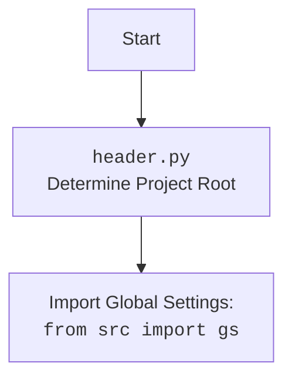

## ИНСТРУКЦИЯ:

Анализируй предоставленный код подробно и объясни его функциональность. Ответ должен включать три раздела:

1. **<алгоритм>**: Опиши рабочий процесс в виде пошаговой блок-схемы, включая примеры для каждого логического блока, и проиллюстрируй поток данных между функциями, классами или методами.
2. **<mermaid>**: Напиши код для диаграммы в формате `mermaid`, проанализируй и объясни все зависимости,
    которые импортируются при создании диаграммы.
    **ВАЖНО!** Убедитесь, что все имена переменных, используемые в диаграмме `mermaid`,
    имеют осмысленные и описательные имена. Имена переменных вроде `A`, `B`, `C`, и т.д., не допускаются!

    **Дополнительно**: Если в коде есть импорт `import header`, добавьте блок `mermaid` flowchart, объясняющий `header.py`:
    ```mermaid
    flowchart TD
        Start --> Header[<code>header.py</code><br> Determine Project Root]

        Header --> import[Import Global Settings: <br><code>from src import gs</code>]
    ```

3. **<объяснение>**: Предоставьте подробные объяснения:
   - **Импорты**: Их назначение и взаимосвязь с другими пакетами `src.`.
   - **Классы**: Их роль, атрибуты, методы и взаимодействие с другими компонентами проекта.
   - **Функции**: Их аргументы, возвращаемые значения, назначение и примеры.
   - **Переменные**: Их типы и использование.
   - Выделите потенциальные ошибки или области для улучшения.

Дополнительно, постройте цепочку взаимосвязей с другими частями проекта (если применимо).

Это обеспечивает всесторонний и структурированный анализ кода.
## Формат ответа: `.md` (markdown)
**КОНЕЦ ИНСТРУКЦИИ**

## <алгоритм>

1.  **Инициализация `ExecuteLocator`**:
    *   При создании объекта `ExecuteLocator` передаётся экземпляр `webdriver` и создаётся объект `ActionChains`.
    *   Пример: `executor = ExecuteLocator(driver)`

2.  **Вызов `execute_locator(locator, message, typing_speed, continue_on_error)`**:
    *   На вход поступает словарь `locator` (содержащий параметры для поиска элемента), сообщение `message`, скорость печати `typing_speed` и флаг `continue_on_error`.
    *   Пример: `executor.execute_locator(locator={'by': 'id', 'selector': 'myElement'}, message='test', typing_speed=0.1)`
    *   Далее идет логика ветвления:
        *   Если в `locator` есть ключ `attribute`: Вызывается `get_attribute_by_locator`
        *   Если в `locator` есть ключ `message`: Вызывается `send_message`
        *   Иначе: Вызывается `get_webelement_by_locator`

3.  **`get_webelement_by_locator(locator, message)`**:
    *   Получает объект `locator` (словарь или `SimpleNamespace`) и сообщение `message`.
    *   Преобразует строку `by` в объект `By` из Selenium, на основе `by_mapping`.
    *   Использует `WebDriverWait` для ожидания появления элемента.
        *   Если `if_list` присутствует в `locator` то используется поиск `find_elements` и результат обрабатывается согласно параметру `if_list` (возвращается первый, последний элемент или список)
        *   Иначе используется `find_element`
    *   В случае возникновения ошибок, возвращает `False` если `continue_on_error` = True, иначе вызывает исключение.
    *   Пример: `element = executor.get_webelement_by_locator(locator={'by': 'id', 'selector': 'myElement'})`

4.  **`get_attribute_by_locator(locator, message)`**:
    *   Получает объект `locator` (словарь или `SimpleNamespace`) и сообщение `message`.
    *   Вызывает `get_webelement_by_locator` для получения элемента.
        *   Если элемент не найден или список элементов, вызывается функция `evaluate_locator` если указан параметр `attribute`
        *   Иначе получаем атрибут  вызовом  `_get_element_attribute`,
    *   В случае возникновения ошибок, возвращает `False` если `continue_on_error` = True, иначе вызывает исключение.
    *   Пример: `attribute_value = executor.get_attribute_by_locator(locator={'by': 'id', 'selector': 'myElement', 'attribute': 'value'})`

5.  **`_get_element_attribute(element, attribute)`**:
    *   Получает `WebElement` и имя атрибута `attribute`.
    *   Возвращает значение атрибута элемента, если он существует, иначе `None`.
    *   Пример: `value = executor._get_element_attribute(element, 'value')`

6.  **`send_message(locator, message, typing_speed, continue_on_error)`**:
    *   Получает объект `locator` (словарь или `SimpleNamespace`), сообщение `message`, скорость печати `typing_speed` и флаг `continue_on_error`.
    *   Вызывает `get_webelement_by_locator` для получения элемента.
    *   Если `typing_speed` больше 0, то печатает сообщение посимвольно с задержкой.
    *   Иначе отправляет сообщение целиком.
    *   Пример: `executor.send_message(locator={'by': 'id', 'selector': 'myElement'}, message='test', typing_speed=0.1)`

7.  **`evaluate_locator(attribute)`**:
     *  Получает значение  `attribute`, которое может быть `str`, `list` или `dict`.
     *  Если `attribute` - это строка, то вызывает функцию `_evaluate`.
     *  Если `attribute` - это список, то рекурсивно вызывает `_evaluate` для каждого элемента списка, возвращает результат в виде списка.
     *  Если `attribute` - это словарь, то рекурсивно вызывает `_evaluate` для каждого значения словаря, возвращает результат в виде словаря.

8.  **`_evaluate(attribute)`**:
     * Получает атрибут в виде строки
     * Заменяет все найденные переменные в формате `${var}` на соответствующие значения из `gs.global_settings`.
     * Возвращает атрибут с подмененными переменными.

## <mermaid>
```mermaid
flowchart TD
    Start[Start] --> InitExecuteLocator[Инициализация ExecuteLocator]
    InitExecuteLocator --> ExecuteLocatorMethod[Вызов execute_locator]
    
    ExecuteLocatorMethod -- "locator['attribute'] exists" --> GetAttributeByLocator[Вызов get_attribute_by_locator]
    ExecuteLocatorMethod -- "locator['message'] exists" --> SendMessage[Вызов send_message]
    ExecuteLocatorMethod -- "else" --> GetWebElementByLocatorCall[Вызов get_webelement_by_locator]

    GetWebElementByLocatorCall --> GetWebElementByLocator[get_webelement_by_locator]
    GetWebElementByLocator --> WaitElement[WebDriverWait: Ожидание элемента]
    WaitElement -- "Element(s) found" --> ReturnElement[Возврат WebElement или List[WebElement]]
    WaitElement -- "Element(s) not found" --> ErrorHandling1[Обработка ошибки]
    ErrorHandling1 -- continue_on_error=true --> ReturnFalse1[Возврат False]
    ErrorHandling1 -- continue_on_error=false --> Exception1[Вызов исключения]

     GetAttributeByLocator --> GetWebElementByLocatorForAttribute[Вызов get_webelement_by_locator]
    GetWebElementByLocatorForAttribute --> WaitElementAttribute[WebDriverWait: Ожидание элемента]
    WaitElementAttribute -- "Element(s) found" --> GetAttributeFromElement[Получение атрибута через _get_element_attribute]
    WaitElementAttribute -- "Element(s) not found or if_list present" -->  EvaluateLocatorCall[Вызов evaluate_locator]

    GetAttributeFromElement --> ReturnAttributeValue[Возврат значения атрибута]

    EvaluateLocatorCall --> EvaluateLocator[evaluate_locator]
    EvaluateLocator --> Evaluate[Вызов _evaluate]
    Evaluate --> ReturnEvalValue[Возврат результата оценки]
    EvaluateLocator -- "attribute is list" --> EvaluateList[Рекурсивный вызов evaluate для списка]
    EvaluateLocator -- "attribute is dict" --> EvaluateDict[Рекурсивный вызов evaluate для словаря]

    SendMessage --> GetWebElementByLocatorForMessage[Вызов get_webelement_by_locator]
    GetWebElementByLocatorForMessage --> WaitElementMessage[WebDriverWait: Ожидание элемента]
    WaitElementMessage -- "Element found" --> SendKeysToElement[Отправка сообщения send_keys или посимвольно]
    WaitElementMessage -- "Element not found" --> ErrorHandling2[Обработка ошибки]
    ErrorHandling2 -- continue_on_error=true --> ReturnFalse2[Возврат False]
    ErrorHandling2 -- continue_on_error=false --> Exception2[Вызов исключения]
    
    ReturnElement --> End[End]
    ReturnAttributeValue --> End
     ReturnEvalValue --> End
     ReturnFalse1 --> End
    Exception1 --> End
    SendKeysToElement --> End
    ReturnFalse2 --> End
    Exception2 --> End
    
    
     
    classDef green fill:#ccf,stroke:#333,stroke-width:2px
    
     InitExecuteLocator,GetWebElementByLocatorCall,GetAttributeByLocator,SendMessage,ExecuteLocatorMethod class:green
    
     classDef red fill:#fcc,stroke:#333,stroke-width:2px
     ErrorHandling1,ErrorHandling2,Exception1,Exception2 class:red
    
     classDef blue fill:#aaf,stroke:#333,stroke-width:2px
    GetWebElementByLocator,WaitElement,WaitElementAttribute,WaitElementMessage,GetAttributeFromElement,EvaluateLocator,Evaluate,ReturnEvalValue,EvaluateList,EvaluateDict,GetWebElementByLocatorForAttribute,GetWebElementByLocatorForMessage,SendKeysToElement class:blue
    
    classDef yellow fill:#ffc,stroke:#333,stroke-width:2px
    ReturnElement,ReturnAttributeValue,ReturnFalse1,ReturnFalse2  class:yellow

```


## <объяснение>

### Импорты:

*   **`from selenium import webdriver`**: Импортирует основной класс `webdriver` из библиотеки Selenium для управления браузером.
*   **`from selenium.webdriver.common.keys import Keys`**: Импортирует класс `Keys`, позволяющий отправлять специальные клавиши (например, Enter, Tab) элементам веб-страницы.
*   **`from selenium.webdriver.common.by import By`**: Импортирует класс `By`, который используется для определения стратегии поиска элементов (например, по ID, XPath, CSS селектору).
*   **`from selenium.webdriver.remote.webelement import WebElement`**: Импортирует класс `WebElement`, представляющий собой элемент на веб-странице.
*   **`from selenium.webdriver.support.ui import WebDriverWait`**: Импортирует класс `WebDriverWait`, который позволяет ожидать появления элемента или изменения его состояния.
*   **`from selenium.webdriver.support import expected_conditions as EC`**: Импортирует модуль `expected_conditions`, содержащий набор условий для использования с `WebDriverWait`.
*   **`from selenium.webdriver.common.action_chains import ActionChains`**: Импортирует класс `ActionChains`, позволяющий выполнять сложные последовательности действий (например, drag-and-drop, hover).
*   **`from selenium.common.exceptions import NoSuchElementException, TimeoutException`**: Импортирует классы исключений, которые могут возникнуть при работе с Selenium (например, при отсутствии элемента на странице, или при превышении таймаута).
*   **`from src import gs`**: Импортирует глобальные настройки проекта из модуля `src`. Это позволяет получить доступ к конфигурационным данным, например к базовому URL, данным для логина и прочему.
*   **`from src.utils.printer import pprint, j_loads, j_loads_ns, j_dumps, save_png`**: Импортирует вспомогательные функции из модуля `src.utils.printer`, которые могут быть использованы для печати, работы с JSON и сохранения скриншотов.
    *   `pprint`:  Функция для "красивого" вывода данных
    *   `j_loads`: Загрузка JSON данных
    *    `j_loads_ns`: Загрузка JSON данных в `SimpleNamespace`
    *   `j_dumps`: Выгрузка в JSON формат
    *   `save_png`: Функция для сохранения скриншота
*   **`from src.logger.logger import logger`**: Импортирует объект `logger` из модуля `src.logger.logger`, который используется для записи сообщений в лог.
*   **`from src.logger.exceptions import DefaultSettingsException, WebDriverException, ExecuteLocatorException`**: Импортирует кастомные исключения для обработки специфических ошибок, которые могут возникнуть в процессе выполнения тестов.

### Класс `ExecuteLocator`:

*   **`__init__(self, driver, *args, **kwargs)`**: Конструктор класса.
    *   `driver`:  Экземпляр `webdriver` , который будет использоваться для взаимодействия с браузером.
    *   Инициализирует атрибуты `driver` и `actions`
*   **`execute_locator(self, locator, message, typing_speed, continue_on_error)`**: Основной метод для выполнения действий с элементами.
    *   `locator` (dict): Словарь с параметрами локатора (например, `"by"`, `"selector"`, `"attribute"`).
    *   `message` (str, optional): Сообщение для отправки элементу (опционально).
    *   `typing_speed` (float, optional): Скорость набора сообщения (опционально).
    *   `continue_on_error` (bool, optional): Флаг, определяющий, нужно ли продолжать выполнение при ошибке (опционально, по умолчанию `True`).
    *   Определяет по ключам словаря `locator` какой метод надо вызвать
    *   Возвращает результат работы вызванного метода
*   **`get_webelement_by_locator(self, locator, message)`**: Метод для получения элемента (или элементов) веб-страницы.
    *   `locator` (dict or SimpleNamespace): Словарь или `SimpleNamespace` с параметрами локатора.
    *   `message` (str, optional): Сообщение для логгирования.
    *   Преобразует `by` (строку) в объект `By` (например, `By.ID`).
    *   Использует `WebDriverWait` для ожидания появления элемента.
    *   Возвращает `WebElement` (если найден один элемент), `List[WebElement]`(если найдено несколько элементов), или `False` если не найден. Вызывает исключение если `continue_on_error=False`.
*   **`get_attribute_by_locator(self, locator, message)`**: Метод для получения значения атрибута элемента.
    *   `locator` (dict or SimpleNamespace): Словарь или `SimpleNamespace` с параметрами локатора.
    *   `message` (str, optional): Сообщение для логгирования.
    *   Вызывает `get_webelement_by_locator` для получения элемента.
    *   Возвращает значение атрибута, или `False` если не найден. Вызывает исключение если `continue_on_error=False`.
*   **`_get_element_attribute(self, element, attribute)`**: Вспомогательный метод для получения атрибута элемента.
    *   `element`: Экземпляр `WebElement`.
    *   `attribute` (str): Имя атрибута.
    *   Возвращает значение атрибута (строку), или `None` если такого атрибута нет.
*  **`send_message(self, locator, message, typing_speed, continue_on_error)`**: Метод для отправки сообщения элементу.
    *   `locator` (dict or SimpleNamespace): Словарь или `SimpleNamespace` с параметрами локатора.
    *   `message` (str): Сообщение для отправки.
    *   `typing_speed` (float): Скорость печати сообщения.
    *   `continue_on_error` (bool): Флаг, определяющий, нужно ли продолжать выполнение при ошибке.
    *   Вызывает `get_webelement_by_locator` для получения элемента
    *   Отправляет сообщение целиком или посимвольно с задержкой, если `typing_speed` > 0.
*  **`evaluate_locator(self, attribute)`**: Метод для подмены переменных в атрибуте локатора.
    *   `attribute`: Атрибут в формате строки, списка или словаря
    *   Вызывает `_evaluate` для подмены переменных, если `attribute` это строка.
    *   Если `attribute` это список или словарь, то вызывается рекурсивно для подмены переменных во всех значениях.
*   **`_evaluate(self, attribute)`**: Вспомогательный метод для подмены переменных в атрибуте локатора.
    *   `attribute` (str): Атрибут для подмены.
    *   Использует регулярные выражения, чтобы найти подстроки вида `${var}` и заменить их значениями из `gs.global_settings`.
*   **`get_locator_keys() `**: Статический метод, возвращает список доступных ключей локатора.

### Переменные:

*   **`driver`**: Экземпляр `webdriver`, используемый для взаимодействия с браузером.
*   **`actions`**: Экземпляр `ActionChains` для выполнения сложных действий.
*   **`by_mapping`**: Словарь для преобразования строковых представлений локаторов в объекты `By`.

### Потенциальные ошибки и области для улучшения:

*   **Обработка исключений:** В методах `get_webelement_by_locator`, `get_attribute_by_locator`,  `send_message`  есть общая логика обработки ошибок.  Нужно пересмотреть и перенести общую логику в отдельный метод.
*   **Унификация локаторов**: Сейчас `locator` может быть либо dict либо  `SimpleNamespace`, но в документации, примерах и коде ожидается только dict.
*   **`typing_speed`**: Параметр `typing_speed` не гибкий, например нужно задавать задержку в секундах, было бы лучше реализовать этот параметр в виде количества символов в секунду.
*   **Обработка списков**:  В функции `get_webelement_by_locator` есть параметр `if_list`, но отсутствует проверка типа данных.
*  **Обработка `timeout` и `timeout_for_event`**: В примерах локаторов есть параметры `timeout` и `timeout_for_event`, но они никак не используются. Нужно добавить обработку этих параметров в `WebDriverWait`.
* **`evaluate_locator`**:  Проверка типа `attribute` производится в `evaluate_locator`, было бы логичнее перенести её в `_evaluate` чтобы избежать повторных вызовов.
* **Глобальные настройки**: Использование `gs.global_settings` для подмены переменных это хорошо, но нужно добавить проверку на существование ключа переменной, а так же документацию, что используется именно этот объект.

### Цепочка взаимосвязей с другими частями проекта:

*   `ExecuteLocator` использует `webdriver` из Selenium для управления браузером, что является основой для выполнения UI-тестов.
*   Он использует настройки из `src.gs` (глобальные настройки), что позволяет гибко управлять параметрами тестов.
*   Использует `src.logger` для записи сообщений в лог, что важно для отладки и анализа результатов.
*   Использует утилиты из  `src.utils.printer` для работы с данными.
*   При возникновении ошибок выбрасываются исключения из `src.logger.exceptions`, для корректной обработки ошибок.

В целом, код предоставляет достаточно мощный и гибкий инструмент для взаимодействия с веб-страницами. Однако,  необходимо улучшить обработку ошибок и унифицировать структуру локаторов.