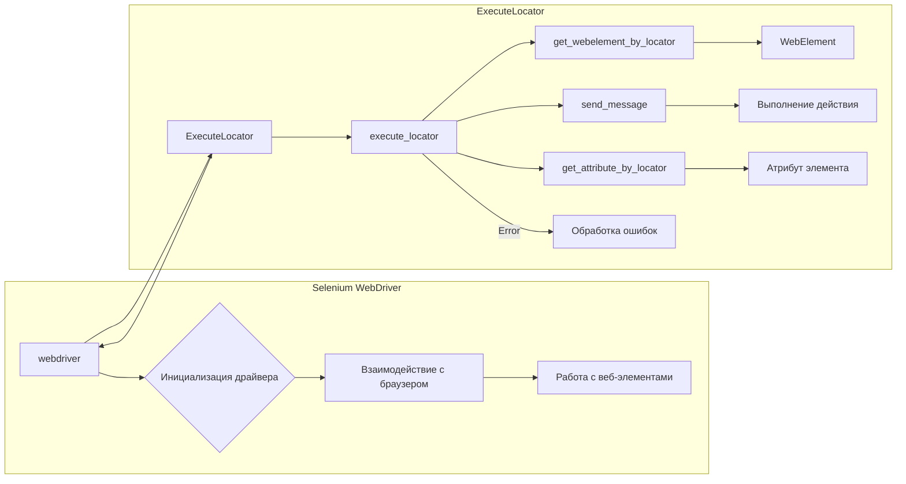

```MD
# Анализ кода класса ExecuteLocator

## <input code>

```python
# Фрагмент кода класса ExecuteLocator из файла executor.py
# (включает импорты, атрибуты, методы)
```

## <algorithm>

**Блок-схема алгоритма работы `execute_locator`:**

```mermaid
graph TD
    A[Вызов execute_locator(locator, message, ...)] --> B{Проверка типа локатора};
    B -- Локатор - словарь --> C[Вызов get_webelement_by_locator];
    B -- Локатор - другое --> D[Вызов другого метода (send_message, get_attribute_by_locator)];
    C --> E[Получение WebElement];
    E --> F[Возврат WebElement];
    D --> G[Выполнение соответствующего метода (отправка сообщения, получение атрибута)];
    G --> H[Возврат результата];
    B -- Ошибка --> I[Обработка ошибки];
    I -- continue_on_error = True --> H;
    I -- continue_on_error = False --> J[Прерывание выполнения];
```

**Пример:**

При вызове `execute_locator` с локатором, содержащим `by: "xpath"` и `selector: "//element"` функция `get_webelement_by_locator` получит элемент на странице, и `execute_locator` вернет полученный элемент.


## <mermaid>



**Подключаемые зависимости:**

* `selenium` – основная библиотека для взаимодействия с веб-драйвером.
* `src.utils` – содержит вспомогательные функции (например, для работы с данными, логгирования).
* `src.logger` – отвечает за логирование и обработку исключений.
* `src.gs` – модуль, содержащий глобальные настройки.
* `ActionChains` – для реализации сложных взаимодействий с элементами.

## <explanation>

**Импорты:**

* Импортируются необходимые компоненты Selenium для работы с веб-драйвером (например, `webdriver`, `By`, `WebElement`).
* Импортируются компоненты для обработки исключений и работы с веб-элементами.
* Импортируются модули из пакета `src` для работы с настройками (`gs`), логгированием (`logger`), дополнительными функциями (`utils`).

**Классы:**

* **`ExecuteLocator`**: Класс для управления взаимодействием с веб-элементами.  `driver` хранит экземпляр WebDriver, `actions` – для сложных действий, `by_mapping` – для преобразования строк в объекты `By`

**Методы:**

* **`__init__`**: Инициализирует `driver` и `actions`.
* **`execute_locator`**: Главный метод, управляющий логикой выполнения действий с элементами. Он решает, какой метод вызвать в зависимости от типа локатора (словарь или другой тип)
* **`get_webelement_by_locator`**: Получает веб-элемент по локатору.
* **`get_attribute_by_locator`**: Получает атрибут веб-элемента по локатору.
* **`_get_element_attribute`**: Вспомогательный метод для получения атрибута элемента.
* **`send_message`**: Отправляет сообщение в поле ввода.
* **`evaluate_locator`**: Оценивает значение локатора.
* **`_evaluate`**: Вспомогательный метод для оценки атрибута.
* **`get_locator_keys`**: Возвращает список доступных ключей локатора.

**Переменные:**

* Переменные, представляющие локаторы, обычно являются словарями (`dict`) или `SimpleNamespace`, содержащими информацию о расположении элемента на странице (например, `xpath`, `id`, `class`).


**Возможные ошибки и улучшения:**

* **Перехват исключений:**  Код должен обрабатывать возможные исключения (`NoSuchElementException`, `TimeoutException`),  чтобы предотвратить сбой сценария.
* **Чёткая логика обработки локаторов:** Важно разделить логику для разных типов локаторов (например, `xpath`, `id`), чтобы сделать код более гибким и масштабируемым.
* **Дополнительно**:  Добавление возможности обработки списков элементов, найденных по локаторам.


**Взаимосвязи с другими частями проекта:**

Класс `ExecuteLocator` использует объекты `webdriver`, `WebElement` и `ActionChains` из Selenium. Он взаимодействует с `src.utils` для функций обработки данных, с `src.logger` для логирования.  `ExecuteLocator` использует  `gs` для доступа к настройкам.

**Вывод:**

Код `ExecuteLocator`  предназначен для работы с веб-драйвером, выполняя действия с элементами на основе локаторов.  Он хорошо структурирован, используя методы для отдельных операций.  Однако, можно улучшить обработку ошибок и логику для повышения надёжности и гибкости.