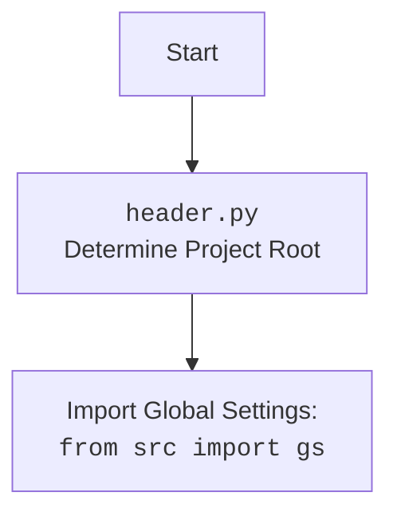

## ИНСТРУКЦИЯ:

Анализируй предоставленный код подробно и объясни его функциональность. Ответ должен включать три раздела:  

1. **<алгоритм>**: Опиши рабочий процесс в виде пошаговой блок-схемы, включая примеры для каждого логического блока, и проиллюстрируй поток данных между функциями, классами или методами.  
2. **<mermaid>**: Напиши код для диаграммы в формате `mermaid`, проанализируй и объясни все зависимости, 
    которые импортируются при создании диаграммы. 
    **ВАЖНО!** Убедитесь, что все имена переменных, используемые в диаграмме `mermaid`, 
    имеют осмысленные и описательные имена. Имена переменных вроде `A`, `B`, `C`, и т.д., не допускаются!  
    
    **Дополнительно**: Если в коде есть импорт `import header`, добавьте блок `mermaid` flowchart, объясняющий `header.py`:\
    ```mermaid
    flowchart TD
        Start --> Header[<code>header.py</code><br> Determine Project Root]
    
        Header --> import[Import Global Settings: <br><code>from src import gs</code>] 
    ```

3. **<объяснение>**: Предоставьте подробные объяснения:  
   - **Импорты**: Их назначение и взаимосвязь с другими пакетами `src.`.  
   - **Классы**: Их роль, атрибуты, методы и взаимодействие с другими компонентами проекта.  
   - **Функции**: Их аргументы, возвращаемые значения, назначение и примеры.  
   - **Переменные**: Их типы и использование.  
   - Выделите потенциальные ошибки или области для улучшения.  

Дополнительно, постройте цепочку взаимосвязей с другими частями проекта (если применимо).  

Это обеспечивает всесторонний и структурированный анализ кода.
## Формат ответа: `.md` (markdown)
**КОНЕЦ ИНСТРУКЦИИ**
```

## <алгоритм>

**`ExecuteLocator` Класс**

1.  **Инициализация (`__init__`)**:
    *   Создается экземпляр класса `ExecuteLocator` с переданным драйвером `webdriver` (`driver`).
    *   Инициализируется объект `ActionChains` с использованием `driver`.
    *   Пример:
        ```python
        driver = webdriver.Chrome()
        executor = ExecuteLocator(driver)
        ```

2.  **Выполнение локатора (`execute_locator`)**:
    *   Получает `locator` (словарь с параметрами), `message` (сообщение для отправки), `typing_speed` (скорость набора текста), `continue_on_error` (флаг для продолжения при ошибках).
    *   Определяет тип действия, используя параметры из `locator` (например, `attribute`, `send_keys`).
    *   Вызывает соответствующий метод:
        *   `get_webelement_by_locator` для поиска элемента.
        *   `get_attribute_by_locator` для получения атрибута элемента.
        *   `send_message` для отправки сообщения элементу.
        *   `evaluate_locator` для оценки значения.
    *   Обрабатывает ошибки в зависимости от значения `continue_on_error`.
    *   Возвращает результат действия или `False` при ошибке.
    *   Пример:
        ```python
        locator = {"by": "id", "selector": "my_element_id", "action":"send_keys", "value":"my_text"}
        executor.execute_locator(locator, message="Test Message", typing_speed=0.1)
        ```
        
3.  **Получение веб-элемента (`get_webelement_by_locator`)**:
    *   Получает словарь `locator`, `message` (сообщение об ошибке)
    *   Использует `WebDriverWait` для ожидания элемента (с использованием параметров `timeout` и `timeout_for_event` из `locator`).
    *   Ищет элемент на странице, используя `locator["by"]` и `locator["selector"]`.
        *   Если `if_list` присутствует в `locator`, возвращает первый или последний элемент (если `if_list` равен "first" или "last" соответсвенно)
        *   Если `if_list` отсутствует возвращает `WebElement`.
        *   Если элемент не найден, возвращает `False`.
        *    Если элемент не один возвращает список элементов `List[WebElement]`.
    *   Пример:
        ```python
         locator = {"by": "id", "selector": "my_element_id",  "timeout":10,"timeout_for_event":"presence_of_element_located" }
        element = executor.get_webelement_by_locator(locator, "Element not found")
        ```
4. **Получение атрибута (`get_attribute_by_locator`)**:
    *   Получает словарь `locator`, `message` (сообщение об ошибке).
    *   Вызывает `get_webelement_by_locator` для получения веб-элемента.
    *   Итерируется по списку атрибутов в `locator["attribute"]`.
    *   Для каждого атрибута вызывает `_get_element_attribute`.
    *   Собирает результат и возвращает его.
    *   Пример:
        ```python
        locator = {"by": "id", "selector": "my_element_id", "attribute": ["href", "class"],  "timeout":10,"timeout_for_event":"presence_of_element_located"}
        attributes = executor.get_attribute_by_locator(locator, "Error getting attribute")
        ```

5.  **Получение значения атрибута (`_get_element_attribute`)**:
    *   Получает `WebElement` и имя атрибута.
    *   Возвращает значение атрибута с помощью `element.get_attribute(attribute)`.
    *   Пример:
        ```python
        element = driver.find_element(By.ID, "my_element_id")
        value = executor._get_element_attribute(element, "href")
        ```

6.  **Отправка сообщения (`send_message`)**:
    *   Получает словарь `locator`, `message` (сообщение для отправки), `typing_speed` (скорость печати), `continue_on_error` (флаг для продолжения при ошибке).
    *   Получает веб-элемент через `get_webelement_by_locator`.
    *   Очищает поле и отправляет сообщение с заданной скоростью `typing_speed` (с использованием цикла).
    *   Возвращает `True` если сообщение отправлено, `False` в противном случае.
    *   Пример:
        ```python
        locator = {"by": "id", "selector": "my_input_field",  "timeout":10,"timeout_for_event":"presence_of_element_located"}
        executor.send_message(locator, message="Input text", typing_speed=0.2, continue_on_error = True )
        ```

7. **Оценка локатора (`evaluate_locator`)**:
   *  Получает `attribute` (строку, список или словарь).
   *  Если `attribute` строка, вызывает `_evaluate` напрямую.
   *  Если `attribute` список, то для каждого элемента списка вызывается `_evaluate` и результаты собираются в список.
   *  Если `attribute` словарь, для каждого ключа словаря вызывается `_evaluate` и результаты собираются в словарь.
   *  Возвращает результат обработки.
   *   Пример:
        ```python
        attribute = "window.location.href"
        value = executor.evaluate_locator(attribute)
         attribute = ["window.location.href","document.title"]
        value = executor.evaluate_locator(attribute)
        attribute = {"url":"window.location.href","title":"document.title"}
        value = executor.evaluate_locator(attribute)
        ```

8.  **Оценка атрибута (`_evaluate`)**:
    *   Получает строку атрибута.
    *   Выполняет JavaScript `driver.execute_script` и возвращает результат.
    *   Пример:
        ```python
        value = executor._evaluate("return window.location.href")
        ```
9. **Получение ключей локаторов (`get_locator_keys`)**:
    *   Возвращает список всех возможных ключей (параметров) для локатора.

## <mermaid>

```mermaid
flowchart TD
    subgraph ExecuteLocator Class
        A[<code>__init__</code><br> Initialize WebDriver and ActionChains]
         --> B(<code>execute_locator</code><br> Execute action based on locator configuration)
        B --> C{Determine action type}
        C -- "get_webelement" --> D(<code>get_webelement_by_locator</code><br> Retrieve WebElement(s) by locator)
        C -- "get_attribute" --> E(<code>get_attribute_by_locator</code><br> Retrieve attribute(s) of the element(s))
        C -- "send_message" --> F(<code>send_message</code><br> Send message to the element)
        C -- "evaluate" --> G(<code>evaluate_locator</code><br> Evaluate locator attribute or javascript )
        
        D --> H{Is list required ?}
         H -- "Yes" -->I(Return list of WebElement)
        H -- "No" -->J(Return WebElement)
        H -- "Error" --> K(Return False)


        E --> L(<code>get_webelement_by_locator</code><br> Get WebElement )
        L --> M{Iterate attributes}
        M --> N(<code>_get_element_attribute</code><br> Get attribute value )
        N --> O(Return attributes values)

        F -->P(<code>get_webelement_by_locator</code><br> Get WebElement)
          P --> Q(Send Message with type speed)
          Q--> R( Return True)
           Q-->S( Return False)
           
        G --> T{Attribute Type}
        T -- "String"-->U(<code>_evaluate</code><br> Execute Javascript and Return value )
        T -- "List" -->V(Iterate and call <code>_evaluate</code>)
        T -- "Dictionary" --> W(Iterate and call <code>_evaluate</code>)
    
    end
        
    classDef grey fill:#f9f,stroke:#333,stroke-width:2px
    A,B,C,D,E,F,G,H,I,J,K,L,M,N,O,P,Q,R,S,T,U,V,W  :::grey
```

### Объяснение зависимостей `mermaid`

*   **`ExecuteLocator Class`**: Представляет собой класс `ExecuteLocator`, который содержит логику для работы с веб-элементами.
    *   **`__init__`**: Метод инициализации класса, который принимает `driver` и инициализирует `ActionChains`.
    *   **`execute_locator`**: Основной метод, который вызывает другие методы в зависимости от типа действия, определенного в локаторе.
    *    **`Determine action type`**: Условный блок, который решает, какой метод вызвать, в зависимости от конфигурации локатора.
    *   **`get_webelement_by_locator`**: Метод для получения веб-элемента(ов) с использованием заданного локатора.
     *  **`Is list required ?`**: Условный блок, для проверки, необходимо ли вернуть список элементов
      *  **`Return list of WebElement`**: Вернуть список элементов
      * **`Return WebElement`**: Вернуть  элемент
      *  **`Return False`**: Возвращает `False` в случае ошибки
    *    **`get_attribute_by_locator`**: Метод для получения атрибута(ов)  веб-элемента(ов) с использованием заданного локатора.
    *    **`Iterate attributes`**: Условный блок, для перебора  атрибутов
    *   **`_get_element_attribute`**: Метод для получения значения атрибута элемента.
    *  **`Return attributes values`**: Вернуть  значение(я) атрибута
    *   **`send_message`**: Метод для отправки сообщения в элемент.
    *  **`Send Message with type speed`**: Условный блок, который перебирает строку и отправляет посимвольно
    * **`Return True`**: Сообщения отправлено
    * **`Return False`**: Сообщения не отправлено
    *   **`evaluate_locator`**: Метод для вычисления выражения JavaScript
    *   **`Attribute Type`**: Условный блок, который определяет тип атрибута
    *   **`_evaluate`**: Метод для выполнения JavaScript и получения результата
   
*   **Зависимости**:
    *   Все методы в классе `ExecuteLocator` работают с `driver`, полученным при инициализации, и `ActionChains`.
    *   Метод `execute_locator` вызывает другие методы класса в зависимости от типа действия.



## <объяснение>

### Импорты

*   **`from selenium import webdriver`**: Импортирует модуль `webdriver` из библиотеки Selenium для управления браузером.
*   **`from selenium.webdriver.common.keys import Keys`**: Импортирует модуль `Keys` для отправки специальных клавиш (например, Enter, Tab).
*   **`from selenium.webdriver.common.by import By`**: Импортирует модуль `By` для определения типа локатора (например, `By.ID`, `By.XPATH`).
*   **`from selenium.webdriver.remote.webelement import WebElement`**: Импортирует класс `WebElement` для представления элементов на веб-странице.
*   **`from selenium.webdriver.support.ui import WebDriverWait`**: Импортирует класс `WebDriverWait` для ожидания определенных условий (например, появления элемента) на странице.
*   **`from selenium.webdriver.support import expected_conditions as EC`**: Импортирует модуль `expected_conditions` для определения ожидаемых условий.
*   **`from selenium.webdriver.common.action_chains import ActionChains`**: Импортирует класс `ActionChains` для выполнения сложных действий с элементами (например, перемещение мыши, drag-and-drop).
*   **`from selenium.common.exceptions import NoSuchElementException, TimeoutException`**: Импортирует исключения, которые могут возникнуть при взаимодействии с Selenium.
*   **`from src import gs`**: Импортирует глобальные настройки из модуля `gs`, расположенного в пакете `src`. Этот модуль, вероятно, содержит настройки проекта и переменные среды.
*   **`from src.utils.printer import pprint, j_loads, j_loads_ns, j_dumps, save_png`**: Импортирует функции для красивого вывода данных, загрузки и сохранения JSON, а также сохранения скриншотов из модуля `printer` пакета `src.utils`.
*    **`from src.logger.logger import logger`**: Импортирует объект `logger` для ведения логов.
*   **`from src.logger.exceptions import DefaultSettingsException, WebDriverException, ExecuteLocatorException`**: Импортирует пользовательские исключения, определенные в проекте, для обработки специфических ошибок.

### Классы

*   **`ExecuteLocator`**:
    *   **Роль**: Основной класс для выполнения действий с веб-элементами на основе переданных локаторов.
    *   **Атрибуты**:
        *   `driver`: Экземпляр `webdriver` для управления браузером.
        *   `actions`: Экземпляр `ActionChains` для выполнения сложных действий.
    *   **Методы**:
        *   `__init__`: Инициализирует класс, принимает `driver` и создает объект `ActionChains`.
        *   `execute_locator`: Основной метод для выполнения действия с элементом. Выбор действия зависит от параметров в словаре `locator`.
        *   `get_webelement_by_locator`: Возвращает веб-элемент на основе локатора, используя ожидания.
        *   `get_attribute_by_locator`: Возвращает значение атрибута элемента.
        *    `_get_element_attribute`: Получает значение атрибута элемента.
        *    `send_message`: Отправляет сообщение в элемент с заданной скоростью набора текста.
        *   `evaluate_locator`: Оценивает значение атрибута локатора.
        *   `_evaluate`:  Выполняет javascript и возвращает результат.
        *   `get_locator_keys`: Возвращает список возможных ключей локатора.
    *   **Взаимодействие**:
        *   Использует `webdriver` для взаимодействия с браузером.
        *   Использует `ActionChains` для сложных взаимодействий.
        *   Использует `WebDriverWait` для ожидания элементов.
        *   Обрабатывает исключения, связанные с Selenium и логирует их.
        *   Использует `src.utils.printer` для вывода и обработки данных.
        *   Использует `src.logger` для логирования.
        *   Использует `src.gs` для получения глобальных настроек.

### Функции

*   `__init__(self, driver, *args, **kwargs)`: Конструктор класса, инициализирующий `driver` и `ActionChains`.
*   `execute_locator(self, locator: dict, message: str = None, typing_speed: float = 0, continue_on_error: bool = True) -> Union[str, list, dict, WebElement, bool]`: Основной метод для выполнения действий с веб-элементами на основе словаря `locator`.
    *   **Аргументы**:
        *   `locator`: Словарь, определяющий, как найти элемент и какое действие с ним выполнить.
        *   `message`: Сообщение для отправки в элемент (если применимо).
        *   `typing_speed`: Скорость печати сообщения (если применимо).
        *   `continue_on_error`: Флаг, указывающий, нужно ли продолжать выполнение при возникновении ошибки.
    *   **Возвращаемое значение**: Результат действия, элемент, список элементов, словарь или `False` в случае ошибки.
    *   **Назначение**: Координирует выполнение действий с веб-элементами на основе переданных параметров.
    *    **Пример**:
        ```python
        locator = {"by": "id", "selector": "my_element_id", "action":"send_keys", "value":"my_text"}
        result = executor.execute_locator(locator, message="Test Message", typing_speed=0.1)
        ```
*   `get_webelement_by_locator(self, locator: dict | SimpleNamespace, message: str = None) -> WebElement | List[WebElement] | bool`: Метод для получения веб-элементов на основе переданного локатора.
    *   **Аргументы**:
        *   `locator`: Словарь или `SimpleNamespace`, содержащий параметры локатора.
        *   `message`: Сообщение, выводимое в случае ошибки.
    *   **Возвращаемое значение**: `WebElement`, список `WebElement` или `False` если элемент не найден.
    *   **Назначение**: Поиск элемента на веб-странице с ожиданием, которое задано в  параметрах `locator`.
     *    **Пример**:
        ```python
         locator = {"by": "id", "selector": "my_element_id",  "timeout":10,"timeout_for_event":"presence_of_element_located" }
        element = executor.get_webelement_by_locator(locator, "Element not found")
        ```

*   `get_attribute_by_locator(self, locator: dict | SimpleNamespace, message: str = None) -> str | list | dict | bool`: Метод для получения значения атрибута элемента.
    *   **Аргументы**:
        *   `locator`: Словарь или `SimpleNamespace`, содержащий параметры локатора.
        *   `message`: Сообщение, выводимое в случае ошибки.
    *   **Возвращаемое значение**: Строка, список, словарь со значениями атрибута или `False` если элемент не найден.
    *   **Назначение**: Поиск элемента на веб-странице, получение его атрибута.
      *    **Пример**:
        ```python
        locator = {"by": "id", "selector": "my_element_id", "attribute": ["href", "class"],  "timeout":10,"timeout_for_event":"presence_of_element_located"}
        attributes = executor.get_attribute_by_locator(locator, "Error getting attribute")
        ```
*   `_get_element_attribute(self, element: WebElement, attribute: str) -> str | None`: Метод для получения значения одного атрибута веб-элемента.
    *   **Аргументы**:
        *   `element`: Экземпляр `WebElement`.
        *   `attribute`: Имя атрибута.
    *   **Возвращаемое значение**: Значение атрибута в виде строки или `None`.
    *   **Назначение**: Получение значения конкретного атрибута у элемента.
    *    **Пример**:
        ```python
        element = driver.find_element(By.ID, "my_element_id")
        value = executor._get_element_attribute(element, "href")
        ```

*   `send_message(self, locator: dict | SimpleNamespace, message: str, typing_speed: float, continue_on_error:bool) -> bool`: Метод для отправки сообщения в текстовое поле.
    *   **Аргументы**:
        *   `locator`: Словарь или `SimpleNamespace`, содержащий параметры локатора.
        *   `message`: Сообщение для отправки.
        *   `typing_speed`: Скорость печати сообщения.
        *   `continue_on_error`: Флаг, указывающий, нужно ли продолжать выполнение при возникновении ошибки.
    *   **Возвращаемое значение**: `True`, если сообщение успешно отправлено, `False` в противном случае.
    *   **Назначение**: Имитация ввода текста в поле с заданной скоростью печати.
      *    **Пример**:
        ```python
        locator = {"by": "id", "selector": "my_input_field",  "timeout":10,"timeout_for_event":"presence_of_element_located"}
        executor.send_message(locator, message="Input text", typing_speed=0.2, continue_on_error = True )
        ```

*  `evaluate_locator(self, attribute: str | list | dict) -> str`: Метод для оценки javascript  выражения.
    *   **Аргументы**:
        *   `attribute`: Строка, список или словарь javascript выражений.
    *   **Возвращаемое значение**: Результат выполнения JavaScript-кода.
    *   **Назначение**: Возвращает результат выполнения JavaScript-кода.
       *    **Пример**:
        ```python
        attribute = "window.location.href"
        value = executor.evaluate_locator(attribute)
         attribute = ["window.location.href","document.title"]
        value = executor.evaluate_locator(attribute)
        attribute = {"url":"window.location.href","title":"document.title"}
        value = executor.evaluate_locator(attribute)
        ```
*   `_evaluate(self, attribute: str) -> str | None`: Метод для выполнения javascript кода.
    *   **Аргументы**:
        *   `attribute`: Строка  javascript выражения.
    *   **Возвращаемое значение**: Результат выполнения JavaScript-кода.
    *   **Назначение**: Выполняет JavaScript-код.
    *    **Пример**:
        ```python
        value = executor._evaluate("return window.location.href")
        ```
*   `get_locator_keys() -> list`: Статический метод, возвращающий список всех возможных ключей локатора.
    *   **Аргументы**: Нет.
    *   **Возвращаемое значение**: Список ключей локатора.
    *   **Назначение**: Получение списка всех доступных ключей локатора.

### Переменные

*   `driver`: Экземпляр `webdriver`, используемый для управления браузером.
*   `actions`: Экземпляр `ActionChains` для выполнения сложных действий с элементами.
*   `by_mapping`: Словарь для преобразования строковых представлений локаторов в объекты `By` (не показано в предоставленном коде, но подразумевается).
*   `locator`: Словарь, содержащий параметры локатора для поиска элементов.
*   `message`: Сообщение для отправки в элемент.
*   `typing_speed`: Скорость печати сообщения.
*   `continue_on_error`: Флаг, определяющий, нужно ли продолжать выполнение при ошибке.
*   `element`: Переменная для хранения экземпляра `WebElement`

### Потенциальные Ошибки и Области для Улучшения

*   **Обработка ошибок**: В методе `execute_locator` обрабатываются общие ошибки. Можно добавить более специфичную обработку ошибок (например, `NoSuchElementException`).
*   **Динамические локаторы**: Код может быть уязвим к динамическим изменениям веб-страницы. Можно внедрить механизмы для адаптации к изменениям DOM.
*   **Расширяемость**: Код поддерживает разные виды действий, но их можно расширить (например, добавление выбора из выпадающего списка).
*   **Логирование**: Можно добавить больше логов, особенно для проблемных ситуаций.
*  **Рефакторинг**: Метод `execute_locator` слишком большой, можно разделить на несколько небольших методов, что улучшит читаемость и сопровождение кода.
*  **Сложность**: Функция `send_message` может быть упрощена, применив встроенные функции для отправки текста в поле
*  **Типизация**: Желательно добавить типизацию для всех атрибутов класса и переменных в методах.

### Взаимосвязи с другими частями проекта

*   **`src.gs`**: Используется для получения глобальных настроек проекта, таких как пути к файлам, тайм-ауты и другие параметры.
*   **`src.utils.printer`**: Используется для вывода информации, загрузки/сохранения JSON, сохранения скриншотов.
*   **`src.logger`**: Используется для логирования событий и ошибок.
*   **`src.webdriver`**:  Включает в себя  данный модуль, который используется для взаимодействия с веб-страницами.
*   **Логика проекта**: Этот класс является частью системы автоматизации тестирования и обеспечивает взаимодействие с веб-элементами в тестах.

В целом, класс `ExecuteLocator` представляет собой мощный инструмент для автоматизации взаимодействия с веб-элементами, предоставляя гибкость и расширяемость для создания robust-тестов.