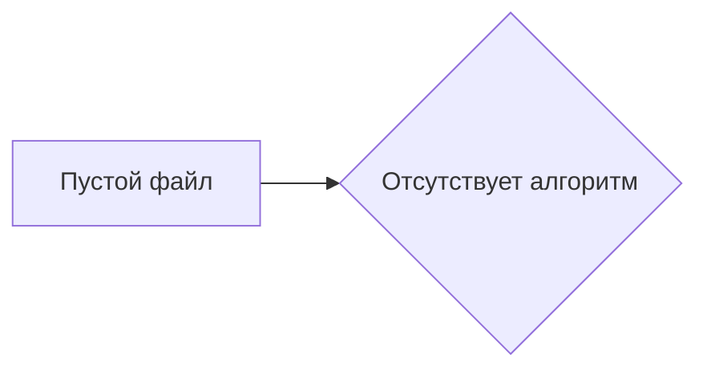

# Анализ кода (пустой файл)

## <input code>

```
{\\rtf1}
```

## <algorithm>

Поскольку предоставленный код пустой, алгоритм работы также отсутствует.  Невозможно построить блок-схему или примеры работы.


## <mermaid>



## <explanation>

Предоставленный код представляет собой пустой файл в формате Rich Text Format (RTF).  В нем нет ни импортов, ни классов, ни функций, ни переменных.  Поэтому анализ функциональности, связей с другими частями проекта или возможных ошибок невозможен.  Для корректного анализа требуется код с содержанием.