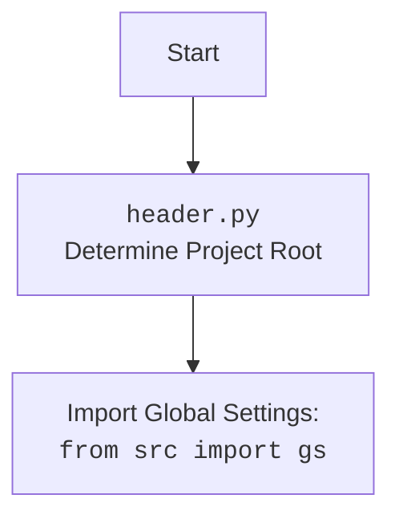

## <алгоритм>

1.  **Инициализация WebDriver**:
    *   Создается экземпляр `webdriver.Chrome` с использованием пути к драйверу, взятого из глобальных настроек (`gs['chrome_driver_path']`).
        *   Пример: `driver = webdriver.Chrome(executable_path=gs['chrome_driver_path'])`
    *   Затем происходит переход на сайт "https://example.com" с помощью `driver.get("https://example.com")`.
2.  **Создание экземпляра `ExecuteLocator`**:
    *   Создается объект `locator` класса `ExecuteLocator`, передавая ему экземпляр драйвера `driver`.
        *   Пример: `locator = ExecuteLocator(driver)`
3.  **Простой пример локатора**:
    *   Определяется словарь `simple_locator` с параметрами для поиска элемента `<h1>` по XPath, получения его `textContent`.
        *   Пример: `simple_locator = {"by": "XPATH", "selector": "//h1", "attribute": "textContent", ...}`
    *   Вызывается метод `locator.execute_locator(simple_locator)` для выполнения поиска и получения значения.
        *   Результат выводится на экран.
4.  **Сложный пример локатора**:
    *   Определяется вложенный словарь `complex_locator` для поиска ссылок на товары (product_links) и элементов пагинации.
        *  Вложенная структура: `complex_locator["product_links"]` , `complex_locator["pagination"]["ul"]` и `complex_locator["pagination"]["->"]`.
        *   Пример: `complex_locator = {"product_links": { "attribute": "href", "by": "XPATH", "selector": "//a[contains(@class, 'product')]"}, "pagination": {"ul":{...}, "->":{...}}}`
    *   Вызывается метод `locator.execute_locator(complex_locator)` для выполнения поиска и получения значений.
        *   Результат выводится на экран.
5.  **Пример обработки ошибок**:
    *   Вызывается `locator.execute_locator` с параметром `continue_on_error=True`.
    *   Оборачивается в `try-except` блок, чтобы перехватить исключение `ExecuteLocatorException`, если оно возникнет.
        *   Пример: `try: locator.execute_locator(complex_locator, continue_on_error=True); except ExecuteLocatorException as ex: print(f"An error occurred: {ex}")`
6.  **Пример `send_message`**:
    *   Определяется словарь `message_locator` для поиска поля ввода.
        *   Пример: `message_locator = {"by": "XPATH", "selector": "//input[@name='search']", ...}`
    *   Вызывается `locator.send_message(message_locator, "Buy a new phone", typing_speed=0.05, continue_on_error=True)` для отправки сообщения в поле ввода.
        *   Результат выводится на экран.
7. **Пример списка локаторов**:
    *  Определяется словарь `multi_locator`, содержащий списки значений для ключей by, selector, attribute, event, use_mouse и mandatory.
         *  Пример: `multi_locator = { "by": ["XPATH", "XPATH"], "selector": ["//button[@id='submit']", "//input[@id='username']"], ... }`
    *  Вызывается метод `locator.execute_locator(multi_locator)`, который выполняет действия на нескольких элементах.
        *   Результат выводится на экран.
8.  **Пример `evaluate_locator`**:
    *   Определяется словарь `attribute_locator` для поиска мета-тега description.
        *   Пример: `attribute_locator = {"by": "XPATH", "selector": "//meta[@name='description']", "attribute": "content", ...}`
    *   Вызывается метод `locator.evaluate_locator(attribute_locator['attribute'])`, чтобы извлечь содержимое атрибута.
        *   Результат выводится на экран.
9.  **Пример обработки исключений**:
    *  Вызывается метод `locator.execute_locator` с параметрами `simple_locator` внутри блока `try-except`, чтобы перехватить возможные исключения.
10. **Пример полного теста**:
    *  Определяется `test_locator` для поиска заголовка `<h1>`, как в первом примере.
    *   Вызывается `locator.execute_locator(test_locator)` для выполнения.
        *   Результат выводится на экран.
11. **Завершение работы**:
    *   Вызывается `driver.quit()` для закрытия браузера.

## <mermaid>

```mermaid
flowchart TD
    Start[Start] --> InitializeDriver[Initialize WebDriver: `webdriver.Chrome`];
    InitializeDriver --> NavigateToWebsite[Navigate to: `driver.get("https://example.com")`];
    NavigateToWebsite --> CreateLocatorInstance[Create `ExecuteLocator` Instance: `ExecuteLocator(driver)`];
    CreateLocatorInstance --> SimpleLocatorExample[Simple Locator Example: `locator.execute_locator(simple_locator)`];
    SimpleLocatorExample --> ComplexLocatorExample[Complex Locator Example: `locator.execute_locator(complex_locator)`];
    ComplexLocatorExample --> ErrorHandlingExample[Error Handling Example: `locator.execute_locator(complex_locator, continue_on_error=True)`];
     ErrorHandlingExample --> SendMessageExample[Send Message Example: `locator.send_message(message_locator, message, ...)`];
    SendMessageExample --> MultiLocatorExample[Multi Locator Example: `locator.execute_locator(multi_locator)`];
    MultiLocatorExample --> EvaluateLocatorExample[Evaluate Locator Example: `locator.evaluate_locator(attribute_locator['attribute'])`];
    EvaluateLocatorExample --> ExceptionHandlingExample[Exception Handling Example: `locator.execute_locator(simple_locator)`];
    ExceptionHandlingExample --> FullTestExample[Full Test Example: `locator.execute_locator(test_locator)`];
    FullTestExample --> DriverCleanup[Driver Cleanup: `driver.quit()`];
    DriverCleanup --> End[End];
    
    subgraph "Simple Locator"
    direction LR
        simple_locator_def[Define Locator: <br> `simple_locator`] --> simple_locator_exec[Execute Locator: <br> `locator.execute_locator(simple_locator)`]
    end

    subgraph "Complex Locator"
        direction LR
       complex_locator_def[Define Locator: <br> `complex_locator`] --> complex_locator_exec[Execute Locator: <br> `locator.execute_locator(complex_locator)`]
    end

    subgraph "Error Handling"
        direction LR
        error_handling_exec[Execute Locator (error): <br> `locator.execute_locator(complex_locator, continue_on_error=True)`] --> error_handling_catch[Catch `ExecuteLocatorException`]
    end
    
    subgraph "Send Message"
        direction LR
        send_message_def[Define Locator: <br> `message_locator`] --> send_message_exec[Send Message: <br> `locator.send_message(message_locator, message, ...)`]
    end
    
    subgraph "Multi Locator"
        direction LR
        multi_locator_def[Define Locator: <br> `multi_locator`] --> multi_locator_exec[Execute Locator: <br> `locator.execute_locator(multi_locator)`]
    end
    
   subgraph "Evaluate Locator"
        direction LR
        evaluate_locator_def[Define Locator: <br> `attribute_locator`] --> evaluate_locator_exec[Evaluate Locator: <br> `locator.evaluate_locator(attribute_locator['attribute'])`]
   end

   subgraph "Exception Handling"
       direction LR
       exception_handling_exec[Execute Locator (exception): <br> `locator.execute_locator(simple_locator)`] --> exception_handling_catch[Catch `ExecuteLocatorException`]
   end
    
    subgraph "Full Test"
       direction LR
       full_test_def[Define Locator: <br> `test_locator`] --> full_test_exec[Execute Locator: <br> `locator.execute_locator(test_locator)`]
    end
```



## <объяснение>

**Импорты:**

*   `from selenium import webdriver`: Импортирует модуль `webdriver` из библиотеки `selenium`. Это основной модуль для управления браузером.  В частности, используется `webdriver.Chrome` для создания экземпляра браузера Chrome.
*   `from src.webdriver.executor import ExecuteLocator`: Импортирует класс `ExecuteLocator` из модуля `src.webdriver.executor`. Этот класс отвечает за выполнение локаторов.
*   `from src import gs`: Импортирует глобальные настройки `gs` из пакета `src`. Используется для получения пути к драйверу Chrome (`gs['chrome_driver_path']`).
*   `from src.logger.exceptions import ExecuteLocatorException`: Импортирует класс `ExecuteLocatorException` из модуля `src.logger.exceptions`. Это исключение используется для обработки ошибок, возникающих при выполнении локаторов.

**Функция `main()`:**

*   `driver = webdriver.Chrome(executable_path=gs['chrome_driver_path'])`: Создает экземпляр браузера Chrome.  `executable_path` берется из глобальных настроек.
*   `driver.get("https://example.com")`: Открывает страницу `https://example.com` в браузере.
*   `locator = ExecuteLocator(driver)`: Создает экземпляр класса `ExecuteLocator`, передавая ему текущий экземпляр драйвера. Это позволяет классу `ExecuteLocator` взаимодействовать с браузером.
*   **Примеры локаторов**: В коде представлены несколько примеров использования `execute_locator`  с различными локаторами. Локаторы представляют собой словари, содержащие параметры для поиска элементов (например, "by": "XPATH", "selector": "//h1", "attribute": "textContent").
    *   **`simple_locator`**: Простой локатор для получения текста заголовка `<h1>`.
    *   **`complex_locator`**: Сложный локатор с вложенной структурой, предназначенный для поиска ссылок на товары и элементов пагинации с различными событиями(например, click()).
    *   **`message_locator`**: Локатор для поиска текстового поля, предназначенный для отправки сообщения.
    *   **`multi_locator`**: Локатор для поиска нескольких элементов, который выполняет разные действия на каждом элементе.
    *   **`attribute_locator`**: Локатор для извлечения значения атрибута, например, `content` из метатега description.
    *   **`test_locator`**: Аналогичен `simple_locator`, используется для демонстрации тестового примера.
*   `locator.execute_locator(locator_dict)`: Метод класса `ExecuteLocator`, который выполняет поиск элементов и действия, указанные в словаре `locator_dict`.
    *    Может принимать параметр `continue_on_error` для продолжения выполнения, даже если произошла ошибка.
*  `locator.send_message(message_locator, message, typing_speed=0.05, continue_on_error=True)`: Метод класса `ExecuteLocator`, который отправляет заданное сообщение в текстовое поле, найденное по локатору.
*  `locator.evaluate_locator(attribute)`: Метод класса `ExecuteLocator`, который возвращает значение атрибута элемента, найденного по локатору.
*   `try...except ExecuteLocatorException as ex:`: Блоки `try-except` используются для перехвата и обработки исключений, которые могут возникнуть при выполнении локаторов.
*   `driver.quit()`: Закрывает браузер и завершает сеанс драйвера.
*   `if __name__ == "__main__": main()`: Запускает функцию `main()`, если скрипт запускается как основной.

**Переменные:**

*   `driver`: Экземпляр `webdriver.Chrome`.
*   `locator`: Экземпляр класса `ExecuteLocator`.
*   `simple_locator`, `complex_locator`, `message_locator`, `multi_locator`, `attribute_locator`, `test_locator`: Словари, содержащие параметры для поиска элементов.
*  `message`: Строка, содержащая сообщение для отправки в текстовое поле.
*  `results`: Переменная, содержащая результаты выполнения метода `execute_locator` с несколькими элементами.
*  `attribute_value`: Значение атрибута, полученное методом `evaluate_locator`.
*   `result`: Переменная для хранения результатов выполнения локаторов.

**Взаимосвязи с другими частями проекта:**

*   Этот скрипт использует `src.webdriver.executor` для выполнения локаторов, что обеспечивает переиспользуемость логики работы с веб-элементами.
*   Используются глобальные настройки (`src.gs`), что позволяет конфигурировать параметры драйвера (например, путь к `chromedriver`) из одного места.
*   Обработка ошибок выполняется с использованием кастомных исключений (`src.logger.exceptions`), что позволяет более гибко обрабатывать ошибки, связанные с выполнением локаторов.

**Потенциальные ошибки и области для улучшения:**

*   **Жестко заданные пути**: Путь к драйверу Chrome задается в глобальных настройках (`gs`). Это может быть проблемой, если настройки отличаются в разных окружениях.  Решением может быть динамическое определение пути в зависимости от окружения.
*   **Обработка исключений**:  Хотя в коде есть блоки `try-except`, можно расширить обработку исключений, добавляя более детальные логирования и оповещения в случае ошибок.
*   **Расширяемость локаторов**:  Локаторы представляют собой словари, что может быть трудно поддерживать для сложных случаев. Возможно использование более структурированного подхода к определению локаторов.
*   **Магические строки**:  Многие строки, такие как `XPATH` или  `click()`,  используются в коде напрямую. Можно использовать константы или перечисления для увеличения читаемости и уменьшения вероятности ошибок.
*   **Управление таймаутами**:  Все локаторы используют значение `timeout=0`. Для более надежной работы следует настраивать таймауты в зависимости от ситуации.

В целом, этот скрипт демонстрирует использование класса `ExecuteLocator` для выполнения различных операций с веб-элементами и показывает базовые примеры использования библиотеки `selenium` для автоматизации браузера.