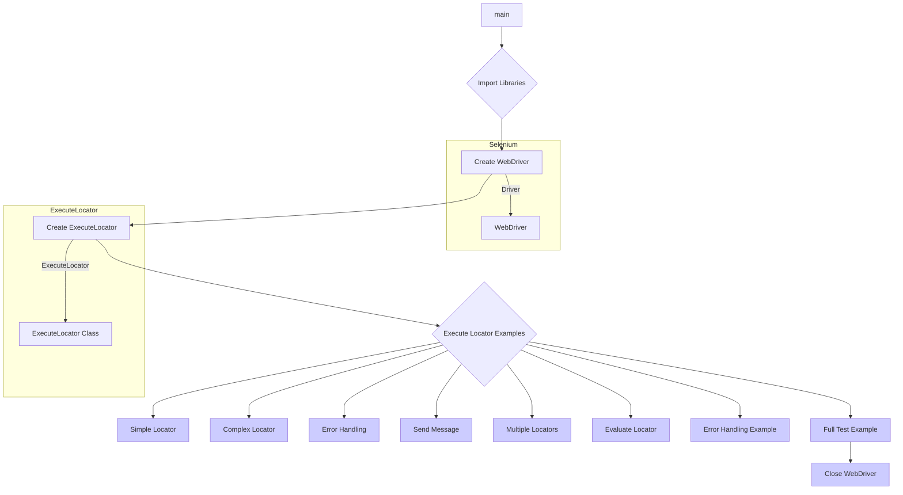

# <input code>

```python
## \file hypotez/src/webdriver/_examples/_example_executor_2.py
# -*- coding: utf-8 -*-
#! venv/Scripts/python.exe
#! venv/bin/python/python3.12

"""
.. module: src.webdriver._examples 
	:platform: Windows, Unix
	:synopsis:

"""
MODE = 'dev'

"""
	:platform: Windows, Unix
	:synopsis:

"""


"""
	:platform: Windows, Unix
	:synopsis:

"""


"""
  :platform: Windows, Unix

"""
"""
  :platform: Windows, Unix
  :platform: Windows, Unix
  :synopsis:
"""MODE = 'dev'
  
""" module: src.webdriver._examples """


""" Примеры использования класса `ExecuteLocator` для различных сценариев тестирования.
@details В этом файле приведены примеры создания экземпляра `ExecuteLocator` и выполнения различных задач с его помощью.
"""

from selenium import webdriver
from src.webdriver.executor import ExecuteLocator
from src import gs
from src.logger.exceptions import ExecuteLocatorException

# Создание экземпляра WebDriver (например, Chrome)
driver = webdriver.Chrome(executable_path=gs['chrome_driver_path'])
driver.get("https://example.com")  # Переход на сайт

# Создание экземпляра ExecuteLocator
locator = ExecuteLocator(driver)

# ... (остальной код)
```

# <algorithm>

**Шаг 1:** Импортируются необходимые библиотеки: `selenium`, `ExecuteLocator` из `src.webdriver.executor`, `gs` из `src` и `ExecuteLocatorException` из `src.logger.exceptions`.

**Шаг 2:** Создаётся экземпляр WebDriver (`driver`) с использованием `webdriver.Chrome` и указанием пути к исполняемому файлу драйвера Chrome из `gs['chrome_driver_path']`. Сайт `https://example.com` открывается с помощью `driver.get()`.

**Шаг 3:** Создаётся экземпляр класса `ExecuteLocator` (`locator`), принимающий на вход `driver`.

**Шаг 4:** Выполняется несколько примеров использования методов `execute_locator`, `send_message`, `evaluate_locator` с различными параметрами.

* **Пример 1:** `execute_locator` с простым локатором (получение элемента по XPath).
* **Пример 2:** `execute_locator` со сложным локатором (получение ссылок на продукты, навигация по страницам).
* **Пример 3:** `execute_locator` с обработкой `ExecuteLocatorException` для ситуаций ошибки.
* **Пример 4:** `send_message` для отправки текста в элемент.
* **Пример 5:** `execute_locator` с множественными локаторами (обработка списка локаторов).
* **Пример 6:** `evaluate_locator` для получения значения атрибута элемента.
* **Пример 7:** Обработка исключения `ExecuteLocatorException` в `execute_locator`.
* **Пример 8:** Полный пример тестирования с `execute_locator` и получением результата.


**Шаг 5:** Закрытие драйвера с помощью `driver.quit()`.

**Пример передачи данных:**
Локаторы (словари) передаются как аргументы в методы `execute_locator`, `send_message`, `evaluate_locator`. Методы `execute_locator` и `evaluate_locator` возвращают результаты (текстовое значение атрибута или данные, полученные из поиска). `send_message` возвращает информацию о успешности или ошибки выполнения.  Драйвер (`driver`) передаётся экземпляру `ExecuteLocator` и используется им внутри для взаимодействия с браузером.


# <mermaid>



**Объяснение диаграммы:**

Диаграмма показывает последовательность действий в программе. Начало (`main`) ведёт к импорту необходимых библиотек. Далее создаются `WebDriver` и экземпляр `ExecuteLocator`. Затем выполняются примеры использования методов `ExecuteLocator` с разными локаторами и обработкой ошибок. Конечный этап - закрытие `WebDriver`.  Зависимости показаны с помощью прямоугольников, например, `Selenium` и `ExecuteLocator` - это отдельные библиотеки, и код в этом блоке используется в качестве модулей (`WebDriver` и `ExecuteLocator`).


# <explanation>

**Импорты:**

* `from selenium import webdriver`: Импортирует библиотеку Selenium для управления веб-драйвером. Selenium необходима для взаимодействия с браузером.
* `from src.webdriver.executor import ExecuteLocator`: Импортирует класс `ExecuteLocator` из модуля `executor` в подпапке `webdriver` проекта. Этот класс, вероятно, содержит логику поиска и взаимодействия с элементами веб-страницы.
* `from src import gs`: Импортирует модуль `gs`, предположительно содержащий глобальные настройки, такие как пути к драйверам браузеров.
* `from src.logger.exceptions import ExecuteLocatorException`: Импортирует исключение `ExecuteLocatorException` для обработки ошибок, связанных с `ExecuteLocator`.


**Классы:**

* `ExecuteLocator`: Этот класс, очевидно, отвечает за поиск и взаимодействие с элементами веб-страницы.  Атрибуты и методы этого класса не определены в предоставленном фрагменте.  Их подробности можно найти в файле `src/webdriver/executor.py`. Этот класс взаимодействует с `WebDriver`, используя локаторы для нахождения элементов.

**Функции:**

* `execute_locator(locator, continue_on_error=False)`: Выполняет поиск элемента веб-страницы по заданным параметрам (`locator`), включая поиск, обработку событий, и проверку времени ожидания. `continue_on_error` позволяет обрабатывать ошибки без завершения выполнения.
* `send_message(locator, message, typing_speed=0.05, continue_on_error=False)`: Отправляет сообщение в заданный элемент на веб-странице с помощью метода `send_keys`, имитируя ввод текста. `typing_speed` управляет скоростью печати.
* `evaluate_locator(attribute)`:  Получает значение атрибута указанного элемента.

**Переменные:**

* `MODE = 'dev'`: Переменная, которая, вероятно, задает режим работы (например, `dev` или `prod`).
* `driver`: Экземпляр класса `webdriver.Chrome`, используемый для управления браузером.
* `locator`: Экземпляр класса `ExecuteLocator`, используемый для поиска элементов.
* `simple_locator`, `complex_locator`, `message_locator`, `multi_locator`, `attribute_locator`, `test_locator`: Словари, содержащие информацию о локаторах (пути поиска элементов).

**Возможные ошибки и улучшения:**

* **Отсутствие документации:** Отсутствует подробная документация для методов класса `ExecuteLocator` и их параметров. Добавьте документацию для лучшего понимания и использования.
* **Жесткие кодировки:** Использование кодировок в начале файла (например, `# -*- coding: utf-8 -*-`) не является критическим, но может помочь при работе с не-латинскими символами.
* **Переменные окружения:** Для `gs['chrome_driver_path']` лучше использовать переменные окружения для повышения портативности.
* **Обработка ошибок:** Необходимо дополнительно обрабатывать исключения `NoSuchElementException` или другие исключения `Selenium` при поиске элементов.
* **Передача данных через объекты:** Рекомендуется передавать данные (например, локаторы) в качестве объектов для лучшей организации и читаемости кода.


**Цепочка взаимосвязей:**

Код использует `selenium` для управления браузером, `ExecuteLocator` для поиска элементов, `gs` для получения конфигураций.  `src/logger/exceptions` управляет исключениями, возникающими при поиске элементов.   Этот код тесно связан с другими модулями в проекте `hypotez`, которые зависят от `gs` для конфигурации и `ExecuteLocator` для взаимодействия с браузером.


```