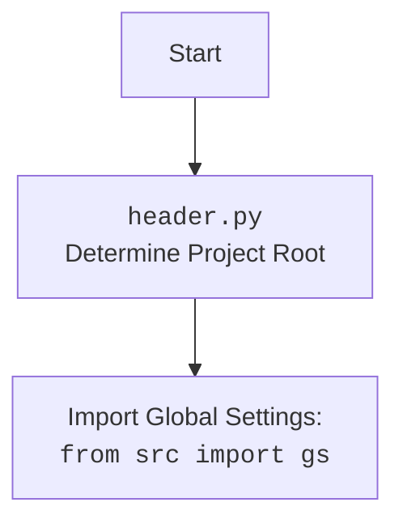

## ИНСТРУКЦИЯ:

Анализируй предоставленный код подробно и объясни его функциональность. Ответ должен включать три раздела:  

1. **<алгоритм>**: Опиши рабочий процесс в виде пошаговой блок-схемы, включая примеры для каждого логического блока, и проиллюстрируй поток данных между функциями, классами или методами.  
2. **<mermaid>**: Напиши код для диаграммы в формате `mermaid`, проанализируй и объясни все зависимости, 
    которые импортируются при создании диаграммы. 
    **ВАЖНО!** Убедитесь, что все имена переменных, используемые в диаграмме `mermaid`, 
    имеют осмысленные и описательные имена. Имена переменных вроде `A`, `B`, `C`, и т.д., не допускаются!  
    
    **Дополнительно**: Если в коде есть импорт `import header`, добавьте блок `mermaid` flowchart, объясняющий `header.py`:\
    ```mermaid
    flowchart TD
        Start --> Header[<code>header.py</code><br> Determine Project Root]
    
        Header --> import[Import Global Settings: <br><code>from src import gs</code>] 
    ```

3. **<объяснение>**: Предоставьте подробные объяснения:  
   - **Импорты**: Их назначение и взаимосвязь с другими пакетами `src.`.  
   - **Классы**: Их роль, атрибуты, методы и взаимодействие с другими компонентами проекта.  
   - **Функции**: Их аргументы, возвращаемые значения, назначение и примеры.  
   - **Переменные**: Их типы и использование.  
   - Выделите потенциальные ошибки или области для улучшения.  

Дополнительно, постройте цепочку взаимосвязей с другими частями проекта (если применимо).  

Это обеспечивает всесторонний и структурированный анализ кода.
## Формат ответа: `.md` (markdown)
**КОНЕЦ ИНСТРУКЦИИ**
```

## <алгоритм>

1.  **Инициализация WebDriver**:
    *   Создается экземпляр `webdriver.Chrome`, который управляет браузером Chrome.
    *   Пример: `driver = webdriver.Chrome(executable_path=gs['chrome_driver_path'])`
    *   Открывается веб-страница `https://example.com`
    *   Пример: `driver.get("https://example.com")`

2.  **Инициализация ExecuteLocator**:
    *   Создается экземпляр класса `ExecuteLocator`, который отвечает за поиск элементов и выполнение действий.
    *   Пример: `locator = ExecuteLocator(driver)`

3.  **Простой пример локатора**:
    *   Определяется словарь `simple_locator` с параметрами для поиска элемента (например, `<h1>` по XPath).
    *   Метод `execute_locator` выполняет поиск и возвращает значение атрибута `textContent` элемента.
    *   Пример:
        ```python
        simple_locator = {
            "by": "XPATH",
            "selector": "//h1",
            "attribute": "textContent",
            "timeout":0,"timeout_for_event":"presence_of_element_located","event": None,
            "if_list":"first","use_mouse": False,
            "mandatory": True,
            "locator_description": "Получение заголовка страницы"
        }
        result = locator.execute_locator(simple_locator)
        ```

4.  **Сложный пример локатора**:
    *   Определяется словарь `complex_locator`, включающий в себя несколько шагов:
        *   Поиск ссылок на продукты.
        *   Поиск элемента пагинации и клик по нему.
        *   Поиск кнопки "следующая страница" и клик по ней.
        *   Метод `execute_locator` последовательно выполняет эти шаги и возвращает результаты.
        *   Пример:
            ```python
            complex_locator = {
                "product_links": { ... },
                "pagination": {
                    "ul": { ... },
                    "->": { ... }
                }
            }
            result = locator.execute_locator(complex_locator)
            ```
    
5.  **Обработка ошибок**:
    *   Демонстрируется, как обрабатывать исключения `ExecuteLocatorException` с параметром `continue_on_error=True`.
    *   Если в процессе выполнения локатора возникает ошибка, она перехватывается, и выполнение продолжается.
    *   Пример:
        ```python
        try:
            locator.execute_locator(complex_locator, continue_on_error=True)
        except ExecuteLocatorException as ex:
            print(f"Произошла ошибка: {ex}")
        ```

6.  **Отправка сообщения**:
    *   Определяется словарь `message_locator` для поиска текстового поля.
    *   Метод `send_message` отправляет сообщение в найденное поле, имитируя ввод текста.
    *   Пример:
        ```python
        message_locator = { ... }
        message = "Купить новый телефон"
        result = locator.send_message(message_locator, message, typing_speed=0.05, continue_on_error=True)
        ```

7.  **Множественный локатор**:
    *   Определяется словарь `multi_locator` с несколькими вариантами поиска элементов.
    *   Метод `execute_locator` обрабатывает все варианты и возвращает список результатов.
    *   Пример:
        ```python
        multi_locator = {
            "by": ["XPATH", "XPATH"],
            "selector": ["//button[@id='submit']", "//input[@id='username']"],
            "attribute": ["textContent", "value"],
            "timeout":0,"timeout_for_event":"presence_of_element_located","event": ["click()", "send_keys('user')"],
            "if_list":"first","use_mouse": [True, False],
            "mandatory": [True, True],
            "locator_description": ["Нажатие кнопки отправки", "Ввод имени пользователя"]
        }
        results = locator.execute_locator(multi_locator)
        ```
    
8.  **Оценка локатора**:
    *   Определяется словарь `attribute_locator` для поиска элемента с мета-описанием страницы.
    *   Метод `evaluate_locator` извлекает значение атрибута `content`.
    *   Пример:
        ```python
        attribute_locator = {
            "by": "XPATH",
            "selector": "//meta[@name='description']",
            "attribute": "content",
            "timeout":0,"timeout_for_event":"presence_of_element_located","event": None,
            "if_list":"first","use_mouse": False,
            "mandatory": True,
            "locator_description": "Получение значения мета-описания страницы"
        }
        attribute_value = locator.evaluate_locator(attribute_locator['attribute'])
        ```
    
9.  **Обработка исключений (пример)**:
    *   Повторно демонстрируется, как обрабатывать исключения `ExecuteLocatorException`, но на этот раз без флага `continue_on_error=True`.

10. **Полный пример теста**:
     *   Повторно вызывается метод `execute_locator` с простым локатором `test_locator`
11. **Закрытие драйвера**:
    *   Метод `driver.quit()` закрывает браузер.
    *   Пример: `driver.quit()`

## <mermaid>

```mermaid
flowchart TD
    Start[Start] --> InitializeWebDriver[Initialize WebDriver: <br><code>driver = webdriver.Chrome(...)</code>]
    InitializeWebDriver --> NavigateToPage[Navigate to Page: <br><code>driver.get("https://example.com")</code>]
    NavigateToPage --> InitializeExecuteLocator[Initialize ExecuteLocator: <br><code>locator = ExecuteLocator(driver)</code>]
    InitializeExecuteLocator --> SimpleLocatorExample[Simple Locator Example]
    SimpleLocatorExample --> ExecuteSimpleLocator[Execute Simple Locator: <br><code>locator.execute_locator(simple_locator)</code>]
    ExecuteSimpleLocator --> ComplexLocatorExample[Complex Locator Example]
    ComplexLocatorExample --> ExecuteComplexLocator[Execute Complex Locator: <br><code>locator.execute_locator(complex_locator)</code>]
    ExecuteComplexLocator --> ErrorHandlingExample[Error Handling Example]
    ErrorHandlingExample --> ExecuteComplexLocatorWithErrorHandling[Execute Complex Locator with Error Handling: <br><code>locator.execute_locator(complex_locator, continue_on_error=True)</code>]
    ExecuteComplexLocatorWithErrorHandling --> SendMessageExample[Send Message Example]
    SendMessageExample --> SendMessage[Send Message: <br><code>locator.send_message(message_locator, message, ...)</code>]
    SendMessage --> MultiLocatorExample[Multi Locator Example]
    MultiLocatorExample --> ExecuteMultiLocator[Execute Multi Locator: <br><code>locator.execute_locator(multi_locator)</code>]
    ExecuteMultiLocator --> EvaluateLocatorExample[Evaluate Locator Example]
    EvaluateLocatorExample --> EvaluateLocator[Evaluate Locator: <br><code>locator.evaluate_locator(attribute_locator['attribute'])</code>]
    EvaluateLocator --> ExceptionHandlingExample[Exception Handling Example]
    ExceptionHandlingExample --> ExecuteSimpleLocatorWithError[Execute Simple Locator with Error: <br><code>locator.execute_locator(simple_locator)</code>]
    ExecuteSimpleLocatorWithError --> FullTestExample[Full Test Example]
    FullTestExample --> ExecuteTestLocator[Execute Test Locator: <br><code>locator.execute_locator(test_locator)</code>]
    ExecuteTestLocator --> CloseWebDriver[Close WebDriver: <br><code>driver.quit()</code>]
    CloseWebDriver --> End[End]


    classDef locatorClass fill:#f9f,stroke:#333,stroke-width:2px
    class ExecuteSimpleLocator, ExecuteComplexLocator, ExecuteComplexLocatorWithErrorHandling, SendMessage, ExecuteMultiLocator, EvaluateLocator, ExecuteSimpleLocatorWithError, ExecuteTestLocator locatorClass

```
**Объяснение зависимостей `mermaid`:**

*   `Start` - Начало выполнения скрипта.
*   `InitializeWebDriver` - Инициализация веб-драйвера с использованием `webdriver.Chrome`.
*   `NavigateToPage` - Переход на указанный URL (`https://example.com`) через `driver.get()`.
*   `InitializeExecuteLocator` - Создание экземпляра класса `ExecuteLocator`, который инкапсулирует логику взаимодействия с веб-элементами.
*   `SimpleLocatorExample` - Блок, демонстрирующий работу с простым локатором (например, поиск заголовка).
*   `ExecuteSimpleLocator` - Вызов метода `execute_locator` с простым локатором.
*   `ComplexLocatorExample` - Блок, демонстрирующий работу со сложным локатором (например, поиск нескольких элементов и выполнение действий).
*    `ExecuteComplexLocator` - Вызов метода `execute_locator` со сложным локатором.
*   `ErrorHandlingExample` - Блок, демонстрирующий обработку ошибок при выполнении локаторов.
*   `ExecuteComplexLocatorWithErrorHandling` - Вызов метода `execute_locator` со сложным локатором и обработкой ошибок.
*   `SendMessageExample` - Блок, демонстрирующий отправку сообщения в текстовое поле.
*   `SendMessage` - Вызов метода `send_message` для отправки текста в элемент.
*   `MultiLocatorExample` - Блок, демонстрирующий работу с множественными локаторами.
*   `ExecuteMultiLocator` - Вызов метода `execute_locator` с множественными локаторами.
*   `EvaluateLocatorExample` - Блок, демонстрирующий оценку локатора.
*   `EvaluateLocator` - Вызов метода `evaluate_locator` для извлечения значения атрибута.
*   `ExceptionHandlingExample` -  Блок, демонстрирующий обработку исключений.
*   `ExecuteSimpleLocatorWithError` -  Вызов метода `execute_locator` и демонстрация обработки исключения.
*   `FullTestExample` - Блок, демонстрирующий полный пример теста.
*   `ExecuteTestLocator` - Вызов метода `execute_locator` в полном примере теста.
*   `CloseWebDriver` - Закрытие браузера через `driver.quit()`.
*    `End` - Завершение выполнения скрипта.
    
    Класс `locatorClass` -  определяет стиль для блоков, представляющих вызовы методов `locator`.

## <объяснение>

**Импорты:**

*   `from selenium import webdriver`: Импортирует модуль `webdriver` из библиотеки `selenium`, который используется для управления веб-браузером.
*   `from src.webdriver.executor import ExecuteLocator`: Импортирует класс `ExecuteLocator` из модуля `src.webdriver.executor`, который отвечает за выполнение локаторов.
*   `from src import gs`: Импортирует глобальные настройки `gs` из пакета `src`, используемые для конфигурации (например, пути к драйверу Chrome).
*   `from src.logger.exceptions import ExecuteLocatorException`: Импортирует пользовательское исключение `ExecuteLocatorException` из пакета `src.logger.exceptions`, которое обрабатывается при возникновении ошибок в `ExecuteLocator`.

**Классы:**

*   `ExecuteLocator`:
    *   **Роль**: Этот класс управляет поиском веб-элементов на странице и выполняет действия с ними.
    *   **Атрибуты**:
        *   `driver`: Экземпляр `webdriver`, используемый для взаимодействия с браузером.
    *   **Методы**:
        *   `__init__(self, driver)`: Конструктор класса, инициализирующий драйвер.
        *   `execute_locator(self, locator, continue_on_error=False)`: Основной метод для выполнения поиска и действий с элементами. Он принимает словарь `locator` и флаг `continue_on_error` для обработки ошибок. Возвращает результат выполнения локатора.
        *   `send_message(self, locator, message, typing_speed=0.05, continue_on_error=False)`: Метод для отправки сообщения в текстовое поле с опциональной скоростью набора и обработкой ошибок.
        *   `evaluate_locator(self, attribute)`: Метод для оценки локатора и получения значения атрибута.

**Функции:**

*   В данном коде нет пользовательских функций. Код использует методы класса `ExecuteLocator`, а так же вызовы методов `webdriver`

**Переменные:**

*   `driver`: Экземпляр `webdriver.Chrome`, который представляет управление браузером. Тип `selenium.webdriver.chrome.webdriver.WebDriver`
*   `locator`: Экземпляр класса `ExecuteLocator`, который отвечает за поиск и взаимодействие с элементами. Тип `src.webdriver.executor.ExecuteLocator`
*   `simple_locator`, `complex_locator`, `message_locator`, `multi_locator`, `attribute_locator`, `test_locator`: Словари, содержащие параметры для поиска элементов (локаторы). Тип `dict`
*   `message`: Текстовое сообщение для отправки в текстовое поле. Тип `str`
*   `result`, `results`, `attribute_value`: Переменные для хранения результатов выполнения методов `execute_locator`, `send_message` и `evaluate_locator`. Тип `Any`, может содержать `str`, `list` или другое значение в зависимости от возвращаемого значения методов.
*   `ex`: Переменная для хранения исключения типа `ExecuteLocatorException`. Тип `src.logger.exceptions.ExecuteLocatorException`
*   `typing_speed`:  Определяет скорость набора текста в методе `send_message`. Тип `float`
*   `continue_on_error`:  Флаг, определяющий, продолжать ли выполнение при возникновении ошибки. Тип `bool`

**Потенциальные ошибки и области для улучшения:**

*   **Отсутствие явного определения типов**: В коде нет явного указания типов для переменных и возвращаемых значений. Это может затруднить понимание и сопровождение кода. Можно улучшить, добавив аннотации типов (Type Hints).
*   **Жестко закодированные пути**: Путь к драйверу Chrome (`gs['chrome_driver_path']`) может быть не универсальным. Лучше использовать относительные пути или механизм конфигурации.
*   **Отсутствие детального логирования**: При ошибках выводится только сообщение об ошибке, было бы хорошо добавить более подробное логирование.
*   **Обработка ошибок**: Можно добавить больше специфичной обработки ошибок и предоставлять более информативные сообщения.
*   **Общая структура**: Код можно разделить на функции для большей модульности и читаемости.
*  **Зависимость от структуры DOM**: Код сильно зависит от структуры DOM на `https://example.com`, любые изменения на странице могут привести к поломке тестов.

**Взаимосвязь с другими частями проекта:**

*   **`src.webdriver.executor`**: Файл `_example_executor_2.py` зависит от модуля `executor`, который инкапсулирует логику взаимодействия с веб-элементами.
*   **`src.gs`**: Глобальные настройки проекта используются для получения пути к драйверу Chrome.
*   **`src.logger.exceptions`**: Пользовательское исключение `ExecuteLocatorException` используется для обработки ошибок при выполнении локаторов.

Этот код представляет собой пример использования класса `ExecuteLocator` для выполнения различных действий с веб-элементами на странице. Он демонстрирует, как использовать локаторы для поиска элементов, отправки сообщений, обработки ошибок и извлечения атрибутов.


`header.py` - определяет корень проекта и импортирует глобальные настройки.