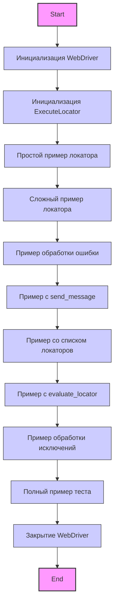
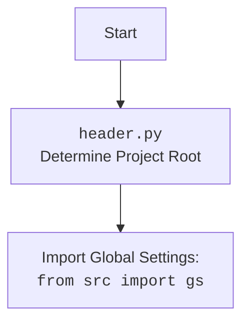

## ИНСТРУКЦИЯ:

Анализируй предоставленный код подробно и объясни его функциональность. Ответ должен включать три раздела:  

1. **<алгоритм>**: Опиши рабочий процесс в виде пошаговой блок-схемы, включая примеры для каждого логического блока, и проиллюстрируй поток данных между функциями, классами или методами.  
2. **<mermaid>**: Напиши код для диаграммы в формате `mermaid`, проанализируй и объясни все зависимости, 
    которые импортируются при создании диаграммы. 
    **ВАЖНО!** Убедитесь, что все имена переменных, используемые в диаграмме `mermaid`, 
    имеют осмысленные и описательные имена. Имена переменных вроде `A`, `B`, `C`, и т.д., не допускаются!  
    
    **Дополнительно**: Если в коде есть импорт `import header`, добавьте блок `mermaid` flowchart, объясняющий `header.py`:\
    ```mermaid
    flowchart TD
        Start --> Header[<code>header.py</code><br> Determine Project Root]
    
        Header --> import[Import Global Settings: <br><code>from src import gs</code>] 
    ```

3. **<объяснение>**: Предоставьте подробные объяснения:  
   - **Импорты**: Их назначение и взаимосвязь с другими пакетами `src.`.  
   - **Классы**: Их роль, атрибуты, методы и взаимодействие с другими компонентами проекта.  
   - **Функции**: Их аргументы, возвращаемые значения, назначение и примеры.  
   - **Переменные**: Их типы и использование.  
   - Выделите потенциальные ошибки или области для улучшения.  

Дополнительно, постройте цепочку взаимосвязей с другими частями проекта (если применимо).  

Это обеспечивает всесторонний и структурированный анализ кода.
## Формат ответа: `.md` (markdown)
**КОНЕЦ ИНСТРУКЦИИ**
```

## <алгоритм>
1. **Инициализация WebDriver:**
   - Создается экземпляр `webdriver.Chrome` для управления браузером Chrome.
   - Пример: `driver = webdriver.Chrome(executable_path=gs['chrome_driver_path'])`
   - Драйвер переходит на веб-страницу `https://example.com`.
   - Пример: `driver.get("https://example.com")`
2. **Инициализация `ExecuteLocator`:**
   - Создается экземпляр класса `ExecuteLocator` с использованием экземпляра `WebDriver`.
   - Пример: `locator = ExecuteLocator(driver)`
3. **Простой пример локатора:**
   - Определяется словарь `simple_locator` для поиска элемента `h1` по XPath.
   - Пример: `simple_locator = {"by": "XPATH", "selector": "//h1", "attribute": "textContent", ...}`
   - Вызывается метод `execute_locator` для получения текста заголовка.
   - Результат печатается в консоль.
4. **Сложный пример локатора:**
   - Определяется словарь `complex_locator` с вложенной структурой для работы с пагинацией и ссылками на продукты.
   - Включает в себя поиск ссылок на продукты, клик на пагинацию и клик по следующей странице.
     - Пример: `complex_locator = { "product_links": { ... }, "pagination": { "ul": { ... }, "->": { ... } } }`
   - Вызывается метод `execute_locator` для выполнения всех действий.
   - Результат печатается в консоль.
5. **Пример обработки ошибки:**
    - Выполняется `execute_locator` с `continue_on_error=True`.
    - Если возникает исключение `ExecuteLocatorException`, оно обрабатывается и выводится сообщение.
6.  **Пример с `send_message`:**
   - Определяется локатор `message_locator` для ввода текста в поле поиска.
    - Пример: `message_locator = { "by": "XPATH", "selector": "//input[@name='search']", ... , "event": "%SEARCH%" }`
   - Вызывается метод `send_message` для ввода текста "Купить новый телефон" в поле поиска.
   - Результат печатается в консоль.
7. **Пример со списком локаторов:**
   - Определяется локатор `multi_locator` для поиска нескольких элементов.
   - Пример: `multi_locator = {"by": ["XPATH", "XPATH"], "selector": ["//button[@id='submit']", "//input[@id='username']"], ...}`
    - Содержит несколько селекторов, атрибутов и событий.
   - Вызывается метод `execute_locator` для выполнения действий с каждым элементом.
   - Результаты печатаются в консоль.
8.  **Пример с `evaluate_locator`:**
   - Определяется локатор `attribute_locator` для получения значения атрибута.
   - Пример: `attribute_locator = { "by": "XPATH", "selector": "//meta[@name='description']", "attribute": "content", ... }`
   - Вызывается метод `evaluate_locator` для получения значения атрибута "content".
   - Значение печатается в консоль.
9.  **Пример обработки исключений:**
    - Выполняется `execute_locator` с локатором `simple_locator`.
    - Если возникает исключение `ExecuteLocatorException`, оно обрабатывается и выводится сообщение.
10. **Полный пример теста:**
    - Определяется локатор `test_locator` для получения текста заголовка.
    - Пример: `test_locator = {"by": "XPATH", "selector": "//h1", "attribute": "textContent", ...}`
    - Вызывается метод `execute_locator`.
    - Результат печатается в консоль.
11. **Закрытие драйвера:**
    - Вызывается метод `driver.quit()` для закрытия браузера.
## <mermaid>


## <объяснение>

### Импорты:
- `from selenium import webdriver`: Импортирует модуль `webdriver` из библиотеки `selenium` для управления браузером. `Selenium` используется для автоматизации веб-браузеров и тестирования веб-приложений.
- `from src.webdriver.executor import ExecuteLocator`: Импортирует класс `ExecuteLocator` из модуля `executor` пакета `src.webdriver`. Класс `ExecuteLocator` предположительно предназначен для выполнения поиска элементов на веб-странице и совершения действий с ними.
- `from src import gs`: Импортирует глобальные настройки `gs` из пакета `src`. `gs` вероятно содержит пути к драйверам браузеров и другие глобальные параметры проекта.
- `from src.logger.exceptions import ExecuteLocatorException`: Импортирует класс исключения `ExecuteLocatorException` из пакета `src.logger.exceptions`. Это кастомное исключение, вероятно используемое для обработки ошибок при выполнении локаторов.
   - **Взаимосвязь с `src`**: Все импорты, начинающиеся с `src`, указывают на внутренние модули и пакеты проекта. Это говорит о том, что проект структурирован таким образом, что веб-драйвер и связанные с ним компоненты являются частью более крупной системы.

### Классы:
- `ExecuteLocator`:
    - Роль: Класс инкапсулирует логику поиска веб-элементов и выполнения действий с ними, используя WebDriver.
    - Атрибуты: Вероятно, имеет атрибут `driver` для хранения экземпляра `webdriver`.
    - Методы:
        - `execute_locator(locator, continue_on_error=False)`: Метод для выполнения локатора(ов) и возврата результата. Параметр `continue_on_error` управляет поведением при возникновении ошибок.
        - `send_message(locator, message, typing_speed=0.05, continue_on_error=False)`: Метод для отправки сообщения в текстовое поле, найденное по локатору. `typing_speed` управляет скоростью ввода.
        - `evaluate_locator(attribute)`: Метод для получения значения атрибута элемента, найденного по локатору.
    - Взаимодействие:
        - Принимает экземпляр `webdriver` при создании, использует его для поиска элементов.
        - Обрабатывает исключения `ExecuteLocatorException` при ошибках.

### Функции:
В данном коде нет явно определенных функций, но есть методы класса `ExecuteLocator`, которые выполняют функции по поиску элементов, отправке сообщений и получению атрибутов.

### Переменные:
- `driver`: Экземпляр `webdriver.Chrome`, используется для управления браузером.
- `locator`: Экземпляр `ExecuteLocator`, используется для работы с локаторами.
- `simple_locator`: Словарь, определяющий простой локатор для поиска заголовка страницы.
- `complex_locator`: Словарь, определяющий сложный локатор для работы с пагинацией.
- `message_locator`: Словарь, определяющий локатор для ввода сообщения в текстовое поле.
- `multi_locator`: Словарь, определяющий локатор для поиска нескольких элементов.
- `attribute_locator`: Словарь, определяющий локатор для получения значения атрибута.
- `test_locator`: Словарь, определяющий локатор для тестового примера.
- `result`, `results`, `attribute_value`: Переменные для хранения результатов выполнения локаторов.
- `message`: Строка, содержащая сообщение для отправки.
- `ex`: Переменная для хранения исключения `ExecuteLocatorException`.

### Ошибки и улучшения:
- **Обработка ошибок:** В коде используется `try-except` для обработки исключений `ExecuteLocatorException`, что позволяет продолжать выполнение скрипта при ошибках локатора, если это необходимо.
- **Гибкость:** Класс `ExecuteLocator` предоставляет гибкий интерфейс для работы с различными типами локаторов и действий, включая клики, ввод текста и получение атрибутов.
- **Потенциальные улучшения:**
    - Было бы полезно добавить более подробное логирование для отслеживания выполнения каждого локатора, особенно при использовании `continue_on_error=True`.
    - Можно улучшить структуру локаторов, добавив возможность передавать параметры (например, для динамических локаторов).
    - Возможно стоит пересмотреть использование множественных локаторов в виде списка в словаре, сделать более унифицированным подход.

### Цепочка взаимосвязей:
1.  Скрипт начинается с инициализации `webdriver.Chrome`, который является внешним компонентом из библиотеки `selenium`.
2.  `ExecuteLocator` использует `webdriver` для взаимодействия с веб-страницей, что показывает взаимосвязь между этими классами.
3.  Глобальные настройки `gs` используются для получения пути к драйверу браузера, связывая скрипт с конфигурацией проекта.
4.  Исключения `ExecuteLocatorException` используются для обработки ошибок при выполнении локаторов, связывая `ExecuteLocator` с механизмом обработки ошибок проекта.

Таким образом, данный скрипт демонстрирует использование `ExecuteLocator` для автоматизации тестирования веб-страниц, показывая взаимосвязь между классами, и компонентами проекта.