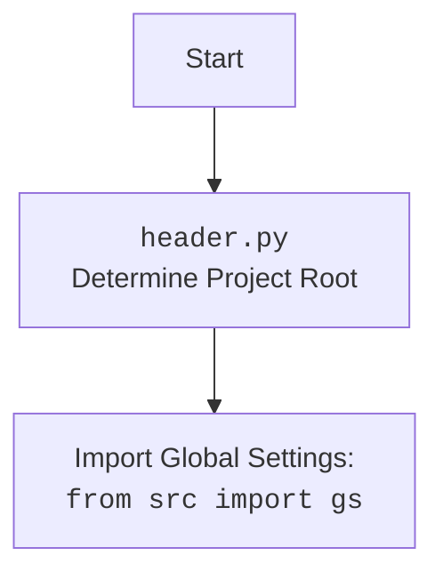

## <алгоритм>

1.  **Инициализация:**
    *   Импортируются необходимые модули: `webdriver` из `selenium`, `ExecuteLocator` из `src.webdriver.executor`, `gs` из `src`, и `ExecuteLocatorException` из `src.logger.exceptions`.
    *   Создаётся экземпляр `webdriver.Chrome`, который управляет браузером.
        *   Пример: `driver = webdriver.Chrome(executable_path=gs['chrome_driver_path'])`
    *   Браузер переходит на страницу `https://example.com`.
        *   Пример: `driver.get("https://example.com")`
    *   Создаётся экземпляр `ExecuteLocator` для управления взаимодействием с элементами веб-страницы.
        *   Пример: `locator = ExecuteLocator(driver)`
2.  **Простой пример:**
    *   Создаётся простой локатор `simple_locator` для поиска элемента `h1` по XPath и извлечения его текста.
    *   Выполняется локатор с помощью `locator.execute_locator(simple_locator)`.
        *   Пример: `result = locator.execute_locator(simple_locator)`
    *   Результат выводится на экран.
3.  **Сложный пример:**
    *   Создаётся сложный локатор `complex_locator`, включающий в себя несколько вложенных локаторов.
    *   Локатор `product_links` извлекает `href` атрибуты ссылок на товары.
    *   Локаторы внутри `pagination` находят элементы пагинации и эмулируют клики по ним.
    *   Результат выполнения выводится на экран.
4.  **Обработка ошибок:**
    *   Пример выполнения сложного локатора с `continue_on_error=True`.
    *   Если возникает исключение `ExecuteLocatorException`, оно перехватывается и выводится сообщение об ошибке.
5.  **Отправка сообщения:**
    *   Создаётся локатор `message_locator` для поиска текстового поля.
    *   С помощью метода `locator.send_message` в текстовое поле вводится сообщение.
        *   Пример: `result = locator.send_message(message_locator, message, typing_speed=0.05, continue_on_error=True)`
    *   Результат выводится на экран.
6.  **Множественные локаторы:**
    *   Создаётся локатор `multi_locator`, который содержит списки селекторов, атрибутов и событий.
    *   Выполняется `locator.execute_locator(multi_locator)`, который обрабатывает каждый селектор из списка.
        *  Пример `results = locator.execute_locator(multi_locator)`
    *   Результат выводится на экран.
7.  **Оценка локатора:**
    *   Создаётся локатор `attribute_locator` для получения значения атрибута `content` элемента `meta`.
    *   С помощью метода `locator.evaluate_locator` извлекается значение атрибута.
        *   Пример: `attribute_value = locator.evaluate_locator(attribute_locator['attribute'])`
    *   Значение выводится на экран.
8.  **Пример с обработкой исключений:**
    *   Пример выполнения простого локатора, где возможна ошибка.
    *   Если возникает `ExecuteLocatorException`, оно перехватывается и выводится сообщение об ошибке.
9.  **Полный пример теста:**
    *   Создаётся тестовый локатор `test_locator` для извлечения заголовка.
    *   Выполняется локатор с помощью `locator.execute_locator(test_locator)`.
    *   Результат выводится на экран.
10. **Завершение:**
    *   Браузер закрывается с помощью `driver.quit()`.

## <mermaid>

```mermaid
flowchart TD
    Start[Start] --> Initialize[Инициализация: <br> WebDriver, ExecuteLocator,  <br>переход на example.com]
    Initialize --> SimpleLocator[Простой локатор: <br> Найти h1 и получить текст]
    SimpleLocator --> ExecuteSimpleLocator[Выполнить локатор: <br> locator.execute_locator(simple_locator)]
    ExecuteSimpleLocator --> PrintSimpleResult[Вывести результат: <br> result]
    PrintSimpleResult --> ComplexLocator[Сложный локатор: <br>  Ссылки на товары, пагинация]
    ComplexLocator --> ExecuteComplexLocator[Выполнить локатор: <br> locator.execute_locator(complex_locator)]
     ExecuteComplexLocator --> PrintComplexResult[Вывести результат: <br> result]
     PrintComplexResult --> ErrorHandling[Обработка ошибок: <br> continue_on_error=True]
    ErrorHandling --> SendMessageLocator[Локатор для отправки сообщения: <br> Найти текстовое поле]
    SendMessageLocator --> SendMessage[Отправить сообщение: <br> locator.send_message(message_locator, message)]
    SendMessage --> PrintSendMessageResult[Вывести результат отправки: <br> result]
    PrintSendMessageResult --> MultiLocator[Множественный локатор: <br> Список селекторов]
    MultiLocator --> ExecuteMultiLocator[Выполнить локатор: <br> locator.execute_locator(multi_locator)]
    ExecuteMultiLocator --> PrintMultiResult[Вывести результаты: <br> results]
    PrintMultiResult --> EvaluateLocator[Оценка локатора: <br> Получить атрибут content мета-тега]
    EvaluateLocator --> EvaluateAttribute[Получить значение атрибута: <br> locator.evaluate_locator(attribute)]
    EvaluateAttribute --> PrintAttributeValue[Вывести значение атрибута: <br> attribute_value]
    PrintAttributeValue --> ExceptionHandling[Пример обработки исключений: <br> Выполнение простого локатора]
    ExceptionHandling --> FullTest[Полный пример теста: <br> Извлечение заголовка]
    FullTest --> ExecuteTestLocator[Выполнить локатор: <br> locator.execute_locator(test_locator)]
     ExecuteTestLocator --> PrintTestResult[Вывести результат: <br> result]
    PrintTestResult --> CloseDriver[Закрыть браузер: <br> driver.quit()]
    CloseDriver --> End[End]
     
   
   
    
```


## <объяснение>

### Импорты:
*   **`from selenium import webdriver`**: Импортирует класс `webdriver` из библиотеки `selenium`.  `Selenium` используется для автоматизации действий в веб-браузерах, включая навигацию, поиск элементов и взаимодействие с ними. Класс `webdriver` - это основа для управления браузером.
*   **`from src.webdriver.executor import ExecuteLocator`**: Импортирует класс `ExecuteLocator` из модуля `executor` в пакете `src.webdriver`.  `ExecuteLocator`, вероятно, является кастомным классом, предназначенным для упрощения и стандартизации взаимодействия с веб-элементами на основе локаторов.
*   **`from src import gs`**: Импортирует модуль `gs` из пакета `src`. `gs` предположительно, хранит глобальные настройки проекта, такие как пути к драйверам браузеров.
*   **`from src.logger.exceptions import ExecuteLocatorException`**: Импортирует кастомное исключение `ExecuteLocatorException` из модуля `exceptions` в пакете `src.logger`. Это исключение, вероятно, используется для обработки ошибок, специфичных для класса `ExecuteLocator`.

### Переменные:
*   **`MODE = 'dev'`**: Строковая переменная, устанавливающая режим работы программы. Значение `dev` подразумевает режим разработки.
*   **`driver`**: Экземпляр `webdriver.Chrome`, представляющий управляемый браузер.
*   **`locator`**: Экземпляр класса `ExecuteLocator`, используемый для управления взаимодействием с элементами веб-страницы.
*   **`simple_locator`**: Словарь, описывающий параметры простого локатора для поиска элемента `h1` и получения его текста.
*   **`complex_locator`**: Словарь, описывающий параметры сложного локатора для извлечения ссылок на товары и навигации по страницам.
*   **`message_locator`**: Словарь, описывающий локатор текстового поля для отправки сообщения.
*   **`message`**: Строковая переменная, содержащая сообщение для отправки в текстовое поле.
*   **`multi_locator`**: Словарь, описывающий параметры локаторов для нескольких элементов.
*   **`attribute_locator`**: Словарь, описывающий параметры локатора для получения атрибута `content` из мета-тега.
*   **`attribute_value`**: Переменная, хранящая значение полученного атрибута.
*   **`test_locator`**: Словарь, описывающий параметры тестового локатора для извлечения заголовка страницы.
*   **`result`**, **`results`**: Переменные, хранящие результаты выполнения методов `execute_locator` и `send_message`.

### Функции и методы:

*   **`webdriver.Chrome(executable_path=gs['chrome_driver_path'])`**: Создает экземпляр браузера `Chrome`. Путь к драйверу Chrome задается через глобальные настройки `gs`.
*   **`driver.get("https://example.com")`**: Переходит по указанному URL в браузере.
*   **`ExecuteLocator(driver)`**: Создает экземпляр класса `ExecuteLocator`, который принимает в качестве аргумента экземпляр веб-драйвера `driver`.
*   **`locator.execute_locator(locator_data, continue_on_error=False)`**: Метод класса `ExecuteLocator`, выполняющий действия, описанные в параметрах локатора (`locator_data`). Параметр `continue_on_error` определяет, нужно ли продолжать выполнение при возникновении ошибок.
*   **`locator.send_message(locator_data, message, typing_speed=0.05, continue_on_error=True)`**:  Метод класса `ExecuteLocator`, выполняющий отправку текста в текстовое поле. Принимает локатор текстового поля, текст, скорость набора и флаг `continue_on_error`.
*    **`locator.evaluate_locator(attribute_name)`**:  Метод класса `ExecuteLocator`, получает значение конкретного атрибута.
*   **`driver.quit()`**: Закрывает все окна браузера и завершает сеанс веб-драйвера.

### Классы:

*   **`ExecuteLocator`**:  Класс, который управляет поиском веб-элементов на странице, взаимодействует с ними и извлекает значения, используя заданные параметры локатора. Он отвечает за стандартизацию процесса взаимодействия с веб-элементами, обрабатывает ошибки и предоставляет высокоуровневый интерфейс.

### Потенциальные ошибки и области для улучшения:
*   **Обработка ошибок**: В коде реализована базовая обработка исключений `ExecuteLocatorException`, но можно добавить более детальную обработку конкретных ошибок, которые могут возникнуть при работе с элементами (например, `NoSuchElementException`).
*   **Логирование**: Отсутствует логирование действий, что усложняет отладку и мониторинг. Было бы полезно использовать `logging` для записи результатов выполнения каждой операции, ошибок и других важных событий.
*   **Конфигурация**: Параметры локаторов (например, `timeout`, `timeout_for_event`) могут быть вынесены в конфигурационный файл, чтобы упростить их изменение и переиспользование.
*   **Повторяемость кода**: Примеры локаторов имеют повторяющиеся ключи (`timeout`, `timeout_for_event`, `event`, `if_list`, `use_mouse`, `mandatory`, `locator_description`). Можно сделать базовый шаблон для локатора и использовать его с помощью `update` для каждого отдельного локатора.
*   **Универсальность**: `ExecuteLocator` можно улучшить, добавив поддержку различных типов локаторов (например, CSS селекторы), расширив список поддерживаемых событий и добавив дополнительные проверки (например, видимость элемента).
*   **Асинхронность**: Можно рассмотреть возможность выполнения некоторых операций асинхронно, чтобы повысить производительность при работе с большим количеством элементов.

### Взаимосвязь с другими частями проекта:

*   **`src.gs`**: Используется для получения глобальных настроек, таких как путь к драйверу браузера. Это позволяет централизованно управлять конфигурацией проекта.
*   **`src.logger.exceptions`**: Используется для обработки специфических исключений, возникающих при работе с `ExecuteLocator`.  Это обеспечивает структурированную обработку ошибок в рамках проекта.

Этот код является примером использования класса `ExecuteLocator` для автоматизации взаимодействия с веб-страницей. Он показывает, как можно создавать локаторы для различных элементов, выполнять с ними различные действия и обрабатывать возможные ошибки. Примеры показывают основные возможности класса `ExecuteLocator` с разными типами локаторов,  событиями и обработкой ошибок.