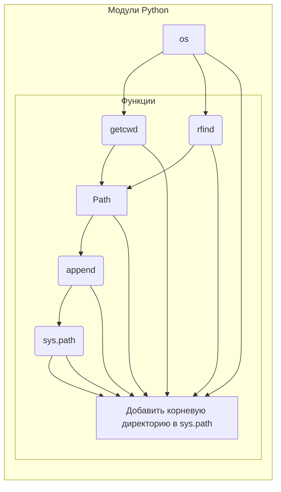

# Анализ кода hypotez/src/webdriver/_examples/header.py

## <input code>

```python
## \file hypotez/src/webdriver/_examples/header.py
# -*- coding: utf-8 -*-\
#! venv/Scripts/python.exe
#! venv/bin/python/python3.12

"""
.. module:: src.webdriver._examples 
	:platform: Windows, Unix
	:synopsis:

"""
MODE = 'dev'

"""
	:platform: Windows, Unix
	:synopsis:

"""


"""
	:platform: Windows, Unix
	:synopsis:

"""


"""
  :platform: Windows, Unix

"""
"""
  :platform: Windows, Unix
  :platform: Windows, Unix
  :synopsis:
"""MODE = 'dev'
  
""" module: src.webdriver._examples """


import os
import sys
from pathlib import Path

dir_root : Path = Path (os.getcwd()[:os.getcwd().rfind('hypotez')+7]) ## <- Корневая директория проекта
sys.path.append (str (dir_root) )  # Добавляю корневую директорию в sys.path
dir_src = Path (dir_root, 'src') 
sys.path.append (str (dir_root) ) # Добавляю рабочую директорию в sys.path 
```

## <algorithm>

```mermaid
graph TD
    A[Начало] --> B{Получить текущую директорию};
    B -- Текущая директория --> C[Найти индекс "hypotez"];
    C -- Индекс --> D[Получить подстроку до индекса];
    D -- Корневая директория --> E[Создать Path объект для корневой директории];
    E --> F[Добавить корневую директорию в sys.path];
    F --> G[Создать Path объект для директории 'src'];
    G --> H[Добавить рабочую директорию в sys.path];
    H --> I[Конец];
```

**Пример:**

Если текущая директория `/home/user/project/hypotez/src/webdriver/_examples`, то:

1. `os.getcwd()` вернет `/home/user/project/hypotez/src/webdriver/_examples`.
2. `os.getcwd().rfind('hypotez')` найдет индекс "hypotez" (например, 18).
3. `os.getcwd()[:os.getcwd().rfind('hypotez')+7]` вернет `/home/user/project/hypotez`.
4. `Path(...)` создаст объект `Path` для `/home/user/project/hypotez`.
5. `sys.path.append(...)` добавит эту директорию в список путей поиска модулей Python.


## <mermaid>



## <explanation>

**Импорты:**

- `os`: Модуль для работы с операционной системой (получение текущей директории, поиск подстрок).
- `sys`: Модуль для управления интерпретатором Python (работа с `sys.path`).
- `pathlib`: Модуль для работы с путями к файлам и директориям в объектно-ориентированном стиле.  Этот модуль делает код более читаемым и менее подвержен проблемам, связанным с разными операционными системами.

**Классы:**

Код не содержит классов.

**Функции:**

Код не содержит функций.

**Переменные:**

- `dir_root`: Переменная типа `Path`, хранит путь к корневой директории проекта.
- `dir_src`: Переменная типа `Path`, хранит путь к директории `src`.
- `MODE`: Переменная, хранящая строковое значение 'dev'.  (Это нестандартный способ обозначения констант.)

**Цепочка взаимосвязей:**

Этот код является частью инициализации проекта. Он добавляет корневую директорию и директорию `src` в `sys.path`.  Это необходимо для того, чтобы Python мог импортировать модули из `src`.  Без этого Python не сможет найти нужные файлы при использовании `import`.

**Возможные ошибки и улучшения:**

- **Возможная проблема:** Дублирование строки `sys.path.append(str(dir_root))`.  Это неэффективно и может привести к дублированию пути в `sys.path`.  Достаточно добавить путь только один раз.
- **Рекомендация:** Использование `os.path.abspath` или `Path.resolve()` для получения абсолютного пути может повысить надежность при выполнении кода из разных директорий, особенно если скрипт запускается не из той директории, где он находится.
- **Улучшение:**  Вместо повторного добавления директории в `sys.path` можно использовать `importlib.import_module` для динамического импорта. Это упростит дальнейшее использование импортированных модулей и уберет возможные конфликты с именем директории.


```python
import sys
import os
from pathlib import Path

def add_root_to_path(root_dir):
    """Adds the root directory to sys.path."""
    root_path = os.path.abspath(root_dir)
    if root_path not in sys.path:
        sys.path.append(root_path)

root_dir = Path(os.getcwd()).resolve().parent
add_root_to_path(root_dir) 

```

Этот улучшенный код уже не содержит дублирования, использует абсолютный путь, и в целом более элегантный и эффективный.