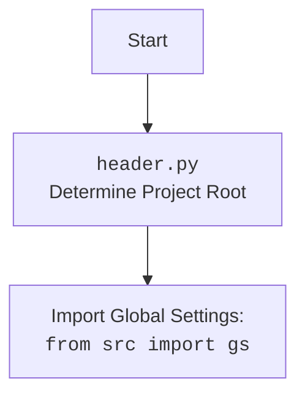

## Анализ кода `header.py`

### 1. <алгоритм>

1.  **Начало**: Исполнение скрипта начинается с определения пути к корневой директории проекта.
2.  **`os.getcwd()`**: Получение текущей рабочей директории.
    *   *Пример*: Если скрипт запущен из `/home/user/projects/hypotez/src/webdriver/_examples/`, то `os.getcwd()` вернет эту строку.
3.  **`os.getcwd().rfind('hypotez')`**: Поиск индекса последнего вхождения подстроки 'hypotez' в текущей рабочей директории.
    *   *Пример*: Для `/home/user/projects/hypotez/src/webdriver/_examples/` вернет 20.
4.  **`os.getcwd()[:index + 7]`**: Извлечение подстроки, начинающейся с начала текущей рабочей директории и заканчивающейся символом после последнего вхождения 'hypotez' (включая 'hypotez'). `+7` обеспечивает включение всего слова 'hypotez'
    *   *Пример*: Для `/home/user/projects/hypotez/src/webdriver/_examples/` будет `/home/user/projects/hypotez`
5.  **`Path(...)`**: Создание объекта `Path` из полученной строки, представляющей корневую директорию.
    *   *Пример*: `Path('/home/user/projects/hypotez')`
6.  **`sys.path.append(str(dir_root))`**: Добавление корневой директории в `sys.path`, что позволяет импортировать модули из этой директории и её поддиректорий.
7.  **`Path(dir_root, 'src')`**: Создание объекта `Path`, представляющего путь к директории `src`.
    *   *Пример*: `Path('/home/user/projects/hypotez/src')`
8.  **`sys.path.append(str(dir_root))`**: Повторное добавление корневой директории в `sys.path`, хотя это действие является избыточным (пункт 6) , т.к. она уже была добавлена.
9.  **Конец**: Скрипт завершает свою работу, установив пути для импорта модулей.

### 2. <mermaid>

```mermaid
flowchart TD
    Start --> GetCurrentDir[GetCurrentDir: Получение текущей рабочей директории `os.getcwd()`]
    GetCurrentDir --> FindHypotez[FindHypotez: Поиск индекса 'hypotez' `os.getcwd().rfind('hypotez')`]
    FindHypotez --> ExtractRootPath[ExtractRootPath: Извлечение корня проекта `os.getcwd()[:index+7]`]
    ExtractRootPath --> CreatePathObject[CreatePathObject: Создание объекта Path `Path(...)`]
    CreatePathObject --> AppendRootToSysPath[AppendRootToSysPath: Добавление корневой директории в `sys.path` `sys.path.append(str(dir_root))`]
    AppendRootToSysPath --> CreateSrcPathObject[CreateSrcPathObject: Создание объекта Path для 'src' `Path(dir_root, 'src')`]
    CreateSrcPathObject --> AppendRootToSysPathAgain[AppendRootToSysPathAgain: Повторное добавление корневой директории в `sys.path` `sys.path.append(str(dir_root))`]
    AppendRootToSysPathAgain --> End[End]
```



**Объяснение:**

*   **GetCurrentDir**: Функция `os.getcwd()` из модуля `os` используется для получения текущей рабочей директории скрипта.
*   **FindHypotez**: Метод `rfind('hypotez')` ищет последнее вхождение подстроки 'hypotez' в полученной строке директории.
*   **ExtractRootPath**: Срез строки извлекает путь до корневой директории проекта, включая слово 'hypotez'.
*   **CreatePathObject**: Функция `Path()` из модуля `pathlib` создает объект пути на основе полученной строки.
*   **AppendRootToSysPath**: Метод `sys.path.append()` добавляет путь к корневой директории в список путей поиска модулей (`sys.path`).
*    **CreateSrcPathObject**: Создается Path object для директории `/src`.
*   **AppendRootToSysPathAgain**: Повторное добавление пути к корневой директории.
*   **Start**: Начало скрипта
*   **End**: Конец скрипта

### 3. <объяснение>

**Импорты:**

*   `import os`: Модуль `os` предоставляет функции для взаимодействия с операционной системой, включая получение текущей рабочей директории (`os.getcwd()`).
*   `import sys`: Модуль `sys` предоставляет доступ к некоторым переменным и функциям, взаимодействующим с интерпретатором Python, включая `sys.path`, используемый для добавления путей поиска модулей.
*   `from pathlib import Path`: Из модуля `pathlib` импортируется класс `Path`, который предоставляет объектно-ориентированный способ работы с путями в файловой системе.

**Переменные:**

*   `dir_root`: Объект `Path`, представляющий корневую директорию проекта. Определяется путем извлечения подстроки из текущей рабочей директории, заканчивающейся названием корневой папки проекта - `hypotez`.
    *   *Тип*: `pathlib.Path`
* `dir_src`: Объект `Path`, представляющий путь к директории `src`.
    *   *Тип*: `pathlib.Path`

**Функции:**

*   Нет пользовательских функций, только встроенные функции `os.getcwd()`, `str()`, `sys.path.append()`.

**Объяснение:**

Этот скрипт `header.py` служит для динамического определения корневой директории проекта и добавления её в `sys.path`. Это позволяет импортировать модули из любой части проекта, независимо от текущей рабочей директории.

1.  Скрипт использует `os.getcwd()` для получения текущей рабочей директории, где был запущен скрипт.
2.  Затем, он ищет индекс последнего вхождения подстроки `hypotez` в текущей рабочей директории с помощью `rfind()`. Это предполагает, что корневая директория проекта названа `hypotez`.
3.  Используя найденный индекс, скрипт извлекает путь к корневой директории проекта.
4.  Создается объект `Path` для представления пути.
5.  Путь к корневой директории добавляется в `sys.path`.
6. Создается объект `Path` для директории `/src`.
7. Повторно добавляется путь к корневой директории в `sys.path`.

**Потенциальные ошибки и улучшения:**

*   **Избыточное добавление в `sys.path`:**  Повторное добавление `dir_root` в `sys.path` избыточно и не влияет на результат, это можно убрать.
*   **Жестко заданное имя `hypotez`:**  Код полагается на то, что корневая директория всегда называется `hypotez`. Это может вызвать проблемы, если имя директории изменится. Можно вынести имя корневой директории в отдельную переменную или файл конфигурации.
*   **Зависимость от текущей рабочей директории:** Код работает корректно только если скрипт запускается в поддиректории корневого каталога проекта. Если запустить скрипт в другом каталоге, то определение `dir_root` может быть некорректным.

**Взаимосвязь с другими частями проекта:**

Этот скрипт является частью механизма настройки окружения проекта.  После того, как `sys.path` настроен, можно импортировать другие модули из `src` и других директорий, например, `from src import gs`. В данном случае, `header.py` позволяет другим частям проекта получить доступ к модулям и пакетам внутри структуры проекта.