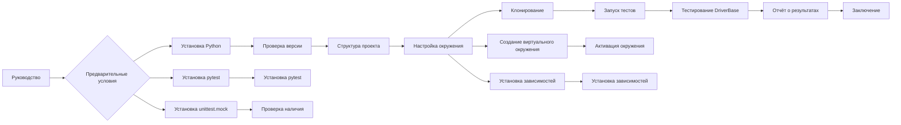

```MD
# Руководство для Тестирования `DriverBase` с `pytest`

## <input code>

```
### Руководство для Тестера

#### Введение

Этот документ предоставляет руководство для тестирования класса `DriverBase`, используя `pytest`. В этом руководстве описаны шаги по установке необходимых инструментов, запуску тестов, а также интерпретации результатов тестирования.

#### Предварительные условия

Перед началом тестирования убедитесь, что у вас установлены следующие компоненты:

1. **Python 3.12**:
    Убедитесь, что у вас установлена версия Python 3.12. Вы можете проверить текущую версию Python с помощью команды:
    ```bash
    python --version
    ```

2. **pytest**:
    Установите `pytest`, если он еще не установлен:
    ```bash
    pip install pytest
    ```

3. **unittest.mock**:
    Библиотека `unittest.mock` входит в стандартную библиотеку Python, начиная с версии 3.3.

#### Структура проекта

Проект имеет следующую структуру:

```
src/
|-- webdriver/
|   |-- driver.py
|   |-- javascript/
|   |-- executor/
|-- logger.py
|-- utils/
|   |-- jjson.py
tests/
|-- test_driver.py
```

#### Настройка окружения

1. **Клонирование репозитория**:
    Склонируйте репозиторий проекта на локальную машину:
    ```bash
    git clone <URL_вашего_репозитория>
    cd <имя_проекта>
    ```

2. **Создание и активация виртуального окружения**:
    Создайте виртуальное окружение для установки зависимостей:
    ```bash
    python -m venv venv
    source venv/bin/activate  # На Windows используйте: venv\Scripts\activate
    ```

3. **Установка зависимостей**:
    Установите необходимые зависимости, перечисленные в `requirements.txt` (если таковой имеется):
    ```bash
    pip install -r requirements.txt
    ```

#### Написание и запуск тестов

1. **Написание тестов**:
    Тесты для класса `DriverBase` находятся в файле `tests/test_driver.py`. Примеры тестов включают в себя тестирование методов `driver_payload`, `scroll`, `locale`, и других.

2. **Запуск тестов**:
    Для запуска тестов выполните следующую команду в корневой директории проекта:
    ```bash
    pytest tests/test_driver.py
    ```

3. **Интерпретация результатов тестов**:
    После запуска тестов `pytest` предоставит отчет о результатах.

#### Полезные команды

1. **Запуск всех тестов**:
    ```bash
    pytest
    ```

2. **Запуск тестов с подробным выводом**:
    ```bash
    pytest -v
    ```

3. **Запуск тестов с отчетом о покрытии кода**:
    Установите `pytest-cov`:
    ```bash
    pip install pytest-cov
    ```
    Затем запустите тесты с отчетом о покрытии:
    ```bash
    pytest --cov=src tests/
    ```

#### Заключение

Тестирование является важной частью разработки программного обеспечения. Используя `pytest` и следуя этому руководству, вы сможете эффективно тестировать функциональность класса `DriverBase`, обеспечивая его корректную работу и предотвращая регрессии.
```

## <algorithm>

(Схема блок-схемы отсутствует, так как текст является руководством, а не кодом.)

## <mermaid>



## <explanation>

**Импорты:**

* Нет явных импортов в предоставленном коде, это руководство.

**Классы:**

* **`DriverBase`:**  Руководство описывает класс `DriverBase`, но не предоставляет его определения.  Ожидается, что этот класс находится в `src/webdriver/driver.py`.

**Функции:**

* Методы класса `DriverBase` (`driver_payload`, `scroll`, `locale`):  Руководство описывает тестирование этих методов, но не предоставляет их определение.  Ожидается, что эти методы реализованы внутри класса `DriverBase`.

**Переменные:**

*  В руководстве есть текстовые константы, но нет объявлений переменных.

**Возможные ошибки/улучшения:**

* Отсутствие кода.  Руководство только описывает, как тестировать класс, но не показывает сам код тестирования или класс.
* Нет примеров тестов.  Руководство описывает, какие методы тестировать, но не предоставляет примеры тестов.
* Необходима информация о `requirements.txt`. Руководство предполагает его наличие, но не показывает его содержимое.

**Взаимосвязи с другими частями проекта:**

* `src/webdriver/driver.py`: содержит реализацию класса `DriverBase`.
* `tests/test_driver.py`: содержит тесты для класса `DriverBase`.
* `src/utils/jjson.py` (предполагается): может быть использована для работы с JSON данными.
* `src/logger.py` (предполагается): возможно содержит логирование.


**Общий анализ:**

Данное руководство является инструкцией для тестирования, а не объяснением реализации.  Для полноценного анализа необходимо предоставить код класса `DriverBase` и тестов в `test_driver.py`.  Схема `mermaid` описывает общий процесс тестирования, но не детализирует логику самих тестов.