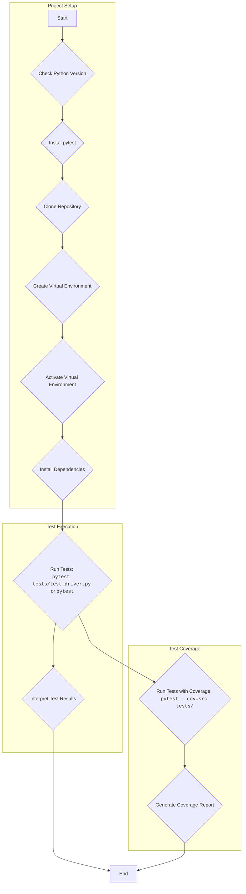

## ИНСТРУКЦИЯ:

Анализируй предоставленный код подробно и объясни его функциональность. Ответ должен включать три раздела:  

1. **<алгоритм>**: Опиши рабочий процесс в виде пошаговой блок-схемы, включая примеры для каждого логического блока, и проиллюстрируй поток данных между функциями, классами или методами.  
2. **<mermaid>**: Напиши код для диаграммы в формате `mermaid`, проанализируй и объясни все зависимости, 
    которые импортируются при создании диаграммы. 
    **ВАЖНО!** Убедитесь, что все имена переменных, используемые в диаграмме `mermaid`, 
    имеют осмысленные и описательные имена. Имена переменных вроде `A`, `B`, `C`, и т.д., не допускаются!  
    
    **Дополнительно**: Если в коде есть импорт `import header`, добавьте блок `mermaid` flowchart, объясняющий `header.py`:\
    ```mermaid
    flowchart TD
        Start --> Header[<code>header.py</code><br> Determine Project Root]
    
        Header --> import[Import Global Settings: <br><code>from src import gs</code>] 
    ```

3. **<объяснение>**: Предоставьте подробные объяснения:  
   - **Импорты**: Их назначение и взаимосвязь с другими пакетами `src.`.  
   - **Классы**: Их роль, атрибуты, методы и взаимодействие с другими компонентами проекта.  
   - **Функции**: Их аргументы, возвращаемые значения, назначение и примеры.  
   - **Переменные**: Их типы и использование.  
   - Выделите потенциальные ошибки или области для улучшения.  

Дополнительно, постройте цепочку взаимосвязей с другими частями проекта (если применимо).  

Это обеспечивает всесторонний и структурированный анализ кода.
## Формат ответа: `.md` (markdown)
**КОНЕЦ ИНСТРУКЦИИ**
## Анализ кода

### 1. <алгоритм>
Представленный текст - это руководство по тестированию класса `DriverBase` с использованием `pytest`. Алгоритм можно описать следующими шагами:

1. **Подготовка окружения:**
    * Проверка наличия Python 3.12.
    * Установка `pytest` и `pytest-cov` (для отчета о покрытии).
    * Клонирование репозитория проекта.
    * Создание и активация виртуального окружения.
    * Установка зависимостей из `requirements.txt`.

2. **Структура проекта:**
   * Описание структуры каталогов:
       - `src/`: Содержит основной код.
          - `webdriver/`: Код драйвера.
          - `logger.py`: Логгирование.
          - `utils/`: Вспомогательные утилиты.
       - `tests/`: Содержит тестовый код.
         - `test_driver.py`: Тесты для класса `DriverBase`.

3. **Написание тестов:**
   * Тесты находятся в `tests/test_driver.py`.
   * Примеры тестов: тестирование методов `driver_payload`, `scroll`, `locale` и других.

4. **Запуск тестов:**
    * Команда `pytest tests/test_driver.py` запускает тесты.
    * Команда `pytest` запускает все тесты.
    * Команда `pytest -v` запускает тесты с подробным выводом.
    * Команда `pytest --cov=src tests/` запускает тесты и генерирует отчет о покрытии кода.

5. **Интерпретация результатов:**
    * `pytest` выводит отчет о результатах, включая количество пройденных, пропущенных и не пройденных тестов, а также время выполнения.
    * В случае неудачных тестов `pytest` предоставляет детали ошибки.

**Примеры:**
   *  **Подготовка окружения:**
       ```bash
       python --version  # Пример вывода: Python 3.12.0
       pip install pytest  # Установка pytest
       git clone <URL_вашего_репозитория> # клонирование
       python -m venv venv #создание виртуального окружения
       source venv/bin/activate # Активация
       pip install -r requirements.txt # Установка зависимостей из requirements.txt
       ```
   * **Запуск тестов:**
      ```bash
      pytest tests/test_driver.py # Запуск конкретного теста
      pytest # Запуск всех тестов
      pytest -v # Запуск с подробным выводом
      pytest --cov=src tests/ # Запуск с отчетом о покрытии
      ```
   * **Интерпретация результатов:**
      ```
      ============================== test session starts ===============================
      platform linux -- Python 3.12.0, pytest-7.0.0, pluggy-0.13.1
      rootdir: /path/to/your/project
      collected 9 items

      tests/test_driver.py ........                                        [100%]

      =============================== 9 passed in 1.23s ================================
      ```

### 2. <mermaid>

**Объяснение диаграммы:**
*   `Project Setup`: Блок, отвечающий за подготовку окружения для выполнения тестов.
    *   `A`: Начало процесса.
    *   `B`: Проверка версии Python.
    *   `C`: Установка `pytest`.
    *   `D`: Клонирование репозитория.
    *   `E`: Создание виртуального окружения.
    *   `F`: Активация виртуального окружения.
    *   `G`: Установка зависимостей из `requirements.txt`.
*   `Test Execution`: Блок, отвечающий за запуск и интерпретацию результатов тестов.
    *   `H`: Запуск тестов с помощью `pytest`.
    *   `I`: Интерпретация результатов тестов.
*   `Test Coverage`: Блок, отвечающий за запуск тестов с генерацией отчета о покрытии.
    * `J`: Запуск тестов с параметром `--cov` для отслеживания покрытия кода.
    * `K`: Генерация отчета о покрытии кода.
*   `L`: Конец процесса.

### 3. <объяснение>

**Импорты:**

В данном тексте нет явных `import` в коде, так как он представляет собой руководство, а не исходный код Python. Однако, из текста следует, что используются:
   - **`pytest`**: Фреймворк для тестирования.  Необходим для написания и запуска тестов, а также интерпретации результатов. Он используется для организации тестовых наборов, выполнения тестов и генерации отчетов.
   - **`unittest.mock`**: Библиотека для создания мок-объектов. Входит в стандартную библиотеку Python (начиная с версии 3.3), и используется для изоляции кода, который тестируется, от внешних зависимостей. Это особенно полезно при тестировании классов, которые взаимодействуют с внешними системами или ресурсами.
   -  **`pytest-cov`**: Плагин для `pytest`, который генерирует отчет о покрытии кода. Помогает анализировать, какие части кода были запущены во время тестов, и позволяет оценить качество тестов.
   
**Структура проекта:**

*   **`src/`**: Содержит основной код проекта.
    *   **`webdriver/`**:  Содержит модули, связанные с управлением веб-драйвером, включая `driver.py`.
    *   **`logger.py`**:  Содержит код для логгирования. Используется для записи событий и отладки.
    *   **`utils/`**:  Содержит общие утилиты, например, `jjson.py` для обработки JSON.
*   **`tests/`**: Содержит тестовые скрипты.
    *   **`test_driver.py`**: Содержит тесты для класса `DriverBase`. Он использует `pytest` для написания и выполнения тестов и `unittest.mock` для создания мок объектов.

**Классы:**

*   **`DriverBase`**: Класс, который тестируется. Методы `driver_payload`, `scroll`, `locale` и другие, упомянутые в руководстве, являются методами этого класса. Предназначен для взаимодействия с веб-драйвером.

**Функции:**

В тексте руководства нет описания конкретных функций, но есть описание тестовых функций, которые используются в `tests/test_driver.py`, например:
   *   Функции тестов, которые являются частью `test_driver.py`, тестируют методы `DriverBase` (например, `test_driver_payload`, `test_scroll`, `test_locale`).

**Переменные:**

*   В основном переменные используются как флаги и пути для настройки окружения и запуска тестов (например: `python --version`, `pip install pytest`, `git clone <URL_вашего_репозитория>`).

**Потенциальные ошибки и области для улучшения:**

*   **Зависимости:**  Руководство подразумевает наличие `requirements.txt`, но не предоставляет его содержание. Неполный список зависимостей может привести к проблемам с окружением.
*   **Ограничения версий:** Не указаны конкретные версии пакетов, кроме python 3.12. Зависимости могут не работать с разными версиями.
*   **Точные инструкции**:  Руководство может быть более детальным, предоставляя конкретные примеры тестовых функций из `test_driver.py` для лучшего понимания.
*   **Примеры:** Добавление примеров кода для методов `driver_payload`, `scroll`, `locale` и т.д. могло бы сделать руководство более понятным и полезным.
* **Обработка ошибок:** В руководстве нет информации об обработке исключений или об ошибках при выполнении команд.
* **Установка тестовой базы**: Не описано как подготовить тестовую базу для тестов

**Взаимосвязи с другими частями проекта:**
*   Тесты в `tests/test_driver.py` зависят от класса `DriverBase` в `src/webdriver/driver.py`.
*   `DriverBase` может использовать `logger.py` для логгирования.
*   `DriverBase` может использовать `jjson.py` для работы с JSON.
*   `pytest` и `pytest-cov` интегрируются с Python и используются для написания и запуска тестов.