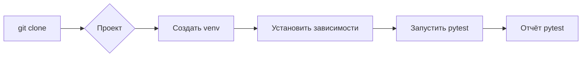

# Руководство по тестированию класса DriverBase с использованием pytest

## <input code>

```
### Руководство для Тестера

#### Введение

Этот документ предоставляет руководство для тестирования класса `DriverBase`, используя `pytest`. В этом руководстве описаны шаги по установке необходимых инструментов, запуску тестов, а также интерпретации результатов тестирования.

#### Предварительные условия

Перед началом тестирования убедитесь, что у вас установлены следующие компоненты:

1. **Python 3.12**
    Убедитесь, что у вас установлена версия Python 3.12. Вы можете проверить текущую версию Python с помощью команды:
    ```bash
    python --version
    ```

2. **pytest**
    Установите `pytest`, если он еще не установлен:
    ```bash
    pip install pytest
    ```

3. **unittest.mock**
    Библиотека `unittest.mock` входит в стандартную библиотеку Python, начиная с версии 3.3.

#### Структура проекта

Проект имеет следующую структуру:

```
src/
|-- webdriver/
|   |-- driver.py
|   |-- javascript/
|   |-- executor/
|-- logger.py
|-- utils/
|   |-- jjson.py
tests/
|-- test_driver.py
```

#### Настройка окружения

1. **Клонирование репозитория**
    Склонируйте репозиторий проекта на локальную машину:
    ```bash
    git clone <URL_вашего_репозитория>
    cd <имя_проекта>
    ```

2. **Создание и активация виртуального окружения**
    Создайте виртуальное окружение для установки зависимостей:
    ```bash
    python -m venv venv
    source venv/bin/activate  # На Windows используйте: venv\Scripts\activate
    ```

3. **Установка зависимостей**
    Установите необходимые зависимости, перечисленные в `requirements.txt` (если таковой имеется):
    ```bash
    pip install -r requirements.txt
    ```

#### Написание и запуск тестов

1. **Написание тестов**
    Тесты для класса `DriverBase` находятся в файле `tests/test_driver.py`. Примеры тестов включают в себя тестирование методов `driver_payload`, `scroll`, `locale`, и других.

2. **Запуск тестов**
    Для запуска тестов выполните следующую команду в корневой директории проекта:
    ```bash
    pytest tests/test_driver.py
    ```

3. **Интерпретация результатов тестов**
    После запуска тестов `pytest` предоставит отчет о результатах.

#### Полезные команды

1. **Запуск всех тестов**
    ```bash
    pytest
    ```

2. **Запуск тестов с подробным выводом**
    ```bash
    pytest -v
    ```

3. **Запуск тестов с отчетом о покрытии кода**
    Установите `pytest-cov`:
    ```bash
    pip install pytest-cov
    ```
    Затем запустите тесты с отчетом о покрытии:
    ```bash
    pytest --cov=src tests/
    ```

#### Заключение

Тестирование является важной частью разработки программного обеспечения. Используя `pytest` и следуя этому руководству, вы сможете эффективно тестировать функциональность класса `DriverBase`, обеспечивая его корректную работу и предотвращая регрессии.
```

## <algorithm>

(Блок-схема отсутствует, т.к. код описывает *как* тестировать, а не *как* работает сам тестируемый код.  Тестируемый код (`DriverBase`) не показан.)

## <mermaid>



## <explanation>

**Импорты:**

Документ описывает руководство по тестированию, поэтому импорты не приведены в коде.  Он предполагает, что необходимые модули (например, `pytest`, `unittest.mock`) установлены.


**Классы:**

Документ упоминает класс `DriverBase`, но его код не показан.  Описание предполагает наличие в файле `src/webdriver/driver.py` класса `DriverBase` с методами `driver_payload`, `scroll`, `locale`.  В `tests/test_driver.py` находятся тесты для этих методов.


**Функции:**

Документ описывает методы класса `DriverBase` (например, `driver_payload`, `scroll`, `locale`), но их код не представлен.  Методы предположительно реализуют логику взаимодействия с веб-драйвером.


**Переменные:**

Нет явных переменных.


**Возможные ошибки/улучшения:**

* **Отсутствие кода `DriverBase`:**  Руководство не содержит исходного кода класса `DriverBase`, что затрудняет подробный анализ. Для полноценного анализа нужен код класса `DriverBase` и тестов.
* **Отсутствие `requirements.txt`:**  Документ не указывает, какие библиотеки нужны для работы кода.  `requirements.txt` важен для воспроизводимости.
* **Недостаток конкретики:**  Руководство даёт общую информацию по тестированию, но не хватает подробностей, необходимых для практического применения (например, какие входные данные ожидаются для `driver_payload`, `scroll`, `locale`, какие ожидаются результаты).


**Взаимосвязь с другими частями проекта:**

* `src/webdriver/driver.py`: содержит класс `DriverBase` и связанную логику.
* `tests/test_driver.py`: содержит тесты для класса `DriverBase`.
* `src/logger.py`: предполагается, что используется для логирования.
* `src/utils/jjson.py`: возможно, используется для работы с JSON данными.

**Выводы:**

Документ предоставляет хорошее руководство по настройке и запуску тестов для класса `DriverBase` с использованием `pytest`. Но, для глубокого анализа, необходимо предоставить сам код `DriverBase` и тестов (`tests/test_driver.py`).