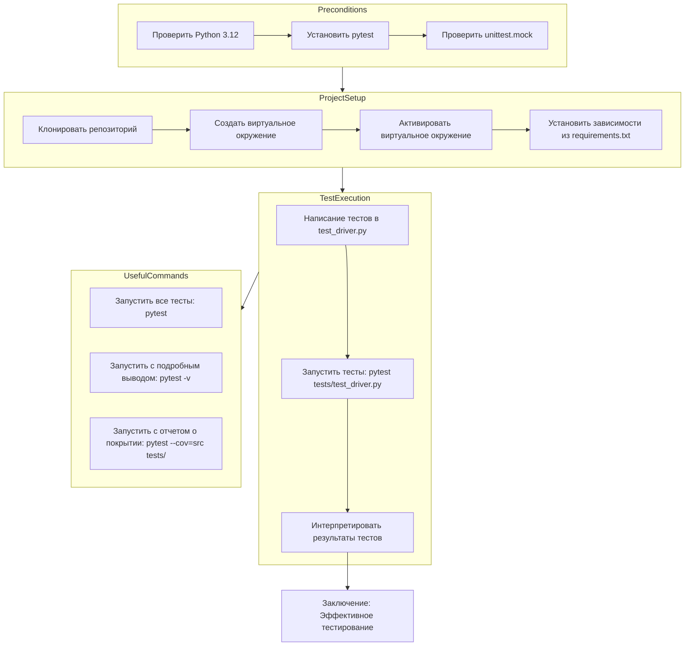

## Анализ Руководства по Тестированию `DriverBase` с Использованием `pytest`

### 1. <алгоритм>

1.  **Начало**: Руководство начинается с вводной информации, объясняющей цель документа: предоставить руководство по тестированию класса `DriverBase` с использованием `pytest`.
2.  **Предварительные Условия**:
    *   **Проверка Python**: Убедитесь, что установлена Python 3.12. Пример: `python --version`.
    *   **Установка pytest**: Установить `pytest` при помощи `pip install pytest`.
    *   **unittest.mock**: Проверить наличие `unittest.mock` (входит в стандартную библиотеку Python с версии 3.3).
3.  **Структура Проекта**: Описывается структура проекта: `src/webdriver/`, `src/logger.py`, `src/utils/`, `tests/`.
4.  **Настройка Окружения**:
    *   **Клонирование**: Клонировать репозиторий проекта.
    *   **Виртуальное Окружение**: Создать и активировать виртуальное окружение (`python -m venv venv`, `source venv/bin/activate`).
    *   **Установка Зависимостей**: Установить зависимости из `requirements.txt` (если есть) при помощи `pip install -r requirements.txt`.
5.  **Написание и Запуск Тестов**:
    *   **Расположение тестов**: Тесты для `DriverBase` находятся в `tests/test_driver.py`.
    *   **Запуск Тестов**: Выполнить тесты через `pytest tests/test_driver.py`.
    *   **Интерпретация Результатов**: `pytest` предоставляет отчет о результатах (количество пройденных тестов, время выполнения, ошибки).
6.  **Полезные Команды**:
    *   Запуск всех тестов: `pytest`.
    *   Запуск с подробным выводом: `pytest -v`.
    *   Запуск с покрытием кода: `pytest --cov=src tests/` (требует установки `pytest-cov`).
7.  **Заключение**: Подчеркивается важность тестирования и использования `pytest` для обеспечения корректной работы `DriverBase`.

### 2. <mermaid>

**Объяснение зависимостей `mermaid`:**

*   **Preconditions**: Этот подграф описывает начальные требования к окружению, включая проверку версии Python, установку `pytest` и проверку наличия `unittest.mock`.
*   **ProjectSetup**: Этот подграф описывает шаги по настройке проекта, включая клонирование репозитория, создание и активацию виртуального окружения, а также установку зависимостей.
*   **TestExecution**: Этот подграф описывает процесс написания, запуска и интерпретации результатов тестов.
*  **UsefulCommands**: Этот подграф описывает полезные команды, используемые при тестировании, такие как запуск всех тестов, запуск с подробным выводом и запуск с отчетом о покрытии кода.
*   Стрелки (`-->`) обозначают последовательность действий.

### 3. <объяснение>

#### Импорты

Руководство не описывает импорты, так как основной фокус на тестировании, а не на коде. Примеры импортов, которые можно предположить, основаны на структуре проекта:

*   `from src.webdriver.driver import DriverBase`: Импортирует основной класс для тестирования.
*   `from src.utils.jjson import jload, jdump`: Импортирует функции для работы с JSON.
*   `from src.logger import log`: Импортирует функцию для логирования.
*   `import pytest`: Импортирует библиотеку для тестирования.
*   `from unittest.mock import patch`: Импортирует функцию для мокирования.

#### Классы

*   **DriverBase**: Основной класс, который тестируется. (детали отсутствуют, так как не предоставлен код `driver.py`).  Предположительно, это базовый класс, предоставляющий интерфейс для взаимодействия с веб-драйвером, содержащий методы для управления страницей (скроллинг, загрузка, выполнение JavaScript и т.д.).
*  **TestDriverBase**: Класс с тестовыми функциями (детали отсутствуют, так как не предоставлен код `test_driver.py`). Представляет собой тестовый класс, в котором содержатся тесты для методов `DriverBase`.

#### Функции

*   **pytest**: Фреймворк для тестирования.
*   **unittest.mock.patch**: Используется для мокирования зависимостей в тестах.

**Примеры:**

*   **driver_payload**: Предположительно метод `DriverBase` для управления полезной нагрузкой драйвера (например, загрузка данных).
*   **scroll**: Предположительно метод `DriverBase` для прокрутки страницы.
*  **locale**: Предположительно метод `DriverBase` для установки или получения текущей локали.

#### Переменные

Руководство не описывает конкретные переменные, поскольку фокусируется на процессе тестирования. Примеры переменных, которые могут быть использованы в тестах:

*   Экземпляры класса `DriverBase`.
*   Данные для тестов (строки, числа, JSON).
*   Мокированные объекты (например, для имитации поведения браузера).

#### Потенциальные ошибки и области для улучшения

*   **Отсутствие `requirements.txt`**: В руководстве упоминается `requirements.txt`, но нет информации, что он обязательно должен присутствовать. Добавление `requirements.txt` и явное перечисление зависимостей поможет избежать проблем с окружением.
*   **Недостаток информации о `DriverBase`**: Руководство не описывает функциональность `DriverBase`, что может затруднить понимание цели тестов.
*   **Нет кода для `test_driver.py`**: Не показаны примеры тестов, что делает руководство менее наглядным.
*   **Отсутствие примеров мокирования**: Не показано, как использовать `unittest.mock`, что затрудняет понимание более сложных тестов.

#### Цепочка взаимосвязей

1.  **`src/webdriver/driver.py`**: Содержит класс `DriverBase`.
2.  **`src/utils/jjson.py`**: Предоставляет утилиты для работы с JSON, которые могут использоваться в `driver.py`.
3.  **`src/logger.py`**: Обеспечивает логирование, которое может использоваться в `driver.py`.
4.  **`tests/test_driver.py`**: Содержит тесты для класса `DriverBase`, используя `pytest`.
5.  `pytest` запускает тесты, описанные в `test_driver.py`, для проверки функциональности `DriverBase`.
6.  `unittest.mock` может быть использован для мокирования зависимостей в тестах, обеспечивая их изоляцию и управляемость.