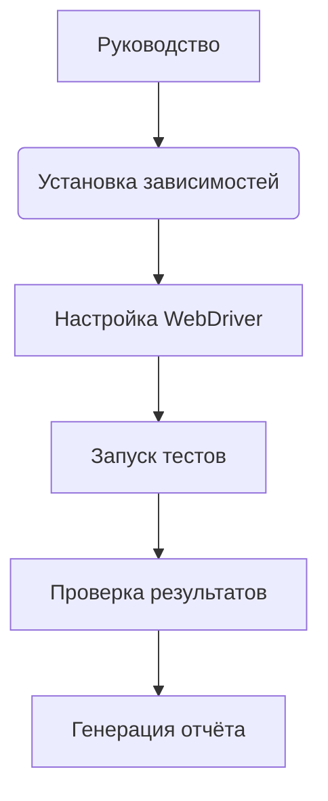

# <input code>

```
Вот руководство для тестеров по запуску и выполнению тестов из файла `test_driver_executor.py`, а также описание тестов и их целей.

---

# Руководство для тестера по запуску и выполнению тестов

## Введение

В этом руководстве описывается, как запустить и выполнить тесты для классов `Driver` и `ExecuteLocator`, расположенные в файле `test_driver_executor.py`. Тесты проверяют функциональность методов классов и взаимодействие между `Driver` и `ExecuteLocator`.

## Структура тестов

Файл `test_driver_executor.py` содержит тесты для двух классов: `Driver` и `ExecuteLocator`. Эти тесты проверяют корректность работы методов классов, взаимодействие между ними, а также сценарии использования в различных ситуациях.

### Тестируемые методы и функции

- **`test_navigate_to_page`**: Проверяет, что WebDriver корректно загружает указанную страницу.
- **`test_get_webelement_by_locator_single_element`**: Проверяет, что метод `get_webelement_by_locator` корректно возвращает элемент по локатору.
- **`test_get_webelement_by_locator_no_element`**: Проверяет, что метод `get_webelement_by_locator` возвращает `False`, если элемент не найден.
- **`test_send_message`**: Проверяет, что метод `send_message` корректно отправляет сообщение элементу.
- **`test_get_attribute_by_locator`**: Проверяет, что метод `get_attribute_by_locator` корректно возвращает атрибут элемента.
- **`test_execute_locator_event`**: Проверяет, что метод `execute_locator` корректно выполняет событие на локаторе.
- **`test_get_locator_keys`**: Проверяет, что метод `get_locator_keys` возвращает правильные ключи локатора.
- **`test_navigate_and_interact`**: Проверяет последовательность навигации и взаимодействия с элементами на другой странице.
- **`test_invalid_locator`**: Проверяет обработку некорректных локаторов и соответствующее исключение.

## Запуск тестов

### Установка зависимостей

Перед запуском тестов убедитесь, что у вас установлены все необходимые зависимости. Для этого выполните команду:

```bash
pip install -r requirements.txt
```

В `requirements.txt` должны быть указаны необходимые библиотеки, такие как `pytest` и `selenium`.

### Настройка WebDriver

В тестах используется Chrome WebDriver. Убедитесь, что у вас установлен [ChromeDriver](https://sites.google.com/chromium.org/driver/) и укажите путь к `chromedriver` в строке:

```python
service = Service(executable_path="/path/to/chromedriver")  # Путь к вашему chromedriver
```

### Запуск тестов

Для запуска тестов используйте команду:

```bash
pytest src/webdriver/_pytest/test_driver_executor.py
```

## ... (остальной текст руководства)
```

# <algorithm>

(Схема блок-схемы отсутствует, так как текст – это руководство, а не код.)

# <mermaid>



**Описание зависимостей для Mermaid:**

Диаграмма отображает общую последовательность действий по запуску тестов.  
* `Руководство`:  Этап получения инструкций перед запуском.
* `Установка зависимостей`:  Указание на необходимость установки библиотек (`pip install -r requirements.txt`).
* `Настройка WebDriver`: Настройка драйвера веб-драйвера, включая указание пути к `chromedriver`.
* `Запуск тестов`:  Выполнение команды `pytest src/webdriver/_pytest/test_driver_executor.py`.
* `Проверка результатов`: Оценка результатов выполнения тестов.
* `Генерация отчёта`: Создание отчёта о ходе выполнения тестов.


# <explanation>

**Импорты:**

Руководство не содержит кода для анализа импортов. Текст описывает необходимые зависимости (pytest, selenium и др.), но не предоставляет их импорт в Python-коде.  Без кода сложно точно определить импортируемые модули и их назначение.

**Классы (`Driver`, `ExecuteLocator`):**

Руководство описывает классы `Driver` и `ExecuteLocator`, но не содержит их определения.  Описание предполагает, что эти классы отвечают за управление WebDriver и взаимодействие с веб-элементами.


**Функции (`test_navigate_to_page`, `test_get_webelement_by_locator_single_element`, и т.д.):**

Руководство подробно описывает функциональность каждой тестовой функции (`test_*`).  Функции проверяют различные аспекты работы `Driver` и `ExecuteLocator`, например, навигацию по страницам, работу с локаторами и обработку событий.  Эти функции - это тесты.  Аргументы, возвращаемые значения, и подробное описание тестов предоставляют основу для проверки корректности реализаций классов `Driver` и `ExecuteLocator`.

**Переменные:**

Описание руководства не предоставляет информации о переменных.  Судя по коду, скорее всего будут переменные, хранящие пути к файлам, значения локаторов, объекты WebDriver, и другие данные, связанные с тестированием.

**Возможные ошибки и улучшения:**

* **Отсутствие кода**:  Руководство является описанием, а не кодом.  Для полноценного анализа кода необходимо исходный код.
* **Недостаточно информации**: Руководство не содержит деталей имплементации. Нельзя сказать, как реализованы методы классов или функции.
* **Подробная документация**:  Необходимо более подробное описание внутренних механизмов, особенно для `Driver` и `ExecuteLocator`.  Полезно было бы знать внутренние структуры данных и алгоритмы, использованные внутри классов.
* **Управление исключениями**: Руководство описывает обработку исключений (`ExecuteLocatorException`), но не показывает, как они обрабатываются.
* **Проверка входных данных**:  Необходимо убедиться, что все функции проверяют корректность и тип входных данных, например, локаторов.
* **Покрытие кода**: Тестирующий код должен охватывать все пути и условия в тестируемых частях программы.
* **Тестирование на разных браузерах**:  Желательно иметь возможность тестирования в разных браузерах (не только Chrome).
* **Модульное тестирование**:  Следует использовать модульное тестирование для проверки отдельных компонентов программы.

**Взаимосвязь с другими частями проекта:**

Руководство предполагает, что существуют другие части проекта, где определены классы `Driver` и `ExecuteLocator`. Возможно, есть модули, определяющие логику обработки локаторов, обработки событий, или другие взаимосвязанные компоненты проекта.  Без доступа к исходному коду, это лишь предположение.