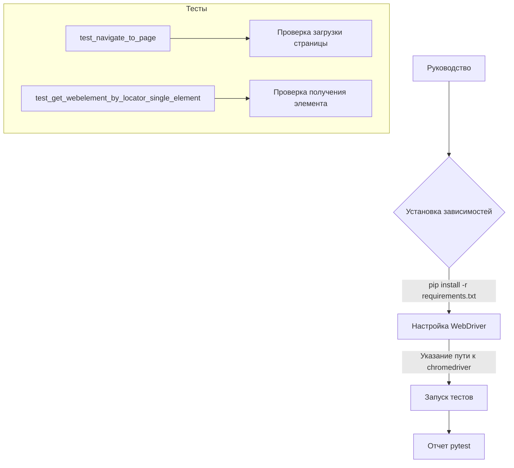

```MD
# <input code>

```python
Вот руководство для тестеров по запуску и выполнению тестов из файла `test_driver_executor.py`, а также описание тестов и их целей.

---

# Руководство для тестера по запуску и выполнению тестов

## Введение

В этом руководстве описывается, как запустить и выполнить тесты для классов `Driver` и `ExecuteLocator`, расположенные в файле `test_driver_executor.py`. Тесты проверяют функциональность методов классов и взаимодействие между `Driver` и `ExecuteLocator`.

## Структура тестов

Файл `test_driver_executor.py` содержит тесты для двух классов: `Driver` и `ExecuteLocator`. Эти тесты проверяют корректность работы методов классов, взаимодействие между ними, а также сценарии использования в различных ситуациях.

### Тестируемые методы и функции

- **`test_navigate_to_page`**: Проверяет, что WebDriver корректно загружает указанную страницу.
- **`test_get_webelement_by_locator_single_element`**: Проверяет, что метод `get_webelement_by_locator` корректно возвращает элемент по локатору.
- **`test_get_webelement_by_locator_no_element`**: Проверяет, что метод `get_webelement_by_locator` возвращает `False`, если элемент не найден.
- **`test_send_message`**: Проверяет, что метод `send_message` корректно отправляет сообщение элементу.
- **`test_get_attribute_by_locator`**: Проверяет, что метод `get_attribute_by_locator` корректно возвращает атрибут элемента.
- **`test_execute_locator_event`**: Проверяет, что метод `execute_locator` корректно выполняет событие на локаторе.
- **`test_get_locator_keys`**: Проверяет, что метод `get_locator_keys` возвращает правильные ключи локатора.
- **`test_navigate_and_interact`**: Проверяет последовательность навигации и взаимодействия с элементами на другой странице.
- **`test_invalid_locator`**: Проверяет обработку некорректных локаторов и соответствующее исключение.

## Запуск тестов

### Установка зависимостей

Перед запуском тестов убедитесь, что у вас установлены все необходимые зависимости. Для этого выполните команду:

```bash
pip install -r requirements.txt
```

В `requirements.txt` должны быть указаны необходимые библиотеки, такие как `pytest` и `selenium`.

### Настройка WebDriver

В тестах используется Chrome WebDriver. Убедитесь, что у вас установлен [ChromeDriver](https://sites.google.com/chromium.org/driver/) и укажите путь к `chromedriver` в строке:

```python
service = Service(executable_path="/path/to/chromedriver")  # Путь к вашему chromedriver
```

### Запуск тестов

Для запуска тестов используйте команду:

```bash
pytest src/webdriver/_pytest/test_driver_executor.py
```

## ... (остальной текст руководства)
```

# <algorithm>

(Блок-схема отсутствует, так как предоставленный текст - руководство, а не код.)

# <mermaid>



# <explanation>

**Импорты:**

Текст руководства описывает процесс запуска тестов, но не содержит импортируемых модулей.

**Классы:**

Руководство описывает классы `Driver` и `ExecuteLocator`, но не предоставляет их определения.

**Функции:**

Руководство описывает функции/методы тестов (`test_navigate_to_page`, `test_get_webelement_by_locator_single_element`, и другие).  Указаны их цели, ожидаемые результаты и условия выполнения.

**Переменные:**

Руководство упоминает переменную `service`, которая хранит путь к ChromeDriver.

**Возможные ошибки/улучшения:**

* Отсутствует код тестов (`test_driver_executor.py`), поэтому невозможно оценить реализацию тестов и возможные ошибки в деталях.
* Не описан код работы с `Driver` и `ExecuteLocator` классами, что не позволяет оценить их архитектуру.
* Отсутствует блок-схема алгоритма работы тестов.
* Документация могла бы быть более структурированной, с использованием формата, поддерживающего гиперссылки или Markdown.

**Взаимосвязи с другими частями проекта:**

Руководство предполагает существование `requirements.txt`, `test_driver_executor.py`, и наличия соответствующих классов, функций, переменных в других частях проекта для выполнения тестов.  Существуют также зависимости от библиотек `pytest` и `selenium`, а также от ChromeDriver.  Связь с другими частями проекта в этом документе не описывается,  но предполагается.