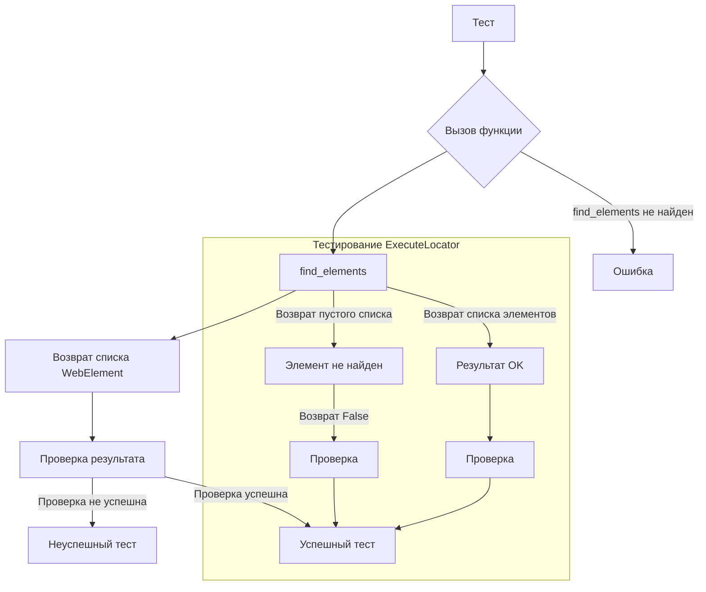

```MD
# Руководство по тестированию класса `ExecuteLocator`

## <input code>

```python
import pytest
from unittest.mock import MagicMock, patch
from selenium.webdriver.remote.webelement import WebElement
from selenium.webdriver.common.by import By

from src.webdriver.executor import ExecuteLocator
from src.logger.exceptions import ExecuteLocatorException

@pytest.fixture
def driver_mock():
    return MagicMock()

@pytest.fixture
def execute_locator(driver_mock):
    return ExecuteLocator(driver_mock)

# Примеры тестов для методов класса ExecuteLocator
def test_get_webelement_by_locator_single_element(execute_locator, driver_mock):
    pass  # Реализация теста
# ... (другие тесты)
```

## <algorithm>

**Шаг 1:** Импортируются необходимые модули (`pytest`, `MagicMock`, `WebElement`, `By`, `ExecuteLocator`, `ExecuteLocatorException`).  Это подключает необходимые библиотеки для тестирования и работы с Selenium WebDriver.

**Шаг 2:** Определяется фикстура `driver_mock`, возвращающая "мока" объекта WebDriver. Это позволяет эмулировать поведение WebDriver, не взаимодействуя с реальным браузером. Пример: `driver_mock = MagicMock()`.

**Шаг 3:** Определяется фикстура `execute_locator`, принимающая `driver_mock` и создающая экземпляр `ExecuteLocator`. Пример: `execute_locator = ExecuteLocator(driver_mock)`.

**Шаг 4:** Определяются тесты (`test_get_webelement_by_locator_single_element`, ...). Каждый тест использует `execute_locator` и `driver_mock` для проверки различных сценариев. Пример: `driver_mock.find_elements.return_value = [element]`.  Внутри тестов проверяются вызовы методов `driver_mock`, а также соответствие полученных результатов ожидаемым. Пример: `driver_mock.find_elements.assert_called_once_with(By.XPATH, "//div[@id=\'test\']")`.


## <mermaid>



**Объяснение зависимостей:**

* **pytest:**  Библиотека для написания и запуска тестов.
* **unittest.mock:**  Модуль для создания "моков" (заглушек) для объектов. Используется для моделирования поведения `WebDriver` без реального запуска браузера.
* **selenium:** Библиотека для работы с WebDriver. В данном случае используются `selenium.webdriver.remote.webelement` и `selenium.webdriver.common.by`.
* **src.webdriver.executor:**  Класс `ExecuteLocator` — часть проекта, который тестируется.
* **src.logger.exceptions:** Модуль, вероятно, содержит классы исключений, используемые в `ExecuteLocator`.

## <explanation>

**Импорты:**

* `pytest`: Используется для фреймворка тестирования.
* `unittest.mock`: Используется для создания "моков" для тестирования, имитируя работу других компонентов без их запуска.
* `selenium`:  Для взаимодействия с веб-драйвером.
* `src.webdriver.executor`: Содержит класс `ExecuteLocator`, который тестируется.
* `src.logger.exceptions`: Вероятно, содержит классы исключений, используемые в `ExecuteLocator`.

**Классы:**

* `ExecuteLocator`: Класс, который содержит методы для работы с веб-элементами (нахождения, получения атрибутов, отправки сообщений) через Selenium WebDriver.

**Функции:**

* `test_get_webelement_by_locator_single_element`:  Тест на поиск единственного элемента.
* `test_get_webelement_by_locator_multiple_elements`: Тест на поиск множества элементов.
* `test_get_webelement_by_locator_no_element`: Тест на случай, когда элемент не найден.
* `test_get_attribute_by_locator`: Тест для получения атрибута элемента.
* `test_send_message`: Тест отправки сообщений элементу.
* `test_send_message_typing_speed`: Тест отправки сообщений с заданной скоростью.


**Фикстуры:**

* `driver_mock`:  Фикстура, возвращающая "мока" объекта `WebDriver`.
* `execute_locator`: Фикстура, создающая экземпляр `ExecuteLocator` с заданным `driver_mock`.

**Переменные:**

Переменные содержат параметры для тестов (например, `locator`, `message`, `typing_speed`).


**Возможные ошибки/улучшения:**

* Не реализованы тесты для `ExecuteLocator`.  Нужно заполнить тела функций тестов, чтобы проверить корректность работы методов `get_webelement_by_locator`, `get_attribute_by_locator`, `send_message`.

**Взаимосвязь с другими частями проекта:**

`ExecuteLocator` напрямую зависит от `WebDriver` и `WebElement`.  Он использует `src.logger.exceptions` для обработки ошибок.  Он, скорее всего, является частью  тестового стека для веб-драйвера (selenium), и для его корректной работы необходимы правильные импорты и использование фреймворка тестирования.


**Дополнительные замечания:**

Код тестов использует паттерн "мокинг", что является хорошей практикой для тестирования. Он проверяет правильность работы `find_elements` и `send_keys`, что очень важно для тестирования взаимодействия с веб-драйвером.