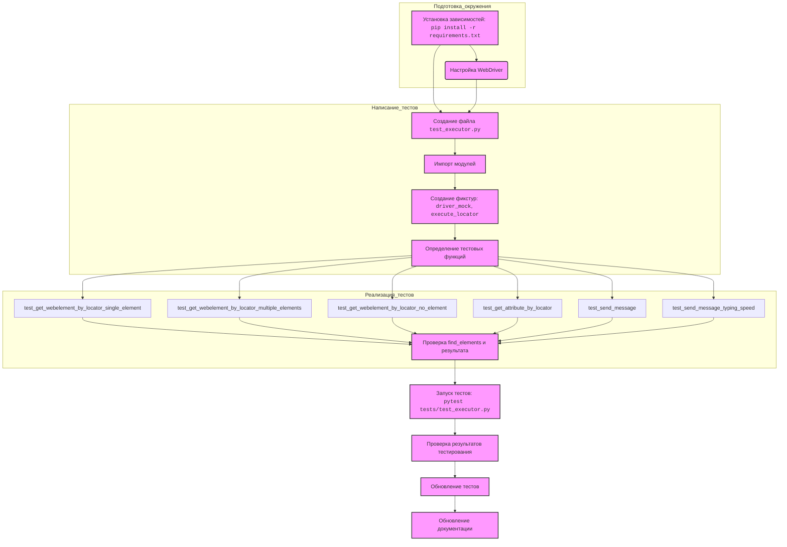

## АНАЛИЗ КОДА: `hypotez/src/webdriver/_pytest/guide_test_executor.md`

### 1. <алгоритм>
   
   **Общий процесс:**
    
   1. **Подготовка окружения:**
      *   **1.1 Установка зависимостей:**
         *   Установка необходимых библиотек через `pip install -r requirements.txt`.
         *   `requirements.txt` содержит зависимости: `pytest==7.4.0` и `selenium==4.16.1`.
      *   **1.2 Настройка WebDriver:**
         *   Убедиться, что установлен WebDriver для браузера (например, ChromeDriver).
   2. **Написание тестов:**
      *   **2.1 Структура тестов:**
         *   Создается файл `test_executor.py` в директории `tests`.
         *   Импортируются необходимые модули: `pytest`, `MagicMock`, `patch`, `WebElement`, `By`, `ExecuteLocator`, `ExecuteLocatorException`.
         *   Создаются фикстуры `driver_mock` (мок-объект WebDriver) и `execute_locator` (экземпляр `ExecuteLocator`).
         *   Определяются функции тестов `test_get_webelement_by_locator_single_element`, `test_get_webelement_by_locator_multiple_elements`, `test_get_webelement_by_locator_no_element`, `test_get_attribute_by_locator`, `test_send_message`, `test_send_message_typing_speed`.
      *   **2.2 Реализация тестов:**
         *   **`test_get_webelement_by_locator_single_element`**:
            *   Создается мок-объект `WebElement`.
            *   Устанавливается возвращаемое значение `driver_mock.find_elements` равным списку с одним мок-объектом.
            *   Создается словарь `locator` с ключами `by` и `selector`.
            *   Вызывается метод `execute_locator.get_webelement_by_locator()` с `locator`.
            *   Проверяется, что `driver_mock.find_elements` вызывается с правильными аргументами (By.XPATH, `selector`).
            *   Проверяется, что результат равен мок-объекту `WebElement`.
         *   **`test_get_webelement_by_locator_multiple_elements`**:
             *   Создается список мок-объектов `WebElement`.
             *   Устанавливается возвращаемое значение `driver_mock.find_elements` равным списку мок-объектов.
             *   Создается словарь `locator` с ключами `by` и `selector`.
             *   Вызывается метод `execute_locator.get_webelement_by_locator()` с `locator`.
             *   Проверяется, что `driver_mock.find_elements` вызывается с правильными аргументами (By.XPATH, `selector`).
             *   Проверяется, что результат равен списку мок-объектов `WebElement`.
         *   **`test_get_webelement_by_locator_no_element`**:
            *   Устанавливается возвращаемое значение `driver_mock.find_elements` пустым списком.
            *   Создается словарь `locator` с ключами `by` и `selector`.
            *   Вызывается метод `execute_locator.get_webelement_by_locator()` с `locator`.
            *   Проверяется, что `driver_mock.find_elements` вызывается с правильными аргументами (By.XPATH, `selector`).
            *   Проверяется, что результат равен `False`.
         *   **`test_get_attribute_by_locator`**:
            *   Создается мок-объект `WebElement`, устанавливается возвращаемое значение `get_attribute` равным `"test_value"`.
            *   Устанавливается возвращаемое значение `driver_mock.find_elements` списком с мок-объектом.
            *   Создается словарь `locator` с ключами `by`, `selector`, `attribute`.
            *   Вызывается метод `execute_locator.get_attribute_by_locator()` с `locator`.
            *   Проверяется, что `driver_mock.find_elements` и `element.get_attribute` вызываются с правильными аргументами.
            *   Проверяется, что результат равен `"test_value"`.
         *  **`test_send_message`**:
             *  Создается мок-объект `WebElement`.
             *  Устанавливается возвращаемое значение `driver_mock.find_elements` списком с мок-объектом.
             *  Создается словарь `locator` с ключами `by`, `selector`.
             *  Вызывается метод `execute_locator.send_message()` с `locator` и сообщением `"Hello World"`.
             *  Проверяется, что `driver_mock.find_elements` и `element.send_keys` вызываются с правильными аргументами.
             *  Проверяется, что результат равен `True`.
         *  **`test_send_message_typing_speed`**:
            *  Создается мок-объект `WebElement`.
            *  Устанавливается возвращаемое значение `driver_mock.find_elements` списком с мок-объектом.
            *  Создается словарь `locator` с ключами `by`, `selector`.
            *  Устанавливается `typing_speed = 0.1`.
            *  С помощью `patch` имитируется `time.sleep`.
            *  Вызывается метод `execute_locator.send_message()` с `locator`, сообщением `"Hello"` и параметром `typing_speed`.
            *  Проверяется, что `driver_mock.find_elements` вызывается с правильными аргументами.
            *  Проверяется, что `element.send_keys` вызывается нужное количество раз (равное длине сообщения).
            *  Проверяется, что `mock_sleep` вызывается с правильным `typing_speed`.
            *  Проверяется, что результат равен `True`.
   3. **Запуск тестов:**
      *   Выполняется команда `pytest tests/test_executor.py`.
   4. **Проверка результатов тестирования:**
      *   Анализируются результаты `pytest` в терминале (Passed/Failed).
   5. **Обновление тестов:**
      *   Тесты обновляются при изменениях в коде `ExecuteLocator`.
   6. **Документация:**
      *   Обновляется документация тестов.
   
### 2. <mermaid>

**Зависимости и пояснения для `mermaid`:**
 
   *   **`Подготовка_окружения`:**
      *  `Установка зависимостей`: Установка библиотек `pytest` и `selenium` из файла `requirements.txt`.
      *  `Настройка WebDriver`: Настройка драйвера браузера для Selenium.
   *   **`Написание_тестов`:**
        *  `Создание файла test_executor.py`: Создание файла с тестами.
        *  `Импорт модулей`: Импорт необходимых модулей, включая `pytest`, `MagicMock`, `WebElement`, `By`, `ExecuteLocator`, `ExecuteLocatorException`.
        *  `Создание фикстур`: Создание мок-объекта `driver_mock` и экземпляра `execute_locator` для тестов.
        *  `Определение тестовых функций`: Объявление функций для каждого теста.
   *   **`Реализация_тестов`:**
      *   `test_get_webelement_by_locator_single_element`, `test_get_webelement_by_locator_multiple_elements`, `test_get_webelement_by_locator_no_element`: Тесты для `get_webelement_by_locator` с различными сценариями.
       *   `test_get_attribute_by_locator`: Тест для `get_attribute_by_locator`.
        * `test_send_message`: Тест для `send_message`.
        *  `test_send_message_typing_speed`: Тест для `send_message` с указанной скоростью печати.
      *  `Проверка find_elements и результата`: Проверка вызова метода `find_elements` у мок-объекта `driver_mock` и сравнение результатов с ожидаемыми.
   *   **`Запуск тестов`:**
      *   Запуск тестов с помощью `pytest`.
   *   **`Проверка результатов тестирования`:**
      *   Анализ результатов тестов (`Passed`/`Failed`).
   *   **`Обновление тестов`:**
        *   Обновление тестов при изменении кода.
   *   **`Обновление документации`:**
         *  Обновление документации по тестам.
   *   Стрелки показывают последовательность действий.

### 3. <объяснение>

#### Импорты:
 
   *   `import pytest`: Библиотека для создания и запуска тестов. Используется для создания фикстур и написания тестовых функций.
   *   `from unittest.mock import MagicMock, patch`: Библиотека для создания мок-объектов и имитации поведения объектов. Используется для мокирования `webdriver` и `time.sleep`.
   *   `from selenium.webdriver.remote.webelement import WebElement`: Класс, представляющий веб-элемент в Selenium. Используется для создания мок-объектов веб-элементов.
   *   `from selenium.webdriver.common.by import By`: Перечисление, определяющее стратегии поиска элементов (например, `By.XPATH`, `By.ID`). Используется при поиске элементов с помощью `find_elements`.
   *   `from src.webdriver.executor import ExecuteLocator`: Импорт класса `ExecuteLocator`, который тестируется.
   *  `from src.logger.exceptions import ExecuteLocatorException`:  Импорт класса пользовательского исключения, который может использоваться внутри `ExecuteLocator`.

#### Классы:
 
   *   **`ExecuteLocator`**:
      *   **Роль**: Класс для взаимодействия с веб-элементами через Selenium WebDriver.
      *   **Атрибуты**: Не показаны в данном фрагменте кода, но предположительно хранит ссылку на экземпляр WebDriver.
      *   **Методы**:
         *   `get_webelement_by_locator(locator)`: Находит и возвращает один или несколько веб-элементов на основе предоставленного локатора. Возвращает `False`, если элемент не найден.
         *   `get_attribute_by_locator(locator)`: Находит элемент по локатору и возвращает значение его атрибута.
         *   `send_message(locator, message, typing_speed, continue_on_error)`: Находит элемент по локатору и отправляет ему сообщение с возможностью задания скорости печати.
      *   **Взаимодействие**: Использует экземпляр WebDriver для поиска элементов и выполнения действий над ними.

#### Функции:
 
   *   `driver_mock()`:
      *   **Аргументы**: Нет.
      *   **Возвращаемое значение**: Мок-объект, имитирующий поведение `webdriver`.
      *   **Назначение**: Создает мок-объект, который используется для имитации работы `webdriver` без запуска реального браузера.
   *   `execute_locator(driver_mock)`:
      *   **Аргументы**: Мок-объект `driver_mock`.
      *   **Возвращаемое значение**: Экземпляр класса `ExecuteLocator`.
      *   **Назначение**: Создает экземпляр `ExecuteLocator`, передавая ему мок-объект `driver_mock` в качестве драйвера.
   *   `test_get_webelement_by_locator_single_element(execute_locator, driver_mock)`:
      *   **Аргументы**: Экземпляр `execute_locator` и мок-объект `driver_mock`.
      *   **Возвращаемое значение**: Нет.
      *   **Назначение**: Проверяет корректное поведение метода `get_webelement_by_locator` при нахождении одного элемента.
   *   `test_get_webelement_by_locator_multiple_elements(execute_locator, driver_mock)`:
        * **Аргументы**: Экземпляр `execute_locator` и мок-объект `driver_mock`.
        * **Возвращаемое значение**: Нет.
        * **Назначение**: Проверяет корректное поведение метода `get_webelement_by_locator` при нахождении нескольких элементов.
   *   `test_get_webelement_by_locator_no_element(execute_locator, driver_mock)`:
      *   **Аргументы**: Экземпляр `execute_locator` и мок-объект `driver_mock`.
      *   **Возвращаемое значение**: Нет.
      *   **Назначение**: Проверяет корректное поведение метода `get_webelement_by_locator`, когда элемент не найден.
   *   `test_get_attribute_by_locator(execute_locator, driver_mock)`:
      *   **Аргументы**: Экземпляр `execute_locator` и мок-объект `driver_mock`.
      *   **Возвращаемое значение**: Нет.
      *   **Назначение**: Проверяет корректное поведение метода `get_attribute_by_locator`.
   *   `test_send_message(execute_locator, driver_mock)`:
      *   **Аргументы**: Экземпляр `execute_locator` и мок-объект `driver_mock`.
      *   **Возвращаемое значение**: Нет.
      *   **Назначение**: Проверяет корректное поведение метода `send_message` при отправке сообщения.
   *   `test_send_message_typing_speed(execute_locator, driver_mock)`:
      *  **Аргументы**: Экземпляр `execute_locator` и мок-объект `driver_mock`.
      *   **Возвращаемое значение**: Нет.
      *   **Назначение**: Проверяет корректное поведение метода `send_message` при отправке сообщения с определенной скоростью печати.

#### Переменные:
 
   *   `locator`: Словарь, описывающий локатор элемента веб-страницы. Содержит ключи `by` (тип локатора, например, `XPATH`) и `selector` (сам локатор, например, `"//div[@id='test']"`). Также может включать ключ `attribute` (имя атрибута).
   *   `element`, `elements`: Мок-объекты, имитирующие веб-элементы (`WebElement`).
   *   `message`: Строка, представляющая сообщение для отправки веб-элементу.
   *   `typing_speed`: Число, задающее скорость печати сообщения в секундах на символ.
   *   `result`: Переменная, хранящая результат выполнения методов `ExecuteLocator`.

#### Потенциальные ошибки и области для улучшения:
 
   *   **Отсутствие реального `webdriver`**: Тесты используют мок-объекты, что позволяет проверять логику `ExecuteLocator`, но не гарантирует его корректную работу с реальным браузером.
   *   **Ограниченный набор тестов**: Тесты охватывают основные сценарии, но могут быть расширены для проверки обработки исключений и других граничных случаев.
   *   **Зависимость от структуры локаторов**:  Тесты предполагают, что структура словаря `locator` всегда имеет поля `by` и `selector`.  Если структура поменяется, тесты сломаются.  Необходимо сделать более гибкую обработку локаторов.
   *   **Отсутствие проверок на некорректные локаторы**: В тестах нет проверок на обработку некорректных локаторов (например, `None` или пустая строка).

#### Взаимосвязь с другими частями проекта:
 
   *  `ExecuteLocator` взаимодействует с `selenium.webdriver` для поиска элементов.  В `src.webdriver.executor`
   *  `ExecuteLocator` использует кастомный класс `ExecuteLocatorException` из `src.logger.exceptions` для генерации исключений.
   *  Тесты находятся в `tests/test_executor.py` и используют `pytest` для запуска.

Этот анализ предоставляет подробное представление о структуре и функционировании тестового кода, а также его взаимосвязях с другими частями проекта.