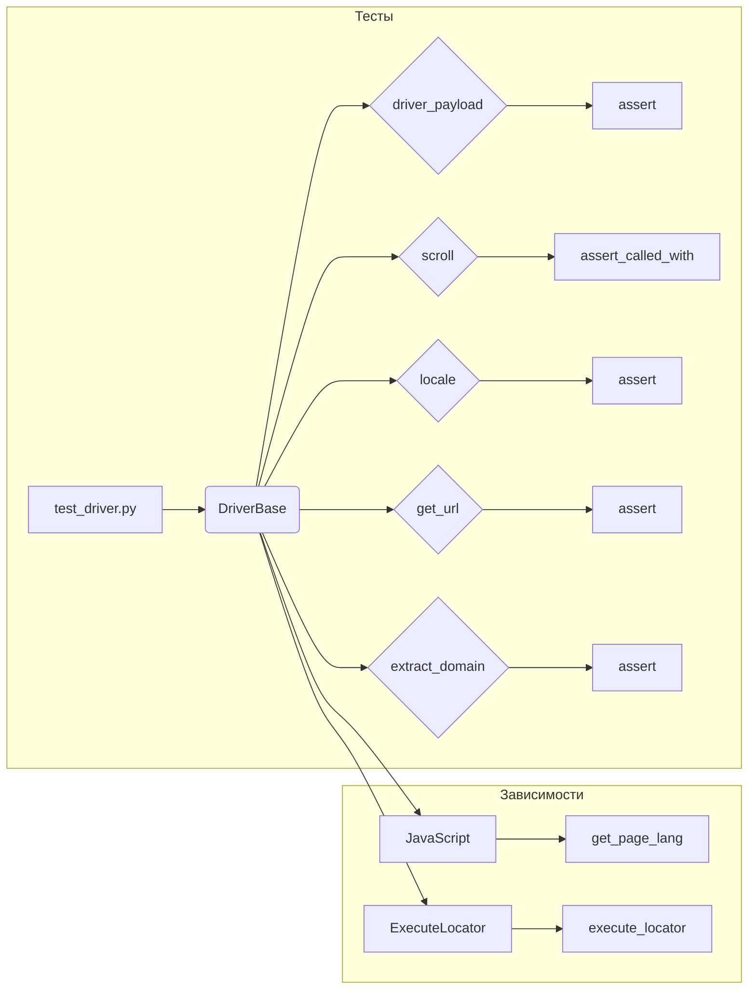

```MD
# <input code>

```python
## \file hypotez/src/webdriver/_pytest/test_driver.py
# -*- coding: utf-8 -*-\n#! venv/Scripts/python.exe
#! venv/bin/python/python3.12
"""
.. module: src.webdriver._pytest 
	:platform: Windows, Unix
	:synopsis:

"""
MODE = 'dev'

"""
	:platform: Windows, Unix
	:synopsis:

"""


"""
	:platform: Windows, Unix
	:synopsis:

"""


"""
  :platform: Windows, Unix

"""
"""
  :platform: Windows, Unix
  :platform: Windows, Unix
  :synopsis:
"""MODE = 'dev'
  
""" module: src.webdriver._pytest """


""" тестовый файл test_driver.py включает тесты для следующих методов класса DriverBase:
- driver_payload
- scroll
- locale
- get_url
- extract_domain
- _save_cookies_localy
- page_refresh
- wait
- delete_driver_logs
Тесты используют pytest и unittest.mock для создания фиктивных объектов и методов, 
чтобы изолировать тестируемый код и избежать взаимодействия с реальными веб-страницами и файлами.
"""

import pytest
from unittest.mock import Mock, patch, PropertyMock
from selenium.common.exceptions import InvalidArgumentException
from src.webdriver.driver import DriverBase
from src.logger import logger

class TestDriverBase:
    @pytest.fixture
    def driver_base(self):
        """Fixture to create an instance of DriverBase for testing."""
        return DriverBase()

    # ... (rest of the code)
```

# <algorithm>

Этот код представляет собой набор тестов для класса `DriverBase` из модуля `src.webdriver.driver`.  Алгоритм работы заключается в следующем:

1. **Создание фикстуры `driver_base`:** В начале каждого теста создается экземпляр `DriverBase` для тестирования.
2. **Мокинг зависимостей:** Используя `unittest.mock`, тесты заменяют реальные объекты (например, `JavaScript`, `ExecuteLocator`) на моки (заглушки). Это изолирует тесты от реальных взаимодействий с браузером и другими компонентами.
3. **Вызов тестируемого метода:** Методы `DriverBase`, такие как `driver_payload`, `scroll`, `locale`, и другие, вызываются с соответствующими аргументами.
4. **Проверка ожидаемого поведения:** Тесты проверяют, что метод вернул ожидаемое значение или вызвал ожидаемые подметоды (например, `execute_script`) с ожидаемыми аргументами. Используются `assert` для проверки результатов.
5. **Проверка моков:** Методы `assert_called_with`, `assert_called_once`, `assert_any_call` и другие используются для проверки того, что моки вызывались ожидаемым образом.


**Пример:** В тесте `test_scroll` создаётся мок `execute_script`. Затем, когда метод `scroll` вызывается,  проверяется, что `execute_script` был вызван с правильными аргументами ('window.scrollBy(0,1000)' или 'window.scrollBy(0,-1000)'),  в зависимости от направления прокрутки.

# <mermaid>



**Объяснение диаграммы:**

* **Тесты (subgraph Тесты):** `test_driver.py` содержит тесты (`test_*`) для методов класса `DriverBase`.
* **Зависимости (subgraph Зависимости):**  `DriverBase` зависит от `JavaScript` и `ExecuteLocator`.  Эти классы, вероятно, определены в `src.webdriver.javascript` и `src.webdriver.executor`.   `get_page_lang` - метод `JavaScript`, `execute_locator` - метод `ExecuteLocator`.
* **Стрелки:** Показывает направление данных и вызовов. Например, `test_scroll` вызывает `scroll` в `DriverBase`, который в свою очередь вызывает `execute_script`.

# <explanation>

* **Импорты:**
    * `pytest`:  Фреймворк для написания и запуска тестов.
    * `unittest.mock`: Модуль для создания моков (заглушек) для тестирования.
    * `selenium.common.exceptions`:  Исключения Selenium, вероятно, используются для обработки ошибок.
    * `src.webdriver.driver`: Модуль, содержащий класс `DriverBase`, который тестируется.
    * `src.logger`: Модуль для логирования, вероятно, используется для записи сообщений о ходе выполнения тестов.
* **Классы:**
    * `TestDriverBase`: Тестовый класс, содержащий методы для тестирования методов `DriverBase`.  Использует фикстуру `driver_base` для создания экземпляров `DriverBase`.
    * `DriverBase`: Базовый класс для управления веб-драйвером, содержит методы для выполнения действий с веб-страницей (например, `driver_payload`, `scroll`, `locale`, `get_url`).
* **Функции:**
    * Тестовые функции (например, `test_driver_payload`, `test_scroll`) содержат утверждения (assert), которые проверяют поведение методов `DriverBase`.
    * Фикстура `driver_base`: Возвращает экземпляр `DriverBase` для каждого теста, что позволяет не создавать его повторно в каждом методе.
    * Методы `DriverBase` (например, `driver_payload`, `scroll`, `locale`) - это методы управления веб-драйвером, которые тестируются.
* **Переменные:**
    * `MODE`: Вероятно, переменная для указания режима работы.
* **Возможные ошибки/улучшения:**

    * Код использует моки (`patch`), что хорошо для изоляции тестов, но может быть трудно отслеживать сложные зависимости.
    * Некоторые тесты (например, `test_save_cookies_localy`) могут быть улучшены, если проверки будут более точными (например, вместо `is True`, использовать проверку на конкретные значения).
    * Отсутствуют пояснения о том, как именно значения передаются между `DriverBase`, `JavaScript` и `ExecuteLocator`.
    * Тестовый код должен быть написан с учетом всех возможных ситуаций.


**Взаимосвязь с другими частями проекта:**

Код взаимодействует с `src.webdriver.javascript` и `src.webdriver.executor`.  Эти модули предоставляют функциональность, необходимую для работы `DriverBase` (например, взаимодействие с JavaScript кодом).  Возможно, существуют и другие зависимости, не затронутые представленным кодом.