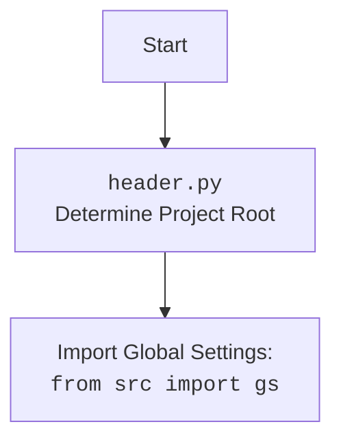

## АНАЛИЗ КОДА: `hypotez/src/webdriver/_pytest/test_driver.py`

### 1. <алгоритм>
1. **Инициализация**:
   - Запускается `pytest`, который находит тесты в файле `test_driver.py`.
   - Определяется класс `TestDriverBase`, содержащий тестовые методы.
   - Создается фикстура `driver_base` для создания экземпляра класса `DriverBase`.

2. **Тест `test_driver_payload`**:
   - Заменяются классы `JavaScript` и `ExecuteLocator` на `Mock` объекты.
   - Вызывается метод `driver_payload`.
   - Проверяется, что атрибуты `DriverBase` (например, `get_page_lang`, `ready_state`) правильно ссылаются на методы `Mock` объектов `JavaScript` и `ExecuteLocator`.
   - **Пример**:
     - `driver_base.get_page_lang` должен вызывать метод `get_page_lang` mock-объекта `JavaScript`.
     - `driver_base.click` должен вызывать метод `click` mock-объекта `ExecuteLocator`.

3. **Тест `test_scroll`**:
   - Заменяются методы `execute_script` и `wait` на `Mock` объекты.
   - Проверяются различные варианты скроллинга (`forward`, `backward`, `both`) путем проверки вызовов `execute_script` с соответствующими параметрами.
   - **Пример**:
     - `driver_base.scroll(3, 1000, 'forward', 0.1)` должен вызвать `driver_base.execute_script('window.scrollBy(0,1000)')`.
     - `driver_base.scroll(3, 1000, 'backward', 0.1)` должен вызвать `driver_base.execute_script('window.scrollBy(0,-1000)')`.

4. **Тест `test_locale`**:
    - Заменяется метод `find_element` на `Mock` объект.
    - Проверяется получение локали из метатега (если он существует), в противном случае используется результат `get_page_lang`.
    - **Пример**:
        - Если `find_element` возвращает `meta_mock` с атрибутом `lang`, то `driver_base.locale` должен вернуть значение этого атрибута.
        - Если `find_element` выбрасывает исключение, то `driver_base.locale` должен вернуть значение `get_page_lang`.

5. **Тест `test_get_url`**:
   - Заменяются методы `get`, `ready_state`, `wait` и `_save_cookies_localy` на `Mock` объекты.
   - Проверяется правильность вызова метода `get` для перехода по URL и сохранения cookies.
   - **Пример**:
     - `driver_base.get_url('http://new.com')` должен вызвать `driver_base.get('http://new.com')`.
     -  Должен сохраниться предыдущий URL в `driver_base.previous_url`

6. **Тест `test_extract_domain`**:
    - Проверяется правильность извлечения домена из различных форматов URL.
    - **Пример**:
       - `driver_base.extract_domain('http://www.example.com/page')`  должен вернуть `example.com`.

7. **Тест `test_save_cookies_localy`**:
   - Заменяются методы `get_cookies`, `builtins.open`, `pickle.dump`, `extract_domain` на `Mock` объекты.
   - Проверяется сохранение cookies в файл с использованием `pickle`.
   - **Пример**:
     - `driver_base._save_cookies_localy('/path/to/cookies')` должен открыть файл для записи, сохранить в него cookies и вызвать pickle.dump.

8. **Тест `test_page_refresh`**:
   - Заменяется метод `get_url` на `Mock` объект.
   - Проверяется вызов `get_url` для обновления страницы.
   - **Пример**:
     - `driver_base.page_refresh()` должен вызвать `driver_base.get_url('http://example.com')`.

9. **Тест `test_wait`**:
   - Заменяется `time.sleep` на `Mock` объект.
   - Проверяется вызов `time.sleep` с корректными параметрами.
   - **Пример**:
      - `driver_base.wait(1)` должен вызвать `mock_sleep(1)`.

10. **Тест `test_delete_driver_logs`**:
    - Заменяются методы `pathlib.Path.iterdir`, `pathlib.Path.is_file`, `pathlib.Path.unlink`, `pathlib.Path.is_dir` на `Mock` объекты.
    - Проверяется удаление файлов из директории логов.
     - **Пример**:
        - `driver_base.delete_driver_logs()`  должен вызвать  `mock_unlink()` для каждого файла в каталоге логов

### 2. <mermaid>

```mermaid
flowchart TD
    Start[Start Test] --> Fixture[driver_base(): DriverBase Instance]
    Fixture --> test_driver_payload
    Fixture --> test_scroll
    Fixture --> test_locale
    Fixture --> test_get_url
    Fixture --> test_extract_domain
    Fixture --> test_save_cookies_localy
    Fixture --> test_page_refresh
    Fixture --> test_wait
    Fixture --> test_delete_driver_logs


    test_driver_payload --> MockJavaScript[Mock JavaScript class]
    test_driver_payload --> MockExecuteLocator[Mock ExecuteLocator class]
    MockJavaScript --> CallDriverPayload[driver_base.driver_payload()]
    MockExecuteLocator --> CallDriverPayload
    CallDriverPayload --> AssertPayload[Assert attribute assignments]
   
    test_scroll --> MockExecuteScript[driver_base.execute_script = Mock()]
    test_scroll --> MockWait[driver_base.wait = Mock()]
    MockExecuteScript --> CallScroll[driver_base.scroll()]
    MockWait --> CallScroll
    CallScroll --> AssertScroll[Assert execute_script calls with forward, backward, both]

    test_locale --> MockFindElement[driver_base.find_element = Mock()]
    MockFindElement --> CallLocale[driver_base.locale]
    CallLocale --> MetaFound[Meta tag found?]
    MetaFound -- Yes --> AssertLocaleMeta[Assert locale from meta tag]
    MetaFound -- No --> MockGetPageLang[driver_base.get_page_lang = Mock()]
    MockGetPageLang --> AssertLocaleLang[Assert locale from get_page_lang]

    test_get_url --> MockGet[driver_base.get = Mock()]
    test_get_url --> MockReadyState[driver_base.ready_state = Mock()]
    test_get_url --> MockWait[driver_base.wait = Mock()]
    test_get_url --> MockSaveCookiesLocaly[driver_base._save_cookies_localy = Mock()]
    MockGet --> CallGetUrl[driver_base.get_url()]
    MockReadyState --> CallGetUrl
    MockWait --> CallGetUrl
    MockSaveCookiesLocaly --> CallGetUrl
    CallGetUrl --> AssertGetUrl[Assert get and _save_cookies_localy calls]

   test_extract_domain --> CallExtractDomain[driver_base.extract_domain()]
   CallExtractDomain --> AssertExtractDomain[Assert domain extraction]

   test_save_cookies_localy --> MockGetCookies[driver_base.get_cookies = Mock()]
   test_save_cookies_localy --> MockOpen[patch(builtins.open)]
   test_save_cookies_localy --> MockPickleDump[patch(pickle.dump)]
   test_save_cookies_localy --> MockExtractDomain[driver_base.extract_domain = Mock()]
   MockGetCookies --> CallSaveCookies[driver_base._save_cookies_localy()]
   MockOpen --> CallSaveCookies
   MockPickleDump --> CallSaveCookies
    MockExtractDomain --> CallSaveCookies
   CallSaveCookies --> AssertSaveCookies[Assert open and pickle.dump calls]

   test_page_refresh --> MockGetUrlRefresh[driver_base.get_url = Mock()]
   MockGetUrlRefresh --> CallPageRefresh[driver_base.page_refresh()]
   CallPageRefresh --> AssertPageRefresh[Assert get_url call with current url]

   test_wait --> MockSleep[patch(time.sleep)]
    MockSleep --> CallWait[driver_base.wait()]
    CallWait --> AssertWait[Assert time.sleep call]

   test_delete_driver_logs --> MockIterdir[patch(pathlib.Path.iterdir)]
    test_delete_driver_logs --> MockIsFile[patch(pathlib.Path.is_file)]
   test_delete_driver_logs --> MockUnlink[patch(pathlib.Path.unlink)]
    test_delete_driver_logs --> MockIsDir[patch(pathlib.Path.is_dir)]
   MockIterdir --> CallDeleteLogs[driver_base.delete_driver_logs()]
    MockIsFile --> CallDeleteLogs
    MockUnlink --> CallDeleteLogs
    MockIsDir --> CallDeleteLogs
    CallDeleteLogs --> AssertDeleteLogs[Assert unlink calls]

    classDef classStyle fill:#f9f,stroke:#333,stroke-width:2px
    class TestDriverBase classStyle
    classDef mockStyle fill:#ccf,stroke:#333,stroke-width:2px
    class MockJavaScript,MockExecuteLocator,MockExecuteScript,MockWait,MockFindElement,MockGetPageLang,MockGet,MockReadyState,MockSaveCookiesLocaly,MockGetCookies,MockOpen,MockPickleDump,MockExtractDomain,MockGetUrlRefresh,MockSleep,MockIterdir,MockIsFile,MockUnlink,MockIsDir mockStyle

    classDef funcStyle fill:#afa,stroke:#333,stroke-width:2px
    class CallDriverPayload,CallScroll,CallLocale,CallGetUrl,CallExtractDomain,CallSaveCookies,CallPageRefresh,CallWait,CallDeleteLogs funcStyle
    
    classDef assertStyle fill:#aaf,stroke:#333,stroke-width:2px
    class AssertPayload,AssertScroll,AssertLocaleMeta,AssertLocaleLang,AssertGetUrl,AssertExtractDomain,AssertSaveCookies,AssertPageRefresh,AssertWait,AssertDeleteLogs assertStyle
```


### 3. <объяснение>
**Импорты:**
- `pytest`: Фреймворк для тестирования на Python. Используется для организации и запуска тестов.
- `unittest.mock`: Библиотека для создания мок-объектов (заглушек), позволяющих изолировать тестируемый код от зависимостей.
   - `Mock`: Используется для замены классов и функций.
    - `patch`: Используется как декоратор или менеджер контекста для подмены (патчинга) объектов.
    - `PropertyMock`: Используется для создания mock-объектов для свойств.
- `selenium.common.exceptions.InvalidArgumentException`: Исключение, связанное с ошибками в аргументах Selenium. В данном коде не используется, но импортируется.
- `src.webdriver.driver.DriverBase`: Класс, который тестируется в этом файле. Содержит методы для взаимодействия с браузером.
- `src.logger.logger.logger`:  Объект логгера для записи сообщений.

**Классы:**
- `TestDriverBase`: Класс, содержащий тестовые методы для `DriverBase`.
    - `@pytest.fixture def driver_base()`: Фикстура, которая создает экземпляр `DriverBase` перед каждым тестом.
        - Используется для установки начального состояния среды тестирования.
        - Возвращает `DriverBase()`.
    - Методы `test_*`: Тестовые методы, каждый из которых тестирует один из методов `DriverBase`.
        - Используют `unittest.mock.patch` для замены зависимостей mock-объектами.
        - Используют `assert` для проверки правильности работы методов.

**Функции:**
- `test_driver_payload(driver_base)`:
   - Аргументы: экземпляр `DriverBase` (предоставляется фикстурой `driver_base`).
   - Назначение: Тестирует метод `driver_payload`, который устанавливает ссылки на методы JavaScript и ExecuteLocator.
   - Пример:
       ```python
       with patch('src.webdriver.javascript.js.JavaScript') as mock_js, patch('src.webdriver.executor.ExecuteLocator') as mock_execute_locator:
          # ...
          driver_base.driver_payload()
          assert driver_base.get_page_lang == mock_js_instance.get_page_lang
       ```
- `test_scroll(driver_base)`:
   - Аргументы: экземпляр `DriverBase` (предоставляется фикстурой `driver_base`).
   - Назначение: Тестирует метод `scroll`, который выполняет скроллинг веб-страницы.
   - Пример:
       ```python
       driver_base.scroll(3, 1000, 'forward', 0.1)
       driver_base.execute_script.assert_called_with('window.scrollBy(0,1000)')
       ```
- `test_locale(driver_base)`:
   - Аргументы: экземпляр `DriverBase` (предоставляется фикстурой `driver_base`).
   - Назначение: Тестирует свойство `locale`, которое возвращает локаль веб-страницы.
   - Пример:
       ```python
       meta_mock = Mock()
       meta_mock.get_attribute.return_value = 'en'
       driver_base.find_element.return_value = meta_mock
       assert driver_base.locale == 'en'
       ```
- `test_get_url(driver_base)`:
   - Аргументы: экземпляр `DriverBase` (предоставляется фикстурой `driver_base`).
   - Назначение: Тестирует метод `get_url`, который открывает URL в браузере.
   - Пример:
       ```python
       driver_base.get_url('http://new.com')
       driver_base.get.assert_called_with('http://new.com')
       ```
- `test_extract_domain(driver_base)`:
   - Аргументы: экземпляр `DriverBase` (предоставляется фикстурой `driver_base`).
   - Назначение: Тестирует метод `extract_domain`, который извлекает домен из URL.
   - Пример:
      ```python
       assert driver_base.extract_domain('http://www.example.com/page') == 'example.com'
      ```
- `test_save_cookies_localy(driver_base)`:
   - Аргументы: экземпляр `DriverBase` (предоставляется фикстурой `driver_base`).
   - Назначение: Тестирует метод `_save_cookies_localy`, который сохраняет cookies в файл.
   - Пример:
       ```python
       with patch('builtins.open', unittest.mock.mock_open()) as mock_open, patch('pickle.dump') as mock_pickle_dump:
            # ...
            driver_base._save_cookies_localy(to_file)
            mock_open.assert_called_once_with(to_file, 'wb')
            mock_pickle_dump.assert_called_once_with({'key': 'value'}, mock_open())
       ```
- `test_page_refresh(driver_base)`:
    - Аргументы: экземпляр `DriverBase` (предоставляется фикстурой `driver_base`).
   - Назначение: Тестирует метод `page_refresh`, который обновляет страницу в браузере.
   - Пример:
       ```python
        driver_base.page_refresh()
        driver_base.get_url.assert_called_with('http://example.com')
        ```
- `test_wait(driver_base)`:
   - Аргументы: экземпляр `DriverBase` (предоставляется фикстурой `driver_base`).
   - Назначение: Тестирует метод `wait`, который приостанавливает выполнение на заданное время.
   - Пример:
       ```python
       driver_base.wait(1)
       mock_sleep.assert_called_with(1)
       ```
- `test_delete_driver_logs(driver_base)`:
  - Аргументы: экземпляр `DriverBase` (предоставляется фикстурой `driver_base`).
   - Назначение: Тестирует метод `delete_driver_logs`, который удаляет файлы логов.
   - Пример:
       ```python
       with patch('pathlib.Path.iterdir') as mock_iterdir, patch('pathlib.Path.is_file', return_value=True), patch('pathlib.Path.unlink') as mock_unlink:
           # ...
           driver_base.delete_driver_logs()
           mock_unlink.assert_any_call()
       ```

**Переменные:**
- `MODE = 'dev'`: Константа, определяющая режим работы (разработка).
- `driver_base`: Экземпляр класса `DriverBase`, используется во всех тестах.
- `mock_js_instance`, `mock_execute_locator_instance`, `meta_mock`: Экземпляры mock-объектов.
-  `to_file`:  `Path` object представляющий путь до файла с cookies.
- `temp_dir`: `Path` object представляющий путь до директории с логами.
- `gs.dir_logs`, `gs.dir_cookies`: Переменные, определяющие путь до директории логов и кукис.

**Потенциальные ошибки и области для улучшения:**
- **Жестко закодированные пути**: В тестах `test_save_cookies_localy` и `test_delete_driver_logs` используются жестко закодированные пути к файлам и директориям (например, `/path/to/cookies`, `/tmp/webdriver`). Это может вызвать проблемы, если тесты запускаются в разных средах.
- **Использование глобальных переменных `gs`**: Использование глобального объекта `gs` не является лучшей практикой, поскольку может вызвать непредсказуемое поведение и усложняет отслеживание зависимостей.
- **Отсутствие проверки типов:** В коде не проверяются типы аргументов, передаваемых в методы, что может приводить к ошибкам в рантайме.
- **Управление ресурсами**: В коде не всегда явно вызывается закрытие открытых файлов, что может привести к утечке ресурсов.

**Цепочка взаимосвязей:**
- Данный модуль `test_driver.py` тестирует функциональность класса `DriverBase`, который является частью модуля `src.webdriver.driver`.
- `DriverBase` в свою очередь использует модули `src.webdriver.javascript.js` и `src.webdriver.executor.ExecuteLocator`.
-  Также используется `src.logger.logger` для логирования событий.
- Файл зависит от модуля `header.py`, который определяет корень проекта и загружает глобальные настройки.

В целом, код представляет собой набор unit-тестов для класса `DriverBase`, использующего моки для изоляции тестируемой логики.