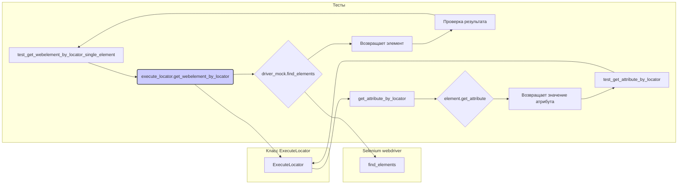

```MD
# <input code>

```python
## \file hypotez/src/webdriver/_pytest/test_executor.py
# -*- coding: utf-8 -*-\n#! venv/Scripts/python.exe
#! venv/bin/python/python3.12
"""
.. module: src.webdriver._pytest 
	:platform: Windows, Unix
	:synopsis:

"""
MODE = 'dev'

"""
	:platform: Windows, Unix
	:synopsis:

"""

"""
	:platform: Windows, Unix
	:synopsis:

"""


"""
  :platform: Windows, Unix

"""
"""
  :platform: Windows, Unix
  :platform: Windows, Unix
  :synopsis:
"""MODE = 'dev'
  
""" module: src.webdriver._pytest """


""" Фикстуры:
driver_mock: создает фиктивный объект веб-драйвера.
execute_locator: создает экземпляр класса ExecuteLocator с фиктивным веб-драйвером.
#Тесты:
 - test_get_webelement_by_locator_single_element: Проверяет получение одного элемента.
 - test_get_webelement_by_locator_multiple_elements: Проверяет получение нескольких элементов.
 - test_get_webelement_by_locator_no_element: Проверяет случай, когда элемент не найден.
 - test_get_attribute_by_locator: Проверяет получение атрибута элемента.
 - test_send_message: Проверяет отправку сообщения элементу.
 - test_send_message_typing_speed: Проверяет отправку сообщения элементу с задержкой между символами.
"""

import pytest
from unittest.mock import MagicMock, patch, create_autospec
from selenium.webdriver.remote.webelement import WebElement
from selenium.webdriver.common.by import By
from selenium.webdriver.common.action_chains import ActionChains
from selenium.common.exceptions import NoSuchElementException, TimeoutException

from src.webdriver.executor import ExecuteLocator
from src.logger.exceptions import ExecuteLocatorException

@pytest.fixture
def driver_mock():
    return MagicMock()

@pytest.fixture
def execute_locator(driver_mock):
    return ExecuteLocator(driver_mock)

# ... (rest of the code)
```

# <algorithm>

Этот код содержит тесты для класса `ExecuteLocator`. Алгоритм работы тестов заключается в проверке методов класса `ExecuteLocator` с использованием фикстур для имитации веб-драйвера.

**Пример test_get_webelement_by_locator_single_element:**

1. Создается фиктивный объект `driver_mock`.
2. Создается фиктивный элемент `element`.
3. Методу `driver_mock.find_elements` задается значение, возвращающее список с одним элементом `element`.
4. Создается локатор `locator`.
5. Вызывается метод `execute_locator.get_webelement_by_locator(locator)`.
6. Проверяется, что `driver_mock.find_elements` был вызван один раз с правильным локатором.
7. Проверяется, что возвращаемое значение соответствует ожидаемому элементу.


**Взаимодействие между функциями/классами:**

Тесты вызывают методы класса `ExecuteLocator`, который взаимодействует с `driver_mock`.  Тесты проверяют правильность поведения `ExecuteLocator` на основе действий `driver_mock`.  Данные (локатороы, сообщения) передаются в функции в качестве аргументов.


# <mermaid>



**Объяснение диаграммы:**

Диаграмма показывает взаимодействие тестов с классом `ExecuteLocator` и имитируемым веб-драйвером. Тесты вызывают методы `ExecuteLocator`, которые, в свою очередь, взаимодействуют с методами веб-драйвера (например, `find_elements`, `send_keys`).


# <explanation>

**Импорты:**

- `pytest`:  Фреймворк для написания тестов.
- `unittest.mock`: Модуль для создания моков (фиктивных объектов). Используется для имитации веб-драйвера и других объектов.
- `selenium.webdriver.remote.webelement`: Модуль Selenium, содержащий определение класса `WebElement`.
- `selenium.webdriver.common.by`: Модуль Selenium, содержащий константы для типов локаторов (By.XPATH, etc.).
- `selenium.webdriver.common.action_chains`: Модуль Selenium, необходимый для работы с действиями над элементами.
- `selenium.common.exceptions`: Модуль Selenium, содержащий определения исключений, которые могут возникнуть во время работы с веб-драйвером.
- `src.webdriver.executor`:  Этот импорт указывает на класс `ExecuteLocator`, который находится в папке `src/webdriver/executor.py` и содержит функциональность для работы с веб-элементами.
- `src.logger.exceptions`: Модуль, содержащий классы исключений, вероятно, для логирования ошибок.


**Классы:**

- `ExecuteLocator`:  Этот класс отвечает за взаимодействие с веб-драйвером для получения элементов, атрибутов и отправки сообщений.
- `MagicMock`:  Моки, создаваемые с помощью `MagicMock`, позволяют имитировать объекты, не нуждаясь в их фактической реализации.


**Функции:**

Функции `test_*` - это юнит-тесты, проверяющие различные сценарии работы с `ExecuteLocator`. Они принимают в качестве аргументов фикстуры `driver_mock` и `execute_locator`, обеспечивая тестируемый объект с имитацией веб-драйвера.  Функции проверяют правильность вызовов методов  `driver_mock` и корректность возвращаемых значений.


**Переменные:**

- `MODE`: Переменная, скорее всего, для определения режима работы (например, 'dev', 'prod').
- `locator`, `message`, `typing_speed`, `continue_on_error`: Переменные, используемые в тестах для передачи параметров в методы `ExecuteLocator`.

**Возможные ошибки и улучшения:**

- Код демонстрирует хорошее использование фикстур, что позволяет писать чистые тесты.
- Отсутствует обработка исключений `NoSuchElementException` или `TimeoutException`, что может привести к сбою тестов.
- Дополнительные проверки на корректность входных данных в методах `ExecuteLocator` (например, проверка типов) могли бы повысить надёжность.
- Неочевидно, как класс `ExecuteLocator` взаимодействует с логгером, и каким образом обрабатываются ошибки во время выполнения.


**Взаимосвязи с другими частями проекта:**

- `ExecuteLocator` зависит от `webdriver` (Selenium),  это видно из импортов.
- `ExecuteLocator` взаимодействует с логированием (в `src.logger.exceptions`, хотя это пока не реализовано).
-  Есть зависимость от `src.webdriver`, скорее всего `webdriver.executor`.

В целом, код написан с использованием современных подходов для тестирования и демонстрирует понимание принципов TDD (Test-driven development).