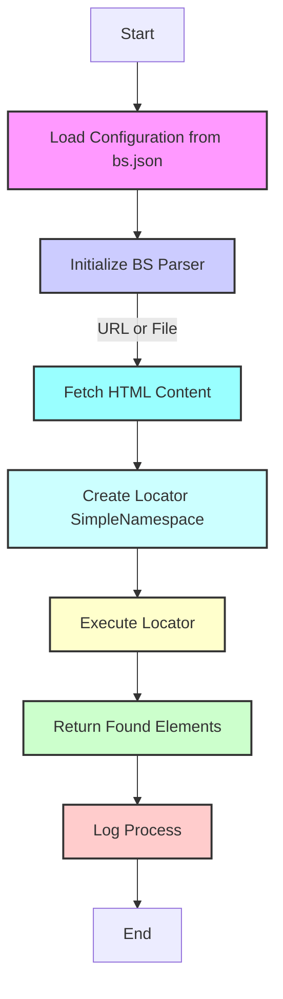

## АНАЛИЗ КОДА: src/webdriver/bs/README.MD

### 1. <алгоритм>

**Обзор модуля `bs`:**

Модуль `bs` предназначен для парсинга HTML-контента с использованием `BeautifulSoup` и `XPath`. Он позволяет загружать HTML-контент как из локальных файлов, так и из веб-адресов, настраивать локаторы для извлечения элементов, вести логирование и обрабатывать ошибки.

**Блок-схема:**

1. **Инициализация:**
    *   Модуль импортируется и инициализируется с параметрами из `bs.json` или заданными пользователем.

        *   *Пример:* `parser = BS(url="https://example.com")`
2.  **Получение HTML-контента:**
    *   Функция `get_url()` получает HTML-содержимое из указанного URL или файла.

        *   *Пример (URL):* `parser.get_url("https://example.com")`
        *   *Пример (File):* `parser.get_url("file://path/to/file.html")`
3.  **Настройка локатора:**
    *   Создается объект локатора `SimpleNamespace` из настроек (по умолчанию или пользовательские).

        *   *Пример:* `locator = SimpleNamespace(by="ID", attribute="element_id", selector='//*[@id="element_id"]')`
4.  **Выполнение локатора:**
    *   Метод `execute_locator(locator)` использует `BeautifulSoup` и `XPath` для извлечения элементов по заданному локатору.

        *   *Пример:* `elements = parser.execute_locator(locator)`
5.  **Возврат результата:**
    *   Возвращаются найденные элементы.
6.  **Логирование:**
    *   Все действия, ошибки и предупреждения логируются с использованием `src.logger`.

        *   *Пример (лог ошибки):* `Error initializing BS parser: <error details>`

**Поток данных:**
```
Начало --> Загрузка_настроек[Загрузка настроек из bs.json]
Загрузка_настроек --> Инициализация_BS[Инициализация BS]
Инициализация_BS -- URL или файл --> Получение_HTML[Получение HTML контента]
Получение_HTML --> Создание_локатора[Создание локатора SimpleNamespace]
Создание_локатора --> Выполнение_локатора[Выполнение локатора]
Выполнение_локатора --> Возврат_элементов[Возврат найденных элементов]
Возврат_элементов --> Логирование[Логирование процесса]
Логирование --> Конец
```

### 2. <mermaid>


**Зависимости `mermaid` диаграммы:**

Данная диаграмма не использует внешних зависимостей. Она описывает поток выполнения модуля `BS`, используя  управляющие конструкции `mermaid`. Имена переменных в диаграмме осмысленные:
- `LoadConfig` - загрузка конфигурации из файла `bs.json`.
- `BSInitialization` - инициализация парсера `BS`.
- `FetchHTMLContent` - получение HTML-контента.
- `CreateLocator` - создание объекта локатора для поиска элементов.
- `ExecuteLocator` - выполнение локатора для поиска элементов в HTML.
- `ReturnElements` - возврат найденных элементов.
- `Logging` - логирование процесса.

### 3. <объяснение>

**Импорты:**

*   `from src.webdriver.bs import BS`: Импортирует класс `BS` из текущего модуля.
*   `from types import SimpleNamespace`: Импортирует класс `SimpleNamespace` для создания объектов с атрибутами.
*   `from src.utils.jjson import j_loads_ns`: Импортирует функцию `j_loads_ns` для загрузки настроек из JSON файла.
*   `from pathlib import Path`: Импортирует класс `Path` для работы с путями к файлам.

    *   `src.webdriver.bs`:  Модуль `bs` является частью пакета `webdriver`, который предназначен для взаимодействия с веб-страницами.
    *   `src.utils.jjson`:  Пакет `jjson` содержит функции для работы с JSON файлами, включая загрузку настроек.
    *   `pathlib`: Стандартная библиотека для работы с файловыми путями.

**Классы:**
*  `BS`: Класс, реализующий основной функционал парсинга HTML.
    *  Атрибуты:
        -   `url` (str): URL или путь к файлу.
        -   `html` (str): HTML содержимое.
        -   `bs_object` (BeautifulSoup): Объект `BeautifulSoup` для парсинга.
        -   `logger` (Logger):  Объект `Logger` для ведения логов.
        -   `settings` (SimpleNamespace): Настройки из `bs.json`.
    *   Методы:
        -   `__init__(self, url=None, settings=None)`: Инициализация объекта `BS` с настройками и URL.
        -   `get_url(self, url)`: Получение HTML-содержимого из файла или URL.
        -   `execute_locator(self, locator)`: Выполнение XPath-локатора и извлечение элементов.
        -   `_parse_html(self, content)`: Парсинг HTML контента с помощью `BeautifulSoup`.

**Функции:**
- `j_loads_ns(settings_path)`: Загружает настройки из JSON файла и возвращает их в виде `SimpleNamespace`.
    *   Аргументы:
        *   `settings_path` (Path): Путь к файлу `bs.json`.
    *   Возвращает:
        *   `SimpleNamespace`: Объект с настройками.
    *   Назначение: Чтение настроек из файла `bs.json` для дальнейшей конфигурации парсера.

**Переменные:**
*  `settings_path` (Path): Путь к файлу `bs.json`.
*  `settings` (SimpleNamespace): Настройки парсера из файла `bs.json`.
*  `parser` (BS): Экземпляр класса `BS` для парсинга HTML.
*  `locator` (SimpleNamespace):  Объект с настройками локатора.
*  `elements` (list): Результат выполнения локатора.

**Потенциальные ошибки и области для улучшения:**
*   **Обработка исключений**: Более детальная обработка исключений при загрузке URL и файлов, а также при работе с `BeautifulSoup`.
*   **Валидация настроек**:  Добавление валидации настроек из `bs.json`, чтобы избежать ошибок при инициализации.
*   **Поддержка различных типов локаторов**: Расширение функционала `execute_locator` для поддержки не только XPath, но и CSS-селекторов.
*   **Кэширование HTML**: Возможно добавление кэширования HTML-контента для ускорения повторных запросов.

**Взаимосвязь с другими частями проекта:**
*   **src.logger**: `BS` использует `logger` из `src.logger` для логирования событий.
*   **src.utils.jjson**:  Используется для загрузки настроек из файла `bs.json`.
*   **src.webdriver**:  Модуль `bs` является частью пакета `webdriver`, что позволяет интегрировать его в более широкий фреймворк для веб-тестирования.

Этот анализ обеспечивает всестороннее понимание функциональности и структуры кода модуля `bs`.