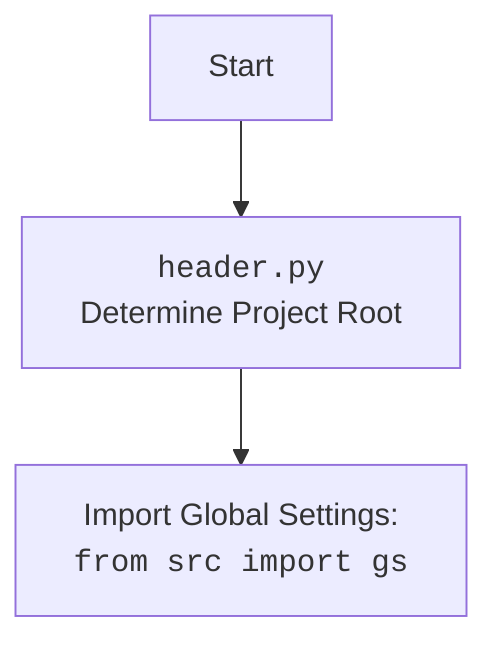

## Анализ кода `src/webdriver/bs/README.MD`

### 1. **<алгоритм>**

Данный документ `README.md` описывает модуль `src.webdriver.bs`, предназначенный для парсинга HTML-контента с использованием BeautifulSoup и XPath. Вот пошаговый алгоритм работы с этим модулем:

1.  **Инициализация:**
    *   Импортируется класс `BS` из модуля `src.webdriver.bs`.
    *   Импортируются необходимые модули, такие как `SimpleNamespace` для создания объектов с атрибутами и `j_loads_ns` для загрузки настроек из JSON файла.
    *   Загружаются настройки из файла `bs.json` с помощью функции `j_loads_ns`.
        *   Пример: `settings = j_loads_ns(Path('path/to/bs.json'))`
    *   Создается экземпляр класса `BS`, передавая URL из настроек.
        *   Пример: `parser = BS(url=settings.default_url)`
2.  **Загрузка HTML контента:**
    *   Метод `get_url` класса `BS` используется для загрузки HTML-контента.
        *   Если URL не указан при инициализации, метод `get_url` может быть вызван с URL в качестве аргумента.
        *   URL может быть как URL веб-страницы, так и путь к локальному файлу.
            *   Пример: `parser.get_url('https://example.com')` или `parser.get_url('file://path/to/your/file.html')`.
    *   Метод `get_url` обрабатывает URL, делает запрос (если это веб-URL) и сохраняет полученный HTML.
3.  **Подготовка локатора:**
    *   Локатор создается как `SimpleNamespace` с полями `by`, `attribute`, `selector` из `bs.json`.
        *   Пример: `locator = SimpleNamespace(**settings.default_locator)` или `locator = SimpleNamespace(by='ID', attribute='element_id', selector='//*[@id="element_id"]')`.
    *   `by`: Тип локатора (например, `ID`, `CSS`, `TEXT`).
    *   `attribute`: Атрибут для поиска (например, `element_id`).
    *   `selector`: XPath-селектор для извлечения элемента.
4.  **Извлечение элементов:**
    *   Метод `execute_locator` класса `BS` принимает объект локатора.
        *   Метод применяет XPath-селектор к загруженному HTML и возвращает список найденных элементов.
        *   Пример: `elements = parser.execute_locator(locator)`
5.  **Вывод результатов:**
    *   Найденные элементы выводятся в консоль.
        *   Пример: `print(elements)`
6.  **Логирование:**
    *   Во время инициализации, загрузки HTML, поиска элементов и обработки исключений все действия логируются с помощью модуля `src.logger`.
    *   Уровень логирования и файл лога определены в `bs.json`.

### 2. **<mermaid>**

```mermaid
flowchart TD
    subgraph BS Module
        Start --> LoadConfig[Load bs.json Configuration]
        LoadConfig --> BSInit[Initialize BS Parser]
        BSInit --> GetURL[Fetch HTML Content: <br> <code>parser.get_url()</code>]
        GetURL --> ParseHTML[Parse HTML with BeautifulSoup]
        ParseHTML --> CreateLocator[Create Locator <br> <code>SimpleNamespace</code>]
        CreateLocator --> ExecuteLocator[Execute XPath Locator <br><code>parser.execute_locator(locator)</code>]
        ExecuteLocator --> ExtractElements[Extract Elements]
        ExtractElements --> LogResults[Log Results]
        LogResults --> Output[Output Elements]
        Output --> End
    end
    
    Start --> ConfigPath[Define config path: <code>settings_path = Path("path/to/bs.json")</code>]
    ConfigPath --> LoadConfig
    
    style Start fill:#f9f,stroke:#333,stroke-width:2px
    style End fill:#ccf,stroke:#333,stroke-width:2px
    
    
    
```

**Описание зависимостей в диаграмме:**

*   **Start:** Начало процесса.
*   **LoadConfig:** Загрузка конфигурации из файла `bs.json`. Используется функция `j_loads_ns` из `src.utils.jjson`.
*    **ConfigPath:** Определение пути к файлу конфигурации `bs.json` с помощью `pathlib.Path`.
*   **BSInit:** Инициализация парсера `BS` с загруженной конфигурацией или URL.
*   **GetURL:** Получение HTML-контента из URL или файла с использованием метода `get_url` класса `BS`. Использует `requests` для запроса веб-страниц.
*   **ParseHTML:** Парсинг HTML с помощью `BeautifulSoup` для подготовки к XPath.
*   **CreateLocator:** Создание объекта локатора `SimpleNamespace` из конфигурации `bs.json`.
*   **ExecuteLocator:** Выполнение XPath-запроса к HTML с помощью `execute_locator`.
*   **ExtractElements:** Извлечение элементов, соответствующих локатору.
*  **LogResults**: Логирование результатов и возможных ошибок. Использует `src.logger`.
*   **Output:** Вывод найденных элементов.
*   **End:** Завершение процесса.


### 3. **<объяснение>**

**Импорты:**

*   `src.webdriver.bs`: Это основной модуль, который описывается в данном файле `README.md`.
*   `types.SimpleNamespace`: Используется для создания простых объектов, у которых можно устанавливать произвольные атрибуты. Удобно для хранения конфигурационных данных.
*   `src.utils.jjson.j_loads_ns`: Функция для загрузки JSON-файла и преобразования его содержимого в объект `SimpleNamespace`. Используется для загрузки конфигурации `bs.json`.
*   `pathlib.Path`: Используется для работы с путями к файлам, в данном случае, для указания пути к файлу конфигурации.

**Конфигурация (bs.json):**

*   **default\_url**: URL по умолчанию, который используется, если URL не передан явно при инициализации `BS`.
*   **default\_file\_path**: Путь к файлу HTML по умолчанию, если не указан URL и не передан файл.
*   **default\_locator**: Объект, содержащий данные для локатора по умолчанию.
    *   **by**: Тип локатора (`ID`, `CSS`, `TEXT`).
    *   **attribute**: Атрибут для поиска.
    *   **selector**: XPath-выражение для поиска.
*   **logging**: Параметры логирования.
    *   **level**: Уровень логирования (`INFO`, `DEBUG`, `ERROR`).
    *   **file**: Путь к файлу лога.
*   **proxy**: Настройки прокси-сервера.
    *   **enabled**: `true` или `false`.
    *   **server**: Адрес прокси-сервера.
    *   **username**: Имя пользователя для аутентификации.
    *   **password**: Пароль для аутентификации.
*   **timeout**: Тайм-аут для запросов, в секундах.
*   **encoding**: Кодировка для чтения файлов и запросов.

**Класс `BS`:**

*   Этот класс является основным компонентом модуля.
*   `__init__`: Конструктор класса, принимает URL или путь к файлу, который будет использоваться по умолчанию.
*   `get_url`: Метод для загрузки HTML-контента из URL или файла.
*   `execute_locator`: Метод для выполнения XPath-запроса и извлечения элементов.
*   Внутри класса `BS` используется `BeautifulSoup` для парсинга HTML, и `lxml` для поддержки XPath.

**Функции:**

*   `j_loads_ns`: Функция для загрузки JSON файла и преобразования его содержимого в объект SimpleNamespace.

**Переменные:**

*   `settings_path`: `pathlib.Path` объект, содержащий путь к файлу конфигурации `bs.json`.
*   `settings`: Объект `SimpleNamespace` с настройками, загруженными из файла `bs.json`.
*   `parser`: Экземпляр класса `BS`.
*   `locator`: Объект `SimpleNamespace`, определяющий способ поиска элементов.
*    `elements`: Список найденных элементов.

**Взаимосвязи с другими частями проекта:**

*   `src.utils.jjson`: Используется для загрузки настроек из JSON-файла.
*   `src.logger`: Используется для логирования событий и ошибок.
*   `requests`: Используется для выполнения HTTP-запросов, если в качестве источника используется веб-страница.

**Возможные ошибки и улучшения:**

*   **Обработка ошибок**: Добавить более детальную обработку ошибок при запросах, парсинге и выполнении XPath, а также добавить возможность изменять политику обработки ошибок.
*   **Валидация конфигурации:** Добавить валидацию данных, загруженных из `bs.json`, для предотвращения неожиданного поведения.
*   **Кэширование**: Добавить механизм кэширования загруженных HTML, чтобы избежать повторных запросов.
*   **Расширение локаторов**: Поддержка CSS-селекторов, помимо XPath.
*   **Улучшенная документация**: Более подробное описание каждого метода класса `BS`, включая примеры и возможные исключения.
*    **Обновление зависимостей**: Необходима проверка и обновление зависимостей, в частности `BeautifulSoup4`, `lxml` и `requests`.

**Дополнительные замечания:**

*   Модуль `BS` спроектирован для облегчения парсинга HTML, предоставляя удобный интерфейс для получения HTML-контента и извлечения данных по XPath-селекторам.
*   Использование `SimpleNamespace` упрощает работу с конфигурацией.
*   Использование `src.logger` обеспечивает централизованное логирование всех действий модуля.