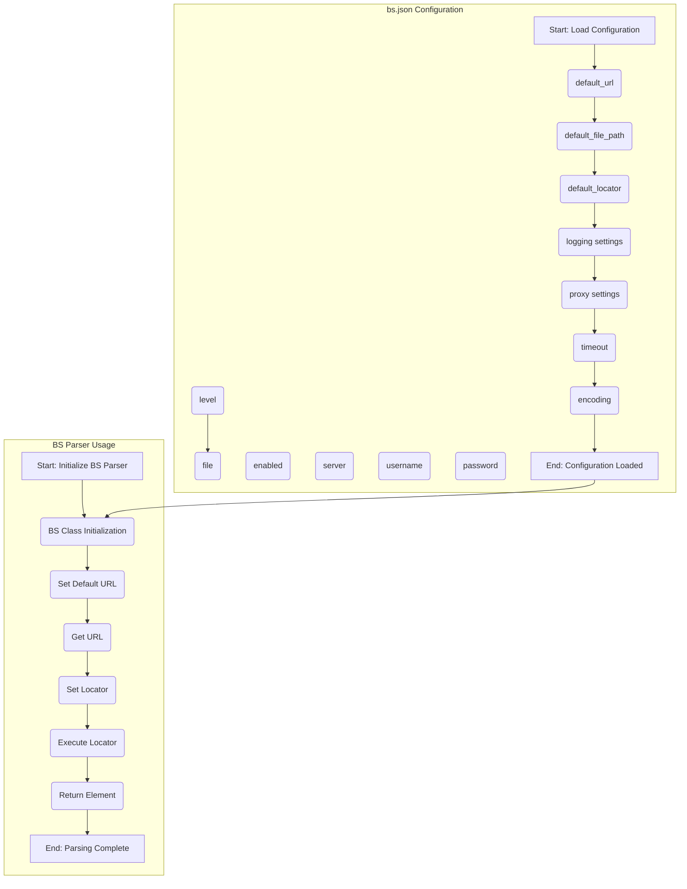

## Анализ кода `README.MD`

### <алгоритм>

1.  **Начало**: Изучается структура `README.MD` файла. Он предоставляет информацию о модуле `src.webdriver.bs`.

2.  **Описание модуля**: Файл описывает модуль, который использует `BeautifulSoup` и `XPath` для парсинга HTML. Модуль поддерживает загрузку HTML из файлов и URL.

3.  **Ключевые особенности**:
    *   Парсинг HTML с использованием `BeautifulSoup` и `XPath`.
    *   Поддержка файлов и URL.
    *   Возможность задавать пользовательские `XPath` локаторы.
    *   Логирование и обработка ошибок.
    *   Настройка через файл `bs.json`.

4.  **Требования**:
    *   Python 3.x
    *   `BeautifulSoup4`, `lxml`, `requests`.
    *   Пример установки зависимостей: `pip install beautifulsoup4 lxml requests`.

5.  **Конфигурация**:
    *   Описание файла `bs.json`.
    *   Пример `bs.json`:
        ```json
        {
          "default_url": "https://example.com",
          "default_file_path": "file://path/to/your/file.html",
          "default_locator": {
            "by": "ID",
            "attribute": "element_id",
            "selector": "//*[@id='element_id']"
          },
          "logging": {
            "level": "INFO",
            "file": "logs/bs.log"
          },
          "proxy": {
            "enabled": false,
            "server": "http://proxy.example.com:8080",
            "username": "user",
            "password": "password"
          },
          "timeout": 10,
          "encoding": "utf-8"
        }
        ```
    *   Описание полей:
        *   `default_url`: URL по умолчанию.
        *   `default_file_path`: путь к файлу по умолчанию.
        *   `default_locator`: локатор по умолчанию для извлечения элементов.
            *   `by`: тип локатора (ID, CSS, TEXT).
            *   `attribute`: атрибут элемента.
            *   `selector`: `XPath` селектор.
        *   `logging`: настройки логирования.
            *   `level`: уровень логирования (INFO, DEBUG, ERROR).
            *   `file`: путь к файлу лога.
        *   `proxy`: настройки прокси.
            *   `enabled`: использовать прокси или нет.
            *   `server`: адрес прокси-сервера.
            *   `username`: имя пользователя для прокси.
            *   `password`: пароль для прокси.
        *   `timeout`: таймаут запроса.
        *   `encoding`: кодировка.

6.  **Примеры использования**:
    *   Инициализация `BS` и использование конфигурации:
        ```python
        from src.webdriver.bs import BS
        from types import SimpleNamespace
        from src.utils.jjson import j_loads_ns
        from pathlib import Path

        settings_path = Path('path/to/bs.json')
        settings = j_loads_ns(settings_path)

        parser = BS(url=settings.default_url)
        locator = SimpleNamespace(**settings.default_locator)
        elements = parser.execute_locator(locator)
        print(elements)
        ```
    *   Загрузка HTML из файла:
        ```python
        parser = BS()
        parser.get_url('file://path/to/your/file.html')
        locator = SimpleNamespace(by='ID', attribute='element_id', selector='//*[@id="element_id"]')
        elements = parser.execute_locator(locator)
        print(elements)
        ```
    *   Загрузка HTML из URL:
        ```python
        parser = BS()
        parser.get_url('https://example.com')
        locator = SimpleNamespace(by='CSS', attribute='class_name', selector='//*[contains(@class, "class_name")]')
        elements = parser.execute_locator(locator)
        print(elements)
        ```

7.  **Логирование**:
    *   Использует `logger` из `src.logger` для логирования ошибок и отладки.
    *   Примеры сообщений в логе: `Error initializing BS parser: <error details>`, `Error in bs.json file: <issue details>`.

8.  **Лицензия**: Проект лицензирован по MIT License.

### <mermaid>



**Разбор зависимостей `mermaid`:**

*   **`bs.json Configuration`**:
    *   `config_start`: Начало загрузки конфигурации.
    *   `config_url`: Параметр `default_url` из `bs.json`.
    *   `config_file`: Параметр `default_file_path` из `bs.json`.
    *   `config_locator`: Параметр `default_locator` из `bs.json`.
    *   `config_logging`: Параметр `logging` из `bs.json`.
        *   `config_log_level`: Уровень логирования.
        *   `config_log_file`: Путь к файлу лога.
    *   `config_proxy`: Параметр `proxy` из `bs.json`.
        *   `config_proxy_enabled`: Использовать прокси или нет.
        *   `config_proxy_server`: Адрес прокси сервера.
        *   `config_proxy_user`: Имя пользователя для прокси.
        *   `config_proxy_pass`: Пароль для прокси.
    *   `config_timeout`: Параметр `timeout` из `bs.json`.
    *   `config_encoding`: Параметр `encoding` из `bs.json`.
    *   `config_end`: Конец загрузки конфигурации.

*   **`BS Parser Usage`**:
    *   `usage_start`: Начало использования парсера.
    *   `usage_init`: Инициализация класса `BS`.
        *   `usage_init_url`: Установка URL по умолчанию.
    *    `usage_get_url`: Вызов метода для получения HTML контента по URL.
    *   `usage_set_locator`: Установка локатора элемента для извлечения.
    *   `usage_execute`: Выполнение извлечения элементов по локатору.
    *   `usage_result`: Возвращение извлеченных элементов.
    *   `usage_end`: Конец использования парсера.

* **Связь между блоками**:
     * Загруженная конфигурация `config_end` передается на инициализацию `BS` парсера `usage_init`.

### <объяснение>

#### Импорты

*   **`from src.webdriver.bs import BS`**: Импортирует класс `BS` из модуля `src.webdriver.bs`. Этот класс является основным для работы с парсером.
*   **`from types import SimpleNamespace`**:  Импортирует `SimpleNamespace` из модуля `types`. `SimpleNamespace` используется для создания объектов с атрибутами из словаря, что удобно для работы с параметрами конфигурации.
*   **`from src.utils.jjson import j_loads_ns`**: Импортирует функцию `j_loads_ns` из модуля `src.utils.jjson`. Эта функция загружает JSON файл и преобразует его в `SimpleNamespace`.
*   **`from pathlib import Path`**: Импортирует класс `Path` из модуля `pathlib`. Этот класс используется для работы с путями к файлам.

#### Классы

*   **`BS`**:
    *   **Роль**: Основной класс для парсинга HTML. Он загружает HTML контент из URL или файла, парсит его, и извлекает элементы, используя XPath локаторы.
    *   **Атрибуты**:
        *   Содержит настройки из `bs.json`.
    *   **Методы**:
        *   `__init__`: Инициализация парсера.
        *   `get_url`: Загрузка HTML по URL или пути к файлу.
        *   `execute_locator`: Выполнение XPath запроса для извлечения элементов.
        *   Другие методы для работы с HTML (не описаны в README, но, вероятно, существуют).
    *   **Взаимодействие**: Взаимодействует с библиотеками `BeautifulSoup4`, `lxml`, `requests`, а также с модулем логирования `src.logger` и конфигурацией из `bs.json`.

#### Функции

*   **`j_loads_ns(path)`**:
    *   **Аргументы**: `path` - путь к `json` файлу.
    *   **Возвращаемое значение**: `SimpleNamespace` объект с данными из `json` файла.
    *   **Назначение**: Загружает данные из файла `json` и преобразует их в `SimpleNamespace` для удобного доступа к атрибутам.
    *   **Пример**: `settings = j_loads_ns(Path('path/to/bs.json'))` загружает и обрабатывает файл `bs.json`.

#### Переменные

*   **`settings_path`**: `Path` объект, представляющий путь к файлу `bs.json`.
*   **`settings`**: `SimpleNamespace` объект, содержащий настройки из `bs.json`.
*   **`parser`**: Экземпляр класса `BS`, используемый для парсинга HTML.
*   **`locator`**: `SimpleNamespace` объект, содержащий настройки локатора для извлечения элементов.
*   **`elements`**: Результат выполнения локатора, обычно список найденных HTML элементов.

#### Потенциальные ошибки и области для улучшения

*   **Отсутствие подробной документации по методам класса `BS`**: В README не описаны все методы класса, что усложняет его использование.
*   **Обработка ошибок**: В примерах кода не показана обработка исключений, что может привести к сбоям.
*   **Динамическая конфигурация**: Возможность изменения конфигурации во время выполнения программы отсутствует.
*   **Зависимость от `SimpleNamespace`**:  Использование `SimpleNamespace` может усложнить отладку, если данные будут иметь сложную структуру.
*   **Логирование**: `README.MD` упоминает про `src.logger`, но не показывает примеров использования.

#### Цепочка взаимосвязей с другими частями проекта

1.  **`src.webdriver.bs`**: Модуль, который использует `BeautifulSoup4` и `lxml` для парсинга.
2.  **`src.utils.jjson`**: Модуль для загрузки конфигурации из `json` файла.
3.  **`src.logger`**: Модуль для логирования событий, связанный с отладкой и отслеживанием работы парсера.
4.  **`bs.json`**: Файл конфигурации, определяющий настройки парсера.
5.  **`src`**: Корень проекта, где размещаются все модули.

#### Замечания

*   Описание в `README.md` хорошо документировано и обеспечивает понимание модуля.
*   Примеры использования понятные и наглядные.
*   `mermaid` диаграмма хорошо показывает структуру конфигурации и логику работы парсера.

Данный анализ представляет полное и подробное описание функциональности кода, обеспечивая понимание его работы и взаимодействия с другими частями проекта.