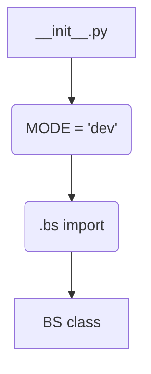
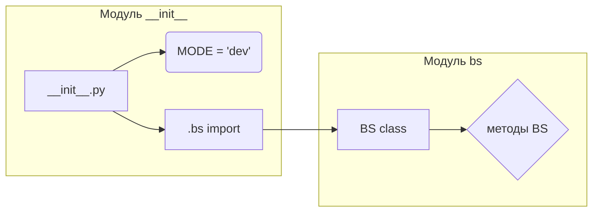

# <input code>

```python
## \file hypotez/src/webdriver/bs/__init__.py
# -*- coding: utf-8 -*-
#! venv/Scripts/python.exe
#! venv/bin/python/python3.12

"""
.. module: src.webdriver.bs 
	:platform: Windows, Unix
	:synopsis:

"""
MODE = 'dev'

from .bs import BS
```

# <algorithm>



В файле `__init__.py` происходит импорт класса `BS` из модуля `bs.py`.  Переменная `MODE` устанавливается в значение 'dev'.  Этот файл служит для инициализации модуля `bs`.  Данные не перемещаются между функциями/классами, так как это всего лишь импорт.


# <mermaid>



Эта диаграмма показывает, что файл `__init__.py` импортирует класс `BS` из модуля `bs` и определяет переменную `MODE`. Зависимости между файлами лежат в импорте `from .bs import BS`, показывая прямую ссылку на класс `BS` внутри модуля `bs`.


# <explanation>

- **Импорты**: Файл `__init__.py`  в папке `hypotez/src/webdriver/bs` импортирует класс `BS` из модуля `bs` внутри той же папки.  `from .bs import BS` — это импорт из текущего пакета.  Это типичная практика для организации модулей Python.  Без этого импорта, в других частях кода нельзя использовать класс `BS`.  Цепочка зависимостей: `hypotez/src` → `webdriver` → `bs` → `bs.py` (где, предположительно, находится определение класса `BS`).

- **Классы**: Класс `BS` (предположительно определяемый в файле `bs.py`) не показан, но, судя по импорту, он, вероятно, представляет собой драйвер браузера или связанный с веб-драйвером класс.  Это специфично для проекта.

- **Функции**: Файл `__init__.py` не содержит функций.  Все логика и поведение находятся в классе `BS` (в `bs.py`).

- **Переменные**: `MODE = 'dev'` — это глобальная переменная, которая, вероятно, используется для управления режимом работы проекта (например, режим разработки, тестирования, производства).  Её значение может повлиять на поведение других частей приложения.

- **Возможные ошибки или области для улучшений**:
    - Отсутствие документации к классу `BS` — это потенциальный недостаток. Хорошее документирование — это практика, которая упрощает дальнейшее развитие и сопровождение проекта.
    - Непонятно, какое поведение связано с `MODE = 'dev'`.  Рекомендуется добавить комментарии, объясняющие назначение переменной `MODE`.
    - Не указано, где и как используются импортированные переменные и классы.  Для полного анализа нужно просмотреть файлы, в которых происходит использование переменной `MODE` и класса `BS`.

**Цепочка взаимосвязей:**

Этот файл является частью более крупной структуры, связанной с управлением веб-драйвером.  Вероятно, в других файлах проекта будут функции или классы, которые используют класс `BS` (например, для инициализации веб-драйвера или выполнения действий в браузере).  Необходимо просмотреть эти взаимосвязи, чтобы понять полную функциональность системы.