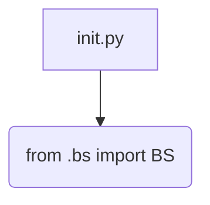
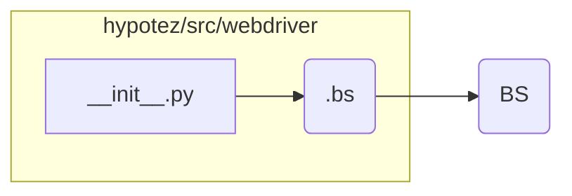

```MD
# Анализ файла hypotez/src/webdriver/bs/__init__.py

1. **<input code>**

```python
## \file hypotez/src/webdriver/bs/__init__.py
# -*- coding: utf-8 -*-
#! venv/Scripts/python.exe
#! venv/bin/python/python3.12

"""
.. module: src.webdriver.bs 
	:platform: Windows, Unix
	:synopsis:

"""
MODE = 'dev'

from .bs import BS
```

2. **<algorithm>**

Этот файл является инициализатором модуля `bs` в пакете `webdriver`.  Он не содержит сложной логики, а лишь импортирует класс `BS` из модуля `bs.py` внутри того же пакета.  Блок-схема минимальна:



Пример:  При импорте этого модуля в другом месте проекта, переменная `MODE` будет доступна, а класс `BS` будет импортирован, что позволит использовать его функциональность.


3. **<mermaid>**



В зависимости `hypotez/src/webdriver`  есть модуль `.bs`,  который, в свою очередь,  содержит класс `BS`.  Этот код устанавливает импортируемую связь между ними.


4. **<explanation>**

* **Импорты:** Файл `__init__.py` является стандартным файлом-инициализатором для пакетов Python.  Строка `from .bs import BS` импортирует класс `BS` из модуля `bs.py`, который находится в той же директории (`./bs`).  Использование `.` перед именем модуля указывает на импорт из текущего пакета.

* **Классы:**  Класс `BS` определен в файле `bs.py` внутри пакета `webdriver` и не представлен в этом файле.  Взаимодействие `BS` с другими компонентами (не показанными в этом коде) будет зависеть от его реализации.

* **Функции:**  В файле `__init__.py` нет собственных функций.

* **Переменные:**  Переменная `MODE` содержит строку `'dev'`.  Это вероятно конфигурационная переменная, которая может использоваться в других частях проекта для выбора режима работы (разработки, тестирования, производства).  Использование в строках импорта и `#!`  suggests  a possible scripting environment (or at least configuration)


* **Возможные ошибки или области для улучшений:**

    * Отсутствие документации для класса `BS` и модуля `bs` снижает читаемость и сопровождение кода.  Желательно добавить docstrings к классу `BS` и модулю `bs`.
    * Необязательно, но для более явного указания режима, можно использовать `enum` вместо простой строки.


* **Взаимосвязь с другими частями проекта:**  Этот модуль служит основой для доступа к классу `BS` из других частей приложения.  Связь будет формироваться через импорт этого файла или подмодулей (`bs`) в других частях проекта.  Например, в модулях, отвечающих за работу с веб-драйвером.