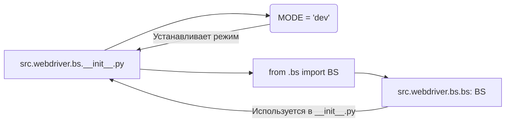

## Анализ кода `hypotez/src/webdriver/bs/__init__.py`

### <алгоритм>

1. **Инициализация модуля:**
   - Задается переменная `MODE` со значением `'dev'`. Это, вероятно, указывает на режим разработки и может влиять на поведение программы.
   -  Импортируется `BS` из модуля `src.webdriver.bs.bs`. Это предполагает, что в файле `bs.py` внутри директории `bs` определен класс или переменная `BS`, которая будет доступна через этот импорт.

   **Пример:**
   - Если `MODE` был бы установлен в `'prod'`, то программа могла бы использовать другой набор конфигураций.
   -  Импорт `BS` позволяет использовать его в других модулях через `from src.webdriver.bs import BS`.

### <mermaid>

**Разбор диаграммы:**

- `A` представляет файл `src.webdriver.bs.__init__.py`.
- `B` представляет переменную `MODE`, инициализированную в `'dev'`.
- `C` представляет операцию импорта `BS` из файла `bs.py` (путь `src.webdriver.bs.bs`).
- `D` представляет сущность `BS`, определенную в `src.webdriver.bs.bs`.
-  Стрелка `B --> A` показывает, что `MODE` устанавливается внутри `__init__.py`.
- Стрелка `D --> A` показывает, что сущность `BS` импортируется и используется в  `__init__.py`, делая ее доступной для импорта из `src.webdriver.bs`.

### <объяснение>

**Импорты:**

- `from .bs import BS`:
    - **Назначение**: Импортирует класс или переменную `BS` из модуля `bs.py`, находящегося в той же директории (относительный импорт).
    - **Взаимосвязь с `src`**: Этот импорт позволяет использовать функциональность, определенную в `bs.py`, внутри пакета `src.webdriver.bs` и других модулях, которые импортируют `BS` через `src.webdriver.bs`.  
    - Это стандартная практика для структурирования пакетов Python.

**Переменные:**

- `MODE = 'dev'`:
    - **Тип**: Строка (str).
    - **Использование**: Вероятно, используется для переключения между различными режимами работы приложения (например, разработка, тестирование, продакшен). В зависимости от значения `MODE` может изменяться поведение программы, например, отладка или логирование.

**Ошибки и улучшения:**

- **Отсутствие документации:**
   -  `__init__.py` имеет докстринг, но он неинформативен и не описывает назначение переменных, импортов и модуля в целом. Необходимо добавить осмысленную документацию.
- **Использование `MODE`:**
    - Использование строковой константы `MODE` может быть не лучшим подходом. Для более гибкой конфигурации можно использовать переменные окружения или конфигурационные файлы.
- **Импорт:**
    -   Используется относительный импорт `from .bs import BS`, но без дополнительных данных, трудно оценить, какие еще компоненты проекта зависят от `BS`.

**Взаимосвязи с другими частями проекта:**

- **`src.webdriver.bs.bs`**: Этот модуль содержит основную логику, используемую в пакете `src.webdriver.bs`. Он является зависимостью для `__init__.py` через импорт `BS`.
- **Другие части `src.webdriver`**: Если другие модули в пакете `src.webdriver` используют  `from src.webdriver.bs import BS`, то они также зависят от `bs.py`.
- **Возможная зависимость от конфигурации:** Если переменная `MODE` используется для переключения конфигурации, то это влияет на все модули, где используется `src.webdriver.bs`.

**Заключение:**
Файл `__init__.py` в пакете `src.webdriver.bs` инициализирует пакет, определяя режим `MODE` и предоставляя доступ к классу/переменной `BS` из `bs.py`.  Это позволяет другим модулям импортировать и использовать  `BS` через `from src.webdriver.bs import BS`. Необходимы улучшения в документации и более гибкий подход к конфигурации режима `MODE`.