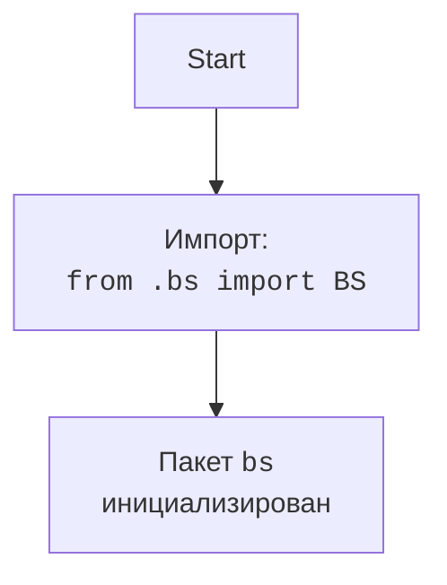

## АНАЛИЗ КОДА: `src/webdriver/bs/__init__.py`

### 1. <алгоритм>

**Общая цель**: Инициализация пакета `bs`, предоставляя доступ к модулю `bs.py`.

1. **Импорт**:
   - Импортируется модуль `BS` из текущего пакета `bs`.
   - **Пример**: После выполнения импорта, можно обращаться к классу, функциям или переменным, которые определены в модуле `bs.py`, через `bs.BS`.

2.  **Результат**:
    -   Пользователи, импортирующие пакет `src.webdriver.bs`, получают доступ к функциональности, реализованной в модуле `bs.py` через `src.webdriver.bs.BS`

### 2. <mermaid>

**Объяснение диаграммы `mermaid`:**
- `Start`: Начало процесса инициализации пакета `bs`.
- `ImportBS`: Импорт модуля `BS` из `bs.py` в рамках текущего пакета. Это делает доступными все элементы, определенные в `bs.py`, например класс `BS`.
- `End`: Конец инициализации пакета. Теперь можно использовать функциональность `BS` через `src.webdriver.bs.BS`.

### 3. <объяснение>

**Импорты:**
- `from .bs import BS`:
    -   `.bs`: Относительный импорт, указывающий на то, что модуль `bs` находится в том же пакете, что и файл `__init__.py`.
    -   `import BS`: Импортирует имя `BS` (обычно класс, но может быть и функция или переменная) из файла `bs.py`, делая его доступным в пространстве имен пакета `bs`.

    -   **Взаимосвязь с другими пакетами `src`**: Этот импорт не затрагивает другие пакеты напрямую. Он обеспечивает доступ к модулю `bs.py` в рамках пакета `src.webdriver.bs`.

**Классы:**

- В предоставленном коде нет явных классов в файле `__init__.py`.  Однако, подразумевается, что импортируется класс `BS` из файла `bs.py`, и он становится доступным через `src.webdriver.bs.BS`. Роль класса `BS` будет определена в файле `bs.py`.

**Функции:**
- В файле нет явных функций.

**Переменные:**
- В файле нет явных переменных.

**Потенциальные ошибки и области для улучшения:**
-   Код прост и выполняет свою задачу по инициализации пакета.
-   Возможным улучшением может быть добавление документации к пакету в виде docstring, чтобы описать его назначение и предоставить инструкции по использованию.
-   В случае добавления логики в `__init__.py`, стоит уделить внимание возможным конфликтам имен и использовать явные пространства имен для избежания коллизий.

**Цепочка взаимосвязей с другими частями проекта:**
-   Этот файл является частью пакета `src.webdriver.bs`, что подразумевает его использование в рамках webdriver функциональности проекта.
-   Предполагается, что `src.webdriver.bs.BS` будет использоваться в других частях проекта для доступа к некоторой функциональности, определенной в файле `bs.py` .