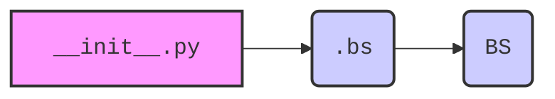

## Анализ кода `hypotez/src/webdriver/bs/__init__.py`

### 1. Алгоритм

1.  **Импорт модуля `bs`**: Импортируется модуль `BS` из подпакета `.bs`.
2.  **Экспорт модуля `BS`**: Модуль `BS` становится доступным для использования в других частях проекта через `src.webdriver.bs`.

### 2. Mermaid



**Объяснение диаграммы `mermaid`**:

*   `__init__.py`: Инициализирует пакет `src.webdriver.bs`.
*   `.bs`: Указывает на модуль `bs.py` в той же директории.
*   `BS`: Класс или модуль, экспортируемый из `bs.py`.

### 3. Объяснение

*   **Импорты**:
    *   `from .bs import BS`: Импортирует класс `BS` из модуля `bs.py`, расположенного в той же директории. Это позволяет использовать функциональность, предоставляемую классом `BS`, в других частях проекта через пакет `src.webdriver.bs`.
*   **Назначение файла**:
    *   `__init__.py` используется для обозначения директории как пакета Python. В данном случае он импортирует класс `BS` из модуля `bs.py` и делает его доступным при импорте пакета `src.webdriver.bs`. Это позволяет пользователям импортировать `BS` напрямую через `from src.webdriver.bs import BS` вместо `from src.webdriver.bs.bs import BS`.
*   **Потенциальные улучшения**:
    *   Документация модуля может быть расширена для более четкого описания функциональности класса `BS` и его роли в проекте.

```python
from .bs import BS