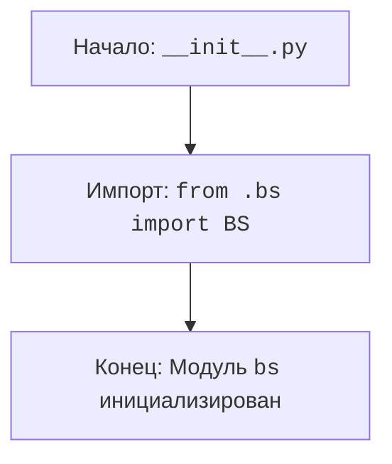

## АНАЛИЗ КОДА: `hypotez/src/webdriver/bs/__init__.py`

### 1. <алгоритм>

1. **Начало:** Запускается интерпретатор Python.
2. **Импорт:** Импортируется модуль `BS` из текущего пакета (`.bs`).
   - **Пример:**  Предполагается, что в файле `hypotez/src/webdriver/bs/bs.py` есть класс или функции, которые становятся доступными через `BS`.
3. **Конец:**  Модуль инициализирован, и `BS` готов к использованию в других частях проекта.

### 2. <mermaid>

**Объяснение зависимостей `mermaid`:**
- Диаграмма показывает последовательность операций в файле `__init__.py`.
- `Start`: Начало выполнения скрипта `__init__.py`
- `Import_BS`: Импорт модуля или класса `BS` из файла `bs.py`, находящегося в том же пакете.
- `End`:  Завершение работы `__init__.py`, когда все импорты выполнены и модуль готов к использованию.

### 3. <объяснение>

**Импорты:**
- `from .bs import BS`: Эта строка импортирует имя `BS` из модуля `bs.py`, который находится в той же директории, что и `__init__.py`. Точка (`.`) в начале пути указывает на текущий пакет. Это позволяет сделать класс или функцию `BS` доступными для использования в других частях проекта, которые импортируют пакет `src.webdriver.bs`.

**Классы:**
- В коде `__init__.py` нет определения классов. Однако подразумевается, что класс `BS` определён в файле `bs.py` (не представлен в этом примере). Класс `BS` вероятно предназначен для работы с браузерной автоматизацией и/или веб-скрейпингом.

**Функции:**
- В коде `__init__.py` нет определения функций. В `bs.py` могут быть функции, связанные с работой `BS`, и они становятся доступными через `from .bs import BS`.

**Переменные:**
- В коде `__init__.py` нет явных переменных. Однако импортированный `BS` будет рассматриваться как переменная (ссылка на класс/функцию) в остальной части проекта, где будет использоваться `src.webdriver.bs`.

**Цепочка взаимосвязей:**
- `hypotez/src/webdriver/bs/__init__.py` является частью пакета `bs`.
- Этот пакет, вероятно, предназначен для работы с браузером (webdriver) и может зависеть от других модулей или библиотек для браузерной автоматизации, таких как Selenium.
- Модуль `src.webdriver.bs` будет использоваться другими частями проекта, которые зависят от браузерной автоматизации.
- Например, модуль `src.webdriver.bs` может использоваться модулями для выполнения задач тестирования или сбора данных.

**Потенциальные ошибки и области для улучшения:**
- В текущем контексте файла ошибок нет. Однако без содержимого `bs.py` сложно оценить его качество и наличие потенциальных ошибок в нём.
- Отсутствие docstring для модуля `__init__.py` (хотя docstring есть для пакета) - хотя он не критичен, но добавляет понимания кода.
- Важно проверить логику, лежащую в `bs.py`, для поиска потенциальных ошибок или улучшения производительности.
- Отсутствие обработки исключений внутри `bs.py` может привести к проблемам при выполнении.