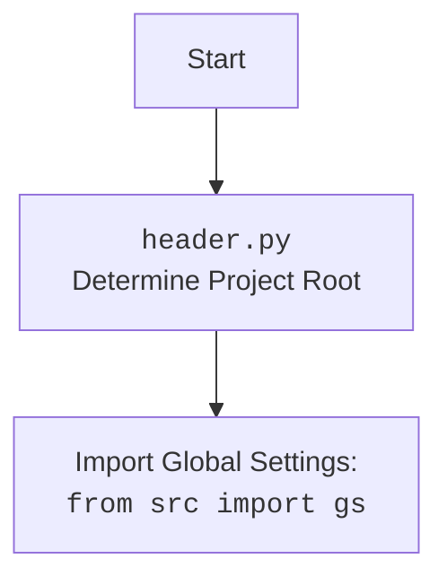

## <алгоритм>

1.  **Инициализация (BS.__init__)**:
    *   Создается экземпляр класса `BS`.
    *   Принимает необязательный аргумент `url`. Если `url` предоставлен, вызывается метод `get_url(url)`.
    *   Пример: `parser = BS('file:///c:/example.html')` или `parser = BS('https://example.com')`
2.  **Получение HTML контента (BS.get_url)**:
    *   Принимает URL или путь к файлу.
    *   Проверяет, начинается ли `url` с "file://".
        *   Если да, удаляет префикс "file:///" и извлекает путь.
        *   Ищет Windows-style путь (например, "c:/...") через регулярное выражение.
            *   Если путь найден, преобразует его в объект `Path` и проверяет, существует ли файл.
                *   Если файл существует, открывает его, считывает HTML и устанавливает атрибут `self.html_content`.
                *   Возвращает `True` в случае успеха, `False` в противном случае.
            *   Если путь не найден или не валиден, возвращает `False`
    *   Проверяет, начинается ли `url` с "https://".
        *   Если да, делает GET запрос.
        *   Проверяет статус код (вызывается исключение в случае ошибки).
        *   Устанавливает `self.html_content` равным тексту ответа.
        *   Возвращает `True` в случае успеха, `False` в противном случае.
    *   Если `url` не соответствует ни одному из условий, возвращает `False`.
3.  **Выполнение локатора (BS.execute_locator)**:
    *   Принимает `locator` (объект `SimpleNamespace` или `dict`) и необязательный URL.
    *   Если предоставлен URL, вызывается `get_url(url)`.
    *   Если `self.html_content` пустой, выводит ошибку и возвращает пустой список.
    *   Создает `BeautifulSoup` объект из `self.html_content`.
    *   Преобразует `BeautifulSoup` объект в `lxml` дерево.
    *   Если `locator` это `dict`, преобразует его в `SimpleNamespace`.
    *   Извлекает атрибуты `attribute`, `by` и `selector` из `locator`.
    *   В зависимости от значения `by`, формируется и выполняется xpath запрос.
        *   `ID`: `//*[@id="{attribute}"]`
        *   `CSS`: `//*[contains(@class, "{attribute}")]`
        *   `TEXT`: `//input[@type="{attribute}"]`
        *   По умолчанию: используется `selector` из `locator`.
    *   Возвращает список элементов `lxml` дерева, найденных через xpath.
4.  **Пример использования (if __name__ == "__main__":)**:
    *   Создается экземпляр класса `BS`.
    *   Вызывается `get_url` для получения HTML с `https://example.com`.
    *   Создается `locator` типа `SimpleNamespace`.
    *   Вызывается `execute_locator` для поиска элементов.
    *   Печатается результат.

## <mermaid>

```mermaid
flowchart TD
    subgraph BS Class
        A[BS.__init__] --> B{url?}
        B -- Yes --> C[BS.get_url(url)]
        B -- No --> D
        D[BS.html_content = None]
        C --> E[BS.html_content = <HTML>]
        F[BS.execute_locator(locator, url?)] --> G{url?}
        G -- Yes --> C
        G -- No --> H
        H{self.html_content?}
        H -- No --> I[Error: No content, return empty list]
        H -- Yes --> J[BeautifulSoup(self.html_content, 'lxml')]
        J --> K[lxml.etree.HTML(BeautifulSoup)]
        K --> L{isinstance(locator, dict)?}
        L -- Yes --> M[SimpleNamespace(**locator)]
        L -- No --> N
        N --> O[Extract locator.attribute, locator.by, locator.selector]
        O --> P{locator.by}
        P -- ID --> Q[xpath: //*[@id="{attribute}"]]
        P -- CSS --> R[xpath: //*[contains(@class, "{attribute}")] ]
        P -- TEXT --> S[xpath: //input[@type="{attribute}"]]
        P -- Other --> T[xpath: locator.selector]
        Q --> U[return list of lxml elements]
        R --> U
        S --> U
        T --> U
    end
    subgraph Example Usage
        X[parser = BS()] --> Y[parser.get_url('https://example.com')]
        Y --> Z[locator = SimpleNamespace(...)]
        Z --> W[elements = parser.execute_locator(locator)]
        W --> V[print(elements)]
    end
    V-->|End|
```



## <объяснение>

**Импорты:**

*   `re`:  Используется для работы с регулярными выражениями, в частности, для извлечения Windows-путей из URL.
*   `pathlib.Path`:  Предоставляет объектно-ориентированный способ работы с файловыми путями, что упрощает проверки существования файлов.
*   `typing.Optional, Union, List`: Используется для статической типизации, чтобы сделать код более понятным и предотвратить ошибки.
    *   `Optional`: Показывает, что значение переменной может быть либо определенного типа, либо `None`.
    *   `Union`: Показывает, что переменная может быть одним из нескольких типов.
    *   `List`:  Обозначает список элементов определенного типа.
*   `types.SimpleNamespace`: Позволяет создавать простые объекты с атрибутами, доступными через точку, используется для передачи параметров, таких как локаторы.
*   `bs4.BeautifulSoup`: Используется для разбора HTML и XML.
*   `lxml.etree`: Предоставляет функции для работы с XML и HTML, особенно для выполнения Xpath запросов.
*   `requests`: Библиотека для отправки HTTP-запросов, используется для загрузки HTML с веб-страниц.
*   `src.gs`: Импортирует глобальные настройки проекта. Предположительно содержит общие параметры конфигурации.
*   `src.logger.logger`: Импортирует модуль для логирования, что позволяет отслеживать происходящие события и возможные ошибки.
*   `src.utils.jjson`: Импортирует модуль для работы с `JSON`, используется как `j_loads_ns` (предположительно для загрузки JSON как `SimpleNamespace`).

**Класс `BS`:**

*   **`html_content`**:
    *   Тип: `str`.
    *   Назначение: Хранит HTML контент для дальнейшего разбора.
*   **`__init__(self, url: Optional[str] = None)`**:
    *   Конструктор класса. Принимает необязательный параметр `url`.
    *   Если `url` передан, сразу вызывает метод `get_url(url)` для получения HTML-контента.
*   **`get_url(self, url: str) -> bool`**:
    *   Метод для загрузки HTML контента из файла или URL.
    *   Аргументы:
        *   `url`: Путь к файлу (формат `file:///...`) или URL (`https://...`).
    *   Логика:
        *   Проверяет, начинается ли `url` с "file://".
            *   Извлекает путь и проверяет его на валидность (локально ищет файл) и если находит считывает контент в `self.html_content`.
        *   Проверяет, начинается ли `url` с "https://".
            *   Делает GET запрос и устанавливает `self.html_content`.
        *   Возвращает `True` в случае успеха, `False` в противном случае.
*   **`execute_locator(self, locator: Union[SimpleNamespace, dict], url: Optional[str] = None) -> List[etree._Element]`**:
    *   Метод для выполнения XPath-запросов к HTML.
    *   Аргументы:
        *   `locator`: Объект типа `SimpleNamespace` (или `dict`) содержащий `by`, `attribute` и `selector`.
        *   `url`: (Опционально) URL для загрузки HTML.
    *   Логика:
        *   Загружает HTML, если передан URL.
        *   Если `self.html_content` пуст, возвращает пустой список.
        *   Создает `BeautifulSoup` объект и конвертирует его в `lxml` дерево.
        *   Извлекает данные из `locator` и формирует XPath запрос в зависимости от значения `by`.
        *   Выполняет запрос и возвращает список найденных элементов.

**Переменные:**

*   `cleaned_url`:  Очищенный URL от префикса `file:///`.
*   `file_path`: Объект `Path` для работы с файловым путём.
*   `match`: Результат поиска через регулярное выражение.
*   `response`: Объект HTTP ответа из `requests`.
*   `soup`:  Объект `BeautifulSoup`, который содержит разобранный HTML.
*   `tree`: `lxml` объект, который содержит разобранное дерево HTML.
*   `locator`: Объект `SimpleNamespace` или `dict`, который содержит локатор.
*   `attribute`: Атрибут для поиска (например, `id` или `class`).
*   `by`: Тип локатора (например, `ID`, `CSS`, `TEXT`).
*   `selector`: Произвольный XPath селектор.
*   `elements`: Список найденных `lxml` элементов.

**Пример использования `if __name__ == "__main__":`**:

*   Создается экземпляр класса `BS`.
*   Загружается HTML с `https://example.com`.
*   Создается объект `SimpleNamespace` для локатора.
*   Выполняется поиск элементов и выводится результат.

**Потенциальные ошибки и улучшения:**

*   **Обработка ошибок**: В `get_url` есть общая обработка `Exception`, которая может скрыть более конкретные ошибки. Лучше использовать более точные исключения, например, `FileNotFoundError`, `requests.exceptions.RequestException`.
*   **Код дублируется**:  Код для получения HTML дублируется в `__init__` и `execute_locator`. Возможно, стоит вынести это в отдельную функцию.
*   **Регулярные выражения**: Регулярное выражение для извлечения Windows пути не покрывает все возможные случаи. Можно использовать более точное выражение.
*   **Локаторы**:  Логика `by` реализована через `if/elif`, что может быть неудобно для добавления новых вариантов. Можно использовать словарь.
*   **Проверка типа**: Можно добавить проверку типа для `locator` (должен быть `SimpleNamespace` или `dict`).

**Взаимосвязи с другими частями проекта:**

*   `src.gs`:  Использует глобальные настройки, это может быть связано с настройками проекта, например, для логирования.
*   `src.logger.logger`:  Использует логирование для отслеживания ошибок, что важно для отладки и мониторинга работы.
*   `src.utils.jjson`: Может быть связан с конфигурацией, которая хранится в JSON и загружается в проект.

**Заключение**:

Этот код предоставляет базовую функциональность для парсинга HTML с использованием `BeautifulSoup` и `XPath`. Класс `BS` инкапсулирует логику получения HTML контента и выполнения локаторов. Код требует доработки в части обработки ошибок и архитектурных улучшений, но в целом, выполняет свою задачу.