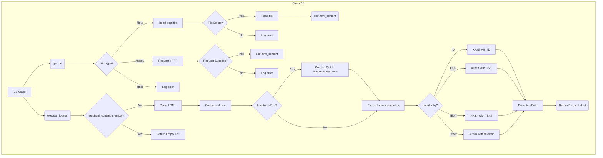

## <алгоритм>

1. **Инициализация `BS`:**
   - Создается экземпляр класса `BS`.
   - Опционально, конструктор может получить `url`, из которого будет загружен HTML-контент.

   ```python
   parser = BS('https://example.com')  # Пример с URL
   parser = BS() # Пример без URL
   ```

2. **Загрузка HTML-контента (`get_url`):**
   - Функция `get_url` принимает URL или путь к файлу.
   - Проверяет тип URL:
     - Если начинается с `file://`:
       - Удаляет префикс `file://`.
       - Извлекает путь к файлу.
       - Пытается открыть и прочитать файл. Если удачно, сохраняет содержимое в `self.html_content`.
       - Если файл не найден или произошла ошибка при чтении, возвращает `False`.
     - Если начинается с `https://`:
       - Отправляет HTTP-запрос GET по URL.
       - Проверяет статус ответа.
       - Сохраняет HTML-содержимое в `self.html_content`.
       - Если произошла ошибка при запросе, возвращает `False`.
     - Если URL не соответствует ни одному из форматов, возвращает `False`.
   - Возвращает `True` при успешной загрузке контента, `False` при неудаче.

   ```python
   parser.get_url('file:///c:/path/to/file.html')  # Пример с файлом
   parser.get_url('https://example.com')          # Пример с URL
   ```

3. **Выполнение локатора (`execute_locator`):**
   - Функция `execute_locator` принимает объект `locator` (либо `SimpleNamespace`, либо `dict`) и опционально `url`.
     - Если `url` предоставлен, загружает HTML-контент с помощью `get_url`.
   - Если `self.html_content` пустой, возвращает пустой список.
   - Создаёт `BeautifulSoup` объект из `self.html_content`.
   - Преобразует объект `BeautifulSoup` в `lxml` объект `etree`.
   - Если `locator` - `dict`, преобразует его в `SimpleNamespace`.
   - Извлекает атрибуты `attribute`, `by`, `selector` из объекта `locator`.
   - В зависимости от `by`:
     - Если `by` равен `ID`, то строит XPath выражение `//*[@id="{attribute}"]`.
     - Если `by` равен `CSS`, то строит XPath выражение `//*[contains(@class, "{attribute}")]`.
     - Если `by` равен `TEXT`, то строит XPath выражение `//input[@type="{attribute}"]`.
     - Если `by` не соответствует ни одному из вариантов, то используется `selector` как xpath выражение.
   - Выполняет XPath запрос с помощью `tree.xpath()` и возвращает список найденных элементов.

   ```python
    locator = SimpleNamespace(by='ID', attribute='element_id', selector='//*[@id="element_id"]')
    elements = parser.execute_locator(locator)
    # или 
    locator = {'by': 'ID', 'attribute': 'element_id', 'selector': '//*[@id="element_id"]'}
    elements = parser.execute_locator(locator)
   ```

4. **Пример использования:**
   - Создается экземпляр класса `BS`.
   - Вызывается `get_url` для загрузки HTML с `https://example.com`.
   - Создается `SimpleNamespace` объект `locator` с параметрами `by='ID'`, `attribute='element_id'` и `selector='//*[@id="element_id"]'`.
   - Вызывается `execute_locator` с `locator`.
   - Выводится результат (список найденных элементов).
   ```python
        parser = BS()
        parser.get_url('https://example.com')
        locator = SimpleNamespace(by='ID', attribute='element_id', selector='//*[@id="element_id"]')
        elements = parser.execute_locator(locator)
        print(elements)
   ```

## <mermaid>



**Объяснение зависимостей:**

*   `BS Class`: Основной класс, инкапсулирующий методы для парсинга HTML.
*   `get_url`: Метод класса `BS` для загрузки HTML-контента по URL или из файла.
*    `execute_locator`: Метод класса `BS` для выполнения XPath-запросов.
*   `Read local file`: Блок чтения локального файла.
*   `Request HTTP`: Блок отправки HTTP-запроса GET.
*   `Parse HTML`: Блок для создания объекта `BeautifulSoup` из `self.html_content`
*   `Create lxml tree`: Преобразует объект `BeautifulSoup` в объект `etree.HTML`
*  `Convert Dict to SimpleNamespace`: Блок для конвертации `dict` в `SimpleNamespace`.
* `Extract locator attributes`: Блок для извлечения атрибутов из объекта `locator`.
* `XPath with ID`:  Блок для построения XPath-выражения по ID.
* `XPath with CSS`: Блок для построения XPath-выражения по CSS-классу.
* `XPath with TEXT`: Блок для построения XPath-выражения по текстовому содержимому.
* `XPath with selector`: Блок для использования переданного селектора в качестве XPath-выражения.
*  `Execute XPath`: Блок для выполнения XPath-запроса с помощью `tree.xpath()`
*  `Return Elements List`:  Блок для возврата списка элементов.
*  `Return Empty List`: Блок для возврата пустого списка, если `self.html_content` пустой.

## <объяснение>

**Импорты:**

*   `re`: Модуль для работы с регулярными выражениями. Используется для извлечения пути к файлу из URL `file:///c:/...`.
*   `pathlib.Path`: Модуль для работы с файловыми путями. Используется для проверки существования файла.
*   `typing.Optional, typing.Union, typing.List`: Модули для аннотации типов, что делает код более читаемым и помогает при статической проверке типов.
*   `types.SimpleNamespace`: Модуль для создания простых объектов с произвольными атрибутами. Используется для представления локатора.
*   `bs4.BeautifulSoup`: Основной класс из библиотеки `BeautifulSoup`, предназначенный для парсинга HTML/XML.
*   `lxml.etree`: Модуль для работы с XML и HTML с помощью XPath. Используется для выполнения XPath-запросов.
*   `requests`: Модуль для отправки HTTP-запросов. Используется для загрузки HTML с веб-страниц.
*   `src.gs`: Импорт из внутреннего модуля проекта, но в данном коде не используется явно.
*   `src.logger.logger.logger`: Импорт логгера из модуля `src.logger`, используется для записи ошибок и отладочной информации.
*   `src.utils.jjson.j_loads_ns`: Импорт функции для работы с json-файлами, в данном коде не используется явно.

**Класс `BS`:**

*   **Роль:** Класс `BS` предназначен для загрузки HTML-контента из различных источников (файлы, URL) и его парсинга с использованием `BeautifulSoup` и `XPath`.
*   **Атрибуты:**
    *   `html_content (str)`: Содержит HTML-контент, который будет парситься. Изначально устанавливается в `None`.
*   **Методы:**
    *   `__init__(self, url: Optional[str] = None)`: Конструктор класса. Принимает опциональный параметр `url`. Если `url` передан, вызывает метод `get_url` для загрузки HTML-контента.
    *   `get_url(self, url: str) -> bool`: Метод для загрузки HTML-контента по URL или пути к файлу. Принимает `url` как аргумент и возвращает `True`, если контент успешно загружен, иначе `False`.
        *   **Аргументы:**
            *   `url (str)`: URL или путь к файлу.
        *   **Возвращаемое значение:**
            *   `bool`: `True` при успешной загрузке контента, `False` в противном случае.
    *   `execute_locator(self, locator: Union[SimpleNamespace, dict], url: Optional[str] = None) -> List[etree._Element]`: Метод для выполнения XPath-запроса к загруженному HTML-контенту.
        *   **Аргументы:**
            *   `locator (Union[SimpleNamespace, dict])`: Объект, содержащий параметры поиска (атрибут, метод поиска, селектор). Может быть типа `SimpleNamespace` или `dict`.
            *    `url (Optional[str])`:  Опциональный URL для загрузки HTML контента.
        *   **Возвращаемое значение:**
            *   `List[etree._Element]`: Список найденных элементов, удовлетворяющих условию.

**Переменные:**

*   `MODE`: Глобальная переменная, установленная в `'dev'`. Используется для определения режима работы, но не используется в текущем коде.
*  `parser`: Объект класса `BS` в примере использования.
* `locator`: Объект `SimpleNamespace`, определяющий параметры поиска.
*  `elements`: Список найденных элементов.

**Потенциальные ошибки и области для улучшения:**

*   **Обработка ошибок:** Более детальная обработка исключений при работе с файлами и HTTP-запросами.
*   **Поддержка других типов локаторов:** Расширение поддержки локаторов, например, поддержка поиска по имени тега, и т.д.
*   **Расширение функциональности:** Добавление методов для работы с `BeautifulSoup` непосредственно, без необходимости перехода к `lxml`.
*   **Улучшение читаемости `execute_locator`:** Можно использовать `match-case` для определения типа локатора в `python 3.10+`

**Взаимосвязь с другими частями проекта:**

*   Этот модуль зависит от модулей `src.logger` и `src.utils`, которые, вероятно, находятся в том же проекте. Он использует логгер для записи сообщений, а `j_loads_ns` для работы с json-файлами, хотя в предоставленном коде не используется.
*   Модуль `src.gs` импортируется, но не используется. Это может быть либо ошибкой, либо заделом на будущее.

**Цепочка взаимосвязей:**

1.  `BS` класс инициализируется с возможностью загрузки HTML контента.
2.  Вызывается метод `get_url` для загрузки HTML контента из файла или по URL.
3.  Если `url` передан в метод `execute_locator`, то вызывается метод `get_url`.
4.  Метод `execute_locator` использует HTML контент для создания `BeautifulSoup` и `lxml.etree` объектов.
5.  Метод `execute_locator` выполняет XPath-запрос на основе переданного локатора.
6.  Результат XPath запроса возвращается вызывающей стороне.