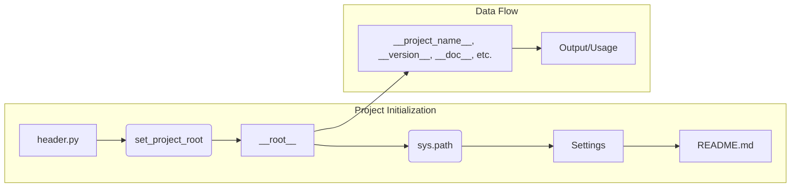

# <input code>

```python
## \file hypotez/src/webdriver/bs/header.py
# -*- coding: utf-8 -*-
#! venv/Scripts/python.exe
#! venv/bin/python/python3.12

"""
.. module:: src.webdriver.bs 
	:platform: Windows, Unix
	:synopsis:

"""
MODE = 'dev'

import sys
import json
from packaging.version import Version

from pathlib import Path
def set_project_root(marker_files=('pyproject.toml', 'requirements.txt', '.git')) -> Path:
    """
    Finds the root directory of the project starting from the current file's directory,
    searching upwards and stopping at the first directory containing any of the marker files.

    Args:
        marker_files (tuple): Filenames or directory names to identify the project root.
    
    Returns:
        Path: Path to the root directory if found, otherwise the directory where the script is located.
    """
    __root__:Path
    current_path:Path = Path(__file__).resolve().parent
    __root__ = current_path
    for parent in [current_path] + list(current_path.parents):
        if any((parent / marker).exists() for marker in marker_files):
            __root__ = parent
            break
    if __root__ not in sys.path:
        sys.path.insert(0, str(__root__))
    return __root__


# Get the root directory of the project
__root__ = set_project_root()
"""__root__ (Path): Path to the root directory of the project"""

from src import gs

settings:dict = None
try:
    with open(gs.path.root / 'src' /  'settings.json', 'r') as settings_file:
        settings = json.load(settings_file)
except (FileNotFoundError, json.JSONDecodeError):
    ...

doc_str:str = None
try:
    with open(gs.path.root / 'src' /  'README.MD', 'r') as settings_file:
        doc_str = settings_file.read()
except (FileNotFoundError, json.JSONDecodeError):
    ...


__project_name__ = settings.get("project_name", 'hypotez') if settings  else 'hypotez'
__version__: str = settings.get("version", '')  if settings  else ''
__doc__: str = doc_str if doc_str else ''
__details__: str = ''
__author__: str = settings.get("author", '')  if settings else ''
__copyright__: str = settings.get("copyrihgnt", '')  if settings else ''
__cofee__: str = settings.get("cofee", "Treat the developer to a cup of coffee for boosting enthusiasm in development: https://boosty.to/hypo69")  if settings else "Treat the developer to a cup of coffee for boosting enthusiasm in development: https://boosty.to/hypo69"
```

# <algorithm>

```mermaid
graph TD
    A[Start] --> B{Get current file path};
    B --> C[set_project_root(marker_files)];
    C --> D{Check if parent directory contains marker files};
    D -- Yes --> E[__root__ = parent];
    D -- No --> F[__root__ = current_path];
    E --> G{Add __root__ to sys.path};
    F --> G;
    G --> H[Return __root__];
    H --> I[Open settings.json];
    I -- Success --> J[Load settings];
    I -- Failure --> K[settings = None];
    J --> L[Open README.MD];
    L -- Success --> M[Read README content];
    L -- Failure --> N[doc_str = None];
    M --> O[Assign values from settings or default];
    O --> P[End];
    K --> O;
    N --> O;
```

**Example:**

If `__file__` points to `hypotez/src/webdriver/bs/header.py`, `set_project_root` will look for `pyproject.toml`, `requirements.txt`, or `.git` in:
1. `hypotez/src/webdriver/bs`
2. `hypotez/src/webdriver`
3. `hypotez/src`
4. `hypotez`

If `.git` is found in `hypotez`, the function will return `hypotez/`


# <mermaid>



**Dependencies:**

* `sys`: For interacting with the Python runtime environment, specifically accessing and manipulating `sys.path`.
* `json`: For working with JSON data, specifically loading the `settings.json` file.
* `packaging.version`: For version handling.
* `pathlib`: For handling file paths in a more object-oriented way.
* `src.gs`:  A custom module (likely part of the same project), providing paths to project resources (e.g., `gs.path.root`).


# <explanation>

* **Imports**:
    * `sys`: Used to modify the Python module search path (`sys.path`).
    * `json`: Used for loading the `settings.json` file.
    * `packaging.version`:  This package is likely used to handle project version information in a standardized way.
    * `pathlib`:  Provides object-oriented path-handling capabilities; crucial for working with file systems, particularly in cases like this where project root directories are involved.
    * `src.gs`:  This is a custom module likely part of the project (or sub-project) for managing paths. It's an example of good modularization, because it handles the specific logic around accessing the project's root directory. This is generally better than hard-coding paths directly.

* **Classes**:  There are no classes defined in this code.  It's primarily a collection of functions and variables.

* **Functions**:
    * `set_project_root(marker_files)`: This function is crucial for finding the project root directory.  It iterates up the directory tree from the current file (`__file__`) until it finds a directory containing any of the specified files (e.g., `pyproject.toml`, `requirements.txt`, `.git`).
      * It's well-documented, making its purpose and operation clear.  The type hinting (`-> Path`) is also excellent.
      * Importantly, it modifies `sys.path` to allow modules from that root to be imported; good practice when structuring large codebases.

* **Variables**:
    * `__root__`:  Holds the path to the project root directory.
    * `settings`:  A dictionary containing project settings loaded from `settings.json`.  Note the `try...except` block handles potential errors if the file doesn't exist or is not valid JSON.
    * `doc_str`:  Stores the content of `README.MD`, if it exists.
    * `__project_name__`, `__version__`, `__doc__`, `__details__`, `__author__`, `__copyright__`, `__cofee__`: These are read from the `settings.json` file if available; otherwise, defaults are used. This promotes flexibility and maintainability, allowing changes to default values without hardcoding them directly.


* **Possible Errors/Improvements:**
    * **Error Handling:** The `try...except` blocks for reading `settings.json` and `README.MD` are good, but they don't provide feedback.  Logging errors or displaying informative messages would be useful for debugging.
    * **`gs.path.root`:** The use of `gs.path.root` depends on the `src.gs` module. You need to ensure that this module is available and that it correctly locates the project's root directory.  The code has a crucial dependency here.


* **Relationship to other parts of the project:**
    The code depends on `src.gs` to find the root directory, so the code's behavior depends completely on the implementation details within `gs`.  It also loads settings and documentation, indicating that other parts of the project are assumed to be properly configured and accessible for it to function properly.

The code is well-structured, uses appropriate error handling, and incorporates best practices for project structure by employing relative paths and the `set_project_root` function. Its design suggests that it forms a foundational piece for other modules in the project by setting up common variables (project name, version).