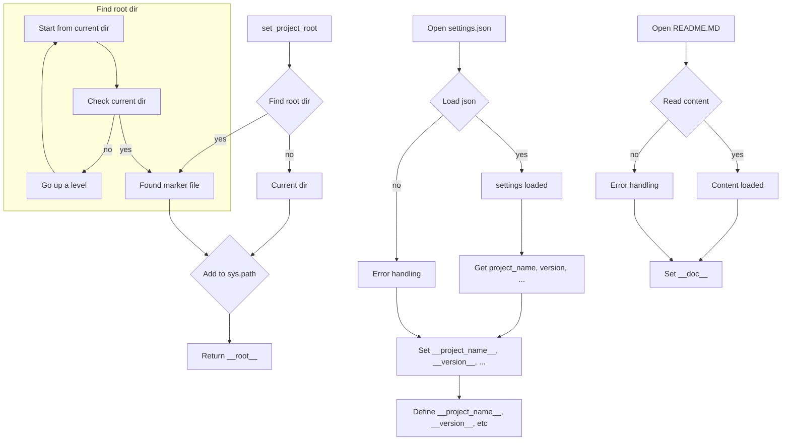

# <input code>

```python
## \file hypotez/src/webdriver/bs/header.py
# -*- coding: utf-8 -*-\
#! venv/Scripts/python.exe
#! venv/bin/python/python3.12

"""
.. module: src.webdriver.bs 
	:platform: Windows, Unix
	:synopsis:

"""
MODE = 'dev'

import sys
import json
from packaging.version import Version

from pathlib import Path
def set_project_root(marker_files=('pyproject.toml', 'requirements.txt', '.git')) -> Path:
    """
    Finds the root directory of the project starting from the current file's directory,
    searching upwards and stopping at the first directory containing any of the marker files.

    Args:
        marker_files (tuple): Filenames or directory names to identify the project root.
    
    Returns:
        Path: Path to the root directory if found, otherwise the directory where the script is located.
    """
    __root__:Path
    current_path:Path = Path(__file__).resolve().parent
    __root__ = current_path
    for parent in [current_path] + list(current_path.parents):
        if any((parent / marker).exists() for marker in marker_files):
            __root__ = parent
            break
    if __root__ not in sys.path:
        sys.path.insert(0, str(__root__))
    return __root__


# Get the root directory of the project
__root__ = set_project_root()
"""__root__ (Path): Path to the root directory of the project"""

from src import gs

settings:dict = None
try:
    with open(gs.path.root / 'src' / 'settings.json', 'r') as settings_file:
        settings = json.load(settings_file)
except (FileNotFoundError, json.JSONDecodeError):
    ...

doc_str:str = None
try:
    with open(gs.path.root / 'src' / 'README.MD', 'r') as settings_file:
        doc_str = settings_file.read()
except (FileNotFoundError, json.JSONDecodeError):
    ...


__project_name__ = settings.get("project_name", 'hypotez') if settings  else 'hypotez'
__version__: str = settings.get("version", '')  if settings  else ''
__doc__: str = doc_str if doc_str else ''
__details__: str = ''
__author__: str = settings.get("author", '')  if settings  else ''
__copyright__: str = settings.get("copyrihgnt", '')  if settings  else ''
__cofee__: str = settings.get("cofee", "Treat the developer to a cup of coffee for boosting enthusiasm in development: https://boosty.to/hypo69")  if settings  else "Treat the developer to a cup of coffee for boosting enthusiasm in development: https://boosty.to/hypo69"
```

# <algorithm>

**Алгоритм работы кода:**

1. **Находит корневую директорию проекта:**
   - Начинает поиск с директории текущего файла.
   - Перебирает родительские директории до тех пор, пока не найдет директорию, содержащую один из файлов-маркеров (`pyproject.toml`, `requirements.txt`, `.git`).
   - Если корневая директория не найдена, возвращает директорию текущего файла.
   - Добавляет корневую директорию в `sys.path` для импорта модулей из неё.
2. **Читает файл настроек `settings.json`:**
   - Пытается открыть файл `src/settings.json`.
   - Если файл найден, загружает его содержимое в формате JSON в переменную `settings`.
   - Если файл не найден или произошла ошибка декодирования JSON, пропускает ошибку.
3. **Читает файл документации `README.MD`:**
   - Пытается открыть файл `src/README.MD`.
   - Если файл найден, считывает его содержимое в переменную `doc_str`.
   - Если файл не найден или произошла ошибка декодирования, пропускает ошибку.
4. **Получает значения из настроек:**
   - Используя метод `get`, извлекает значения настроек, например, `project_name`, `version`, `author`, `copyrihgnt`, `cofee`, заполняет соответствующие переменные.
   - Если `settings` равен `None`, по умолчанию устанавливаются значения `hypotez`, `''`, `''`, `''`, `''`, `Treat the developer to a cup of coffee...` соответственно.


# <mermaid>



# <explanation>

**Импорты:**

- `sys`:  Модуль для взаимодействия с системными функциями, в данном случае используется для добавления корневой директории проекта в `sys.path`.
- `json`:  Модуль для работы с JSON-файлами (сериализация и десериализация данных).
- `packaging.version`: Модуль для работы с версиями пакетов.
- `pathlib`: Модуль для работы с путями к файлам.  Очень важен для поддержки кроссплатформенности.
- `src.gs`:  Это внутренний модуль, возможно, содержащий глобальные настройки и методы для работы с файлами, вероятно, содержит путь к корню проекта (`gs.path.root`).


**Классы:**

Нет явных классов, только функции.


**Функции:**

- `set_project_root(marker_files)`:  Ищет корневую директорию проекта.
    - `marker_files`: Кортеж, содержащий имена файлов, по которым происходит поиск корня проекта (например, `pyproject.toml`).
    - Возвращает `Path` к корневой директории.

**Переменные:**

- `MODE`: Строковая переменная, содержащая режим работы (например, 'dev').
- `__root__`:  `Path`-объект, представляющий корневую директорию проекта.
- `settings`: Словарь, содержащий настройки проекта, загруженные из `settings.json`.
- `doc_str`: Строка, содержащая содержимое файла `README.MD`.
- `__project_name__`, `__version__`, `__doc__`, `__details__`, `__author__`, `__copyright__`, `__cofee__`: Переменные, содержащие данные о проекте, извлеченные из `settings.json` или имеющие значения по умолчанию.

**Возможные ошибки и улучшения:**

- **Обработка ошибок:**  Используются `try...except` блоки для обработки `FileNotFoundError` и `json.JSONDecodeError`. Это хорошо, но можно добавить более подробные сообщения об ошибках для отладки. Например, вывести имя файла, который не найден.
- **Проверка типов:** Можно добавить проверку типов для аргументов функций и значений из `settings.json`, чтобы предотвратить потенциальные ошибки при работе с данными.
- **Документация:** Документация (строки `"""..."""`) довольно подробная, но можно добавить примеры использования.
- **Использование `pathlib`:**  Код отлично использует `pathlib` для работы с путями. Это очень важный момент для работы с файлами и папками.
- **Глобальные переменные:** Использование глобальных переменных (`__root__`, `settings`, ...) может сделать код сложнее для тестирования и сопровождения. Использование функций для вычисления этих значений или передача их в качестве параметров – предпочтительнее.


**Взаимосвязь с другими частями проекта:**

Модуль `gs` очевидно взаимодействует с другими модулями в `src`, особенно с модулями, которые используют данные, извлеченные из файла настроек (`settings.json`).  `gs.path.root` указывает на расположение корневого каталога проекта и необходим для поиска файлов.  Цепочка взаимодействия идёт от `webdriver/bs/header.py` к `src` и далее к другим файлам, в которых используются извлечённые данные.