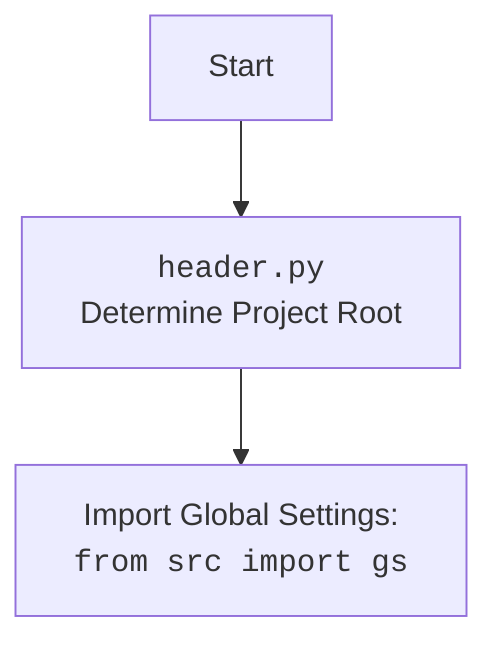

# Анализ кода `hypotez/src/webdriver/bs/header.py`

## <алгоритм>

1.  **`set_project_root(marker_files)`**:
    *   Начало: Принимает кортеж `marker_files` (по умолчанию `('__root__', '.git')`) для поиска корневой директории.
    *   Определение текущего пути: Получает путь к директории, где расположен файл `header.py`.
    *   Поиск родительских директорий: Итерируется по текущей директории и её родительским директориям.
    *   Проверка наличия маркеров: Для каждой директории проверяет наличие файлов или директорий, указанных в `marker_files`.
    *   Установка корня проекта: Если один из маркеров найден, устанавливает текущую родительскую директорию как корень проекта и прерывает цикл.
    *   Добавление корня в `sys.path`: Если корень проекта не в `sys.path`, добавляет его.
    *   Возврат: Возвращает путь к корню проекта.
    *   Пример:
        *   Если `header.py` находится в `/home/user/project/src/webdriver/bs/` и в `/home/user/project/` есть файл `.git`, то функция вернёт `/home/user/project/`.
        *   Если `header.py` находится в `/home/user/project/src/webdriver/bs/` и нет ни `__root__` ни `.git` в родительских директориях, то вернет `/home/user/project/src/webdriver/bs/`.

2.  **`__root__ = set_project_root()`**:
    *   Вызывает функцию `set_project_root` для определения корня проекта.
    *   Сохраняет результат в глобальную переменную `__root__`.

3.  **`from src import gs`**:
    *   Импортирует модуль `gs` из пакета `src`.

4.  **Загрузка `settings` из `settings.json`**:
    *   Попытка открыть файл `settings.json`, расположенный в директории `<root>/src/settings.json`.
    *   Если файл найден, загружает JSON-контент в переменную `settings`.
    *   Обработка исключений: Если файл не найден или JSON недействителен, пропускает операцию (переменная `settings` остаётся `None`).

5.  **Загрузка документации из `README.MD`**:
    *   Попытка открыть файл `README.MD`, расположенный в директории `<root>/src/README.MD`.
    *   Если файл найден, считывает содержимое в переменную `doc_str`.
    *   Обработка исключений: Если файл не найден или произошла ошибка, пропускает операцию (переменная `doc_str` остаётся `None`).

6.  **Инициализация глобальных переменных**:
    *   Извлекает значения из словаря `settings` (если он был загружен) или устанавливает значения по умолчанию для переменных:
        *   `__project_name__` (по умолчанию `'hypotez'`)
        *   `__version__` (по умолчанию `''`)
        *   `__doc__` (содержимое `README.MD`, если загружено, иначе `''`)
        *   `__details__` (по умолчанию `''`)
        *   `__author__` (по умолчанию `''`)
        *   `__copyright__` (по умолчанию `''`)
        *   `__cofee__` (сообщение для поддержки разработчика, если загружено, иначе стандартное сообщение)

## <mermaid>

```mermaid
flowchart TD
    Start[Start] --> FindRoot[<code>set_project_root()</code><br>Determine Project Root]
    FindRoot --> CheckMarkerFiles[Check for marker files in current and parent dirs]
    CheckMarkerFiles --> RootFound{Marker file found?}
    RootFound -- Yes --> SetRoot[Set project root and break loop]
    RootFound -- No --> NextParent[Go to parent directory]
    NextParent --> CheckMarkerFiles
    RootFound -- No --> EndLoop[If no root is found returns current dir]
    EndLoop--> AddPath[Add root to <code>sys.path</code>]
    SetRoot --> AddPath
    AddPath --> ReturnRoot[Return root path]
    ReturnRoot --> SetGlobalRoot[Set global <code>__root__</code>]
    SetGlobalRoot --> ImportGS[Import Global Settings: <br><code>from src import gs</code>]
    ImportGS --> TryLoadSettings[Try to load <code>settings.json</code>]
    TryLoadSettings --> FileFound{File found and Valid JSON?}
    FileFound -- Yes --> LoadSettings[Load settings into <code>settings</code>]
    FileFound -- No --> SettingsError[Handle settings loading Error]
    LoadSettings-->TryLoadDoc[Try to load <code>README.MD</code>]
    SettingsError-->TryLoadDoc
     TryLoadDoc --> DocFound{File found and Valid MD?}
    DocFound -- Yes --> LoadDoc[Load doc into <code>doc_str</code>]
    DocFound -- No --> DocError[Handle doc loading Error]
     LoadDoc --> InitGlobalVars[Initialize global variables]
     DocError-->InitGlobalVars
     InitGlobalVars --> End[End]

    classDef green fill:#90EE90,stroke:#333,stroke-width:2px
    class FindRoot,CheckMarkerFiles,RootFound,SetRoot,NextParent,EndLoop,AddPath,ReturnRoot,SetGlobalRoot,ImportGS,TryLoadSettings,FileFound,LoadSettings,SettingsError,TryLoadDoc,DocFound,LoadDoc,DocError,InitGlobalVars green
```

**Зависимости `mermaid`:**

*   `flowchart TD`: Определяет тип диаграммы как блок-схему (flowchart) с направлением сверху вниз (Top-Down).
*   `Start`, `FindRoot`, `CheckMarkerFiles`, и т.д.: Узлы блок-схемы, представляющие различные операции в коде.
*   `-->`: Стрелки, указывающие на поток управления между узлами.
*   `{}`: Ромбовидные узлы, представляющие условные проверки.
*   `classDef green fill:#90EE90,stroke:#333,stroke-width:2px`: Определяет стиль для узлов, используя CSS-подобный синтаксис, задавая цвет заливки, обводку и её ширину.
*   `class FindRoot,CheckMarkerFiles,RootFound,SetRoot,NextParent,EndLoop,AddPath,ReturnRoot,SetGlobalRoot,ImportGS,TryLoadSettings,FileFound,LoadSettings,SettingsError,TryLoadDoc,DocFound,LoadDoc,DocError,InitGlobalVars green`: Применяет определенный стиль ко всем узлам которые принадлежат основному циклу программы

Дополнительный блок `mermaid` для `header.py`:



## <объяснение>

### Импорты:
*   `sys`: Модуль для работы с системными параметрами и функциями. Используется для добавления пути к корню проекта в список путей поиска модулей (`sys.path`).
*   `json`: Модуль для работы с данными в формате JSON. Используется для загрузки настроек из файла `settings.json`.
*  `packaging.version`: Модуль для сравнения версий. В данном коде не используется напрямую, но возможно, используется в другом модуле проекта, т.к. импортирован без псевдонима.
*   `pathlib.Path`: Класс для работы с путями к файлам и директориям в объектно-ориентированном стиле. Используется для манипуляций с путями в коде.
*   `from src import gs`: Импортирует модуль `gs` из пакета `src`. Модуль `gs`, скорее всего, содержит глобальные настройки и константы проекта, включая пути к файлам и директориям.

### Классы:

*   `pathlib.Path`: Используется для представления путей к файлам и директориям. В коде экземпляры класса `Path` используются для построения путей, поиска файлов и директорий, а также для добавления корня проекта в `sys.path`.

### Функции:

*   `set_project_root(marker_files: tuple = ('__root__', '.git')) -> Path`:
    *   **Аргументы**:
        *   `marker_files` (tuple, необязательный): Список файлов или директорий, наличие которых указывает на корень проекта. По умолчанию `('__root__', '.git')`.
    *   **Возвращаемое значение**:
        *   `Path`: Путь к корню проекта.
    *   **Назначение**: Находит корневую директорию проекта, проверяя наличие `marker_files` в текущей директории и её родительских директориях. Добавляет корневую директорию в `sys.path` для корректного импорта модулей.

### Переменные:

*   `__root__`: (Path) Глобальная переменная, хранящая путь к корню проекта.
*   `settings`: (dict, None) Словарь, загруженный из файла `settings.json`. Содержит настройки проекта. Может быть `None`, если файл не найден или JSON недействительный.
*   `doc_str`: (str, None) Содержимое файла `README.MD`, которое используется как основная документация проекта. Может быть `None`, если файл не найден или произошла ошибка при чтении.
*   `__project_name__`: (str) Имя проекта, полученное из `settings` или `hypotez` по умолчанию.
*   `__version__`: (str) Версия проекта, полученная из `settings` или пустая строка по умолчанию.
*   `__doc__`: (str) Основная документация проекта, взятая из файла `README.MD` или пустая строка по умолчанию.
*   `__details__`: (str) Строка для хранения деталей о проекте.
*   `__author__`: (str) Автор проекта, полученный из `settings` или пустая строка по умолчанию.
*   `__copyright__`: (str) Авторское право, полученное из `settings` или пустая строка по умолчанию.
*  `__cofee__`: (str) Сообщение о том, как поддержать разработчика.

### Потенциальные ошибки и улучшения:

*   **Обработка ошибок**: В коде используется `try...except` для обработки ошибок `FileNotFoundError` и `json.JSONDecodeError` при чтении `settings.json` и `README.MD`. Вместо пропуска ошибок можно добавить логирование ошибок и, возможно, предоставлять пользователю более информативное сообщение об ошибке.
*   **Не используется `packaging.version`**: Импортированный модуль `packaging.version` не используется в коде. Возможно, он предназначен для использования в других модулях. Можно рассмотреть возможность его удаления, если он не используется.
*   **Упрощение загрузки `settings` и `doc_str`**: Код загрузки `settings` и `doc_str` можно вынести в отдельные функции для лучшей читаемости и переиспользуемости.
*   **Отсутствует типизация `__root__`**: В коде объявлена переменная `__root__` с аннотацией `__root__:Path`, но при этом она присваивается значение внутри функции `set_project_root()`, в которой уже есть локальная переменная `__root__:Path`. Это можно исправить либо удалив аннотацию у внешней `__root__`, либо у внутренней, чтобы не происходило переопределения типа переменной.
*   **Установка дефолтов для `settings`**: При получении данных из словаря `settings`, можно использовать метод `get` с дефолтным значением, как в случаях с другими переменными (например, `__project_name__ = settings.get("project_name", 'hypotez')`). Это может упростить код и сделать его более читабельным.

### Взаимосвязь с другими частями проекта:

*   Модуль `header.py` используется как точка входа для получения основных настроек и пути к корню проекта. Другие модули в проекте импортируют `header` для доступа к этим настройкам.
*   Модуль `gs` (глобальные настройки) также импортируется и используется для построения путей к файлам `settings.json` и `README.MD`.
*   Данные из `settings.json` используются для инициализации глобальных переменных, которые доступны по всему проекту.
*   Содержимое `README.MD` загружается в переменную `__doc__` и может использоваться для документации.
*   Добавление корня проекта в `sys.path` позволяет корректно импортировать другие модули проекта.

Этот анализ предоставляет подробное описание кода `header.py`, его функциональности, зависимостей и потенциальных улучшений.