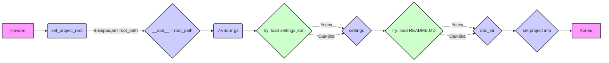

# Анализ кода `hypotez/src/webdriver/bs/header.py`

## 1. <алгоритм>

**Блок-схема:**

1.  **Инициализация:**
    *   Объявление глобальной переменной `MODE` со значением `'dev'`.
    *   Импорт необходимых библиотек: `sys`, `json`, `Version` из `packaging.version`, `Path` из `pathlib`.
2.  **`set_project_root(marker_files)` Функция:**
    *   Находит корневой каталог проекта, используя маркерные файлы.
        *   Пример входных данных `marker_files`: `('pyproject.toml', 'requirements.txt', '.git')`.
        *   Получает абсолютный путь к текущему файлу.
        *   Перебирает текущий каталог и его родительские каталоги.
        *   Проверяет, существует ли какой-либо из маркерных файлов в текущем родительском каталоге.
        *   Если маркерный файл найден, сохраняет этот путь как корневой каталог и прерывает цикл.
        *   Добавляет корневой путь в `sys.path` для возможности импорта модулей проекта.
        *   Возвращает `Path` объект, представляющий корневой каталог.
        *   Пример результата: `Path('/path/to/your/project')`
3.  **Получение корневого каталога:**
    *   Вызывает `set_project_root()` и сохраняет возвращенный `Path` объект в глобальную переменную `__root__`.
4.  **Импорт `gs`:**
    *   Импортирует модуль `gs` из пакета `src`.
5.  **Загрузка настроек:**
    *   Инициализирует переменную `settings` со значением `None`.
    *   Пытается открыть и загрузить JSON-файл настроек (`settings.json`) из каталога `src` относительно корневого каталога.
        *   Пример: Если корневой путь `/path/to/project`, тогда путь до файла: `/path/to/project/src/settings.json`.
        *   Если файл найден и корректно загружен, то  `settings` присваивается словарь.
        *   В противном случае (если файл не найден или JSON некорректен) обрабатывает ошибку  и `settings` остается  `None`.
6.  **Загрузка документации:**
    *   Инициализирует переменную `doc_str` со значением `None`.
    *   Пытается открыть и прочитать файл `README.MD` из каталога `src` относительно корневого каталога.
        *   Пример: Если корневой путь `/path/to/project`, тогда путь до файла: `/path/to/project/src/README.MD`.
        *   Если файл найден и прочтен,  `doc_str` присваивается содержимое файла.
        *   В противном случае (если файл не найден или возникла ошибка чтения) обрабатывает ошибку  и `doc_str` остается  `None`.
7.  **Установка глобальных переменных:**
    *   Устанавливает глобальные переменные, такие как `__project_name__`, `__version__`, `__doc__`, `__details__`, `__author__`, `__copyright__`, `__cofee__`, извлекая значения из словаря `settings`, если он существует, или устанавливая значения по умолчанию.
        *   Если `settings` не `None` устанавливается значение из словаря, иначе значение по умолчанию.

## 2. <mermaid>

**Объяснение диаграммы:**

*   **`Начало`**: Начальная точка выполнения скрипта.
*   **`set_project_root`**: Функция, которая определяет корневой каталог проекта.
*   **`__root__ = root_path`**: Присваивание переменной `__root__` значения пути к корню проекта, полученного из функции `set_project_root`.
*   **`Импорт gs`**:  Импорт модуля `gs`, который, вероятно, содержит глобальные настройки или пути.
*   **`try: load settings.json`**: Попытка загрузить настройки из файла `settings.json`.
    *   Успешное выполнение приведет к присвоению значения переменной `settings`.
    *   Ошибка (например, файл не найден или поврежден)  продолжит выполнение программы без присвоения.
*   **`try: load README.MD`**: Попытка загрузить документацию из файла `README.MD`.
    *   Успешное выполнение приведет к присвоению значения переменной `doc_str`.
    *   Ошибка (например, файл не найден или поврежден) продолжит выполнение программы без присвоения.
*   **`set project info`**: Установка глобальных переменных `__project_name__`, `__version__`, `__doc__` и т.д. на основе загруженных настроек.
*   **`Конец`**: Конечная точка выполнения скрипта.

**Зависимости:**
    *   `pathlib` (импорт Path) - используется для работы с путями к файлам.
    *   `sys` - для модификации `sys.path`, для работы с путями импорта проекта
    *   `json` - для загрузки настроек из JSON файла.
    *   `packaging.version` - для работы с версиями, в данном случае импорт, но не использование в коде.

## 3. <объяснение>

### Импорты:
*   **`sys`**:  Используется для доступа к системным переменным и функциям, в частности для добавления корневого каталога проекта в `sys.path`  что позволяет импортировать модули из проекта.
*   **`json`**: Используется для работы с JSON-файлами. Здесь он необходим для загрузки настроек проекта из файла `settings.json`.
*   **`packaging.version.Version`**:  Импортируется класс `Version` для сравнения версий, но в данном коде он не используется.
*   **`pathlib.Path`**:  Используется для создания объектов, представляющих пути к файлам и каталогам, упрощая работу с файловой системой.
*   **`src.gs`**:  Импортируется модуль `gs` из пакета `src`. Этот модуль, вероятно, содержит глобальные настройки или утилиты, включая путь к корневой директории, определенный в этом модуле, через переменную `path.root`.

### Переменные:
*   **`MODE`**: Глобальная переменная, установленная в `'dev'`.  Вероятно, указывает на режим работы (разработка).
*   **`__root__`**: Путь к корневому каталогу проекта (`Path` object). Определяется в `set_project_root` и добавляется в `sys.path`.
*  **`settings`**: Словарь, хранящий настройки проекта, загруженные из файла `settings.json` или `None` если произошла ошибка.
*   **`doc_str`**: Строка, содержащая текст из файла `README.MD`, или `None`, если файл не найден или не удалось прочитать.
*   **`__project_name__`**: Имя проекта, извлекается из `settings`  или значение по умолчанию `'hypotez'`.
*   **`__version__`**: Версия проекта, извлекается из `settings` или пустая строка.
*   **`__doc__`**:  Документация проекта, извлекается из `doc_str` или пустая строка.
*   **`__details__`**: Строка с дополнительной информацией,  остается пустой.
*   **`__author__`**: Автор проекта, извлекается из `settings` или пустая строка.
*   **`__copyright__`**: Информация об авторских правах, извлекается из `settings` или пустая строка.
*   **`__cofee__`**: Сообщение с предложением поддержать разработчика, извлекается из `settings` или используется значение по умолчанию.

### Функции:
*   **`set_project_root(marker_files)`**:
    *   **Аргументы**:
        *   `marker_files` (tuple): Кортеж имен файлов или директорий, которые служат маркерами для определения корневого каталога проекта.
    *   **Возвращает**:
        *   `Path`: Объект `Path` представляющий путь к корневому каталогу проекта.
    *   **Назначение**: Функция динамически определяет путь к корневому каталогу проекта путем поиска вверх по иерархии каталогов. Поиск прекращается, когда находится каталог, содержащий хотя бы один из указанных маркерных файлов.  Эта функция гарантирует, что путь проекта будет правильно определен независимо от того, откуда запускается скрипт, и добавляет путь проекта в `sys.path` для импорта модулей проекта.

### Классы
В данном коде нет объявлений классов.

### Взаимосвязи с другими частями проекта:
*   **`src.gs`**: Этот модуль используется для получения доступа к глобальным настройкам и константам, которые могут использоваться в других частях проекта.
*   **`settings.json`**: Файл, содержащий настройки проекта, такие как имя проекта, версия, автор и т.д. Он используется для настройки переменных окружения в файле `header.py`.
*   **`README.MD`**: Файл, содержащий документацию проекта. Из него загружается текст в переменную `__doc__`.

### Потенциальные ошибки и области для улучшения:
1.  **Обработка исключений**: Обработка `FileNotFoundError` и `json.JSONDecodeError`  выполняется с помощью  `...`, что может скрывать ошибки и усложнять отладку. Было бы лучше логировать ошибки или выводить предупреждения, чтобы понимать, что файл не был загружен или был некорректен.
2.  **Зависимость от `settings.json`**: Код сильно зависит от наличия и корректности `settings.json` и `README.MD`.  Необходимо предусмотреть обработку случаев, когда этих файлов нет или они содержат неверные данные, чтобы избежать ошибок в других частях проекта.
3.  **Неиспользуемый импорт**: Импорт `Version` из `packaging.version` не используется. Рекомендуется удалить неиспользуемые импорты.
4.  **Константы**: Было бы хорошо создать константы для названий `settings.json`, `README.MD` и маркерных файлов, чтобы их было легче поддерживать в будущем.

Этот код является частью механизма загрузки настроек и метаданных проекта. Он определяет корень проекта, загружает настройки и другую информацию для дальнейшего использования.