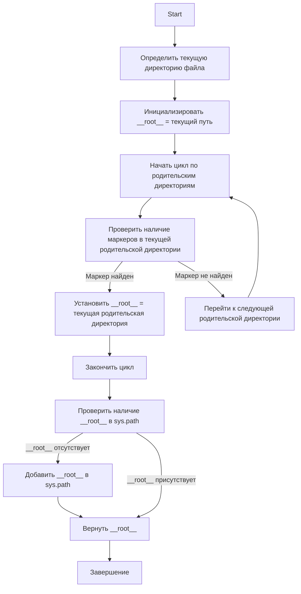

## Анализ кода `hypotez/src/webdriver/bs/header.py`

### 1. <алгоритм>

1.  **Начало**: Запускается скрипт `header.py`.
2.  **Инициализация**:
    *   Импортируются необходимые модули: `sys`, `json`, `packaging.version.Version` и `pathlib.Path`.
    *   Определяется функция `set_project_root` с аргументом `marker_files` (по умолчанию `('__root__', '.git')`).
3.  **Определение текущего пути**:
    *   Внутри функции `set_project_root` определяется текущий путь к директории, в которой находится файл `header.py` через `Path(__file__).resolve().parent`.
    *   Переменной `__root__` изначально присваивается значение текущей директории.
4.  **Поиск корневой директории**:
    *   Цикл `for parent in [current_path] + list(current_path.parents)`: перебирает текущую директорию и все её родительские директории вплоть до корня файловой системы.
    *   Проверяется, существует ли хотя бы один из `marker_files` в текущей родительской директории `parent`:
        *   `if any((parent / marker).exists() for marker in marker_files):`.
        *   Если один из `marker_files` найден,  `__root__` присваивается значение текущей родительской директории `parent` и цикл прерывается.
        *   **Пример**: Если `header.py` находится в `/project/src/webdriver/bs`, а файл `.git` в `/project`, то цикл пройдёт `/project/src/webdriver/bs`, `/project/src/webdriver`, `/project/` и на `/project/` условие `(parent / marker).exists()` вернет `True`, цикл прервется.
5.  **Добавление корневого пути в `sys.path`**:
    *   Если путь `__root__` отсутствует в `sys.path`, он добавляется в начало списка. Это позволяет импортировать модули из корневой директории проекта.
6.  **Возврат значения**:
    *   Функция `set_project_root` возвращает `Path` к найденной корневой директории (или к директории, где находится скрипт, если не найден маркер).
7.  **Присвоение значения**:
    *   Вызывается функция `set_project_root` без аргументов (используются значения по умолчанию), результат присваивается глобальной переменной `__root__`.
8.  **Конец**: Скрипт завершает работу, переменная `__root__` содержит путь к корневой директории проекта.

### 2. <mermaid>


`mermaid` диаграмма показывает пошаговую логику работы функции `set_project_root`.

**Зависимости:**
* `pathlib.Path`: Используется для представления путей к файлам и директориям, а также для манипуляций с ними, таких как определение родительской директории и проверка существования файлов.
* `sys`: Используется для работы с системными переменными, такими как `sys.path`, которые определяют пути поиска модулей.
* `packaging.version.Version`: Несмотря на импорт, не используется в текущем коде.

### 3. <объяснение>

#### Импорты:

*   `import sys`: Модуль `sys` предоставляет доступ к некоторым переменным и функциям, взаимодействующим с интерпретатором Python. Здесь используется для работы с `sys.path` для добавления корневой директории проекта в список путей поиска модулей. Это позволяет импортировать модули из других частей проекта без явного указания их относительного пути.
*   `import json`: Модуль `json` используется для работы с данными в формате JSON. В данном конкретном коде, `json` импортируется, но не используется, что может указывать на его потенциальное использование в будущем или на то, что импорт был добавлен по ошибке.
*   `from packaging.version import Version`: Из пакета `packaging.version` импортируется класс `Version`. Этот класс используется для сравнения и анализа версий пакетов.  Как и `json`, в данном коде импорт не используется, что может указывать на потенциальное использование в будущем.
*   `from pathlib import Path`: Из модуля `pathlib` импортируется класс `Path`. Он предоставляет объектно-ориентированный способ работы с файловыми путями. `Path` упрощает выполнение таких операций, как получение родительской директории, объединение путей и проверка существования файлов.

#### Функция `set_project_root`:

*   **Аргументы**:
    *   `marker_files` (tuple, optional): Набор строк, которые обозначают маркерные файлы или директории. По умолчанию используется `('__root__', '.git')`.
*   **Возвращаемое значение**:
    *   `Path`: Объект `Path`, представляющий корневую директорию проекта.
*   **Назначение**:
    *   Функция предназначена для автоматического определения корневой директории проекта, которая может быть не очевидной при запуске скрипта из поддиректорий.
    *   Алгоритм работает путем поиска родительских директорий вверх по файловой системе, пока не будет найдена директория, содержащая один из маркерных файлов.
    *   После нахождения корневой директории, она добавляется в `sys.path` для обеспечения возможности импорта модулей из разных частей проекта.
*   **Пример**:
    Если структура проекта такая:
    ```
    project/
        .git
        src/
           webdriver/
             bs/
                header.py
    ```
    Вызов `set_project_root()` из `header.py` вернет `Path` к `/project/`.

#### Переменные:

*   `__root__` (Path): Глобальная переменная, которая хранит путь к корневой директории проекта. Она инициализируется значением, возвращенным из `set_project_root()`. Используется для хранения корневой директории и  в дальшейшем может использоваться другими частями проекта для получения базового пути.
*   `current_path` (Path): Локальная переменная внутри `set_project_root`, которая хранит путь к директории, в которой находится файл `header.py`.
*  `parent` (Path): Локальная переменная внутри `set_project_root`, которая в цикле `for` хранит путь к родительской директории на текущей итерации.
* `marker` (str): Локальная переменная внутри `set_project_root`, которая в цикле `for` перебирает маркерные файлы для поиска.

#### Потенциальные ошибки и области для улучшения:

*   **Импорты `json` и `packaging.version`**: Как было указано ранее, модули `json` и `packaging.version.Version` импортируются, но не используются. Это может быть либо избыточным импортом, который можно удалить, либо указанием на их будущее использование. В текущем виде они не несут функциональной нагрузки.
*   **Обработка ошибок**: Функция не обрабатывает ситуации, когда корневая директория не найдена (хотя фактически она всегда возвращает директорию, где находится скрипт, если маркер не найден). Возможно, стоит добавить более явную обработку таких ситуаций, например, вывод предупреждения в консоль.
*   **Гибкость маркерных файлов**: Использование tuple для `marker_files` является хорошей практикой. Однако, возможно, стоит сделать его еще более гибким, например, позволяя передавать список glob-паттернов для поиска.
* **Производительность**:  В случае глубокой структуры файловой системы, поиск корневого каталога может занять некоторое время, особенно если маркерные файлы расположены далеко от текущего скрипта. Возможно, стоит рассмотреть оптимизации, если это становится проблемой производительности.
*  **Зависимость от конкретных маркеров**: Привязка к файлам `'__root__'` и `'.git'` может быть неудобной, если проект не использует git или имеет другие специфичные маркеры. Возможность конфигурации или добавления новых маркеров должна рассматриваться.
* **Отсутсвие комментариев к переменным**: Для переменных используемых внутри функции не хватает комментариев.

#### Цепочка взаимосвязей с другими частями проекта:

*   Данный скрипт `header.py` предназначен для определения корневой директории проекта. Эта директория является основой для работы других частей проекта, поскольку позволяет правильно формировать пути к ресурсам и модулям.
*   Глобальная переменная `__root__`, инициализированная в этом скрипте, может использоваться другими модулями в пакете `src.webdriver.bs` и за его пределами для получения пути к корню проекта. Это создает своего рода централизованную точку доступа к корневой директории.
*  Скрипт использует модуль `sys` для модификации `sys.path`, который влияет на все остальные части проекта. Изменение `sys.path` позволяет другим модулям проекта импортировать модули, которые находятся в корневой директории, что делает проект более модульным.

**В заключении**, скрипт `header.py` выполняет важную функцию определения и установки корневой директории проекта, что обеспечивает корректную работу всего приложения.