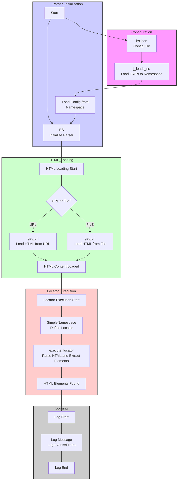

## АНАЛИЗ КОДА: `src/webdriver/bs/readme.ru.md`

### 1. <алгоритм>
1. **Загрузка HTML:**
   - **Пример 1 (из файла):**  Указывается путь к файлу, HTML-содержимое считывается.
     ```
     file_path = "file://path/to/your/file.html"
     html_content = read_file(file_path)  # HTML из файла
     ```
   - **Пример 2 (из URL):**  Указывается URL, HTML-содержимое загружается через HTTP-запрос.
    ```
    url = "https://example.com"
    html_content = get_request(url)  # HTML со страницы
    ```
2. **Инициализация `BS`:**
   - Создается экземпляр класса `BS` с параметрами конфигурации (из `bs.json`) или без них.
   ```python
   # Загрузка настроек из конфигурационного файла
   settings_path = Path("path/to/bs.json")
   settings = j_loads_ns(settings_path)
   # Инициализация парсера BS с URL по умолчанию
   parser = BS(url=settings.default_url)
    ```
3. **Получение HTML:**
   - Вызывается метод `get_url()` с URL или file path. HTML загружается и сохраняется.
    ```
    parser.get_url('file://path/to/your/file.html')
    ```
4. **Определение локатора:**
   - Создается объект локатора `SimpleNamespace`, содержащий настройки поиска (тип, атрибут, XPath-селектор).
    ```python
    locator = SimpleNamespace(by='ID', attribute='element_id', selector='//*[@id="element_id"]')
    ```
5. **Применение локатора:**
   - Вызывается метод `execute_locator()` с объектом локатора.
   - HTML парсится с использованием BeautifulSoup.
   - Извлекаются элементы, соответствующие XPath-селектору.
    ```python
    elements = parser.execute_locator(locator)
    ```
6. **Возврат результата:**
   - Метод `execute_locator()` возвращает список найденных HTML-элементов.
   ```python
    print(elements)
    ```
7. **Логирование:**
    - В процессе работы все значимые события и ошибки логируются.
    ```
    logger.info("HTML-контент успешно загружен.")
    logger.error("Ошибка при загрузке HTML.")
   ```
   
**Поток данных:**
- **`bs.json`** (конфигурация) -> **`BS`** (инициализация)
- **URL/File Path** -> **`BS.get_url()`** -> **HTML Content**
- **`SimpleNamespace`** (локатор) -> **`BS.execute_locator()`** -> **HTML Elements**
- **`logger`** -> **Log File** (в зависимости от уровня логирования)

### 2. <mermaid>


**Зависимости в `mermaid` диаграмме:**
- `Config_File` (`bs.json`): представляет файл конфигурации, содержащий параметры для парсера.
- `j_loads_ns`: функция для загрузки JSON-конфигурации в пространство имен (namespace).
- `Load_settings`:  загруженные настройки из `bs.json`.
- `Init_BS`:  инициализирует парсер `BS`.
- `Get_HTML_URL_File`: проверяет тип источника HTML - URL или файл.
- `Get_from_URL`: метод `get_url`, который загружает HTML-контент по URL.
- `Get_from_File`: метод `get_url`, который загружает HTML-контент из файла.
- `HTML_Loaded`: представляет загруженный HTML-контент.
- `Create_Locator`: создает объект `SimpleNamespace` с настройками локатора.
- `Execute_Locator`: метод `execute_locator`, который парсит HTML и извлекает элементы.
- `Elements_Found`: представляет найденные HTML-элементы.
- `Log_Message`: представляет процесс логирования.

### 3. <объяснение>

#### Импорты:
- `src.webdriver.bs`: (текущий модуль)  этот модуль.
- `types.SimpleNamespace`: используется для создания простых объектов, которые могут хранить атрибуты (используется для хранения настроек локатора).
- `src.utils.jjson.j_loads_ns`: функция, предназначенная для загрузки данных из JSON-файла в объект `SimpleNamespace`.
- `pathlib.Path`:  используется для работы с путями файлов в кроссплатформенном формате.

#### Классы:
- В данном коде не указан класс `BS`. Судя по описанию, `BS` является классом, который должен выполнять следующие функции:
  - Инициализируется с настройками из файла `bs.json` (если передан путь к файлу).
  - Содержит методы для загрузки HTML-контента из файла или URL (`get_url`).
  - Содержит метод для применения XPath-локаторов для извлечения элементов из HTML (`execute_locator`).
  - Ведёт логирование всех действий.
- Класс `SimpleNamespace` используется для представления настроек конфигурации. Его задача – простое хранение настроек без дополнительных методов.

#### Функции:
- `j_loads_ns(path: Path) -> SimpleNamespace`:  загружает конфигурацию из JSON-файла по указанному пути и возвращает ее как `SimpleNamespace`.
-  Метод `get_url(url: str)`: загружает HTML контент из URL или локального файла, и сохраняет его в атрибут `html` объекта `BS`.
-  Метод `execute_locator(locator: SimpleNamespace)`: принимает на вход настройки локатора, парсит HTML-содержимое с помощью `BeautifulSoup` и применяет XPath-селектор с использованием `lxml`, возвращает  список найденных элементов.

#### Переменные:
- `settings_path` (`pathlib.Path`):  путь к файлу конфигурации `bs.json`.
- `settings` (`SimpleNamespace`): объект `SimpleNamespace`, содержащий загруженные настройки из файла `bs.json`.
- `parser` (`BS`): экземпляр класса `BS`, который выполняет парсинг HTML-контента.
- `locator` (`SimpleNamespace`): объект `SimpleNamespace`, содержащий настройки XPath-локатора (например, тип, атрибут и селектор).
- `elements` (`list`):  список HTML-элементов, найденных с помощью XPath-локатора.

#### Взаимосвязь с другими частями проекта:
- **`src.utils.jjson`**: Этот модуль используется для загрузки конфигурационных данных из JSON-файлов, что обеспечивает гибкую настройку парсера.
- **`src.logger`**:  Модуль логгера используется для записи сообщений об ошибках, предупреждениях и отладочной информации, что помогает отслеживать работу парсера.
- `src.webdriver`: этот модуль является частью более крупного модуля `webdriver`, который, вероятно, отвечает за управление браузером и веб-взаимодействием.

#### Потенциальные ошибки и области для улучшения:
1. **Отсутствие обработки ошибок**: Код в `readme.ru.md` не содержит явной обработки ошибок. Потенциальные ошибки могут возникать при загрузке HTML из файла или URL, при парсинге HTML, при применении XPath-локаторов. Необходимо предусмотреть try-except блоки для корректной обработки ошибок и записи их в логи.
2.  **Недостаточная документация `BS`**:   Код подразумевает класс `BS`, но не предоставляет его реализации. Без кода класса `BS` трудно оценить полноту его функциональности и корректность работы.
3.  **Проверка корректности конфигурации**: Необходимо добавить проверку корректности данных, загруженных из `bs.json`, чтобы избежать ошибок при инициализации `BS`.
4.  **Гибкость локаторов**:  Локаторы хранятся в виде `SimpleNamespace` и не поддерживают полную гибкость использования. Возможно стоит рассмотреть использование более сложного подхода для формирования локаторов.
5.  **Управление прокси**: Использование прокси должно поддерживать различные типы прокси (например, SOCKS5) и предоставлять более гибкие настройки, такие как авторизация.

В целом, данный `readme.ru.md` предоставляет обзор функциональности и конфигурации для парсера HTML. Однако для полноценного анализа и использования необходимо иметь доступ к исходному коду класса `BS`.