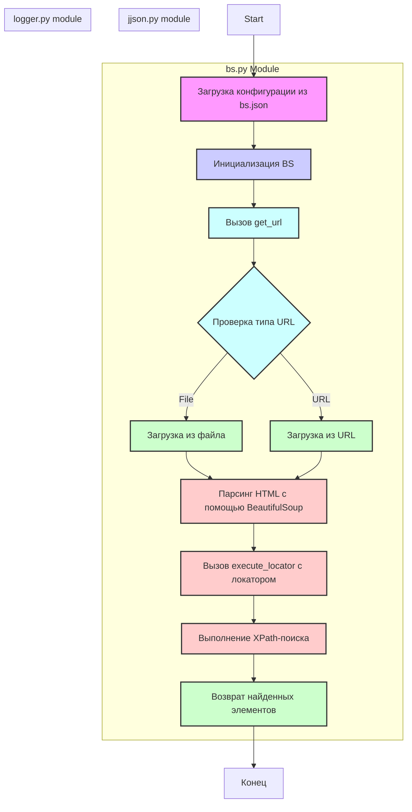
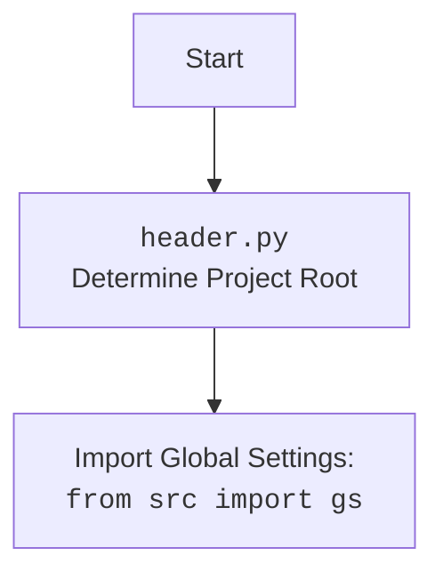

## <алгоритм>

1. **Инициализация парсера `BS`:**
    - Загружаются настройки из файла `bs.json` (`j_loads_ns`).
    - Создается экземпляр класса `BS` с заданным `url` (если предоставлен) или используется значение по умолчанию.
    - Если `url` не задан при инициализации, он может быть установлен позже через метод `get_url`.
    - Настройки логирования из `bs.json` загружаются и конфигурируется логгер.
    - Пример:
       ```python
       # Загрузка настроек
       settings_path = Path('path/to/bs.json')
       settings = j_loads_ns(settings_path)
        # Инициализация парсера
       parser = BS(url=settings.default_url)
       ```
       
2. **Загрузка HTML-контента:**
    - Метод `get_url` вызывается для загрузки HTML-контента.
    - Проверяется, является ли предоставленный путь файлом или URL.
    - В зависимости от типа, HTML-контент загружается из файла или из сети с использованием `requests`.
    - Обработка ошибок: если возникают ошибки при загрузке (например, неверный URL или файл), они логируются.
    - Примеры:
       - Загрузка из файла: `parser.get_url('file://path/to/your/file.html')`
       - Загрузка из URL: `parser.get_url('https://example.com')`
    - Поток данных:
       - Пользователь вызывает `get_url` с файлом или URL.
       - `get_url` определяет тип источника.
       - Если файл, он читается.
       - Если URL, отправляется HTTP-запрос.
       - HTML-контент сохраняется в переменной экземпляра.

3. **Выполнение XPath-локатора:**
    - Метод `execute_locator` вызывается с объектом `locator`.
    -  `locator`  содержит информацию о том, как искать элементы:  `by` (тип, например, ID, CSS, TEXT), `attribute`, и `selector` (XPath).
    - HTML парсится с помощью BeautifulSoup, а затем выполняется поиск элементов с использованием XPath.
    - Если поиск успешен, возвращается список найденных элементов.
    - Примеры:
       - Использование локатора ID: `locator = SimpleNamespace(by='ID', attribute='element_id', selector='//*[@id="element_id"]')`
       - Использование локатора CSS: `locator = SimpleNamespace(by='CSS', attribute='class_name', selector='//*[contains(@class, "class_name")]')`
    - Поток данных:
       - Пользователь вызывает `execute_locator` с локатором.
       - HTML-контент преобразуется в дерево BeautifulSoup.
       - Выполняется XPath-поиск.
       - Найденные элементы возвращаются.

4. **Логирование:**
    - Во время всего процесса работы парсера используется модуль `src.logger` для записи информации о происходящих событиях.
    -  Уровни логирования и путь к файлу определяются в `bs.json`.
    - Все возникающие ошибки, предупреждения и информация записываются в лог.

## <mermaid>



## <объяснение>

**Импорты:**

*   `src.webdriver.bs`: Указывает, что это модуль, находящийся в `src/webdriver/bs`.
*   `types.SimpleNamespace`: Используется для создания простых объектов с атрибутами (в основном для хранения параметров локаторов).
*   `src.utils.jjson.j_loads_ns`: Функция из `src.utils.jjson` для загрузки JSON-файла в виде объекта `SimpleNamespace`. Это используется для загрузки конфигурации из `bs.json`.
*   `pathlib.Path`: Используется для создания путей к файлам, что упрощает работу с файловой системой.
*   `src.logger`: Модуль для логирования ошибок, предупреждений и информации.

**Классы:**

*   `BS`: Основной класс парсера.
    *   **Атрибуты:**
        *   `_url`: URL для загрузки HTML-контента.
        *   `_html`: HTML-контент в виде строки.
        *   `_logger`: Логгер для записи сообщений.
        *   `_settings`: Настройки из файла `bs.json`.
    *   **Методы:**
        *   `__init__(self, url=None)`: Конструктор класса. Инициализирует экземпляр `BS`, загружает настройки из `bs.json` (используя `j_loads_ns`), настраивает логирование и, если передан `url`, сохраняет его.
        *   `get_url(self, url)`: Загружает HTML-контент из файла или URL. Определяет тип источника и загружает контент. Логирует все ошибки.
        *   `execute_locator(self, locator)`: Ищет элементы в HTML, используя XPath. Выполняет поиск и возвращает список найденных элементов.

**Функции:**

*   `j_loads_ns(file_path)`: (из `src.utils.jjson`) Загружает JSON из файла и возвращает его в виде объекта `SimpleNamespace`. Это упрощает доступ к параметрам конфигурации (например, `settings.default_url`).

**Переменные:**

*   `settings_path`: Объект `Path` для пути к файлу `bs.json`.
*   `settings`: Объект `SimpleNamespace`, содержащий настройки, загруженные из `bs.json`.
*   `parser`: Экземпляр класса `BS`.
*   `locator`: Объект `SimpleNamespace`, описывающий способ поиска элементов.
*   `elements`: Список элементов, найденных в HTML.

**Объяснения:**

*   Модуль `src.webdriver.bs` предоставляет возможность загружать HTML и извлекать элементы по заданным XPath-локаторам. Это обеспечивает гибкость при работе с HTML-содержимым из разных источников (файлы или веб-адреса).
*   Использование `SimpleNamespace` для хранения конфигурации и параметров локатора делает код более читаемым.
*   Логирование позволяет отслеживать ошибки и проблемы, возникающие при выполнении парсинга.
*   Конфигурационный файл `bs.json` позволяет задавать настройки парсера, такие как: URL по умолчанию, пути к файлам, параметры прокси и уровни логирования.
*   Модуль использует `BeautifulSoup` и `lxml` для эффективного разбора HTML и XPath.
*   Модуль тесно связан с другими частями проекта:
    *   `src.utils.jjson` используется для загрузки настроек.
    *   `src.logger` используется для логирования.
    *   `src.webdriver` (из контекста пути файла) является родительским каталогом.

**Возможные улучшения:**

*   Добавить поддержку `CSS` селекторов.
*   Добавить проверку на тип возвращаемого значения от метода `execute_locator` (если элементы не найдены).
*   Реализовать возможность извлечения конкретных атрибутов из найденных элементов.
*   Улучшить обработку ошибок при загрузке HTML-контента.

Этот модуль представляет собой хороший пример реализации парсера, который хорошо структурирован и достаточно гибок для различных сценариев использования.