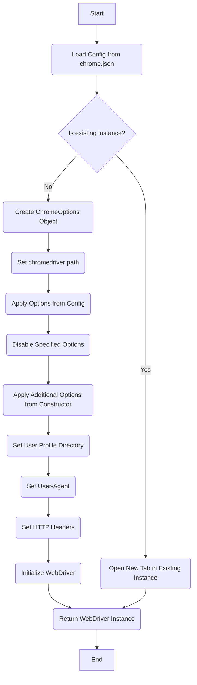
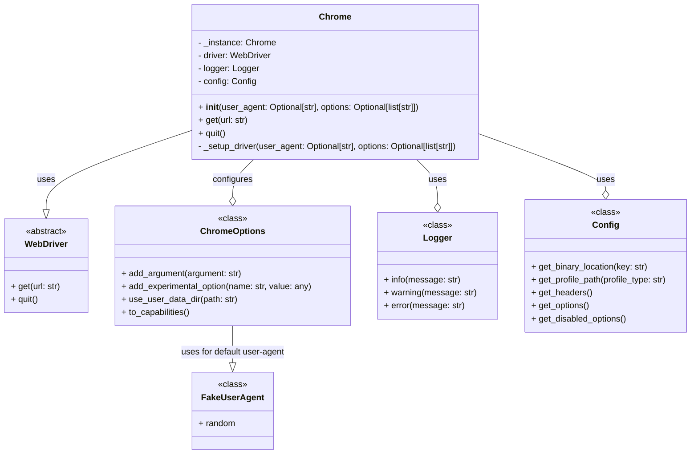
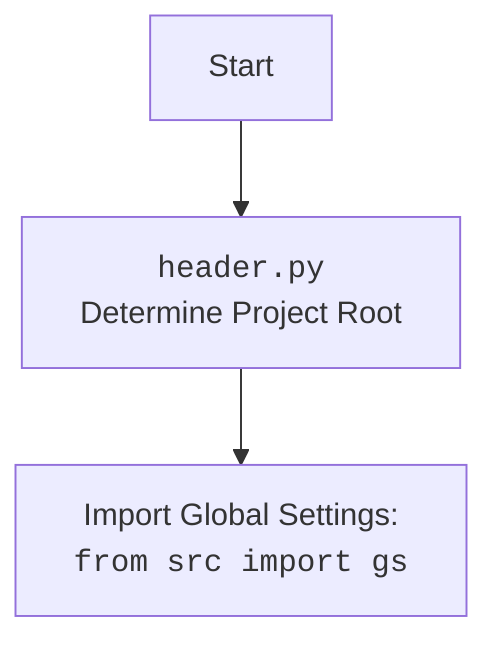

# Анализ кода модуля `src.webdriver.chrome`

## 1. <алгоритм>

### Пошаговое описание работы модуля:

1.  **Инициализация**:
    *   Импортируются необходимые библиотеки: `selenium`, `fake_useragent`, `json`, `os`, `typing`, `src.logger`, `src.utils`, `src.config`.
    *   Загружается конфигурация из `chrome.json` файла.
    *   Инициализируется `logger` для логирования.
2.  **Конфигурация `ChromeOptions`**:
    *   Создается объект `ChromeOptions` из `selenium`.
    *   Устанавливается путь к `chromedriver.exe` из конфигурации, используя `config.get_binary_location("exe")`.
    *   Применяются общие опции из `chrome.json` (например, `log-level`, `disable-dev-shm-usage`, `remote-debugging-port`, `arguments`).
    *   Отключаются опции, указанные в `disabled_options` (например, `headless`).
    *   Применяются дополнительные опции из параметров конструктора, переданные в `__init__`.
3.  **Установка пользовательского профиля**:
    *   Определяется путь к каталогу профиля пользователя, используя `config.get_profile_path()`.
    *   Устанавливается опция `user-data-dir` для `ChromeOptions`.
4.  **Установка User-Agent**:
    *   Если в конструктор передан `user_agent`, то он используется, иначе используется `User-Agent` из `chrome.json`. Если `User-Agent` пуст, то используется `fake_useragent`.
    *   Устанавливается опция `user-agent` для `ChromeOptions`.
5.  **Установка HTTP-заголовков**:
    *   Из `chrome.json` берутся HTTP-заголовки.
    *   Используется `experimental_options` для установки заголовков.
6.  **Инициализация WebDriver**:
    *   Создается экземпляр `webdriver.Chrome` с настроенными `ChromeOptions`.
7.  **Singleton Pattern**:
    *   При повторной инициализации возвращается существующий экземпляр `webdriver.Chrome` вместо создания нового.
    *   Открывается новое окно браузера в существующем экземпляре WebDriver.
8.  **Функциональность**:
    *   Предоставляются методы для работы с браузером, например, `get`, `quit`.
    *   Присутствует логирование ошибок и действий.

### Блок-схема алгоритма:

## 2. <mermaid>


### Анализ зависимостей:
*   **Chrome**: Основной класс для управления браузером Chrome. Использует `WebDriver` от `selenium`, `Logger` для логирования, `Config` для получения конфигурации и `ChromeOptions` для настройки браузера.
*   **WebDriver**: Абстрактный класс, представляющий интерфейс для управления браузером. Класс `Chrome` реализует методы данного интерфейса.
*   **ChromeOptions**: Класс для настройки опций браузера Chrome. Используется для установки аргументов, экспериментальных опций, пути к профилю пользователя и т.д.
*  **Logger**:  Класс, отвечающий за логирование.
*   **Config**:  Класс, управляющий загрузкой и получением конфигурации из файла `chrome.json`.
*  **FakeUserAgent**: Класс для генерации случайных User-Agent.
    

### Анализ `header.py`
*   Импортирует глобальные настройки `gs` из пакета `src`.
*   Определяет корневую директорию проекта.

## 3. <объяснение>

### Импорты:

*   `selenium.webdriver`: Основной модуль для управления веб-браузерами с использованием Selenium.
    *   `selenium.webdriver.chrome.options`: Модуль для настройки опций браузера Chrome.
    *   `selenium.webdriver.chrome.service`: Модуль для запуска ChromeDriver.
    *   `selenium.webdriver.chrome.webdriver`: Модуль, предоставляющий класс `webdriver.Chrome`.
    *   `selenium.webdriver.remote.webdriver`: Базовый класс WebDriver.
*   `fake_useragent`: Библиотека для генерации случайных User-Agent, что полезно для избежания блокировки сайтов.
*   `json`: Стандартный модуль Python для работы с JSON-файлами. Используется для загрузки конфигурации из `chrome.json`.
*   `os`: Стандартный модуль Python для взаимодействия с операционной системой. Используется для работы с путями к файлам и каталогам.
*   `typing`: Модуль Python для аннотации типов, что улучшает читаемость и позволяет проводить статическую проверку типов.
*   `src.logger`:  Пользовательский модуль для логирования событий, позволяющий отслеживать работу модуля и выявлять ошибки.
*   `src.utils`:  Пользовательский модуль с дополнительными утилитами, которые могут понадобиться для работы.
*   `src.config`:  Пользовательский модуль, предоставляющий классы для работы с конфигурацией приложения. Используется для получения путей к драйверу, профилям и опций из `chrome.json`.

### Классы:

*   **`Chrome`**: Основной класс для управления браузером Chrome.
    *   **Атрибуты**:
        *   `_instance: Chrome | None`: Хранит ссылку на единственный экземпляр класса.
        *   `driver: webdriver.Chrome`: Экземпляр `webdriver.Chrome` для управления браузером.
        *   `logger: Logger`: Экземпляр класса `Logger` для логирования.
        *   `config: Config`: Экземпляр класса `Config` для доступа к конфигурациям.
    *   **Методы**:
        *   `__init__(user_agent: Optional[str], options: Optional[list[str]])`: Конструктор класса. Инициализирует WebDriver, настраивая его параметры из `chrome.json`. Применяет паттерн Singleton.
        *   `get(url: str)`: Открывает веб-страницу по заданному URL.
        *   `quit()`: Закрывает браузер и WebDriver.
        *   `_setup_driver(user_agent: Optional[str], options: Optional[list[str]])`: Приватный метод для настройки и инициализации `webdriver.Chrome`.
    *   **Взаимодействие**: Использует классы `webdriver.Chrome`, `ChromeOptions`, `Config`, `Logger` и `FakeUserAgent` для создания и настройки экземпляра браузера.

### Функции:
*   `__init__(self, user_agent: Optional[str] = None, options: Optional[list[str]] = None)`: Конструктор класса.
    *   **Аргументы**:
        *   `user_agent: Optional[str] = None`: Пользовательский User-Agent.
        *   `options: Optional[list[str]] = None`: Список дополнительных опций для Chrome.
    *   **Возвращает**: `None`.
    *   **Назначение**: Инициализирует `webdriver.Chrome`, настраивает его параметры из `chrome.json` или из параметров конструктора, если они были переданы. Реализует Singleton Pattern.
    *   **Пример**:
    ```python
    browser = Chrome(user_agent="Mozilla/5.0 ...", options=["--headless"])
    ```
*   `get(self, url: str)`: Открывает веб-страницу.
    *   **Аргументы**:
        *   `url: str`: URL открываемой веб-страницы.
    *   **Возвращает**: `None`.
    *   **Назначение**: Вызывает метод `get` у экземпляра `webdriver.Chrome`.
    *   **Пример**:
    ```python
    browser.get("https://example.com")
    ```
*   `quit(self)`: Закрывает браузер.
    *   **Аргументы**: `None`.
    *   **Возвращает**: `None`.
    *   **Назначение**: Вызывает метод `quit` у экземпляра `webdriver.Chrome`.
    *   **Пример**:
    ```python
    browser.quit()
    ```
*  `_setup_driver(self, user_agent: Optional[str] = None, options: Optional[list[str]] = None)`: Приватный метод для настройки и инициализации `webdriver.Chrome`.
    *   **Аргументы**:
        *   `user_agent: Optional[str] = None`: Пользовательский User-Agent.
        *   `options: Optional[list[str]] = None`: Список дополнительных опций для Chrome.
    *   **Возвращает**: `None`.
    *   **Назначение**: Загружает конфигурацию, настраивает `ChromeOptions` и инициализирует `webdriver.Chrome`

### Переменные:

*   `_instance: Chrome | None`: Приватная статическая переменная, которая хранит ссылку на единственный экземпляр класса.
*   `driver: webdriver.Chrome`: Экземпляр `webdriver.Chrome`, который управляет браузером.
*   `logger: Logger`: Экземпляр класса `Logger` для логирования ошибок и действий.
*   `config: Config`: Экземпляр класса `Config` для доступа к настройкам.
*   `options: ChromeOptions`: Экземпляр класса `ChromeOptions` для настройки опций Chrome.

### Потенциальные ошибки и области для улучшения:

1.  **Обработка ошибок**:
    *   Необходимо добавить более надежную обработку исключений, особенно при загрузке конфигурации из `chrome.json` и при инициализации `webdriver.Chrome`.
    *   Следует предусмотреть сценарии, когда `chromedriver` не найден или не соответствует версии браузера.
2.  **Конфигурация**:
    *   Проверка корректности данных в `chrome.json`.
    *   Добавить валидацию данных перед их использованием.
3.  **Гибкость**:
    *   Возможность передачи дополнительных настроек `ChromeOptions` при инициализации.
    *   Реализовать возможность использования нескольких профилей для разных целей.
    *   Поддержка других веб-драйверов (например, Firefox).
4.  **Улучшение логирования**:
    *   Более детальное и структурированное логирование.
    *   Возможность вывода логов в файл или консоль.
    *   Возможность настраивать уровень логирования.

### Взаимосвязь с другими частями проекта:
*  `src.logger`: Обеспечивает логирование работы `Chrome`, позволяя отслеживать его действия и ошибки.
*  `src.utils`: Предоставляет утилиты для работы с конфигурациями.
*  `src.config`:  Получает настройки `chrome.json`.
*  `src.header`: Определяет корневую директорию проекта.

Этот анализ обеспечивает всестороннее понимание кода и его места в проекте.