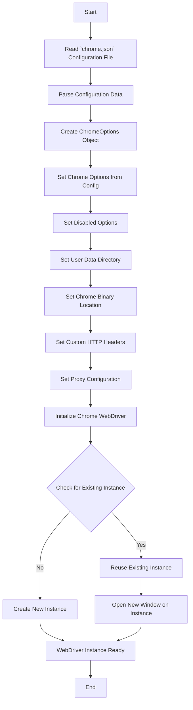

## Анализ кода `README.MD`

### 1. <алгоритм>

1.  **Начало**: Документ `README.MD` предназначен для описания модуля `src.webdriver.chrome`, который предоставляет пользовательскую реализацию Chrome WebDriver на основе Selenium.

2.  **Описание модуля**:
    *   Модуль предназначен для управления настройками Chrome через файл `chrome.json`.
    *   Позволяет использовать различные профили браузера.
    *   Обеспечивает улучшенное логирование и обработку ошибок.
    *   Поддерживает передачу пользовательских опций при инициализации WebDriver.

3.  **Требования**:
    *   Python 3.x
    *   Selenium
    *   Fake User Agent
    *   Chrome WebDriver binary (chromedriver)

4.  **Установка зависимостей**:
    *   Команда `pip install selenium fake_useragent` устанавливает необходимые Python-пакеты.
    *   `chromedriver` должен быть доступен в `PATH` или его путь должен быть указан в конфигурации.

5.  **Конфигурация (chrome.json)**:
    *   Файл содержит настройки для WebDriver.
    *   Структура: `options`, `disabled_options`, `profile_directory`, `binary_location`, `headers`, `proxy_enabled`.
    *   Пример конфигурации:
        ```json
        {
          "options": {
            "log-level": "5",
            "disable-dev-shm-usage": "",
            "remote-debugging-port": "0",
            "arguments": [ "--kiosk", "--disable-gpu" ]
          },
        
          "disabled_options": { "headless": "" },
        
          "profile_directory": {
            "os": "%LOCALAPPDATA%\\\\Google\\\\Chrome\\\\User Data",
            "internal": "webdriver\\\\chrome\\\\profiles\\\\default",
            "testing": "%LOCALAPPDATA%\\\\Google\\\\Chrome for Testing\\\\User Data"
          },
        
          "binary_location": {
            "os": "C:\\\\Program Files\\\\Google\\\\Chrome\\\\Application\\\\chrome.exe",
            "exe": "bin\\\\webdrivers\\\\chrome\\\\125.0.6422.14\\\\chromedriver.exe",
            "binary": "bin\\\\webdrivers\\\\chrome\\\\125.0.6422.14\\\\win64-125.0.6422.14\\\\chrome-win64\\\\chrome.exe",
            "chromium": "bin\\\\webdrivers\\\\chromium\\\\chrome-win\\\\chrome.exe"
          },
        
          "headers": {
            "User-Agent": "Mozilla/5.0 (Windows NT 10.0; Win64; x64) AppleWebKit/537.36 (KHTML, like Gecko) Chrome/97.0.4692.71 Safari/537.36",
            "Accept": "text/html,application/xhtml+xml,application/xml,application/json;q=0.9,*/*;q=0.8",
            "Accept-Charset": "ISO-8859-1,utf-8;q=0.7,*;q=0.3",
            "Accept-Encoding": "none",
            "Accept-Language": "en-US,en;q=0.8",
            "Connection": "keep-alive"
          },
          "proxy_enabled": false
        }
        ```

6.  **Описание полей конфигурации**:
    *   `options`: Настройки Chrome, такие как уровень логирования, отключение `dev-shm`, порт отладки и аргументы командной строки.
    *   `disabled_options`: Отключаемые опции (например, `headless`).
    *   `profile_directory`: Пути к каталогам пользовательских данных для разных окружений (os, internal, testing).
    *   `binary_location`: Пути к исполняемым файлам Chrome и `chromedriver`.
    *   `headers`: Пользовательские HTTP-заголовки для браузерных запросов.
    *   `proxy_enabled`: Флаг для включения/выключения прокси-сервера.

7.  **Использование**:
    *   Импорт `Chrome` класса из `src.webdriver.chrome`.
    *   Инициализация WebDriver с пользовательским user-agent и опциями:

        ```python
        from src.webdriver.chrome import Chrome
        
        browser = Chrome(user_agent="Mozilla/5.0 (Windows NT 10.0; Win64; x64)", options=["--headless", "--disable-gpu"])
        browser.get("https://www.example.com")
        browser.quit()
        ```
    *   `Chrome` загружает настройки из `chrome.json` и использует их для конфигурации WebDriver.
    *   Поддерживается передача пользовательского `user-agent` и дополнительных опций.

8.  **Singleton Pattern**:
    *   Используется шаблон Singleton для создания только одного экземпляра WebDriver.
    *   При повторном создании используется существующий экземпляр, а открывается новое окно.

9.  **Логирование и отладка**:
    *   Используется `logger` из `src.logger` для логирования ошибок, предупреждений и общей информации.
    *   Примеры логов:
        *   `Error initializing Chrome WebDriver: <error details>`
        *   `Error in chrome.json file: <issue details>`

10. **Лицензия**:
    *   Проект лицензирован по MIT License.

### 2. <mermaid>



**Анализ зависимостей `mermaid`:**

Диаграмма `mermaid` показывает следующий поток данных:

1.  **Start**: Начало процесса инициализации WebDriver.
2.  **ReadConfig**: Считывание конфигурации из `chrome.json`.
3.  **ParseConfig**: Разбор данных конфигурации, извлечение параметров и путей.
4.  **CreateOptions**: Создание объекта `ChromeOptions` для настройки WebDriver.
5.  **SetOptions**: Установка параметров Chrome из конфигурации (log-level, arguments, remote-debugging-port и т.д.).
6.  **SetDisabledOptions**: Установка отключенных опций (например, `headless`).
7.  **SetProfileDirectory**: Установка пути к каталогу пользовательских данных.
8.  **SetBinaryLocation**: Установка пути к исполняемым файлам Chrome и ChromeDriver.
9.  **SetHeaders**: Установка пользовательских HTTP-заголовков.
10. **SetProxy**: Установка прокси-сервера, если включен.
11. **InitWebDriver**: Инициализация Chrome WebDriver с помощью Selenium.
12. **InstanceCheck**: Проверка наличия существующего экземпляра WebDriver (Singleton).
13. **ReuseInstance**: Если экземпляр есть, повторное использование.
14. **CreateNewInstance**: Если экземпляра нет, создание нового.
15. **WebDriverReady**: WebDriver готов к использованию.
16. **OpenNewWindow**: Открытие нового окна в существующем экземпляре.
17. **End**: Конец процесса.

Эта диаграмма показывает последовательность действий, которые выполняются при создании экземпляра `Chrome` WebDriver.

### 3. <объяснение>

#### Импорты:

В данном документе `README.MD` импортов нет, так как это документация, а не код. Однако, в коде, который этот документ описывает (`src.webdriver.chrome`) будут следующие импорты:

*   `selenium`: Используется для управления браузером Chrome.
*   `fake_useragent`: Используется для генерации случайных `user-agent`.
*   `src.logger`: Используется для логирования действий.
*   `src.config`: Используется для загрузки конфигурации из `chrome.json`.

#### Классы:

В этом документе описывается использование класса `Chrome` в модуле `src.webdriver.chrome`. Этот класс является основным элементом, который используется для создания экземпляра `Chrome WebDriver`. Этот класс, предположительно, реализует шаблон проектирования Singleton.

*   **Роль**: Предоставляет настроенный экземпляр Chrome WebDriver.
*   **Атрибуты**: Атрибуты класса будут включать в себя:
    *   Конфигурации из `chrome.json` (опции, заголовки, пути и т.д.).
    *   Экземпляр `webdriver.Chrome` (после его инициализации).
    *   `user-agent` и другие опции, переданные при создании экземпляра.
*   **Методы**: 
    *   `__init__`: Инициализирует WebDriver, настраивает опции из файла конфигурации, устанавливает заголовки, прокси, `user-agent` и пр.
    *  `get()`: Открывает веб-страницу.
    *  `quit()`: Закрывает браузер.
    * Возможно другие методы взаимодействия с браузером.

#### Функции:

В этом `README.MD` нет описания конкретных функций, но класс `Chrome` будет содержать методы инициализации и управления браузером.

#### Переменные:

В `README.MD` описаны переменные, которые используются в файле конфигурации `chrome.json`. Эти переменные задают параметры для настройки WebDriver.

*   **Типы**: В основном строки, булевы значения и списки.
*   **Использование**: 
    *  `options`: Для настройки параметров запуска браузера.
    *  `disabled_options`: Для отключения определённых опций.
    *  `profile_directory`: Для установки каталогов пользовательских данных.
    *  `binary_location`: Для указания путей к исполняемым файлам.
    *  `headers`: Для настройки HTTP-заголовков.
    *  `proxy_enabled`: Для включения/выключения прокси.

#### Потенциальные ошибки и области для улучшения:

*   **Конфигурационные ошибки**: Неправильные пути или форматы данных в `chrome.json` могут привести к сбоям при инициализации WebDriver.
*   **Несовместимость версий**: Несовместимость между версией `chromedriver` и Chrome может привести к ошибкам.
*   **Управление прокси**: Реализация прокси может быть расширена для поддержки различных типов прокси.
*  **Пути**: Пути к каталогам и файлам заданы явно и не являются переносимыми между ОС. Необходимо использовать кроссплатформенные решения, например, `os.path`
*  **Обработка ошибок**: Обработка ошибок может быть улучшена для более точного определения причин сбоев.
*  **Singleton Pattern**:  Реализация Singleton pattern может потребовать дополнительной проверки на потокобезопасность при использовании в многопоточном окружении.

#### Взаимосвязи с другими частями проекта:

*   **`src.logger`**: Модуль логирования используется для записи ошибок и предупреждений, что помогает в отладке.
*   **`src.config`**: Используется для загрузки и обработки конфигурационных файлов.
*   **Другие модули**: `src.webdriver.chrome` может зависеть от других модулей проекта, которые используют WebDriver для автоматизации тестирования.
* **`src.utils`**: `utils` могут содержать общие функции для работы с путями к файлам или для кроссплатформенной разработки.

В целом, данный `README.MD` документ предоставляет исчерпывающее описание модуля `src.webdriver.chrome`, включая его функциональность, требования, конфигурацию и использование. Он также выделяет основные моменты, которые необходимо учитывать при работе с этим модулем.