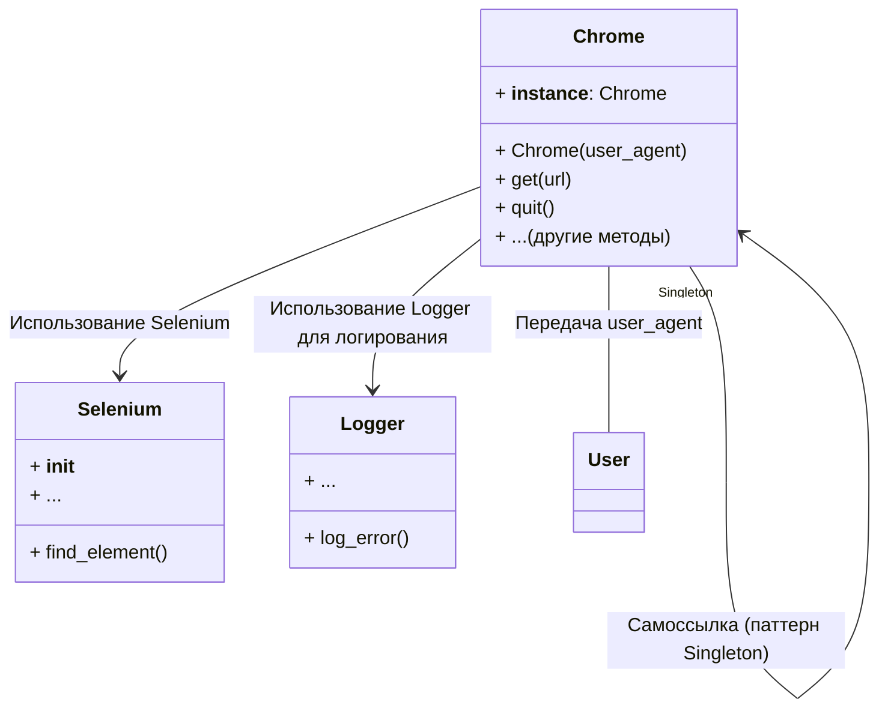

```MD
# Анализ кода Chrome WebDriver для Selenium

## <input code>

```rst
.. module:: src.webdriver.chrome
```
# Chrome WebDriver для Selenium

Этот репозиторий предоставляет пользовательскую реализацию Chrome WebDriver, использующую Selenium. Он интегрирует настройки конфигурации, определенные в файле `chrome.json`, такие как пользовательский агент и настройки профиля браузера, для обеспечения гибких и автоматизированных взаимодействий с браузером.

## Ключевые особенности

- **Централизованная конфигурация**: Конфигурация управляется через файл `chrome.json`.
- **Несколько профилей браузера**: Поддерживает несколько профилей браузера, позволяя пользователям настраивать разные параметры для тестирования.
- **Улучшенное логирование и обработка ошибок**: Предоставляет подробные логи для инициализации, проблем с конфигурацией и ошибок WebDriver.

## Предварительные условия

Перед использованием этого WebDriver убедитесь, что установлены следующие зависимости:

- Python 3.x
- Selenium
- Fake User Agent
- Бинарник WebDriver для Chrome (например, `chromedriver`)

Установите необходимые зависимости Python:

```bash
pip install selenium fake_useragent
```

Кроме того, убедитесь, что бинарник `chromedriver` доступен в переменной окружения `PATH` или укажите путь к нему в конфигурации.

## Конфигурация

Конфигурация для Chrome WebDriver хранится в файле `chrome.json`. Ниже приведен пример структуры файла конфигурации и его описание:

### Пример конфигурации (`chrome.json`)

```json
{
  "options": {
    "log-level": "5",
    "disable-dev-shm-usage": "",
    "remote-debugging-port": "0",
    "arguments": [ "--kiosk", "--disable-gpu" ]
  },
  "disabled_options": { "headless": "" },
  "profile_directory": {
    "os": "%LOCALAPPDATA%\\\\Google\\\\Chrome\\\\User Data",
    "internal": "webdriver\\\\chrome\\\\profiles\\\\default",
    "testing": "%LOCALAPPDATA%\\\\Google\\\\Chrome for Testing\\\\User Data"
  },
  "binary_location": {
    "os": "C:\\\\Program Files\\\\Google\\\\Chrome\\\\Application\\\\chrome.exe",
    "exe": "bin\\\\webdrivers\\\\chrome\\\\125.0.6422.14\\\\chromedriver.exe",
    "binary": "bin\\\\webdrivers\\\\chrome\\\\125.0.6422.14\\\\win64-125.0.6422.14\\\\chrome-win64\\\\chrome.exe",
    "chromium": "bin\\\\webdrivers\\\\chromium\\\\chrome-win\\\\chrome.exe"
  },
  // ... (остальная конфигурация)
}
```

## <algorithm>

Блок-схема алгоритма отсутствует, так как предоставленный код - это описание класса, а не фрагмент кода с алгоритмом.  Документация описывает функциональность класса `Chrome`, но не реализацию.  Алгоритм работы будет реализован в методах класса.

## <mermaid>



## <explanation>

**Импорты:**

Документация указывает на использование `Selenium` и `fake_useragent`, но не приводится конкретный импорт.  Предполагается, что они импортируются в модуле `src.webdriver.chrome`.  Связь с `src.logger` также указана для логирования ошибок.

**Классы:**

Класс `Chrome` реализует интерфейс для взаимодействия с браузером Chrome.  Он, вероятно, использует `Selenium` для создания WebDriver и управления браузером.  Атрибут `__instance__` указывает на паттерн Singleton, гарантирующий создание единственного экземпляра `Chrome`.  Методы `get()`, `quit()`, и другие методы отвечают за взаимодействие с браузером.

**Функции:**

Нет определенных функций, описанных в документации.  Предполагается, что они реализуют логику взаимодействия с браузером Chrome (внутренние методы класса `Chrome`).

**Переменные:**

Переменные `user_agent` (в примере кода `usage`) - строка, представляющая строку user-agent.  Другие переменные присутствуют в `chrome.json`, это настройки для Chrome WebDriver.  Их типы соответствуют типам данных JSON (строки, числа, массивы).

**Возможные ошибки и улучшения:**

- Отсутствует код, поэтому невозможно точно определить ошибки или области для улучшения.
- Необходимо добавить обработку исключений для таких ситуаций, как невозможность найти элементы на странице, ошибки при запуске WebDriver или ошибки чтения из `chrome.json`.
- Необходимо документировать параметры конструктора и методы `Chrome` класса, что позволит более удобно и корректно использовать его.
- Не указана логика обработки разных платформ.  `%LOCALAPPDATA%` - специфично для Windows.  Необходимо обеспечить переносимость.
- Не учтены возможные ошибки валидации в `chrome.json`.  Проверка корректности данных из файла `chrome.json` поможет предотвратить проблемы при использовании.
- Документация могла бы быть более подробной и содержать примеры использования для разных методов.

**Взаимосвязи с другими частями проекта:**

Класс `Chrome` зависит от библиотек `Selenium` и `fake_useragent`.  Он также использует логирование из модуля `src.logger`, что делает его зависимым от этого модуля.  Взаимодействие с другими частями проекта происходит через вызовы методов, например, `get()` (для взаимодействия с браузером).