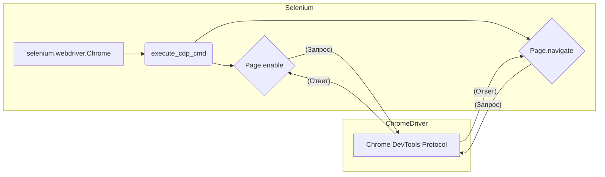

# Анализ кода для интеграции WebDriver и DevTools Protocol

## <input code>

```python
from selenium import webdriver
from selenium.webdriver.chrome.service import Service
from selenium.webdriver.chrome.options import Options

# Set the path to ChromeDriver
service = Service('/path/to/chromedriver')

# Configure ChromeOptions
chrome_options = Options()
chrome_options.add_argument('--remote-debugging-port=9222')

# Launch Chrome with specified options
driver = webdriver.Chrome(service=service, options=chrome_options)

# Get DevTools session
dev_tools = driver.execute_cdp_cmd('Page.enable', {})

# Execute a command via DevTools Protocol
response = driver.execute_cdp_cmd('Page.navigate', {'url': 'https://www.example.com'})
print(response)

# Close the browser
driver.quit()
```

## <algorithm>

```mermaid
graph TD
    A[Инициализация] --> B{Установить путь к ChromeDriver};
    B --> C[Настройка ChromeOptions];
    C --> D[Запуск Chrome];
    D --> E[Получить сессию DevTools];
    E --> F[Выполнить команду Page.navigate];
    F --> G[Вывод ответа];
    G --> H[Закрытие браузера];
    
    subgraph "Детали"
        B -.-> B1{Создание объекта Service};
        C -.-> C1{Создание объекта Options};
        C1 -.-> C2{Установить порт удаленной отладки};
        D -.-> D1{Использование webdriver.Chrome()};
    end
```

**Пример:**

1. **Инициализация**: Устанавливается путь к исполняемому файлу ChromeDriver.
2. **Настройка ChromeOptions**: Добавляется аргумент `--remote-debugging-port=9222`, необходимый для включения DevTools.
3. **Запуск Chrome**: Chrome запускается с указанными опциями, позволяющими взаимодействовать с DevTools.
4. **Получение сессии DevTools**: Выполняется команда `Page.enable`, устанавливающая соединение с DevTools.
5. **Выполнение команды Page.navigate**: Отправляется команда `Page.navigate` для перехода на указанный URL. Результат выполнения сохраняется в переменной `response`.
6. **Вывод ответа**: Выводится полученный ответ от сервера DevTools.
7. **Закрытие браузера**: Браузер закрывается.

## <mermaid>



**Объяснение:**  Диаграмма отображает взаимодействие между Selenium, ChromeDriver и Chrome DevTools Protocol.  Selenium использует метод `execute_cdp_cmd` для передачи команд DevTools Protocol через ChromeDriver, который передает их в Chrome.  Результат выполнения команд возвращается обратно в Selenium.


## <explanation>

**Импорты:**

- `from selenium import webdriver`: Импортирует основной класс `webdriver` из библиотеки Selenium, необходимый для управления браузером.
- `from selenium.webdriver.chrome.service import Service`: Импортирует класс `Service` для управления ChromeDriver.
- `from selenium.webdriver.chrome.options import Options`: Импортирует класс `Options` для настройки Chrome, в том числе для работы с DevTools.

**Классы:**

- `Service`: Класс, отвечающий за управление ChromeDriver.  В данном примере используется для задания пути к исполняемому файлу.
- `Options`: Класс для настройки параметров браузера, в данном случае для работы с DevTools.
- `webdriver`:  Основной класс для управления браузером и взаимодействия с ним.  Определяет методы для управления элементами страницы, навигации, и т.д., включая `execute_cdp_cmd`.

**Функции:**

- `driver.execute_cdp_cmd`:  Функция для выполнения команд DevTools Protocol. Принимает имя команды и параметры, возвращает ответ от сервера DevTools.

**Переменные:**

- `service`: Объект класса `Service`, хранит путь к ChromeDriver.
- `chrome_options`: Объект класса `Options`, хранит конфигурацию Chrome для работы с DevTools.
- `driver`: Объект класса `webdriver.Chrome`, представляющий запущенный браузер Chrome.
- `dev_tools`: Результат выполнения `driver.execute_cdp_cmd('Page.enable', {})`, представляющий активную сессию DevTools.
- `response`:  Результат выполнения `driver.execute_cdp_cmd('Page.navigate', {'url': 'https://www.example.com'})`.

**Возможные ошибки и улучшения:**

- **Отсутствие проверки ошибок:**  Код не содержит проверки ошибок, таких как отсутствие ChromeDriver, неправильный путь, или проблемы с соединением с DevTools.  Необходимо добавить обработку исключений (try-except блоки).
- **Неудаление временных файлов**: Код не удаляет временные файлы, созданные ChromeDriver.
- **Не указан путь:** В коде отсутствует путь к ChromeDriver, что требует его указания.
- **Задержка:** Необходимо добавить задержку между запуском браузера и выполнением `driver.execute_cdp_cmd('Page.navigate', {'url': 'https://www.example.com'})` для корректной работы, особенно если страница сложная.


**Связь с другими частями проекта:**

Код напрямую взаимодействует с `webdriver` и `chromedriver` для выполнения задач управления браузером через протокол DevTools. Это позволяет интегрировать тесты и автоматизацию в проекты, которые используют Selenium.