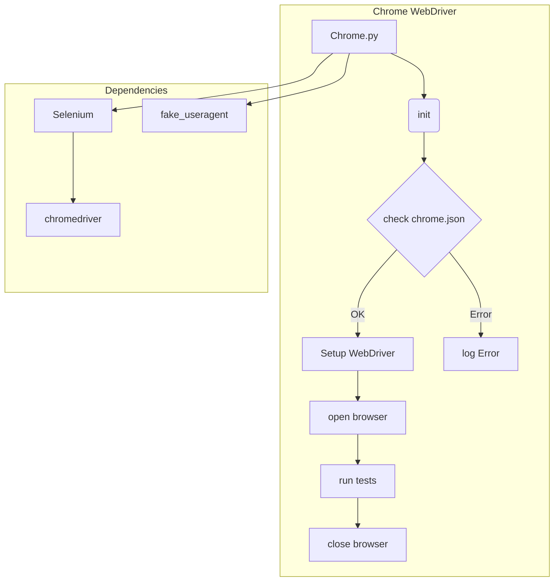

```MD
# Анализ кода Chrome WebDriver для Selenium

## <input code>

```rst
.. :module: src.webdriver.chrome
```
# Chrome WebDriver for Selenium

This repository provides a custom implementation of the Chrome WebDriver using Selenium. It integrates configuration settings defined in the `chrome.json` file, such as user-agent and browser profile settings, to enable flexible and automated browser interactions.

## Key Features

- **Centralized Configuration**: Configuration is managed through a `chrome.json` file.
- **Multiple Browser Profiles**: Supports multiple browser profiles, enabling users to configure different settings for testing.
- **Enhanced Logging and Error Handling**: Provides detailed logs for initialization, configuration issues, and WebDriver errors.

## Prerequisites

... (Prerequisites and installation instructions)

## Configuration

... (Configuration details and example `chrome.json`)

## Usage

... (Usage example and explanation)

### Singleton Pattern

... (Explanation of the Singleton pattern)

## Logging and Debugging

... (Explanation of logging and error handling)

```

## <algorithm>

К сожалению, предоставленный код представляет собой README.md файл, а не код программы.  Поэтому построить блок-схему алгоритма работы невозможно.  README.md описывает *идею* работы класса `Chrome` и его зависимостей, но не реализует его.

## <mermaid>



**Описание диаграммы:**

* **Chrome WebDriver:** Блок, представляющий класс `Chrome`.
* **init:** Инициализация экземпляра класса.
* **check chrome.json:** Проверка файла конфигурации `chrome.json`.
* **Setup WebDriver:** Настройка WebDriver с использованием данных из `chrome.json`.
* **log Error:**  Запись ошибок в лог.
* **open browser:** Открытие браузера Chrome.
* **run tests:** Выполнение тестовых сценариев.
* **close browser:** Закрытие браузера.
* **Dependencies:** Блок, описывающий зависимости.
* **Selenium:** Библиотека Selenium для управления браузером.
* **fake_useragent:** Библиотека для генерации случайных user-agent строк.
* **chromedriver:** Драйвер Chrome для взаимодействия с браузером.


## <explanation>

**Импорты:**

Файл README.md не содержит кода импорта.  В коде программы, соответствующем этому описанию, вероятно будут импорты из библиотек `selenium`, `fake_useragent`, и возможно `src.logger` для работы с логированием.

**Классы:**

Документация описывает класс `Chrome`, который, по всей видимости, реализует Singleton паттерн для управления экземплярами Chrome WebDriver.  В коде будет определен конструктор `__init__`, методы для работы с браузером (`get`, `quit`),  возможно методы для работы с конфигурацией.  Важно, что класс будет использовать `chrome.json` для настройки.

**Функции:**

Файл README.md описывает ожидаемые функции, но не их реализацию.  Это инициализация браузера (с возможностью переопределения user-agent), открытие веб-страниц (`get`) и закрытие браузера (`quit`).  В коде должны быть функции для парсинга файла `chrome.json` и создания параметров для драйвера.

**Переменные:**

README.md описывает переменные, которые будут использоваться для хранения конфигурации (`chrome.json`, user-agent, paths к файлам драйвера).


**Возможные ошибки и области для улучшений:**

* **Обработка ошибок:** Хотя README.md упоминает логирование, важны детали реализации обработки ошибок (например, исключения при работе с `chrome.json`, проблемы с установкой ChromeDriver).
* **Модульность:** Возможно, стоит разделить логику конфигурации (читание `chrome.json`) на отдельный модуль или функцию, чтобы улучшить читаемость и тестируемость кода.
* **Обновление конфигурации:** Если `chrome.json` изменяется во время работы программы, механизм обновления параметров должен быть реализован.
* **Тестирование:** Необходимо написать тесты для проверки корректности работы класса `Chrome` с различными сценариями, включая разные настройки в `chrome.json` и обработку ошибок.
* **Документация:**  Хотя README.md хорошее начало,  необходимо добавить подробную документацию внутри класса и методов (`__init__`, `get`, `quit`) с примерами использования.

**Взаимосвязи с другими частями проекта:**

Описание предполагает, что класс `Chrome` взаимодействует с модулем `src.logger` для логирования. Также ожидается зависимость от Selenium и `fake_useragent`.