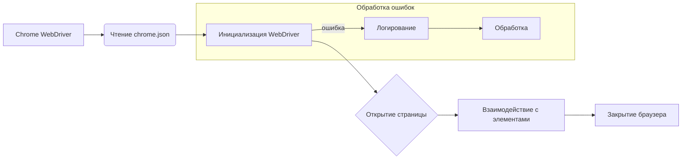

# Анализ кода Chrome WebDriver

## <input code>

```rst
.. :module: src.webdriver.chrome
```
# Chrome WebDriver для Selenium

Этот репозиторий предоставляет пользовательскую реализацию Chrome WebDriver с использованием Selenium. Он интегрирует настройки конфигурации, определенные в файле `chrome.json`, такие как пользовательский агент и настройки профиля браузера, чтобы обеспечить гибкие и автоматизированные взаимодействия с браузером.

## Ключевые особенности

- **Централизованная конфигурация**: Конфигурация управляется через файл `chrome.json`.
- **Несколько профилей браузера**: Поддерживает несколько профилей браузера, позволяя пользователям настраивать различные параметры для тестирования.
- **Улучшенное логирование и обработка ошибок**: Предоставляет подробные логи для инициализации, проблем с конфигурацией и ошибок WebDriver.

## Предварительные условия

Перед использованием этого WebDriver убедитесь, что установлены следующие зависимости:

- Python 3.x
- Selenium
- Fake User Agent
- Двоичный файл WebDriver для Chrome (например, `chromedriver`)

Установите необходимые зависимости Python:

```bash
pip install selenium fake_useragent
```

Кроме того, убедитесь, что двоичный файл `chromedriver` доступен в переменной среды `PATH` или укажите путь к нему в конфигурации.

## Конфигурация

Конфигурация для Chrome WebDriver хранится в файле `chrome.json`. Ниже приведен пример структуры файла конфигурации и его описание:

### Пример конфигурации (`chrome.json`)

```json
{
  "options": {
    "log-level": "5",
    "disable-dev-shm-usage": "",
    "remote-debugging-port": "0",
    "arguments": [ "--kiosk", "--disable-gpu" ]
  },
  "disabled_options": { "headless": "" },
  "profile_directory": {
    "os": "%LOCALAPPDATA%\\\\Google\\\\Chrome\\\\User Data",
    "internal": "webdriver\\\\chrome\\\\profiles\\\\default",
    "testing": "%LOCALAPPDATA%\\\\Google\\\\Chrome for Testing\\\\User Data"
  },
  "binary_location": {
    "os": "C:\\\\Program Files\\\\Google\\\\Chrome\\\\Application\\\\chrome.exe",
    "exe": "bin\\\\webdrivers\\\\chrome\\\\125.0.6422.14\\\\chromedriver.exe",
    "binary": "bin\\\\webdrivers\\\\chrome\\\\125.0.6422.14\\\\win64-125.0.6422.14\\\\chrome-win64\\\\chrome.exe",
    "chromium": "bin\\\\webdrivers\\\\chromium\\\\chrome-win\\\\chrome.exe"
  },
  "headers": {
    "User-Agent": "Mozilla/5.0 (Windows NT 10.0; Win64; x64) AppleWebKit/537.36 (KHTML, like Gecko) Chrome/97.0.4692.71 Safari/537.36",
    "Accept": "text/html,application/xhtml+xml,application/xml,application/json;q=0.9,*/*;q=0.8",
    // ... (more headers)
  },
  "proxy_enabled": false
}
```

// ... (дальнейшая документация)
```

## <algorithm>

**Шаг 1:** Чтение файла конфигурации `chrome.json`.
**Пример:** `{"options": {"log-level": "5", ...}}`

**Шаг 2:** Инициализация WebDriver с использованием считанных настроек.
**Пример:** Создать объект `Chrome` с заданными значениями из `chrome.json` или пользовательским `user_agent`.

**Шаг 3:** Открытие веб-страницы.
**Пример:** Вызов метода `get("https://www.example.com")`

**Шаг 4:** Выполнение необходимых действий на странице (напр., взаимодействие с элементами).
**Пример:** `element = browser.find_element_by_id("elementID")`.

**Шаг 5:** Закрытие браузера.
**Пример:** Вызов метода `quit()`.


## <mermaid>



## <explanation>

**Импорты:**
Документация не содержит импортов. Предполагается, что необходимый импорт (`from src.webdriver.chrome import Chrome`)  идёт в другом файле.  Это предполагает наличие пакета `src.webdriver.chrome` в структуре проекта,  в котором определяется класс `Chrome`.

**Классы:**
- `Chrome`: Этот класс реализует Chrome WebDriver.  Он, вероятно, управляет инициализацией WebDriver,  загрузкой конфигурации,  открытием браузера,  взаимодействием с элементами и закрытием.  Предполагается, что этот класс использует методы Selenium и, возможно, `fake_useragent` для обработки заголовков.  Он, скорее всего, использует Singleton паттерн,  чтобы гарантировать создание единственного экземпляра WebDriver.

**Функции:**
- Методы `get`, `find_element`, `quit` и т.д. предполагаются частью API WebDriver из Selenium.


**Переменные:**
- `user_agent`: Строковое значение,  пользовательский агент браузера.
- `chrome.json`: Файл конфигурации с настройками Chrome,  например, `options`, `headers`,  `profile_directory`.

**Возможные ошибки или области для улучшений:**
- Не описано как обрабатываются ошибки валидации файла `chrome.json`.
- Нет описания возможных исключений при использовании WebDriver,  как они логгируются и обрабатываются.
- Отсутствует описание логирования, которое, как указано в документации, использует `src.logger`.
- Нет информации о взаимодействии с другими частями проекта, например, с `src.logger`.
- Не указано, как выполняется отключение `headless` режима,  и как определяется используемая версия Chrome.


**Взаимосвязи с другими частями проекта:**
Поскольку документация упоминает `src.logger`, существует зависимость между `src.webdriver.chrome` и `src.logger` (для логирования ошибок и информации). Также предполагается зависимость от Selenium и `fake_useragent`.  Необходимость в `chromedriver` подразумевает наличие механизма для взаимодействия с браузером.


**Вывод:**
Документация описывает структуру и функциональность реализации Chrome WebDriver,  но  отсутствуют детали реализации и подробный анализ отдельных частей кода,  такого как инициализация,  обработка конфигурации и взаимодействие с браузером.  Необходимы конкретные определения классов и методов для более точного анализа.