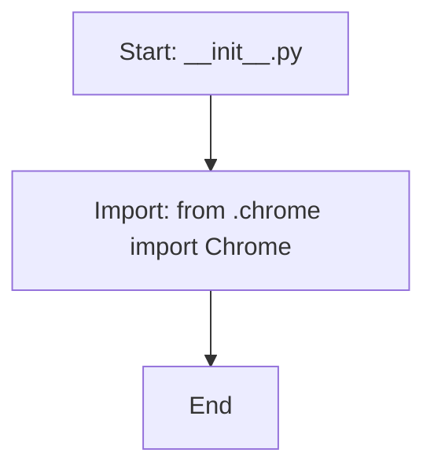

## Анализ кода `hypotez/src/webdriver/chrome/__init__.py`

### 1. <алгоритм>
1.  **Начало**: Запускается скрипт `__init__.py`.
2.  **Импорт**: Выполняется импорт `from .chrome import Chrome`. Это означает, что из модуля `chrome.py` (находящегося в той же директории) импортируется класс `Chrome`.
3.  **Конец**: Скрипт завершается, класс `Chrome` становится доступным для использования через пакет `src.webdriver.chrome`.

**Пример:**
Предположим, у нас есть другой скрипт в `src/test.py`

```python
from src.webdriver.chrome import Chrome

chrome_instance = Chrome()
# Дальнейшая работа с chrome_instance
```

В этом примере, импорт `from src.webdriver.chrome import Chrome` позволяет использовать класс `Chrome`, определенный в модуле `chrome.py`.

### 2. <mermaid>


**Объяснение зависимостей `mermaid`:**
-   `Start`: Начальная точка выполнения скрипта `__init__.py`.
-   `ImportChrome`: Импорт класса `Chrome` из модуля `chrome.py`.
-   `End`: Конечная точка выполнения скрипта.

Здесь нет сложных зависимостей, поскольку `__init__.py` в основном используется для импорта и делает класс `Chrome` доступным для использования.

### 3. <объяснение>

**Импорты:**
-   `from .chrome import Chrome`: Этот импорт означает, что из модуля `chrome.py`, который находится в той же директории, что и `__init__.py`, импортируется класс `Chrome`. Точка `.` в начале пути указывает на относительный импорт (внутри текущего пакета). Это позволяет использовать класс `Chrome` из других частей проекта через пакет `src.webdriver.chrome`.

**Классы:**
-   Класс `Chrome` не определен в данном файле, но импортируется из файла `chrome.py`. Предполагается, что класс `Chrome` содержит логику для управления браузером Chrome через Selenium WebDriver. Атрибуты и методы будут определены в `chrome.py`
  -   Пример использования (из `src/test.py`)
        ```python
        from src.webdriver.chrome import Chrome
        
        chrome_driver = Chrome()
        chrome_driver.start_browser()
        # ...
        chrome_driver.close_browser()
        ```
        
**Функции:**
-   В данном файле нет функций. `__init__.py` в основном служит для определения пакета и импорта необходимых модулей и классов.

**Переменные:**
-   Переменные в этом файле отсутствуют. Файл `__init__.py` используется для импорта и не объявляет переменных.

**Цепочка взаимосвязей:**
1.  `src.webdriver.chrome` – пакет, который обеспечивает интерфейс для управления браузером Chrome.
2.  `src.webdriver.chrome.__init__.py` – определяет пакет и делает класс `Chrome` доступным для импорта.
3.  `src.webdriver.chrome.chrome.py` – содержит класс `Chrome`, который реализует логику управления браузером (не в этом файле).
4.  Другие части проекта, такие как `src/test.py`, могут импортировать `Chrome` из `src.webdriver.chrome` и использовать для автоматизации тестирования или других задач.

**Потенциальные ошибки и улучшения:**
-   Пока не обнаружено ошибок.
-   В будущем может потребоваться добавить другие классы или модули в этот пакет для поддержки других браузеров или для расширения функциональности.
-   Добавить явные аннотации типов для переменных и функций в файле `chrome.py`.

**Дополнительно:**
- Файл `__init__.py` является ключевым для создания пакетов в Python. Он сообщает интерпретатору, что директория `src/webdriver/chrome` должна интерпретироваться как пакет, и позволяет импортировать модули и классы из этой директории.