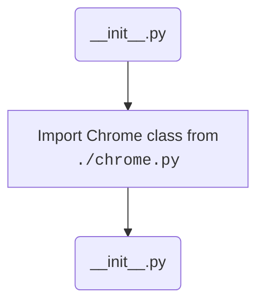

## АНАЛИЗ КОДА: `hypotez/src/webdriver/chrome/__init__.py`

### 1. <алгоритм>

1.  **Начало**: Выполнение файла `__init__.py` начинается.
2.  **Импорт**: Импортируется модуль `Chrome` из файла `chrome.py`, находящегося в том же каталоге.
3.  **Завершение**: Выполнение файла `__init__.py` завершается.

Пример:

Представьте, что вы вызываете `from src.webdriver.chrome import Chrome`. В этом случае, сначала выполнится код внутри `__init__.py`, который импортирует класс `Chrome` из `chrome.py`, делая его доступным для импорта в других частях проекта.

### 2. <mermaid>



**Объяснение зависимостей в `mermaid`:**
- `Start(__init__.py)`: Начало выполнения файла `__init__.py`.
- `ImportChrome`: Операция импорта класса `Chrome` из файла `chrome.py` в текущем каталоге.
- `End(__init__.py)`: Завершение выполнения файла `__init__.py`.

### 3. <объяснение>

**Импорты:**

*   `from .chrome import Chrome`: Эта строка импортирует класс `Chrome` из модуля `chrome.py`, находящегося в том же каталоге, что и файл `__init__.py`. Точка `.` в начале пути означает "текущий каталог". Этот импорт позволяет другим частям проекта использовать класс `Chrome` через импорт из `src.webdriver.chrome`.

**Классы:**

*   Файл `__init__.py` сам по себе не содержит классов. Он выступает как точка входа в пакет `src.webdriver.chrome` и делает класс `Chrome` доступным для импорта. Класс `Chrome` определен в файле `chrome.py`.

**Функции:**

*   Файл не содержит функций. Его основная цель — выполнить импорт.

**Переменные:**

*   Файл не объявляет переменных.

**Объяснение:**

`__init__.py` — это файл-маркер, который указывает Python, что каталог `chrome` должен рассматриваться как пакет. В данном случае, `__init__.py` импортирует класс `Chrome` из `chrome.py`, делая его доступным при импорте пакета `src.webdriver.chrome`. Таким образом, другие модули проекта могут просто использовать:

```python
from src.webdriver.chrome import Chrome
```

вместо того, чтобы явно импортировать `from src.webdriver.chrome.chrome import Chrome`.

**Взаимосвязь с другими частями проекта:**

Этот файл является частью пакета `src.webdriver`, который предположительно предназначен для управления веб-драйверами, в частности, Chrome. Таким образом, другие части проекта, требующие взаимодействия с Chrome через веб-драйвер, будут импортировать класс `Chrome` через этот пакет.

**Потенциальные ошибки и области для улучшения:**

*   В данном коде нет явных ошибок, поскольку это простой файл импорта.
*   Можно было бы добавить docstring в `__init__.py`, чтобы описать назначение пакета `src.webdriver.chrome`.

**Дополнительно**: В данном случае, отсутствует импорт `header`, поэтому блок `mermaid` для `header.py` не требуется.